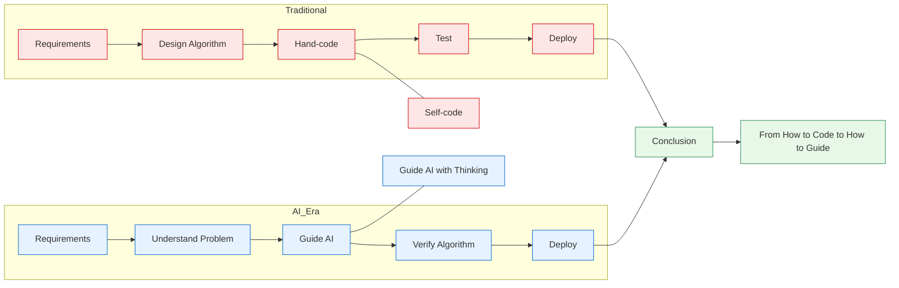
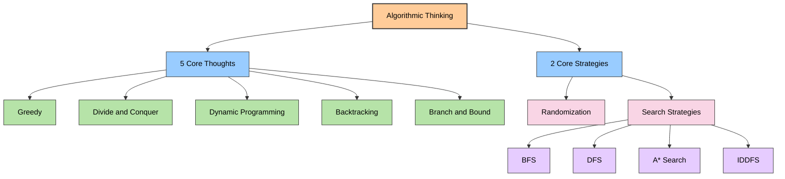
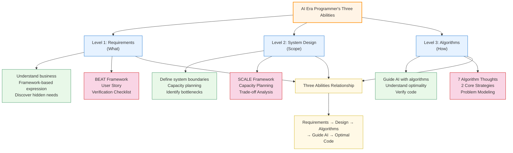

# In the AI Era, Every Programmer Should Be an Algorithmic Thinking Engineer

In the AI programming era, AI-written code is fast and excellent. However, when facing specific business scenarios, if you cannot clearly describe requirements, define boundaries, and understand and model problems from an algorithmic perspective, AI will be helpless. Therefore, in the AI era, programmers need not only deep business understanding and technical architecture determination, but also master core algorithmic thinking and use it to guide AI to do the work.

Only then can we truly leverage AI tools for innovation and solve real problems. Therefore, in the AI era, a programmer's value doesn't disappear, but gradually shifts from "writing code" to "understanding problems, designing solutions, and guiding AI." Only with solid data structure foundations and algorithmic thinking can programmers more effectively use AI for algorithm design and problem-solving, thereby solving complex problems in the real world.

> In the AI era, a programmer's value is not in writing code, but in using algorithmic thinking to guide AI to write optimal code.

**Complete source code can be found at** [https://github.com/microwind/algorithms](https://github.com/microwind/algorithms)

## Table of Contents

1. [Overview of Algorithms and Algorithmic Thinking](#one-overview-of-algorithms-and-algorithmic-thinking)
2. [What Problems Do Algorithms Solve](#two-what-problems-do-algorithms-solve)
3. [What Value Does Algorithmic Thinking Provide](#three-what-value-does-algorithmic-thinking-provide)
4. [Complete Guide to Algorithmic Thinking](#four-complete-guide-to-algorithmic-thinking)
5. [Examples of Guiding AI Programming with Algorithmic Thinking](#five-examples-of-guiding-ai-programming-with-algorithmic-thinking)
6. [How Programmers Learn Algorithmic Thinking](#six-how-programmers-learn-algorithmic-thinking)
7. [Practical Projects Using Algorithmic Thinking to Guide AI](#seven-practical-projects-using-algorithmic-thinking-to-guide-ai)

---

## One. Overview of Algorithms and Algorithmic Thinking

### What is an Algorithm?

**Algorithm** is a step-by-step method and procedure for computers to solve problems. It is a definite, finite, effective computational process that includes:

- **Input**: Problem data
- **Output**: Problem solution
- **Clear Instructions**: A series of definite steps

**Engineer's Perspective**: Computer Program = Algorithm + Data Structure. Algorithm is the soul of code. The same functionality can have performance differences of several orders of magnitude with different algorithms.

### What is Algorithmic Thinking?

**Algorithmic Thinking** is a universal, systematic approach and philosophy to solving problems. It is:

- **Abstraction and summarization** of multiple concrete algorithms
- A **way of thinking about problems, analyzing problems, and designing algorithms**
- A **universal methodology** independent of specific programming languages

**Key Distinction**:

- **Algorithmic Thinking**: Abstract, universal, reusable → **Black-box thinking**
- **Concrete Algorithm**: Implementation, specific, one-time → **White-box implementation**

### Why Must Programmers Learn Algorithmic Thinking?

#### Traditional Era vs AI Era

| Dimension | Traditional Programming Era | AI Programming Era |
|-----------|---------------------------|-------------------|
| **Code Source** | Hand-written | AI-generated |
| **Algorithm Implementation** | Self-implemented | AI writes |
| **Core Ability** | Coding skill | Design skill |
| **Key Value** | Implementing algorithms | Guiding AI design |
| **Learning Focus** | Master syntax and algorithms | Understand thinking and principles |

#### Transformation of Programmer Responsibilities in AI Era



### Why Learn Algorithmic Thinking in the AI Era?

**Core Reasons**:

1. **Guide AI to Generate Correct Algorithms** - AI needs clear design guidance, not vague requirements
2. **Verify AI-Generated Code** - Knowing algorithmic thinking helps judge AI code correctness and optimality
3. **Performance Optimization Decisions** - Choose optimal solutions among multiple options by understanding complexity and trade-offs
4. **Solve Novel Problems** - New problems without existing solutions need creative combinations of basic thinking
5. **Understand System Fundamentals** - Database indexes, caching strategies, distributed algorithms all based on basic thinking
6. **Career Development** - Algorithmic thinking is core to engineer capability; essential for career advancement

---

## Two. What Problems Do Algorithms Solve

Algorithms solve real-world problems. Here are some examples:

#### 1. **Computational Problems** - Value Calculation

```
Characteristics: Calculate output from given input
Examples:
- Mathematics: Factorial, Fibonacci, GCD
- Statistics: Average, standard deviation, correlation
- Engineering: Interest calculation, loan amortization, financial forecasting
```

#### 2. **Search Problems** - Finding Elements

```
Characteristics: Find elements or positions meeting conditions in datasets
Examples:
- Linear search: Sequential lookup
- Binary search: Lookup in sorted arrays
- Applications: Database queries, log retrieval, inverted indexes
```

#### 3. **Sorting Problems** - Ordering Data

```
Characteristics: Arrange data in specific order
Examples:
- Bubble sort: Suitable for small datasets
- Quick sort: General-purpose efficient sorting
- Merge sort: Stable sorting, external sorting
- Applications: Database indexes, cache eviction, queue priorities
```

#### 4. **Optimization Problems** - Finding Optimal Solutions

```
Characteristics: Find optimal solution among many possibilities
Examples:
- Knapsack problem: Maximum benefit with limited resources
- Traveling Salesman Problem: Shortest path
- Resource allocation: Cost minimization
- Applications: Task scheduling, load balancing, cache policies
```

#### 5. **Combinatorial Problems** - Enumeration

```
Characteristics: Generate or enumerate all possible combinations or permutations
Examples:
- Permutations: All possible orderings
- Combinations: Choose k from n elements
- Subsets: All possible subsets
- Applications: Permission combinations, configuration generation, test case generation
```

#### 6. **Graph Problems** - Relationship Handling

```
Characteristics: Process relationships and network structures between elements
Examples:
- Shortest path: Dijkstra, Bellman-Ford
- Minimum spanning tree: Prim, Kruskal
- Topological sort: DAG sorting
- Applications: Routing protocols, social networks, recommendation systems, knowledge graphs
```

---

## Three. What Value Does Algorithmic Thinking Provide

Through algorithmic thinking, we can think and solve problems fundamentally. Its core value is: transforming vague business problems into quantifiable, optimizable computational models, enabling correct strategic choices at the design stage.

#### 1. **Rapid Problem Identification and Solution Selection**

```
Scenario: Receive a new requirement, how to quickly design a solution?

Algorithmic Thinking Benefits:
✓ Identify problem category (search/optimization/sorting)
✓ Quickly associate with corresponding thinking (greedy/DP/divide-and-conquer)
✓ Estimate solution complexity
✓ Select optimal design approach

Instance:
Requirement: Design an LRU cache
Identification: Optimization problem (maximize hit rate with limited space)
Thinking: Greedy algorithm (evict least recently used each time)
Implementation: HashMap + DoublyLinkedList
```

#### 2. **Code Performance Optimization**

```
Case: Users report system slowness

Algorithmic Thinking Helps:
❌ Original: O(n²) nested queries
→ Analysis: This is a search problem, should use binary search
→ Optimization: O(n log n) sorting + binary search

Performance Gain: 10 million records, from minutes to seconds
```

#### 3. **System Architecture Understanding**

```
Why algorithmic thinking is important:

Database Index ← Binary search application
Cache Eviction ← Greedy algorithm
Distributed Consensus ← Graph theory and greedy
OS Scheduling ← Dynamic programming and greedy
Compiler Optimization ← Dynamic programming
Network Protocols ← Graph theory and greedy

Understand thinking = Understand system internals
```

#### 4. **Core Competency in AI Programming Era**

```
AI Code Generation Issues:
❌ May not generate optimal algorithms
❌ May have logic flaws
❌ May not fit specific scenarios

Solutions:
✓ Guide AI with thinking: "Design search using binary search"
✓ Verify with thinking: "What's this solution's complexity?"
✓ Optimize with thinking: "Try dynamic programming for optimization"

Conclusion: Algorithmic thinking is programmer's "control lever" in AI era
```

#### 5. **Career Development Catalyst**

```
Junior Engineer: Can implement given algorithms
Mid-Level Engineer: Can choose algorithms based on requirements
Senior Engineer: Can design novel algorithms for problems

All levels need algorithmic thinking, but at different depths
```

#### 6. **Interview and Technical Assessment**

```
Interview Focus Order:
1. Can identify problem type? (Algorithmic thinking)
2. Is chosen solution optimal? (Complexity analysis)
3. Is code implementation correct? (Coding skill)

Conclusion: Algorithm design thinking determines 60% of score, coding less important
```

---

## Four. Complete Guide to Algorithmic Thinking

### Seven Major Algorithmic Thoughts



---

### Algorithm Descriptions

#### 1. Greedy Algorithm

```
Core Idea: Each step chooses locally optimal, striving for global optimum

Key Characteristics:
- Greedy Choice Property: Global optimum reachable through local optimum choices
- Optimal Substructure: Problem's optimal solution contains subproblems' optimal solutions
- No Aftereffect: Previous choices don't affect subsequent decisions

Pseudocode Template:
function greedy(items):
    result = empty_set
    sort items by greedy_criteria

    for item in items:
        if can_add(item, result):
            result.add(item)
            if is_complete(result):
                return result

    return result

Applications:
- Activity selection, interval scheduling
- Huffman coding, minimum spanning tree
- Task scheduling, resource allocation
```

#### 2. Divide and Conquer

```
Core Idea: Break down → Solve recursively → Combine results

Three Steps:
1. Divide: Break problem into smaller similar problems
2. Conquer: Recursively solve subproblems
3. Combine: Merge subproblem solutions

Pseudocode:
function divide_and_conquer(problem):
    if problem.is_small():
        return solve_directly(problem)

    subproblems = divide(problem)
    results = []
    for subproblem in subproblems:
        results.append(divide_and_conquer(subproblem))

    return combine(results)

Applications:
- Sorting (quicksort, mergesort)
- Binary search, binary answer
- Matrix multiplication, large integer multiplication
```

#### 3. Dynamic Programming

```
Core Idea: Trade space for time, use memoization to eliminate redundant computation

Essential Conditions:
- Optimal Substructure: Large problem's optimal solution = subproblems' optimal solutions
- Overlapping Subproblems: Different subproblems compute same results

Two Implementation Methods:
1. Top-down: Memoized recursion
2. Bottom-up: Iterative table filling

Pseudocode:
function dynamic_programming(problem):
    dp_table = initialize(problem)

    for i in range(1, size):
        for j in range(required_dimensions):
            dp_table[i][j] = compute_from_subproblems(
                dp_table[i-1][...],
                dp_table[i][j-1],
                ...
            )

    return dp_table[last_index]

Applications:
- Knapsack problems, coin change
- Longest increasing subsequence, edit distance
- Path counting, matrix chain multiplication
```

#### 4. Backtracking

```
Core Idea: Try → Explore → Backtrack, systematically try all possibilities

Essence: Depth-first search with constraints

Steps:
1. Make choice
2. Recursively explore
3. Undo choice (backtrack)
4. Try other choices

Applications:
- Permutations, combinations
- N-Queens problem
- Sudoku solving
- Maze solving
```

#### 5. Branch and Bound

```
Core Idea: Use bound function for pruning, eliminate impossible search paths

Algorithm Features:
- Branch: Decompose into subproblems
- Bound: Calculate bounds, prune inferior branches
- Prune: Terminate search for non-optimal paths

Applications:
- 0/1 Knapsack
- Traveling Salesman Problem
- Job scheduling
```

#### 6. Randomization

```
Core Idea: Use randomness to simplify algorithm design or improve performance

Algorithm Types:
1. Las Vegas: Always correct but random runtime
2. Monte Carlo: Deterministic runtime but possibly incorrect

Example Application:
- Randomized Quicksort
- Randomized Selection
- Monte Carlo Method
```

#### 7. Search Strategies

```
Core Idea: Systematically traverse solution space

BFS (Breadth-First Search):
- Layer-by-layer expansion
- Shortest path in unweighted graphs
- Memory intensive

DFS (Depth-First Search):
- Go deep before backtrack
- Can use less memory
- May explore irrelevant branches

A* Search:
- Heuristic-guided search
- Estimates remaining distance
- More efficient for goal-directed problems

IDDFS (Iterative Deepening DFS):
- Balance BFS and DFS advantages
- Limited memory, faster than DFS
- Good for unknown search depth
```

---

## Five. Examples of Guiding AI Programming with Algorithmic Thinking

### Case Study 1: E-commerce Flash Sale System

#### 1. Describe Requirement (What)
Provide high-concurrency product purchase service for users, ensure fairness and system stability.

#### 2. Define Boundary (Scope)
- Concurrent Users: 100,000 simultaneous
- Product Inventory: 1,000 items
- Response Time: <100ms
- Fairness: First-come-first-served, limit 1 per user

#### 3. Algorithm Modeling (How)
**Greedy Algorithm Modeling**:
- Problem Abstraction: Resource allocation + sequential decisions
- Algorithm Model: Queue + greedy selection
- Core Idea: Make optimal allocation immediately for each request

**Guide AI Programming**:
```
AI, implement greedy flash sale system:
1. User requests enter queue
2. Process in queue order (greedy)
3. Check inventory and user limits
4. Allocate or reject immediately
```

---

### Case Study 2: Video Platform Content Distribution

#### 1. Describe Requirement
Provide low-latency video playback for global users.

#### 2. Define Boundary
- User Scale: 10 million simultaneous
- Video File: 1-10GB each
- CDN Nodes: 50 global locations
- Latency Requirement: Start playback within 200ms
- Cost Optimization: Minimize transmission cost

#### 3. Algorithm Modeling
**Divide and Conquer Modeling**:
- Problem Abstraction: Large-scale data distribution + geographic optimization
- Algorithm Model: Region decomposition + parallel processing
- Core Idea: Divide (geographic regions) → Conquer (parallel) → Combine

---

### Case Study 3: Food Delivery Path Optimization

#### 1. Describe Requirement
Optimize delivery routes for platform to increase efficiency.

#### 2. Define Boundary
- Order Volume: 10,000/hour peak
- Delivery Staff: 500 active
- Time Limit: Deliver within 30 minutes
- Optimization Goals: Minimize time + maximize orders
- Constraints: Balanced load, order deadlines

#### 3. Algorithm Modeling
**Dynamic Programming Modeling**:
- Problem Abstraction: Multi-stage decision optimization + resource constraints
- Algorithm Model: State transition equations + memoization
- Core Idea: Current optimal = Previous optimal + Current decision

---

## Six. How Programmers Learn Algorithmic Thinking

### Three-Level Ability Model

| Level | Core Ability | Traditional | Algorithmic Thinker |
|-------|----------|------------|----------------|
| **Problem Understanding** | Understand objectives | Direct coding | Clarify what to solve |
| **Boundary Definition** | Analyze constraints | Ignore limitations | Clarify scale and limits |
| **Algorithm Modeling** | Abstract models | Choose familiar algorithms | Guide AI with optimal algorithms |

### Three-Layer Ability Framework

#### **Layer 1: Describe Requirements (What)**
**Core Question**: What business problem to solve?

Examples:
- ❌ "Build a recommendation system"
- ✅ "Recommend products users may like"

#### **Layer 2: Define Boundaries (Scope)**
**Core Question**: What are problem scales and limitations?

Key Elements:
- Data Scale: Users, products, requests
- Time Limits: Response time requirements, time windows
- Resource Constraints: Memory, CPU, bandwidth
- Quality Requirements: Accuracy, success rate, fault tolerance

#### **Layer 3: Algorithm Modeling (How)**
**Core Question**: What algorithm model solves it?

Process:
1. Problem Abstraction: Transform business → algorithm problem
2. Model Selection: Choose thinking suited to constraints
3. Guide AI: Use algorithmic thinking to guide AI generation

Example:
```
Recommendation Problem
→ Vector similarity search
→ KNN/ANN algorithms
→ AI implementation
```

---

## Seven. Practical Projects Using Algorithmic Thinking to Guide AI

### Framework: Prompting vs Skill Tools

In AI era, programmers have two ways to leverage algorithmic thinking:

**Method 1: Traditional Prompting**
- Manually analyze problem
- Select algorithmic thinking
- Fill BROKE framework
- Generate prompt
- Submit to AI

**Method 2: Skill Tool**
- Call `/algorithm-advisor` skill
- Describe business problem
- Answer key questions
- Get complete framework
- Can directly use

---

### Case Study: E-commerce Recommendation System Design

#### Business Context
Design personalized recommendation from 1 million products for users.

#### Three-Layer Analysis

**1. Describe Requirements (What)**
- Recommend products users may interest
- Consider both relevance and diversity
- Require real-time response (100ms)

**2. Define Boundaries (Scope)**
- Products: 1 million
- Users: 10 million
- Response Time: <100ms
- Accuracy: >80%

**3. Algorithm Modeling (How)**
- Problem Abstraction: Multi-objective optimization (relevance + diversity)
- Algorithmic Thinking: Greedy algorithm (two-stage)
- Core Approach:
  - Stage 1: Greedy filter high-relevance (Top 50)
  - Stage 2: Greedy diversity optimization → Final 10

#### BROKE Framework for AI Programming

```
B - Background:
Design personalized recommendation system for e-commerce platform.
Challenges: Large product catalog, real-time requirement, multi-objective.

R - Role:
Senior recommendation system architect, expert in greedy and dynamic programming.

O - Objective:
Implement two-stage greedy recommendation system:
1. Stage 1: Fast relevance filtering (Top 50)
2. Stage 2: Diversity optimization for final 10

K - Key Results:
- Response <100ms
- Accuracy >80%
- Include ≥3 categories
- Support 10M users
- O(n log n) complexity

E - Expectations:
Provide:
1. Complete Python implementation
2. Detailed algorithm explanation
3. Complexity analysis
4. Test cases
5. Performance optimization suggestions
```

---

## Key Takeaways

### 1. **Cognitive Transformation**
- From "how to code" to "how to design"
- From "implementer" to "guide"
- Algorithmic thinking is programmer's core competency in AI era

### 2. **Seven Major Algorithmic Thoughts**

| Thought | Mechanism | Real-World Applications |
|---------|-----------|------------------------|
| Greedy | Local optimum → Global optimum | E-commerce flash sales, real-time dispatch, feed ranking |
| Divide-Conquer | Decompose → Parallel solve | CDN distribution, big data processing, search engines |
| Dynamic Programming | Memoization to avoid redundancy | Delivery routing, coupon optimization, text prediction |
| Backtracking | Try → Explore → Backtrack | Permission combinations, test generation, game strategy |
| Branch-Bound | Estimate bounds, prune search | Logistics optimization, security scanning, cloud scheduling |
| Randomization | Use randomness for efficiency | Crawler scheduling, A/B testing, cache expiry |
| Search (BFS/DFS/A*) | Systematic solution space traversal | Social recommendations, route planning, music discovery |

### 3. **Three-Layer Ability System**
```
Describe Requirements (What)
    ↓
Define Boundaries (Scope)
    ↓
Algorithm Modeling (How)
    ↓
Guide AI → Generate Optimal Code
```

---

## Reference Resources

**Complete Code:**
https://github.com/microwind/algorithms

**Design Patterns:**
https://github.com/microwind/design-patterns

**AI Programming Prompts:**
https://github.com/microwind/ai-prompt

**AI Skill Library:**
https://github.com/microwind/ai-skills

---

## Three-Article Complete System

You've now learned AI era programmers' three core abilities:



---

> **Final Thoughts**
>
> In the AI era, code is not disappearing; instead, programmer value shifts from "writing code" to "guiding AI to write code."
>
> To guide AI effectively, you need:
> 1. **Clearly describe problems** (Requirements Definition Engineer)
> 2. **Reasonably design systems** (System Design Engineer)
> 3. **Guide with algorithms** (Algorithmic Thinking Engineer)
>
> All three levels are essential. Master these three to become an excellent AI-era programmer.
