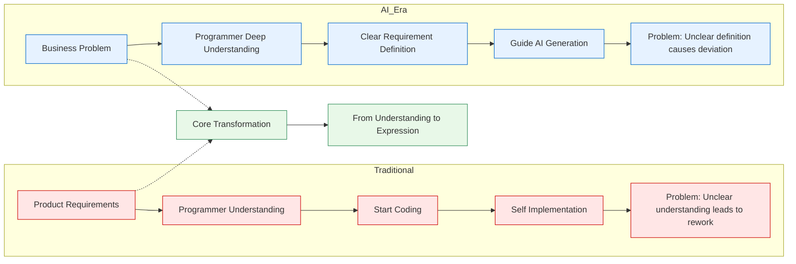
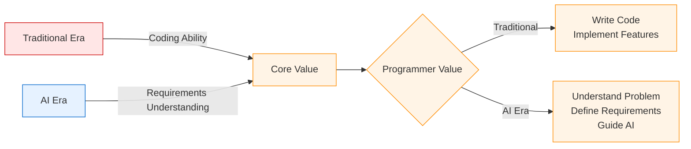
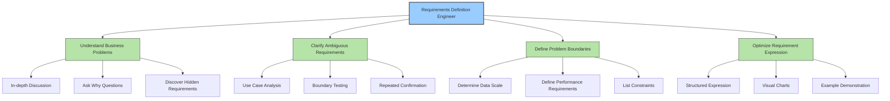
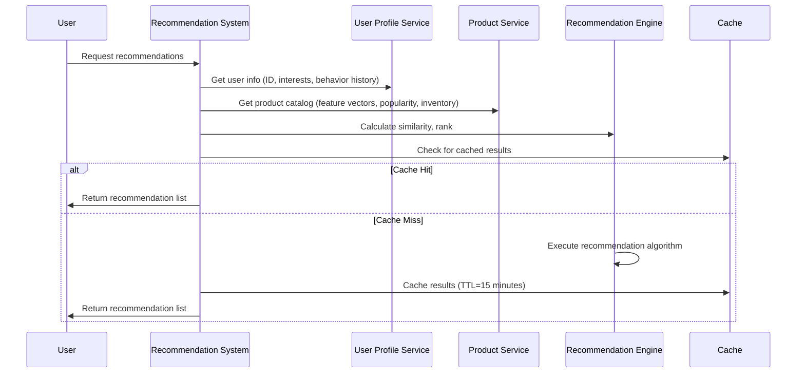
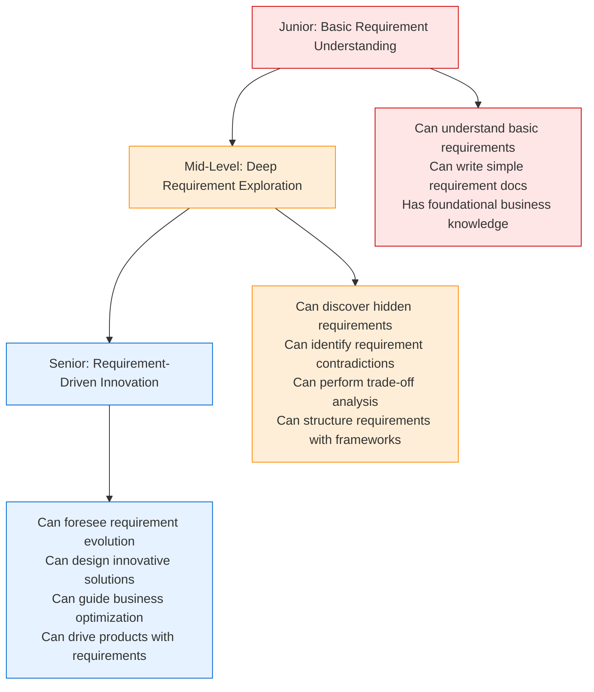

# In the AI Era, Every Programmer Should Be a Requirements Definition Engineer

In the era of AI-assisted programming, **no matter how well you write code, it's not as important as understanding the problem correctly from the start**. AI tools can generate code quickly, but the prerequisite is that you can describe your requirements clearly and completely. This is precisely where the Requirements Definition Engineer's core value lies.

In the traditional era, programmers would receive a requirements document and immediately start coding. However, in the AI era, programmers need to do much more: **understand the essence of the problem, describe it with precise language, enable AI to understand your intent, and often articulate the problem more clearly than the business stakeholders themselves**.

> In the AI era, a programmer's first value is not in writing code, but in understanding and describing requirements. Good requirement descriptions enable AI to generate code that matches expectations perfectly.

**Complete source code can be found at** [https://github.com/microwind/algorithms](https://github.com/microwind/algorithms)

## Table of Contents

1. [Overview of Requirements and Requirements Definition](#one-overview-of-requirements-and-requirements-definition)
2. [Why Requirements Definition Matters](#two-why-requirements-definition-matters)
3. [Transformation: Traditional Era vs AI Era](#three-transformation-traditional-era-vs-ai-era)
4. [Core Responsibilities of Requirements Definition Engineers](#four-core-responsibilities-of-requirements-definition-engineers)
5. [Frameworks and Methods for Requirements Definition](#five-frameworks-and-methods-for-requirements-definition)
6. [Common Requirements Definition Problems and Solutions](#six-common-requirements-definition-problems-and-solutions)
7. [Practical Case Studies: How to Define Requirements Effectively](#seven-practical-case-studies-how-to-define-requirements-effectively)
8. [Career Path for Requirements Definition Engineers](#eight-career-path-for-requirements-definition-engineers)

---

## One. Overview of Requirements and Requirements Definition

### What is a Requirement?

**Requirements** refer to the objectives, functionalities, or constraints that users or business stakeholders expect the software system to achieve. They include:

- **Functional Requirements**: What the system should do
- **Non-Functional Requirements**: How the system should do it (performance, availability, security, etc.)
- **Constraints**: System limitations and boundary conditions

**Engineer's Perspective**: Requirements are the definition of the problem. The clearer the problem definition, the more efficiently the solution can be implemented.

### What is Requirements Definition?

**Requirements Definition** is a systematic approach to translating business problems into clear technical requirements, enabling AI tools (or other developers) to accurately understand the intent and generate correct solutions.

**Key Characteristics**:
- **Accuracy**: Correctly reflects the business problem
- **Completeness**: Covers all key elements
- **Clarity**: Easy to understand, unambiguous
- **Structure**: Follows standardized description frameworks

### Why Must Programmers Become Requirements Definition Engineers?

#### Traditional Era vs AI Era

| Dimension | Traditional Programming Era | AI Programming Era |
|-----------|---------------------------|-------------------|
| **Input** | Product Requirements Document | Clear Requirements Definition |
| **Processing** | Programmer understands and codes | AI understands and generates code |
| **Quality Control** | Coding ability | Requirements definition ability |
| **Key Capability** | Implementation skills | Understanding and expression skills |
| **Core Value** | Code correctness | Requirements understanding |

#### Transformation of Programmer Responsibilities in the AI Era



---

## Two. Why Requirements Definition Matters

### 1. **Directly Impacts AI Code Generation Quality**

```
Clear Requirements → AI Accurate Understanding → Code Matches Expectations → Fewer Iterations
Vague Requirements → AI Misunderstanding → Code Deviates → More Rework
```

**Real Case Example**:
```
❌ Weak Requirement:
"Give me a search function"
AI Generates: Simple linear search, O(n) time complexity

✓ Strong Requirement:
"Implement a search function supporting 1 million data entries,
require <100ms response time, use binary search or inverted index
for efficient algorithms"
AI Generates: Optimal algorithm based on data scale, O(log n) complexity
```

### 2. **Avoids Massive Rework Costs from Requirements Deviation**

According to software engineering research:
- **Rework costs from unclear requirements** = **5-10 times** the cost of **coding errors**
- Discovering requirement deviation in late development stages can increase costs by **100 times**
- Spending 1 hour clarifying requirements during the requirements phase saves 10 hours of rework later

### 3. **Improves Communication Efficiency**

```
Inefficient Requirements Definition:
Programmer ❓ "What exactly does this feature mean?"
Product ➜ "Just build a management system"
Programmer ❓ "Manage what?"
Product ➜ "Users and orders"
Programmer ❓ "How much user data?"
Product ➜ "About a few million"
... (Multiple rounds, low efficiency)

Efficient Requirements Definition:
Programmer Summarizes: Users ≤ 5 million, Orders ≤ 20 million,
Real-time query requires <500ms response, supports multi-dimensional
queries by creation time, status, user ID, etc...
Product Confirms: Completely correct, that's it

// All subsequent discussions based on this clear definition
```

### 4. **Reduces Ambiguity and Misunderstandings**

```
Vague Requirement Example:
"System needs to be fast" ← How is "fast" defined?
    - Is 100ms fast? 1 second? 10 seconds?

Clear Requirement Example:
"Query response time <100ms (P99),
supports 10,000 concurrent users simultaneously"
    - Clear performance metrics, no ambiguity
```

---

## Three. Transformation: Traditional Era vs AI Era

### Changes in Requirements Flow Process

#### Traditional Process

```
Product → Requirements Document → Programmer Understanding → Estimate Workload → Start Coding → Address Issues Later
           ↑                                                                              ↓
           └──────────────────── Rework ───────────────────────────────────────────┘
```

**Problems**:
- Requirements understanding has ambiguities
- Issues discovered after coding has started
- Rework costs are high
- Communication efficiency is low

#### AI Era Process

```
Product Initial Idea → Programmer Deep Understanding → Structured Requirements Definition → Guide AI Programming → Verify Results
                ↑                                                                                                 ↓
                └─ Rapidly iterate requirements definition until AI generates expected code ──────────────────┘
```

**Advantages**:
- Requirements definition process is understanding process
- Direction is clear before AI generation
- Fewer understanding gaps and rework
- More efficient iteration

### Core Transformation Comparison



---

## Four. Core Responsibilities of Requirements Definition Engineers

### Responsibility Model



### Five Core Capabilities

#### 1. **Understanding Ability** - Grasp Business Essence

```
Surface Requirement:
"Recommend products to platform users"

Deep Understanding Questions:
- Why recommend? (Increase conversion, improve experience, boost repurchase)
- To whom? (New users, active users, at-risk users)
- What to recommend? (Best-sellers, personalized items, traffic-driving items)
- How many recommendations? (10, 20, or dynamic)
- Based on what? (History, trending, collaborative filtering, content similarity)
- What are the constraints? (Must maintain category ratios, must include new items)
```

#### 2. **Expression Ability** - State Problems Clearly

```
❌ Poor Expression:
"When users are many, the system must be fast"

✓ Good Expression:
"System must support peak 10,000 requests/sec, query response time <100ms (P99),
store 10 million user records, support multi-dimensional queries by city, age, spending tier, etc."
```

#### 3. **Analysis Ability** - Identify Problem Essence

```
User Says: "This feature is hard to use"

Strong Analysis Ability Leads to Questions:
- Which step is hard to use? (Pinpoint problem)
- Why is it hard to use? (Dig into causes)
- What should the ideal experience be? (Understand goals)
- How big is the impact? (Assess priority)
- Are there constraints? (Understand limitations)
```

#### 4. **Verification Ability** - Ensure Understanding Accuracy

```
After Describing Requirements, Verification Checklist:
□ Are functional requirements completely covered?
□ Have all boundary conditions been considered?
□ Are performance requirements quantified?
□ Are there any contradictions?
□ Do use case scenarios pass verification?
□ Is the product team satisfied?
□ Does AI-generated code match the description?
```

#### 5. **Documentation Ability** - Record Requirements Structurally

```
Good Requirement Documents Should Have:
✓ Clear goal statements
✓ Specific feature lists
✓ Explicit constraints and limitations
✓ Quantified performance metrics
✓ Real data examples
✓ Use cases and process diagrams
✓ Exception and error handling explanations
✓ Dependencies on other systems
```

---

## Five. Frameworks and Methods for Requirements Definition

### Framework 1: BEAT Framework

This is an optimized requirements definition framework for the AI era:

#### **B - Business (Business Context)**
Clearly state the **business objectives and value** of the problem

```
Example:
E-commerce platform wants to increase user stickiness and repurchase rate.
Current recommendation system has only 8% conversion rate.
Goal is to increase to 15% through personalization.
```

**Core Question**: Why is this feature important? What business problem does it solve?

#### **E - Expected (Expected Performance)**
**Quantified functional and performance metrics**

```
Example:
- Recommendation accuracy: >80% (defined by user click-through rate)
- Response time: <200ms (P99)
- System availability: >99.9%
- Diversity metric: Recommendations must include at least 5 different categories
```

**Core Question**: What are the success criteria? How do we measure them?

#### **A - Assumption (Assumption Conditions)**
List **data scale and business assumptions**

```
Example:
- Daily active users: 10 million
- Product catalog: 1 million items
- Recommendation scenarios: Homepage, listing page, product details page
- User behavior data: Clicks, favorites, purchases (last 90 days)
- Algorithm assumption: Based on collaborative filtering and content similarity hybrid
```

**Core Question**: What data scale and assumptions are we based on?

#### **T - Technical (Technical Requirements)**
Explicit **technical constraints and system requirements**

```
Example:
- Tech stack: Python + TensorFlow + Redis + Elasticsearch
- Deployment: Cloud servers with elastic scaling support
- Real-time: Support real-time user behavior updates, refresh recommendations every 15 minutes
- Maintainability: Readable code, complete documentation, version control support
- Monitoring: Real-time monitoring of recommendation accuracy, response time, coverage rate
```

**Core Question**: What are the technical implementation constraints?

### Framework 2: User Story Framework

For describing **specific user scenarios and functionality**

#### Basic Format

```
As a <user role>
I want to <feature description>
So that <business value>

Acceptance Criteria:
- When <precondition>, <action>, <expected result>
- When <precondition>, <action>, <expected result>
- ...

Constraints:
- <performance requirement>
- <data scale>
- <business limitation>
```

#### Real Example

```
As an e-commerce platform user
I want to see product recommendations matching my interests
So that I can quickly discover products I like

Acceptance Criteria:
- When user enters homepage for the first time, display 10 recommended products,
  recommendation results should return within 200ms
- When user clicks a product, recommendation list should refresh within 2 seconds
- When user searches, search results should include query-relevant recommendations
  with >80% accuracy
- Recommendation results should include different categories, avoid homogeneity
  (at least 5 different categories)

Constraints:
- System must support 10 million daily active users
- Recommendation product catalog has 1 million items
- Response time requirement: <200ms (P99)
- Recommendations cannot include products user has already purchased
```

### Framework 3: Use Case Flow

For describing **complete feature interaction flow**



**Key Points**:
- Clear participants (Actors)
- Explicit preconditions and postconditions
- Complete main flow and alternative flows
- Exception handling

---

## Six. Common Requirements Definition Problems and Solutions

### Problem 1: Requirements Too Vague

**Symptoms**:
```
"Make a very fast search"
"Need an intelligent recommendation system"
"Support large concurrency"
```

**Root Cause**:
- "Very fast", "intelligent", "large" are relative concepts
- No quantifiable standards
- AI cannot understand specific expectations

**Solution**:
```
✓ Quantify all key metrics:
"Search response time <100ms (P99), support 100,000 concurrent users simultaneously,
handle 50 million products"

✓ Replace adjectives with specific numbers:
❌ "Performance must be good"
✓ "Query latency <50ms, throughput >10,000qps"

✓ Use examples to illustrate expectations:
"When user searches for 'mobile phone', should return 5 relevant products within 100ms,
first result should be the most searched product"
```

### Problem 2: Overlook Boundaries and Constraints

**Symptoms**:
```
"Support user comment functionality"
(Not considering: How many comments? How long? How to handle deletion?)

"Build a recommendation system"
(Not considering: What algorithm limits? How many compute resources?)
```

**Root Cause**:
- Completely missing non-functional requirements
- Not considering technical implementation constraints
- Leads to surprises and rework during development

**Solution - Constraints Checklist**:
```
For every feature, answer:

Data Related:
□ How much data? (row count, file size)
□ Data growth speed? (how much added daily)
□ Data retention period? (how long to store)

Performance Related:
□ Response time requirement?
□ Concurrent user count?
□ QPS requirement?
□ Availability requirement?

Business Related:
□ Any business limitations?
□ Legal compliance requirements?
□ User privacy considerations?

Technical Related:
□ What tech stack?
□ Deployment location?
□ System dependencies?
□ Cost constraints?
```

### Problem 3: Contradictory Requirements

**Symptoms**:
```
"Completely free" + "Support 100 million users" + "Support 1 million requests/sec"
(These three are very difficult to satisfy simultaneously)

"Support 50ms response time" + "Run on a single machine"
(May require very expensive hardware with high costs)
```

**Root Cause**:
- No trade-off analysis performed
- Unrealistic expectations
- Causes difficulties in subsequent implementation

**Solution**:
```
Clearly List Trade-offs:

Cost vs Performance:
- High performance: Use high-end servers, caching, CDN, etc. High cost, faster speed
- Budget-limited: Use cheaper hardware, optimize algorithms, but possibly slower response

Speed vs Maintainability:
- Complete features: Requires 3 months development
- MVP (Minimum Viable Product): 1 month to launch core features, iterate later

Consistency vs Availability:
- Strong consistency: Data always consistent, but higher failure risk
- Eventual consistency: Data may be temporarily inconsistent, but high availability
```

### Problem 4: Hidden Requirements Not Discovered

**Symptoms**:
```
Product: "We need a user management system"
Programmer builds: Basic CRUD functionality

Actual Requirements:
- Support permission management (different users see different data)
- Support audit logs (who changed what when)
- Support data export (Excel export support)
- Support batch operations (batch activate/freeze users)
```

**Root Cause**:
- Did not perform deep requirements exploration
- Insufficient business understanding
- Results in incomplete functionality

**Solution - Deep Questioning**:
```
During requirements interviews, core questions:

Why Questions (Understand Essence):
□ Why do we need this feature?
□ What business problem does it solve?
□ What happens if we don't implement this?

Who Questions (Understand Users):
□ Who will use this feature?
□ Are there differences in needs for different user roles?
□ Are they internal or external users?

How Questions (Understand Details):
□ What interaction style does the user expect?
□ Are there special scenarios or exceptions?
□ How does it interact with other features?

When Questions (Understand Priority):
□ When does this need to launch?
□ Is there time pressure?
□ Which features should be prioritized?
```

---

## Seven. Practical Case Studies: How to Define Requirements Effectively

### Case Study 1: E-commerce Recommendation System Requirements Definition

#### 🎯 Business Context
E-commerce platform wants to increase user stickiness and sales. Current recommendation system has only 8% conversion rate, aiming for 15%.

#### Initial Requirement (Not Clear)
```
"Recommend products to users, must be fast, must be accurate"
```

**Problems**:
- How to define "fast" and "accurate"?
- How many products to recommend?
- What to base recommendations on?

#### Optimized Requirement (Using BEAT Framework)

**B - Business Context**:
```
• Goal: Increase product conversion rate from 8% to 15%
• Impact: 10 million daily active users, covering 1 million products
• ROI: Every 1% conversion rate increase = 1+ million revenue increase
```

**E - Expected Performance**:
```
• Recommendation accuracy: User click-through rate from current 5% to 12%
• Response time: <200ms (P99), fast initial load
• System availability: 99.9%
• Diversity: Recommendations include at least 3 different categories
```

**A - Assumptions**:
```
• Daily active users: 10 million
• Product catalog: 1 million products
• User behavior data: Last 90 days of browsing, favoriting, purchases
• Training data: 2 million samples for offline training
• Real-time feature update: User real-time clicks, refresh every 15 minutes
```

**T - Technical Requirements**:
```
• Recommendation scenarios: Homepage (10), product details (5), search results (3)
• Recommendation approach: Hybrid (collaborative filtering 60% + content similarity 30% + popularity 10%)
• Real-time capability: Support real-time user behavior updates, refresh every 15 minutes
• Cold start: New users use hot products, new products use content recommendations
• Constraints:
  - Do not recommend products user has purchased
  - Do not recommend products with low inventory (<10 items)
  - Do not recommend products that were removed or delisted in last 7 days
  - Must include new products (tagged as 'new')
```

#### Advanced Requirements Definition - User Story

```
As a shopping user
I want to see product recommendations matching my preferences
So that I can quickly discover and purchase products I like

Acceptance Criteria:
□ When user opens homepage, recommendation section loads within 3 seconds, displaying 10 products
□ Recommended products should include categories user may be interested in (based on browsing history)
□ Recommendations should include bestsellers and new products (bestsellers 70% + new products 30%)
□ User click-through rate to recommended products >12%
□ Same session should not have duplicate recommendations

Constraints:
□ System supports 10 million daily active users, peak concurrent 50,000 users
□ Recommendation database has 1 million products, daily additions of 5,000 items
□ Recommendation response time <200ms (P99)
□ Algorithm needs to support canary releases and A/B testing
□ Support real-time pause of recommendations for certain categories or products
```

### Case Study 2: Content Moderation System Requirements Definition

#### Initial Requirement (Many Issues)
```
"Filter illegal content, protect platform safety"
```

**Problems Here**:
- What counts as illegal?
- How to define "safety"?
- How much latency is acceptable?
- Is there a cost limit?

#### Optimized Requirement (BEAT Framework)

**B - Business**:
```
Goal: Prevent publication of illegal/inappropriate content on platform, reduce legal risk
Current: Manual review is slow, 15% miss rate, costs 500 people daily
Expected: Automated review, <1% miss rate, 90% cost reduction
```

**E - Expected**:
```
Review accuracy: >99% (false deletion rate <0.5%)
Review latency: <2 seconds (UGC publish to review complete)
Coverage: 6 categories - politics, adult content, violence, advertisements, harassment, etc.
Throughput: Handle 1 million content pieces/day
```

**A - Assumptions**:
```
Daily content uploads: 1 million (text, images)
Content types: User comments, dynamic posts, product descriptions
Inappropriate content ratio: About 5%
Training data: 500,000 labeled samples
Region limits: China only, comply with relevant Chinese regulations
```

**T - Technical**:
```
Detection Dimensions:
- Text moderation: Sensitive keywords, illegal content, harassment language
- Image moderation: Illegal marks, violence, inappropriate content
- Multimodal: Combined text+image violation judgment

Processing Pipeline:
- Priority 1 (Must Delete): Politics, adult content, etc.
- Priority 2 (Flag): Advertisements, harassment
- Priority 3 (Manual Review): Edge case content

Degradation Plan:
- When moderation system fails, allow posting but mark as pending
- Manual review must complete within 24 hours
- Monitoring: Miss rate, false deletion rate, latency
```

---

## Eight. Career Path for Requirements Definition Engineers

### Three-Level Ability Progression Model



### Learning Path: Junior Programmer → Requirements Definition Engineer

#### **Phase 1: Understanding Fundamentals (1-3 months)**

Learning Goals: Master basic requirements understanding and expression abilities

```
□ Learn software engineering fundamentals: requirement definition, classification, documentation
□ Understand BEAT, User Story and other basic frameworks
□ Shadow senior engineers in requirement reviews
□ Try writing requirement documents for simple features yourself
□ Build "requirement checklist" habit
```

#### **Phase 2: Deepen Practice (3-6 months)**

Learning Goals: Independently complete moderately complex requirements definition

```
□ Participate in 2-3 real project requirement definition processes
□ Learn systematic requirement analysis using BEAT framework
□ Learn deep interview techniques to discover hidden requirements
□ Build requirement verification methods and tools
□ Learn trade-off analysis and risk assessment
□ Participate in requirement reviews, accumulate business understanding
```

#### **Phase 3: Ability Upgrade (6-12 months)**

Learning Goals: Become team's requirement definition expert

```
□ Lead large project requirement definition
□ Guide other programmers on requirement definition
□ Establish team requirement definition norms and best practices
□ Learn to guide product planning with requirements
□ Identify opportunities and risks in requirements
□ Build good collaboration with product managers
```

### Five Skills Requirements Definition Engineers Should Master

#### 1. **Systems Thinking**

```
From Single Feature → Comprehensive Systems Thinking

Example:
❌ Junior Thinking:
"Build a login feature"
(Only considers input password and verification)

✓ Systems Thinking:
"Design a secure user authentication system"
(Consider registration, login, password reset, two-factor auth, session management,
logout, security vulnerability protection, audit logs, etc.)
```

#### 2. **Communication and Coordination**

```
Effective Communication with Different Roles:

With Product Managers:
- Understand product vision and strategy
- Validate product solutions with data and logic
- Suggest technical feasibility recommendations

With Business Teams:
- Explain technical solutions in their language
- Help them clearly express business needs
- Suggest reasonable technical trade-offs

With Engineers:
- Clearly convey requirement intent
- Reach consensus on requirement reasonableness
- Jointly maintain and update requirements
```

#### 3. **Business Analysis**

```
Understand Business from Technical Perspective:

Be Able to Answer:
□ Why is this feature important?
□ What are success criteria?
□ Are there alternative approaches?
□ What are costs and benefits?
□ What are potential risks?
```

#### 4. **Data Sensitivity**

```
Sensitivity to Data Scale and Constraints:

✓ Data-Aware Requirements:
"System must support 10 million users, 1 million daily active,
recommendations must complete in 100ms,
acceptable latency tolerance?"

✓ Scale Estimation Ability:
"If storing user behavior data, average 100 records per user,
10 million users = 1 billion records,
how much storage space needed?"
```

#### 5. **Verification and Quality Consciousness**

```
Self-Check of Requirement Quality:

Post-Generation Checklist:
□ Are requirements clear? (Can you understand them?)
□ Are requirements complete? (Anything missing?)
□ Are requirements feasible? (Technically doable?)
□ Are requirements consistent? (Any contradictions?)
□ Are requirements testable? (Can they be tested?)
□ Is requirement approved? (Does product team agree?)
```

---

## Nine. Using AI to Assist Requirements Definition

### How to Use AI to Improve Requirements Definition?

#### Method 1: Use AI for Requirements Checking

```
Your Initial Requirement:
"Build a user management system, must be fast, must be secure"

AI Prompt:
"I have a requirement: Build a user management system, must be fast, must be secure.
Please check this requirement for issues and provide improvement suggestions.
Please check from these dimensions: functional completeness, performance metrics,
security considerations, data scale, constraints, user experience, etc."

AI Response:
Your requirement has these issues:
1. "Fast" and "secure" are too vague, need quantification
2. No data scale and concurrent user definition
3. Missing important features like permission management, audit logs
4. No definition of interaction with other systems
5. No consideration of deployment and maintenance costs

Improvement Suggestions:
[Detailed improvement plan]
```

#### Method 2: Use AI to Expand Requirements

```
Your Requirement Outline:
"Recommendation system: Recommend products based on user behavior"

AI Prompt:
"Please help me expand this requirement. Consider these aspects:
1. User Experience: Recommendation presentation form, personalization level
2. Data Aspect: Data scale, data quality requirements
3. Algorithm Aspect: Recommendation algorithm, cold start problem
4. Performance Aspect: Response time, concurrent support
5. Operations Aspect: Monitoring metrics, disaster recovery
6. Cost Aspect: Resource consumption, budget"

AI Expansion Result:
[Comprehensive structured requirement]
```

#### Method 3: Use AI to Generate Test Cases to Verify Requirements

```
Requirement: Order system needs "Limited Time Promotion" feature

AI Prompt:
"Generate comprehensive test cases based on this requirement:

As an e-commerce order system
I need to support limited-time promotion feature
Rule: During specified time window, products get discounts

Please list:
1. Main flow use cases (normal purchase process)
2. Boundary use cases (promotion time boundaries, inventory boundaries)
3. Exception use cases (promotion time conflicts, system clock inaccuracy)
4. Performance use cases (high concurrency during big promotions)"

This process helps:
□ Discover missing requirement elements
□ Find implicit constraints
□ Verify requirement completeness
```

---

## Ten. Self-Cultivation for Requirements Definition Engineers

### Weekly Self-Improvement Plan

```
Monday:
□ Review last week's requirement definition process
□ Record encountered problems and improvements

Tuesday-Thursday:
□ Practice requirement frameworks in regular work
□ Proactively clarify and discuss requirements in depth
□ Record discovered hidden requirements and boundary conditions

Friday:
□ Summarize this week's practice
□ Organize good cases and best practices
□ Update personal requirement checklist
□ Share experience and lessons with team
```

### Build Personal Requirement Library

```
Maintain a requirement template library including:

✓ BEAT framework template
✓ User Story template
✓ Use case flow template
✓ Requirement checklist
✓ Different business domain requirement examples
✓ Common requirement patterns and anti-patterns
✓ Team best practices
```

### Reference Resources

**Complete code and cases:**
https://github.com/microwind/algorithms

**Design Patterns and Programming Paradigms:**
https://github.com/microwind/design-patterns

**AI Programming Prompts:**
https://github.com/microwind/ai-prompt

**AI Programming Skill Library:**
https://github.com/microwind/ai-skills

---

## What You Should Have Learned from This Article:

### 1. **Cognitive Shift**
- From "implementer" to "understander"
- From "writing code" to "describing problems"
- In the AI era, programmer's core competency is **clearly understanding and describing problems**

### 2. **BEAT Framework Mastery**
```
B - Business Context → Why is this important?
E - Expected Performance → What is success?
A - Assumptions → What are we assuming?
T - Technical Requirements → What are technical constraints?
```

### 3. **Five Core Abilities**
- **Understanding Ability**: Grasp business essence deeply
- **Expression Ability**: State problems clearly
- **Analysis Ability**: Identify problem essence
- **Verification Ability**: Ensure understanding accuracy
- **Documentation Ability**: Record requirements structurally

### 4. **Practical Methods**
- Use requirement checklist ensure completeness
- Use user stories understand real user scenarios
- Use trade-off analysis handle contradictory requirements
- Use AI to improve requirement quality

### 5. **Career Development Path**
```
Junior Engineer: Can understand basic requirements
  ↓
Mid-Level Engineer: Can discover hidden requirements, framework-based structuring
  ↓
Senior Engineer: Can drive product innovation, guide business optimization
```

---

> **Final Thoughts**
>
> In the AI era, coding ability becomes less scarce. However, the ability to **understand complex business, transform vague requirements into clear technical requirements** will become the most valuable skill for programmers.
>
> In the next article, we'll discuss how to define system boundaries and constraints based on clear requirements (in "In the AI Era, Every Programmer Should Be a System Design Engineer").
