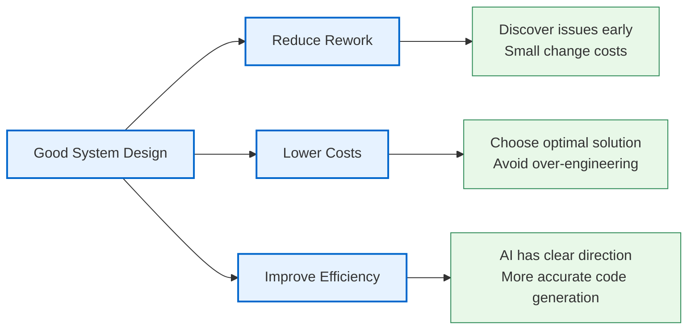
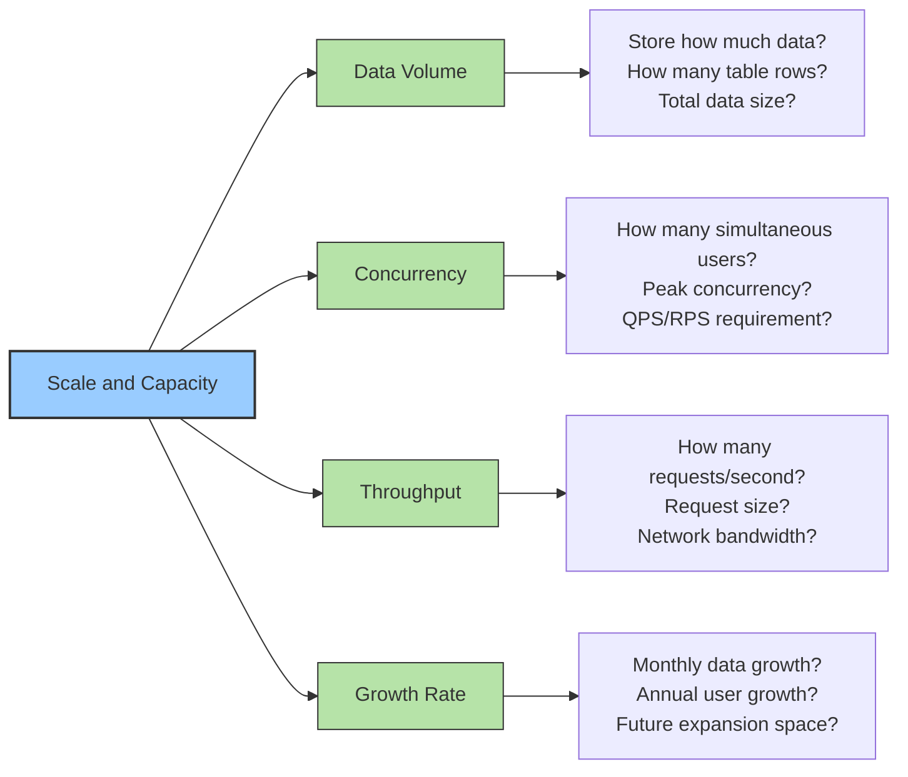
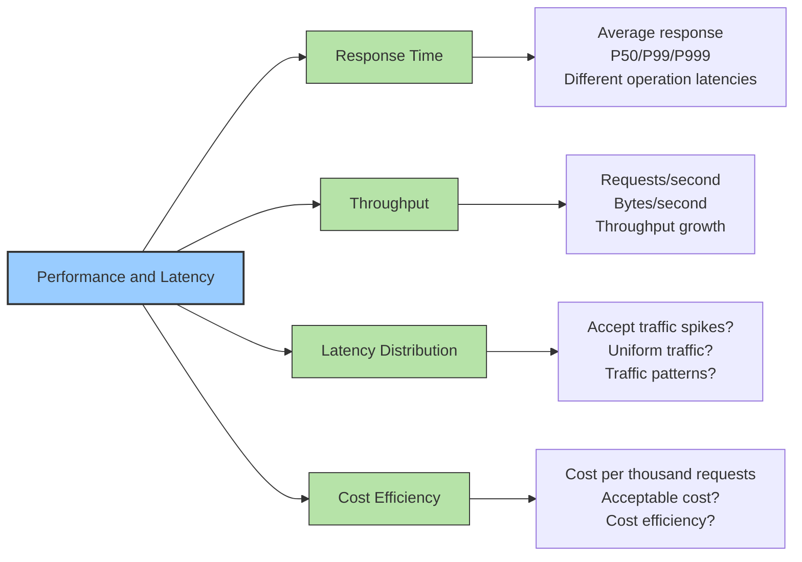
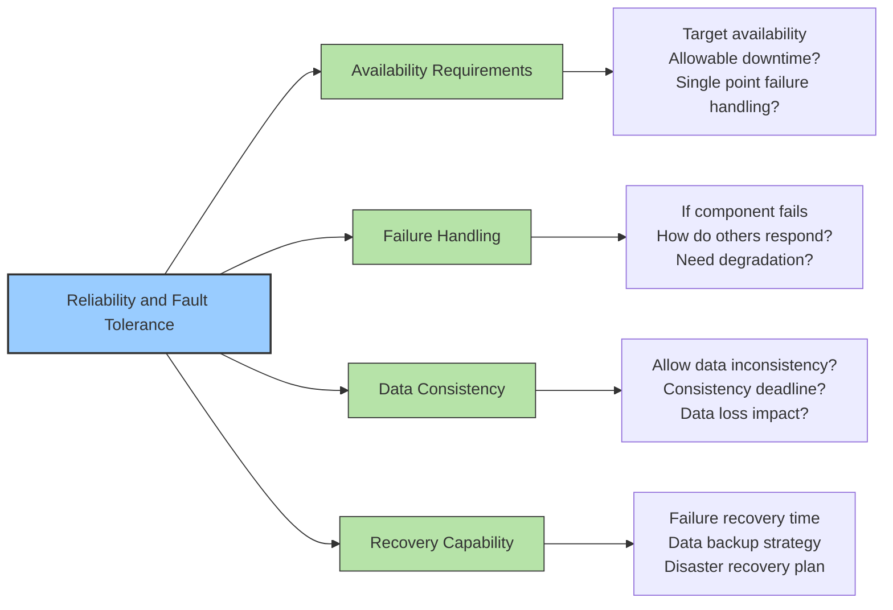
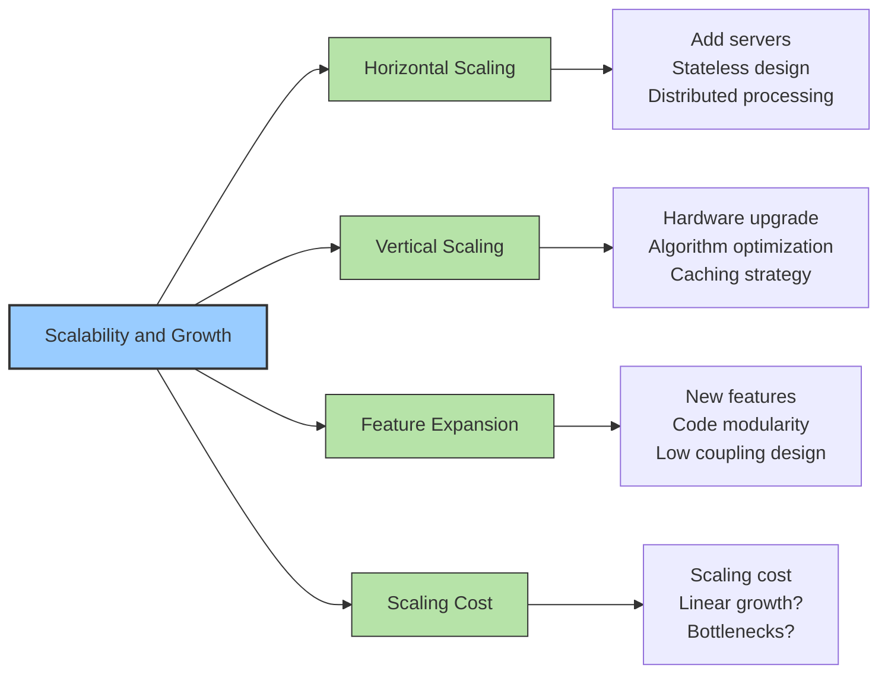
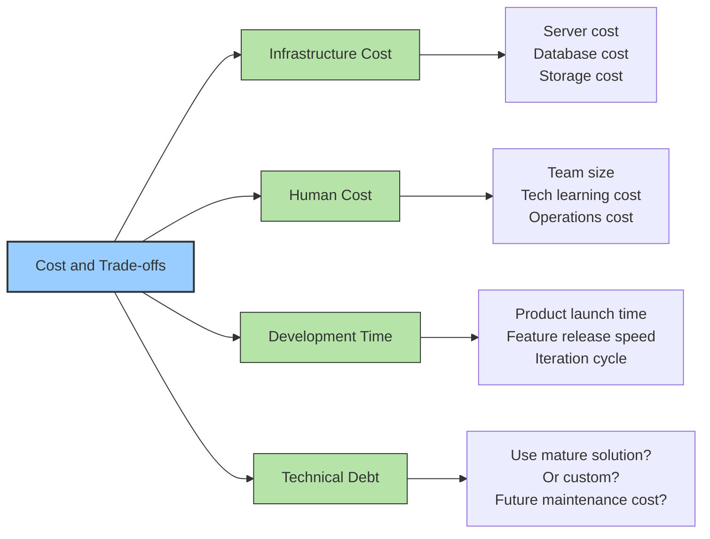
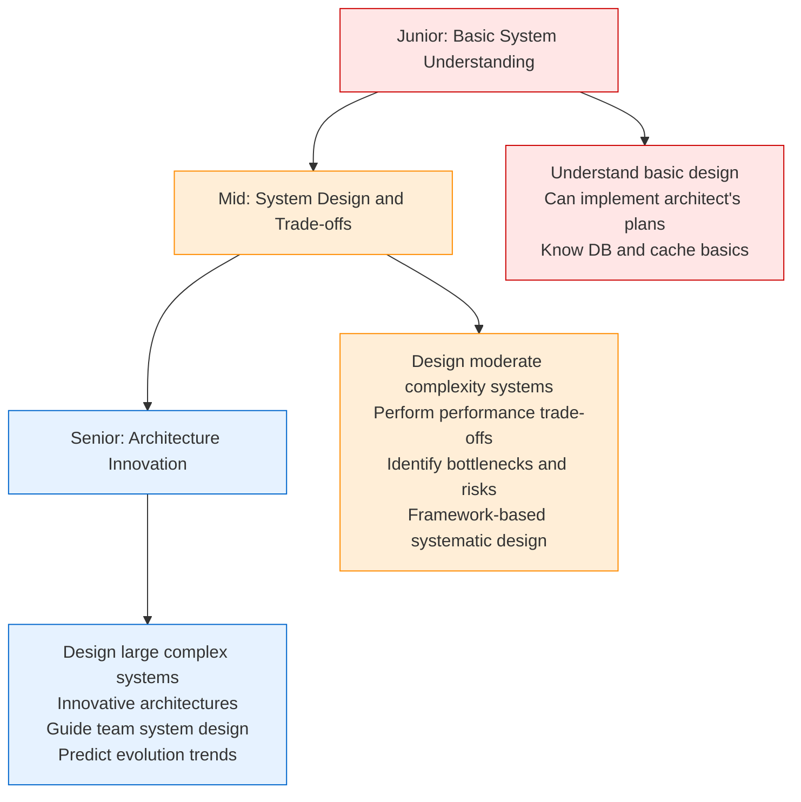
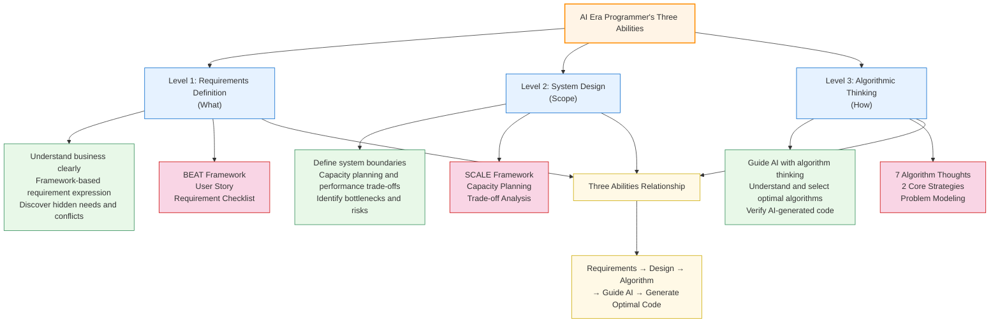

# In the AI Era, Every Programmer Should Be a System Design Engineer

Once you have clearly described your requirements, the next step is to **define the system's boundaries and constraints**. This step is crucial because it directly impacts subsequent algorithm selection, technical architecture, and implementation costs.

In the AI era, a System Design Engineer's responsibility is: **based on clear requirements, analyze system scale, identify key constraints, balance multiple dimensions, and ultimately design an optimal system architecture that both satisfies requirements and is cost-effective**. This is not simply "how to do it," but "what's the most efficient way to do it."

> In the AI era, a programmer's second value is system design ability. Good system design enables AI-generated code to be both efficient and maintainable.

**Complete source code can be found at** [https://github.com/microwind/algorithms](https://github.com/microwind/algorithms)

## Table of Contents

1. [Overview of System Design and Boundary Definition](#one-overview-of-system-design-and-boundary-definition)
2. [Why System Design Matters](#two-why-system-design-matters)
3. [Five Core Dimensions of System Design](#three-five-core-dimensions-of-system-design)
4. [Core Responsibilities of System Design Engineers](#four-core-responsibilities-of-system-design-engineers)
5. [Frameworks and Methods for System Design](#five-frameworks-and-methods-for-system-design)
6. [Common System Design Problems and Solutions](#six-common-system-design-problems-and-solutions)
7. [Practical Case Study: Complete System Design Process](#seven-practical-case-study-complete-system-design-process)
8. [Career Path for System Design Engineers](#eight-career-path-for-system-design-engineers)

---

## One. Overview of System Design and Boundary Definition

### What is System Design?

**System Design** is a comprehensive plan for overall architecture, component division, interaction methods, and technology selection based on clear requirements. It enables systems to efficiently, reliably, and maintainably solve business problems within given constraints.

**Core Elements**:
- **Functional Decomposition**: Break requirements into modules and components
- **Data Flow Design**: Define data flow and storage methods
- **Technology Selection**: Choose appropriate technology stack and frameworks
- **Performance Optimization**: Achieve optimal performance within constraints
- **Fault Tolerance Mechanisms**: Design system reliability and disaster recovery

### What is Boundary Definition (Scoping)?

**Boundary Definition** is the first step in system design, defining "what the system should handle and what it shouldn't," clarifying system constraints and limitations.

**Boundary Definition Includes**:
1. **Functional Boundary**: What functions the system includes and excludes
2. **Data Boundary**: How much data the system processes, how data grows
3. **Performance Boundary**: System response time, throughput, concurrency ability
4. **Reliability Boundary**: Required availability, fault tolerance capability
5. **Cost Boundary**: Maximum allowed system investment

### Why Learn System Design in the AI Era?

#### Traditional Era vs AI Era

| Dimension | Traditional Programming Era | AI Programming Era |
|-----------|---------------------------|-------------------|
| **Design Approach** | Experience-driven, iterative adjustment | Requires comprehensive upfront planning |
| **Code Generation** | Manual implementation | AI rapid generation |
| **Performance Optimization** | Continuous tuning | Based on design guidance |
| **Maintainability** | Improved through refactoring | Guaranteed through framework design |
| **Key Ability** | Coding and debugging | Architectural design |

#### Three Major Values of System Design



---

## Two. Why System Design Matters

### 1. **Avoid Massive Rework Costs from Late Discovery**

```
1 hour in design phase = 1 hour + design change
1 hour in coding phase = coding time + code change + testing
1 hour discovered after launch = urgent fix + data migration + user compensation

Software engineering research: Discovering issues post-launch costs 100x more than in design phase
```

**Real Case Example**:
```
Case: E-commerce Recommendation System

❌ Poor Design:
  - Didn't consider data scale growth
  - No cache layer design
  - Wrong algorithm selection

Result:
  - After 3 months, response time degraded from 100ms to 5000ms
  - Emergency architecture redesign, 2 weeks effort
  - Severe user experience drop, 30% DAU decline

✓ Good Design:
  - Anticipated 100x data growth
  - Designed layered caching (Redis + local cache)
  - Selected scalable algorithm architecture

Result:
  - Handled 10x traffic growth smoothly
  - System stable and reliable, good user experience
```

### 2. **Directly Impacts System Scalability and Maintainability**

```
Good System Design:
✓ Easy to add new features (loose coupling)
✓ Easy to scale capacity (modular)
✓ Easy to troubleshoot (clear layering)
✓ Easy to iterate improvements (pluggable components)

Poor System Design:
❌ Changing one thing breaks many places
❌ Cannot scale capacity (single point bottleneck)
❌ Problem origins unclear (chaotic code)
❌ Every optimization requires restructuring
```

### 3. **Directly Related to Costs**

```
Case Comparison:

Plan A (Insufficient Design):
- Initial cost: Cheap (cheap single servers)
- 6 months later: Emergency optimization needed = engineer time + downtime
- 1 year later: Restructuring needed = major human investment
- Total cost: Very high

Plan B (Reasonable Design):
- Initial cost: Appropriate (suitable servers and architecture)
- 6 months later: Linear scaling, cost controllable
- 1 year later: Stable operation, continuous optimization
- Total cost: Lower

Conclusion: Good design's initial cost isn't high, but total cost is lowest
```

### 4. **Impacts AI Code Generation Quality**

```
Unclear Design → AI doesn't know what to do → Code deviates from expectations
Clear Design → AI understands overall architecture and constraints → Code matches expectations

Example:

❌ Vague Guidance:
"AI, build me a recommendation system"

✓ Clear Guidance:
"AI, implement based on this design:
- Architecture: Two-stage processing (coarse-ranking + fine-ranking)
- Coarse-ranking: Redis-cached popularity ranking, 1000qps support
- Fine-ranking: Vector similarity-based greedy algorithm, 100qps support
- Constraint: Total response <200ms, cache recommendations for 15 minutes
- Fallback: Coarse-ranking failure returns hot products; fine-ranking failure returns coarse results"
```

---

## Three. Five Core Dimensions of System Design

### Dimension 1: Scale and Capacity



**Key Questions**:
```
□ Daily active users? Peak concurrency?
□ Data per user? Total data volume?
□ Data growth speed? (monthly/yearly)
□ Scale projection for next year?
□ Historical data retention period?
```

**Estimation Example**:
```
E-commerce Recommendation System:
- Daily active: 10 million users
- Product catalog: 1 million items
- Recommendation history: Last 90 days user behavior
- Behavior data: 10M users × 30 clicks/day × 90 days = 27 billion records
- Storage: 27B × 100 bytes = 2.7TB
- Annual growth: ×365 ≈ 10TB storage/year
```

### Dimension 2: Performance and Latency



**Key Questions**:
```
□ What's P99 latency? (not just average)
□ Can 1% users tolerate 1 second latency?
□ Peak traffic vs average traffic ratio?
□ Acceptable unit cost? (AWS/cloud cost)
□ Need SLA commitment? (99.9%, 99.99%?)
```

**Performance Metrics System**:
```
Key Performance Indicators:

Response Time:
- P50 (median): Represents average experience
- P99 (99th percentile): Determines user satisfaction
- P999 (99.9th percentile): Edge case scenarios

Throughput:
- QPS (Query Per Second): Queries/second
- TPS (Transaction Per Second): Transactions/second
- RPS (Request Per Second): Requests/second

Availability:
- 99.9% = 43 minutes/month downtime
- 99.99% = 4 minutes/month downtime
- 99.999% = 26 seconds/month downtime
```

### Dimension 3: Reliability and Fault Tolerance



**Key Questions**:
```
□ Required reliability? (99.9%, 99.99%, 99.999%?)
□ Database failure handling? (Standby replicas? Switch time?)
□ Single server failure impact?
□ Can data be lost? (Critical vs non-critical)
□ Failure recovery time requirement? (RTO/RPO)
□ Need multi-region deployment?
```

**CAP Trade-offs**:
```
Classic Design Trade-off:

Consistency vs Availability:
- Strong Consistency: Data always accurate, but network partition causes unavailability
- Eventual Consistency: Temporarily inconsistent, but high availability

Example Decisions:
- Payment System: Strong consistency (money can't be wrong)
- Recommendation System: Eventual consistency (late recommendations okay)
- Inventory System: Configurable (choose based on business)
```

### Dimension 4: Scalability and Growth



**Key Questions**:
```
□ Handle 10x data growth? (Design supports it?)
□ Add servers easily? (Stateless?)
□ Any single point bottlenecks? (Database, cache, MQ)
□ New features require core code changes?
□ Scaling cost linear growth?
□ Tech stack lifespan?
```

### Dimension 5: Cost and Trade-offs



**Key Trade-offs**:
```
Performance vs Cost:
❌ Over-engineering: 2x cost for <1x performance gain
✓ Balanced: Sufficient business support, controllable cost

Speed vs Maintainability:
❌ Quick and dirty: 1 month launch, weekly repairs
✓ Balanced: 2 weeks MVP launch, continuous optimization

Generic vs Specialized:
❌ Generic: Handles anything, optimal for nothing
✓ Specialized: Optimized for business scenario
```

---

## Four. Core Responsibilities of System Design Engineers

### Responsibility 1: Define System Boundaries

```
Clearly Answer:
✓ What functions are included? What are excluded?
✓ System inputs and outputs?
✓ Interaction with external systems?
✓ Data sources and destinations?

Example:

Recommendation System Boundaries:
✓ Include:
  - User behavior data collection
  - Recommendation algorithm computation
  - Recommendation display
✗ Exclude:
  - User login authentication (handled by user service)
  - Product details display (handled by product service)
  - Order processing (handled by order service)
```

### Responsibility 2: Perform Capacity Planning

```
Estimate System Resource Requirements:
✓ Compute Capacity: How many servers needed?
✓ Storage Capacity: How much storage space?
✓ Network Capacity: How much bandwidth?
✓ Memory Capacity: How much cache?

Example Calculation:

Recommendation System Capacity:
Daily 10M users, 30 recommendation requests per user = 300M requests/day = 3500 QPS
Each request takes 10ms = 35,000 CPU cores needed (unrealistic)

Optimization:
Using cache + algorithm optimization:
- Hot product caching (80% hit rate)
- Fast popularity ranking (1ms)
→ Actual need: 3500 QPS × 20% × 10ms = 700 cores = 70 machines

Storage Estimation:
User behavior: 10M users × 100 records = 1B records = 10GB
Recommendation cache: 10M users × 10 results × 100 bytes = 10GB
Product vectors: 1M products × 1KB = 1GB
Total: ≈20GB memory
```

### Responsibility 3: Design Architecture and Technology Stack

```
Choose Appropriate Technology Stack:
✓ Language: Python/Java/Go/...
✓ Framework: Django/FastAPI/SpringBoot/...
✓ Database: MySQL/MongoDB/...
✓ Cache: Redis/Memcached/...
✓ MQ: RabbitMQ/Kafka/...
✓ Search: Elasticsearch/Solr/...

Decision Criteria:
1. Fits business scenario?
2. Team experienced?
3. Active community?
4. Meets performance?
5. Cost controllable?
6. Learning cost?
```

### Responsibility 4: Identify System Bottlenecks and Risks

```
Identify Risks in Design Phase:
✓ Any single points of failure?
✓ Handle peak traffic?
✓ Obvious performance bottlenecks?
✓ Data consistency guarantee?
✓ Disaster recovery plan?

Risk Identification Example:

Recommendation System Risks:
❌ Risk 1: Redis Failure
   Impact: No cache, system blocks
   Solution: Redis cluster + failover

❌ Risk 2: Algorithm Too Slow
   Impact: >200ms response
   Solution: Timeout + fast fallback

❌ Risk 3: Data Inconsistency
   Impact: Already-purchased products shown
   Solution: Async update + real-time verification
```

### Responsibility 5: Guide AI Code Generation

```
Guide AI with Clear Design:

❌ Weak Guidance:
"AI, implement recommendation system"

✓ Strong Guidance:
"AI, implement based on this architecture:
- Architecture Diagram: [Coarse] → [Fine] → [Filter] → [Result]
- Coarse: Redis popularity ranking, 1000qps
- Fine: Vector similarity greedy algorithm, 100qps
- Filter: Exclude purchased, out-of-stock, blacklist items
- Cache: 15-minute TTL, auto-expiry
- Fallback: Coarse failure returns hot items; Fine failure returns coarse result
- Monitoring: Algorithm time, hit rate, diversity metrics
- Tech Stack: Python + Redis + Elasticsearch + Kafka"
```

---

## Five. Frameworks and Methods for System Design

### Framework: SCALE Framework

Optimized system design framework for the AI era:

#### **S - Scale (Scale and Capacity)**

Define **system's data scale and concurrency ability**

```
Example:
Daily active users: 10 million
Peak concurrent users: 100,000
QPS: 50,000 requests/second
Daily storage growth: 10GB
Annual growth rate: 3x
```

**Must Clarify**:
```
□ DAU/MAU/Total Users
□ Peak concurrent users
□ QPS/TPS requirement
□ Single request size
□ Daily data growth
□ Data retention period
```

#### **C - Constraints (Constraints and Limitations)**

Define **system's key constraint conditions**

```
Example:
Performance:
- Response <200ms (P99)
- Availability >99.9%

Cost:
- Monthly cost <1 million
- Can use public cloud

Tech Stack:
- Use open-source
- Team knows Python and Java
```

**Must Clarify**:
```
□ Response time requirement
□ Availability requirement (SLA)
□ Budget
□ Development time
□ Team skills
□ External system limits
```

#### **A - Architecture (Architecture and Design)**

Define **overall system architecture and key components**

```
Example: Recommendation System Architecture

┌─────────────┐
│ User Request│
└──────┬──────┘
       │
┌──────▼──────────────┐
│ Layered Processing  │
│ 1. Cache Check      │
│ 2. Coarse Layer     │
│ 3. Fine Layer       │
│ 4. Filter Layer     │
└──────┬──────────────┘
       │
┌──────▼──────────────┐
│ Result Cache        │
│ (Redis, TTL=15m)    │
└──────┬──────────────┘
       │
┌──────▼──────────────┐
│ Return Results      │
└─────────────────────┘
```

**Must Clarify**:
```
□ Main components?
□ Component interaction?
□ Data flow?
□ Any single points of failure?
□ Cache and database layering?
□ Need async processing?
```

#### **L - Limitations (Limitations and Degradation)**

Define **system's fault tolerance and degradation strategies**

```
Example:
Normal Flow:
Request → Coarse → Fine → Filter → Return

Degradation Plan 1 (Cache Miss):
Request → Cache Fail → Hot Ranking → Return
Cost: Fast (<50ms), Quality: Medium

Degradation Plan 2 (Coarse Timeout):
Request → Coarse Timeout(100ms) → Use Cache → Return

Degradation Plan 3 (Fine Failure):
Request → Coarse OK → Fine Fails → Return Coarse Result
```

**Must Clarify**:
```
□ Critical component timeouts?
□ Component failure fallback?
□ Feature switch control?
□ Algorithm version switching?
□ Minimum service guarantee?
```

#### **E - Evaluation (Assessment and Monitoring)**

Define **system's key metrics and monitoring plan**

```
Example:
Core Metrics:
- Recommendation accuracy (user click rate)
- System response time
- Recommendation diversity (category coverage)
- User conversion rate

Monitoring Alerts:
- Response >500ms alert
- Accuracy <10% alert
- Availability <99% alert
- Diversity <3 categories alert

Display:
- Real-time dashboard
- Daily reports
- Weekly analysis
```

**Must Clarify**:
```
□ System key metrics?
□ Measurement methods?
□ Alert thresholds?
□ A/B test approach?
□ Solution comparison method?
□ Data collection and analysis?
```

---

## Six. Common System Design Problems and Solutions

### Problem 1: Over-Engineering

**Symptoms**:
```
"What if users become 100x?"
"What if we need internationalization?"
"What if we need AI recommendations?"

Result:
- Use overly complex tech stacks
- Implement unnecessary features
- Development time triples
- System complexity unnecessarily high
```

**Root Cause**:
- Unclear requirements understanding
- Optimizing for non-existent problems
- Lack of prioritization and trade-off awareness

**Solution**:
```
1. Clarify current stage goals
   - MVP: Meet basic requirements
   - Mature: Support expected growth

2. Define clear growth plan
   - This year: Support 5 million users
   - Next year: Support 50 million
   - Year after: Support 100 million

3. Invest by stage
   - Stage 1: Single or small cluster sufficient
   - Stage 2: Add cache and database sharding
   - Stage 3: Consider global distribution

4. Use YAGNI Principle
   - You Aren't Gonna Need It
   - Implement only current needs
```

**Trade-off Example**:
```
Plan 1 (Simple Design):
- Single server + MySQL
- Dev time: 2 weeks
- Cost: 500/month
- Support: 1M users
- Drawback: Cannot scale

Plan 2 (Moderate Design):
- 3 app servers + MySQL Master-Slave + Redis
- Dev time: 3 weeks
- Cost: 5,000/month
- Support: 10M users
- Drawback: Needs optimization at scale

Plan 3 (Sufficient Design):
- App Cluster(20+) + DB Sharding + Cache Cluster + MQ + Search Engine
- Dev time: 8 weeks
- Cost: 500,000/month
- Support: 1B users
- Drawback: Over-designed now

Recommendation: Start with Plan 1 or 2, upgrade based on growth
```

### Problem 2: Wrong Technology Stack Choice

**Symptoms**:
```
"We chose a popular framework, but later found it unsuitable"
"Migration costs too high, we're stuck"
"Team learning costs too high, development efficiency stuck"
```

**Root Cause**:
- Blindly following trends
- Not considering team experience
- Not evaluating migration costs

**Solution**:
```
Technology Stack Selection Framework:

1. Compatibility (40% weight)
   □ Suits this business scenario?
   □ Can meet performance requirements?
   □ Sufficient scalability?

2. Team Factors (30% weight)
   □ Team experienced?
   □ How high learning cost?
   □ Recruitment ease?

3. Ecosystem Maturity (20% weight)
   □ Active community?
   □ Rich documentation?
   □ Mature solutions?

4. Cost Factors (10% weight)
   □ License cost?
   □ Infrastructure cost?
   □ Personnel cost?

Scoring Example (Recommendation System):

Option A: Python + Django + MySQL + Redis
- Compatibility: 4/5 (dev fast, performance fair)
- Team Factors: 5/5 (team knows Python)
- Ecosystem: 5/5 (active community)
- Cost: 5/5 (all open-source)
- Score: 4.7/5 ✓ Recommended

Option B: Java + Spring Cloud + PostgreSQL + RabbitMQ
- Compatibility: 5/5 (high performance, reliable)
- Team Factors: 3/5 (high learning cost)
- Ecosystem: 5/5 (mature stable)
- Cost: 4/5 (license cost)
- Score: 4.3/5

Option C: Rust + Custom Framework + ClickHouse
- Compatibility: 5/5 (excellent performance)
- Team Factors: 1/5 (very hard, nobody knows)
- Ecosystem: 2/5 (immature)
- Cost: 3/5 (engineers scarce)
- Score: 2.75/5 ❌ Not recommended
```

### Problem 3: Overlooked Non-Functional Requirements

**Symptoms**:
```
"We only focused on features, forgot security"
"Never thought system can't handle peak traffic"
"Data leaked, then realized needed encryption"
```

**Root Cause**:
- Skipped at requirements definition
- Incomplete design consideration

**Solution - Non-Functional Requirements Checklist**:
```
Performance and Reliability:
□ Response time requirement?
□ Availability requirement (99.9%?)
□ Disaster recovery needed?
□ Failure recovery time (RTO)?

Security:
□ Need encryption? (transport? storage?)
□ Access control design?
□ Audit logs needed?
□ DDoS protection?

Maintainability:
□ Code understandable?
□ Logging and monitoring complete?
□ Good documentation?
□ Quick troubleshooting?

Scalability:
□ Handle 10x data growth?
□ Easily add features?
□ Support new scenarios?

Cost:
□ Infrastructure cost controllable?
□ Human cost (including ops)?
□ Technical debt hidden cost?
```

### Problem 4: Single Points of Failure

**Symptoms**:
```
"Entire system depends on single Redis, if it fails system dies"
"Single database is a bottleneck, disaster if it fails"
"Only one person knows this critical algorithm"
```

**Root Cause**:
- No redundancy design
- Lack of high availability mechanisms
- Knowledge concentration

**Solution**:
```
Eliminate Single Points of Failure:

Single Point: Single MySQL
→ Solution: Master-Slave Replication + Failover
             └─ Architecture: Master-Slave + Sentinel

Single Point: Single Redis
→ Solution: Redis Cluster + Sentinel + Persistence
             └─ Or: Local cache + Multi-level caching

Single Point: Single Datacenter
→ Solution: Cross-region deployment + Data sync
             └─ Architecture: Primary DC + Backup DC

Single Point: Human knowledge
→ Solution: Documentation + Code review + On-call rotation
             └─ Ensure at least 2 people can handle critical modules
```

---

## Seven. Practical Case Study: Complete System Design Process

### Case: E-commerce Recommendation System Complete Design

#### Step 1: Define Boundaries (SCALE Framework)

**S - Scale**:
```
Daily active users: 10 million
Peak concurrent users: 1 million
Product catalog: 1 million items
Daily recommendations: 300 million (10M × 30)
QPS: 50,000
Monthly data growth: 10GB
```

**C - Constraints**:
```
Performance:
- Recommendation response <200ms (P99)
- Availability >99.9%
- Accuracy >80%

Cost:
- Infrastructure <1 million/month
- Team <15 people

Tech Stack:
- Backend: Python/Java acceptable
- Database: MySQL + Redis
- Search: Elasticsearch
- Container: Docker + K8S
```

**A - Architecture**:
```
Recommendation System Architecture Design:

         User Request
              │
              ▼
    ┌────────────────┐
    │ Request Routing│ (Nginx Load Balancing)
    └────────┬───────┘
             │
    ┌────────▼───────┐
    │  Cache Check   │ (Redis)
    │ (Hot Product)  │
    └────────┬───────┘
             │
    ┌────────┴────────┐
    │ Cache Hit       │ Cache Miss
    │ Return Direct   │ Continue
    │                 │
    │      ┌──────────▼────────┐
    │      │   Coarse Stage    │
    │      │ (Popularity+Rules)│
    │      │ Return Top 50     │
    │      └──────────┬────────┘
    │                 │
    │      ┌──────────▼────────┐
    │      │   Fine Stage      │
    │      │ (Vector Similarity│
    │      │ +Diversity)       │
    │      │ Return Top 10     │
    │      └──────────┬────────┘
    │                 │
    │      ┌──────────▼────────┐
    │      │  Filter Stage     │
    │      │ (Blacklist+Stock) │
    │      └──────────┬────────┘
    │                 │
    └─────────┬───────┘
              │
     ┌────────▼────────┐
     │ Result Cache    │ (15min TTL)
     │ Return to User  │
     └─────────────────┘
```

**L - Limitations**:
```
Level 1 (Cache Miss):
- Clear Redis cache
- System continues from coarse stage
- Response: 100-200ms

Level 2 (Coarse Timeout):
- Coarse stage >100ms
- Downgrade to popularity ranking
- Response: 50ms

Level 3 (Fine Failure):
- Fine ranking unavailable
- Return coarse results
- Response: 100ms

Level 4 (System Failure):
- Recommendation system down
- Return hot products
- Response: <10ms
```

**E - Evaluation**:
```
Core Metrics:
- Accuracy (click-through rate)
- Response time (P50/P99)
- Diversity (category count)
- Conversion rate

Monitoring Alerts:
□ Response >500ms → alert
□ Accuracy <10% → alert
□ Diversity <3 categories → alert
□ Availability <99% → alert

Dashboard:
- Real-time QPS and latency
- Error rates per layer
- Cache hit rate
- Algorithm accuracy trend
```

#### Step 2: Detailed Component Design

**Coarse Stage Detailed Design**:
```
Input: User ID, Request Context
Output: Top 50 Product IDs

Implementation:
1. Fetch user interest tags (from user profile cache)
2. Quick search from Elasticsearch with tags → Top 1000
   Index: Product ID + Category + Popularity + Tags
   Query time: <50ms
3. Sort by popularity, take Top 50
4. Check inventory (filter <10 stock)

Expected Performance:
- Processing: <80ms
- QPS: 1000 (50 CPU cores)
```

**Fine Stage Detailed Design**:
```
Input: Top 50 Product IDs
Output: Top 10 Product IDs (with diversity)

Implementation:
1. Fetch product vectors (from vector DB cache)
2. Calculate user-product similarity
3. Use MMR (Maximal Marginal Relevance) for diversity
   - Greedy: Select highest similarity product
   - Diversity: Gradually decrease similarity to selected items

Expected Performance:
- Processing: <100ms
- QPS: 100 (10 CPU cores)
```

**Caching Strategy**:
```
Multi-Level Caching Design:

L1 Cache (Local, In-Memory):
- Store: Top 100 hot product recommendations
- TTL: 5 minutes
- Capacity: 1GB
- Hit Rate: 30%

L2 Cache (Redis Distributed):
- Store: User-personalized recommendation results
- TTL: 15 minutes
- Capacity: 50GB (cluster)
- Hit Rate: 50%

Warmup Strategy:
- Scheduled: Update hot recommendations every 5 minutes
- On-demand: Cache user recommendations on access

Expiry Strategy:
- New user behavior: Proactively expire
- TTL expiry: Auto-expire
```

#### Step 3: Technology Stack and Deployment

**Technology Selection**:
```
Application:
- Language: Python (fast dev) + Java (high-performance modules)
- Framework: FastAPI + Spring Boot

Storage:
- Relational DB: MySQL (user, product metadata)
- Cache: Redis (recommendations, user features)
- Search: Elasticsearch (coarse ranking)
- Vector DB: Milvus (product vectors)
- Time-Series: InfluxDB (monitoring)

Message Queue:
- Kafka (user behavior collection, async recommendation update)

Compute:
- Spark (offline recommendation)
- Flink (real-time recommendations)

Deployment:
- Container: Docker
- Orchestration: Kubernetes
- CI/CD: GitLab CI + Jenkins
```

**Deployment Architecture**:
```
┌─────────────────────────────────────┐
│  User Requests (from CDN)           │
└──────────────────┬──────────────────┘
                   │
         ┌─────────▼────────┐
         │ Nginx Load Bal   │ (4 instances)
         └─────────┬────────┘
                   │
    ┌──────────────┼──────────────┐
    │              │              │
┌───▼───┐     ┌───▼───┐     ┌───▼───┐
│App    │     │App    │     │App    │
│(20)   │     │(20)   │     │(20)   │
└───┬───┘     └───┬───┘     └───┬───┘
    │             │             │
    └─────────────┼─────────────┘
                  │
        ┌─────────▼────────┐
        │ Redis Cluster    │
        │ (10 shards)      │
        └─────────┬────────┘
                  │
    ┌─────────────┼────────────┐
    │             │            │
┌───▼───┐  ┌─────▼──┐   ┌─────▼──┐
│MySQL  │  │Elastic │   │Milvus  │
│Master │  │Search  │   │        │
└───┬───┘  └────────┘   └────────┘
    │
    ▼
  MySQL Slave (Backup + Read)
```

#### Step 4: Risk Identification and Mitigation

**Key Risks**:
```
Risk 1: Recommendation Accuracy Drop
- Cause: Outdated model, training data bias
- Mitigation:
  □ Weekly accuracy evaluation, alert if <10%
  □ Prepare fallback (popularity ranking)
  □ A/B test new models

Risk 2: Cache Breakdown
- Cause: Redis failure + high concurrency
- Mitigation:
  □ Redis cluster + multiple nodes
  □ Local cache backup
  □ Ensure fallback service available

Risk 3: High Recommendation Latency
- Cause: Slow vector computation, network delay
- Mitigation:
  □ Monitor P99 latency every 10 seconds
  □ Auto-degrade if >500ms
  □ Pre-compute hot products

Risk 4: Data Inconsistency
- Cause: Recommendation result vs actual inventory mismatch
- Mitigation:
  □ Filter stage queries inventory real-time
  □ Verify before user sees recommendation
  □ Async compensation mechanism
```

---

## Eight. Career Path for System Design Engineers

### Three-Level Ability Progression



### Learning Path: Junior → System Design Engineer

#### **Phase 1: Foundation Understanding (1-3 months)**

Learning Goals: Master basic system design and common architectures

```
□ Learn system design fundamentals: scalability, reliability, performance
□ Understand SCALE framework
□ Learn database design and optimization basics
□ Understand caching principles and patterns
□ Learn message queue concepts
□ Participate in small system design reviews
```

**Recommended Resources**:
```
https://github.com/microwind/design-patterns
Design patterns help you understand modular system design

https://github.com/microwind/algorithms
Algorithm thinking helps you understand system core logic
```

#### **Phase 2: Deepen Practice (3-6 months)**

Learning Goals: Independently design moderately complex systems

```
□ Participate in 2-3 real project system design processes
□ Learn capacity planning and performance estimation
□ Learn architecture trade-offs and decision methods
□ Learn bottleneck identification and single-point elimination
□ Understand different tech stack pros/cons
□ Learn monitoring and alerting design
□ Participate in system optimization
```

#### **Phase 3: Ability Upgrade (6-12 months)**

Learning Goals: Become team system design expert

```
□ Lead large system architecture design
□ Establish team system design standards
□ Guide other engineers on system design
□ Learn distributed system design
□ Participate in tech stack decisions
□ Build system design best practices library
```

### Five Skills System Design Engineers Must Master

#### 1. **Scale Estimation Ability**

```
Quickly estimate system resource needs:

Example 1: Storage Estimation
100M users, 100 records per user = 10B records, 50 bytes each
→ Total 500GB storage

Example 2: QPS Estimation
10M daily active, 10 requests per user = 100M requests/day
→ Average 1150 QPS, peak 5000 QPS

Example 3: Server Count
50,000 peak QPS, 1000 QPS per server = 50 servers needed

Common Formulas:
- Daily Traffic = Daily Active Users × Avg Requests Per User
- QPS = Daily Traffic / (24×3600)
- Servers Needed = Peak QPS / Single Server Capacity
- Storage = Records × Average Record Size
```

#### 2. **Architecture Trade-off Ability**

```
Choose optimal solution among multiple plans:

Trade-off 1: Performance vs Cost
- High performance: Expensive, better experience
- Economic: Low cost, may need optimization

Trade-off 2: Complexity vs Functionality
- Simple architecture: Maintainable, limited features
- Complex architecture: Complete, hard maintain

Trade-off 3: Consistency vs Availability
- Strong consistency: Data accurate but failure risk
- Eventual consistency: High availability, temporary inconsistency

Trade-off 4: Generic vs Specialized
- Generic design: Multi-scenario, none optimal
- Specialized design: One scenario optimized, less expandable

Decision Method:
1. List all options
2. Evaluate pros/cons
3. Weight by priority
4. Choose highest score
5. Document reasoning and assumptions
```

#### 3. **Bottleneck Identification Ability**

```
Quickly find performance bottlenecks:

Common Bottlenecks:
- Database: Slow queries, missing indexes
- Cache: Low hit rate, hot data
- Network: Low bandwidth, high latency
- Compute: High complexity, insufficient CPU
- Storage: Slow disk IO, low space

Identification Methods:
1. Load test in test environment
2. Monitor component metrics
3. Use analysis tools (APM, flame graphs)
4. Mathematical analysis (Big O)

Optimization Priority:
- Optimize biggest bottleneck first
- System optimization, not single component
- Optimization ROI vs cost
```

#### 4. **Technology Selection Ability**

```
Choose suitable technology based on needs:

Decision Framework:
1. Business Requirement Match (40% weight)
   - Supports needed functions?
   - Performance sufficient?
   - Scalable?

2. Team Ability (30% weight)
   - Team experienced?
   - Learning cost?
   - Recruitment easy?

3. Ecosystem Support (20% weight)
   - Active community?
   - Good documentation?
   - Mature cases?

4. Cost Factors (10% weight)
   - License cost?
   - Infrastructure cost?
   - Learning/maintenance cost?

Record Decision:
- Why choose this technology?
- Alternative options?
- Improvement if needed?
- Future upgrade plan?
```

#### 5. **Systems Thinking Ability**

```
Understand system from holistic perspective:

Systems Thinking Manifestation:
□ Not just component, but overall
□ Not just features, but non-functional
□ Not just current, but future growth
□ Not just optimal, but cost-effective
□ Not just design, but operations

Practice Method:
1. Draw complete architecture diagram
2. Annotate key metrics per part
3. Analyze inter-dependencies
4. Identify risks and bottlenecks
5. Design fallback and monitoring
```

---

## Reference Resources

**Complete code and cases:**
https://github.com/microwind/algorithms

**Design Patterns and Programming Paradigms:**
https://github.com/microwind/design-patterns

**AI Programming Prompts:**
https://github.com/microwind/ai-prompt

**AI Programming Skill Library:**
https://github.com/microwind/ai-skills

---

## What You Should Have Learned:

### 1. **Cognitive Shift**
- From "can code" to "can design"
- From "implementer" to "architect"
- System design is required learning for excellent programmers

### 2. **SCALE Framework Mastery**
```
S - Scale → Handle how much data?
C - Constraints → What are limits?
A - Architecture → How to build?
L - Limitations → What if fails?
E - Evaluation → How to monitor?
```

### 3. **Five Core Dimensions**
- **Scale and Capacity**: DAU, QPS, storage
- **Performance and Latency**: Response time, throughput, SLA
- **Reliability and Fault Tolerance**: HA, disaster recovery, data consistency
- **Scalability and Growth**: Horizontal/vertical scaling
- **Cost and Trade-offs**: Infrastructure, human, tech debt

### 4. **System Design Three-Level Ability**
```
Junior: Basic system understanding
  ↓
Mid-Level: System design and trade-offs
  ↓
Senior: Architecture innovation and guidance
```

### 5. **Complete Design Process**
```
Requirements → Boundary Definition (SCALE) → Architecture → Detail Design
→ Risk Assessment → Tech Selection → Monitoring Plan
```

---

## Three Articles' Complete System

Now you've learned AI era programmers' three core abilities:



> **Final Thoughts**
>
> In the AI era, it's not that programmers stop writing code. Rather, programmers' value shifts from "writing code" to "guiding AI to write code."
>
> To guide AI to write good code, you need:
> 1. **Clearly describe problems** (Requirements Definition Engineer)
> 2. **Reasonably design systems** (System Design Engineer)
> 3. **Guide with algorithms** (Algorithmic Thinking Engineer)
>
> All three abilities are essential. Only by mastering these three levels can you become an excellent programmer in the AI era.
