# AI时代，人人都是系统设计工程师

AI时代，你可以让AI替你打工。最近OpenClaw很火，它可以承担产品、UI、程序员、测试等一系列职责，这些工作你都可以交给它来完成。但AI还是需要人来给它意图和指令，否则AI也不知何去何从。

随着AI能力的提升，软件开发中的岗位边界正在变得模糊。传统意义上的产品、UI、前端、后端、大数据工程师、算法工程师等角色，不再像过去那样细分。未来需要的角色，是能够**理解需求、设计系统并做出技术权衡的综合型工程师**。换句话说，我们需要的是既懂需求、又懂架构，同时具备良好算法思维的**系统设计工程师**。

当你清晰地描述了问题之后，下一步就是**定义问题的边界和约束**。这个步骤至关重要，因为它直接影响后续的算法选择、技术架构和实现成本。

在AI编程时代，系统设计工程师的职责是：**在明确需求的基础上，分析系统的规模、确定关键约束、权衡多个维度的因素，最终设计出既能满足需求又最优系统架构**。这不是简单的"怎么做"，而是"用什么样的方式做最划算"。

> AI时代，程序员的价值不在于写代码，而在于系统设计能力。好的系统设计，能让AI生成的代码既高效又可维护。

**本文完整源码请见** [https://github.com/microwind/algorithms](https://github.com/microwind/algorithms)

## 目录

1. [系统设计与边界定义概述](#一系统设计与边界定义概述)
2. [为什么系统设计很重要](#二为什么系统设计很重要)
3. [系统设计的五大核心维度](#三系统设计的五大核心维度)
4. [系统设计工程师的核心职责](#四系统设计工程师的核心职责)
5. [系统设计框架和方法](#五系统设计框架和方法)
6. [常见的系统设计问题与解决方案](#六常见的系统设计问题与解决方案)
7. [实战案例：完整的系统设计过程](#七实战案例完整的系统设计过程)
8. [系统设计工程师的成长路径](#八系统设计工程师的成长路径)

---

## 一、系统设计与边界定义概述

### 什么是系统设计（System Design）？

**系统设计**是指在明确需求的基础上，对系统的整体架构、组件划分、数据交互、技术选型进行全面规划，使其能够在给定的约束条件下，高效、稳定、可维护地解决特定业务问题。

**核心要素**：

- **功能分解**：将需求分解为多个模块和组件
- **数据流设计**：定义数据的流向和存储方式
- **技术选型**：选择合适的技术栈、框架和基础设施
- **性能优化**：在既定约束条件下实现合理的性能指标
- **容错机制**：设计容错机制、监控与灾难恢复能力

### 什么是边界定义（Scoping）？

**边界定义**是系统设计的第一步，它定义了**"系统要处理什么、不要处理什么"**，明确了系统的约束条件和限制。

**边界定义包括**：

1. **功能边界**：系统包含哪些功能，不包含哪些功能
2. **数据边界**：系统处理多少数据，数据如何增长
3. **性能边界**：系统的响应时间、吞吐量、并发能力
4. **可靠性边界**：系统需要达到什么样的可用性、容错能力
5. **成本边界**：系统在基础设施、开发运维等方面最大成本投入

### AI时代为什么要学系统设计？

#### 传统时代 vs AI时代

| 维度 | 传统编程时代 | AI编程时代 |
|------|-----------|---------|
| **设计方式** | 经验驱动、逐步调整 | 需要前期的全面规划 |
| **代码生成** | 手写实现 | AI快速生成 |
| **性能优化** | 持续调优 | 基于设计指导 |
| **可维护性** | 通过重构改进 | 通过框架设计保证 |
| **关键能力** | 编码和调试 | 架构设计 |

#### 系统设计的三大价值

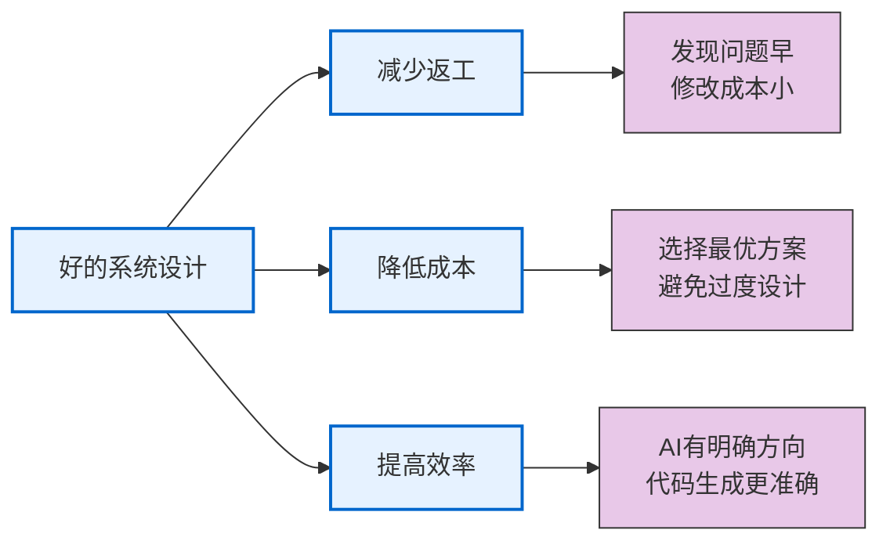

---

## 二、为什么系统设计很重要

### 1. **避免后期返工的巨大成本**

```
设计阶段发现的问题
成本 = 修改设计 + 少量讨论时间

编码阶段发现的问题
成本 = 修改代码 + 重新测试 + 可能的模块重构

上线后发现的问题
成本 = 紧急修复 + 数据迁移 + 用户影响 + 业务损失

根据软件工程中的经验法则：
上线后修复问题的成本，可能是设计阶段的 50～100 倍。
```

**真实案例**：

```
案例：某电商平台推荐系统

✗ 设计不当：
  - 没有考虑数据规模增长
  - 没有设计缓存层
  - 算法策略选择不当

结果：
  - 上线3个月后，系统响应时间从100ms增至5000ms
  - 紧急进行架构重设计，耗时2周
  - 期间用户体验严重下降，日活下跌30%

✓ 好的设计：
  - 前期考虑了100倍数据增长
  - 设计了分层缓存（Redis + 本地缓存）
  - 选择了支持扩展的算法架构

结果：
  - 上线后应对10倍流量增长无压力
  - 系统稳定可靠，用户体验好
```

### 2. **直接影响系统的可扩展性和可维护性**

```
✓ 好的系统设计：
- 易于添加新功能（松耦合）
- 易于扩展容量（模块化）
- 易于定位问题（清晰的分层）
- 易于迭代优化（可插拔的组件）

✗ 差的系统设计：
- 改一个地方，牵连多处
- 无法扩展容量（单点瓶颈）
- 问题来源不明（代码混乱）
- 每次优化都要重构（牵一发动全身）
```

### 3. **成本直接相关**

```
案例对比：

✗ 方案A（设计不足）：
- 初期成本：便宜（便宜的单机服务器）
- 半年后：需要紧急优化 = 工程师成本 + 服务器停机成本
- 一年后：需要重构 = 大量人力投入
- 总成本：非常高

✓ 方案B（合理设计）：
- 初期成本：正常（适当的服务器和架构投入）
- 半年后：线性扩展，成本可控
- 一年后：稳定运行，迭代优化
- 总成本：较低

结论：好的设计前期成本不高，但总成本最低
```

### 4. **影响AI代码生成的质量**

```
不清晰的设计 → AI不知道要做什么 → 代码偏离预期
清晰的设计 → AI知道整体架构和约束 → 代码符合预期

示例：

✗ 模糊的指导：
"AI，给我做个推荐系统"

✓ 清晰的指导：
"AI，请基于以下设计来实现推荐系统：
- 架构：两层处理（粗排 + 精排）
- 粗排：基于Redis缓存的热度排序，支持1000qps
- 精排：基于向量相似度的贪心算法，支持100qps
- 约束：总响应时间<200ms，推荐结果缓存15分钟
- 容错：粗排失败时返回热度商品；精排失败时返回粗排结果"
```

---

## 三、系统设计的五大核心维度

五大核心维度：规模与容量、性能与延迟、可扩展性与成长、成本与权衡

### 维度1：规模与容量

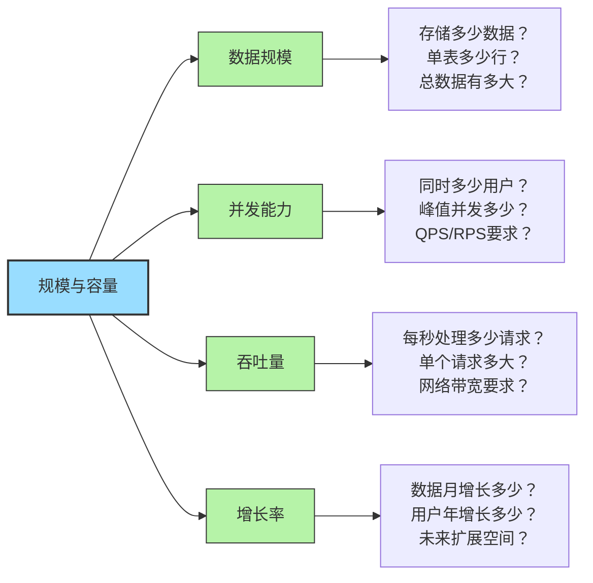

**关键问题**：
```
□ 日活用户数？峰值并发？
□ 单个用户数据量？总数据量？
□ 数据增长速度？（每月/每年）
□ 对应年份的规模预测？
□ 需要支持多久的历史数据？
```

**估算示例**：
```
电商平台推荐系统：
- 日活：1000万用户
- 商品库：100万件
- 推荐历史：保留用户最近90天的行为数据
- 行为数据：点击1000万用户×30次/日×90天 = 270亿条记录
- 存储需求：270亿×100字节 = 2.7TB
- 年增长：×365 ≈ 10TB存储/年
```

### 维度2：性能与延迟

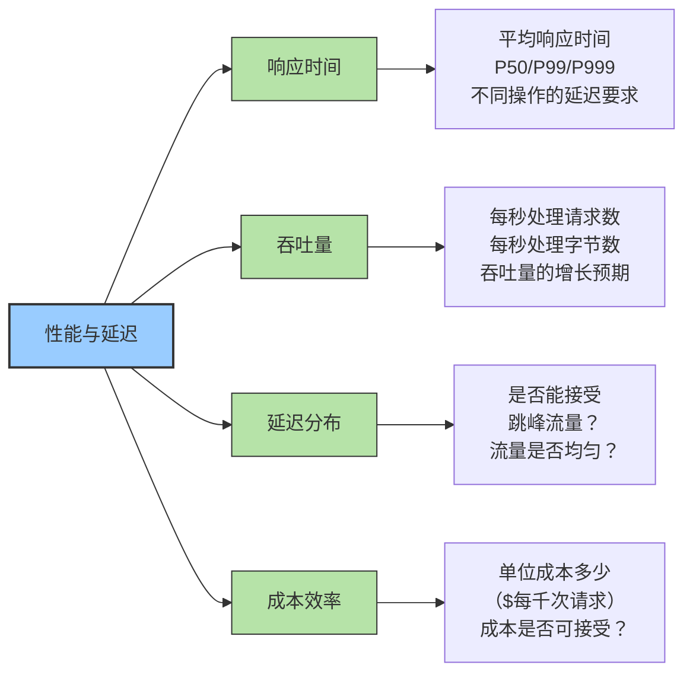

**关键问题**：

```
□ P99延迟是多少？（不只是平均值）
□ 是否能接受99分位数的用户有1秒延迟？
□ 峰值流量是平均流量的多少倍？
□ 单位成本能承受吗？（AWS/云成本）
□ 是否需要SLA承诺？（99.9%, 99.99%?）
```

**性能指标体系**：
```
关键的性能指标：

响应时间：
- P50（中位数）：表示中等体验
- P99（99分位）：决定用户满意度
- P999（99.9分位）：极端情况

吞吐量：
- QPS（Query Per Second）：每秒查询
- TPS（Transaction Per Second）：每秒事务
- RPS（Request Per Second）：每秒请求

可用性：
- 99.9% = 43分钟/月宕机
- 99.99% = 4分钟/月宕机
- 99.999% = 26秒/月宕机
```

### 维度3：可靠性与容错

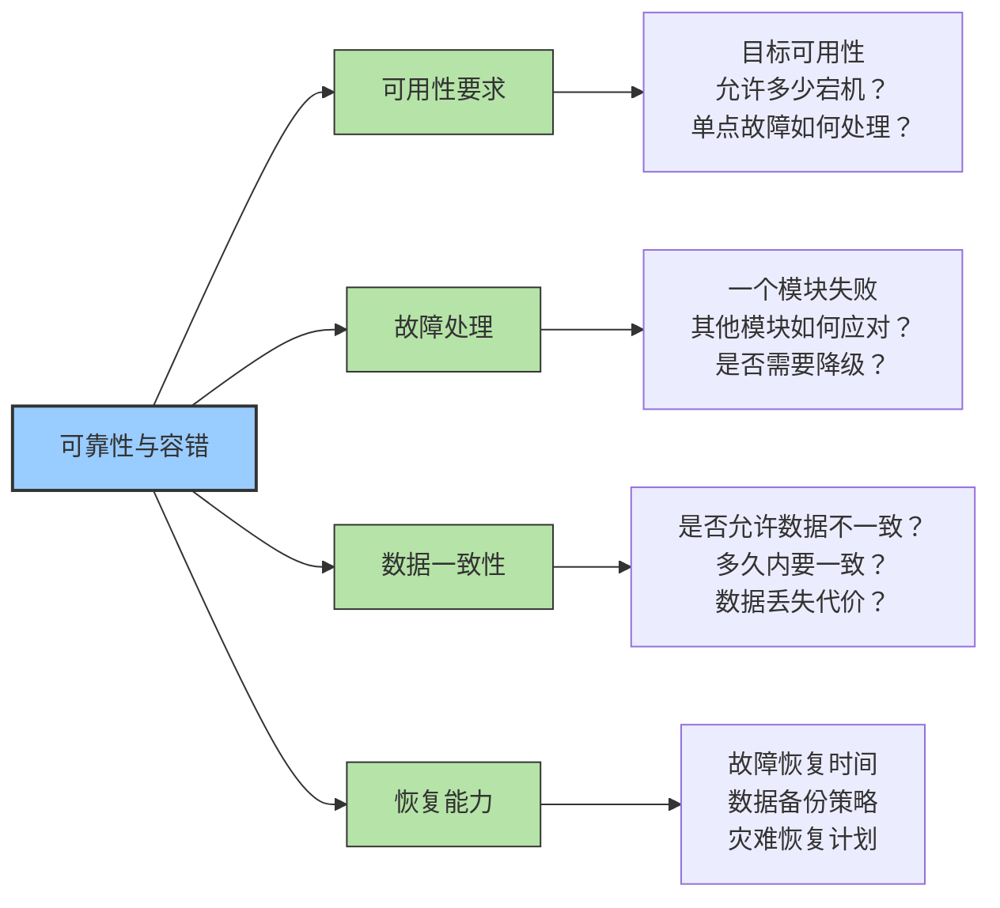

**关键问题**：
```
□ 系统需要达到什么级别的可靠性？（99.9%、99.99%、99.999%）
□ 当数据库发生故障时，系统是否具备自动故障转移能力？（主从/主备架构，切换时间）
□ 单个服务器发生故障时，是否会影响用户请求？（负载均衡与多实例部署）
□ 系统是否允许数据丢失？（核心数据必须持久化，日志数据可容忍少量丢失）
□ 系统的故障恢复目标是什么？（RTO / RPO）
□ 是否需要跨机房或跨区域部署？（容灾与高可用架构）
```

**CAP权衡**：

在分布式系统设计中，一个经典理论是 **CAP**。当发生网络分区（Partition）时，系统必须在一致性（C）和可用性（A）之间做选择。

```
系统设计中的经典权衡：

一致性 vs 可用性：
- 强一致性：数据总是准确，但如果网络分区就无法服务
- 最终一致性：短期不一致，但保证最终准确，高可用

示例决策：
- 支付系统：强一致性（钱不能错）
- 推荐系统：最终一致性（推荐晚一点没关系）
- 库存系统：可配置（根据业务选择）

由于现实系统几乎必须支持 网络分区（P），因此在实际设计中，系统通常需要在 一致性（C） 和 可用性（A） 之间进行权衡。
```

### 维度4：可扩展性与成长

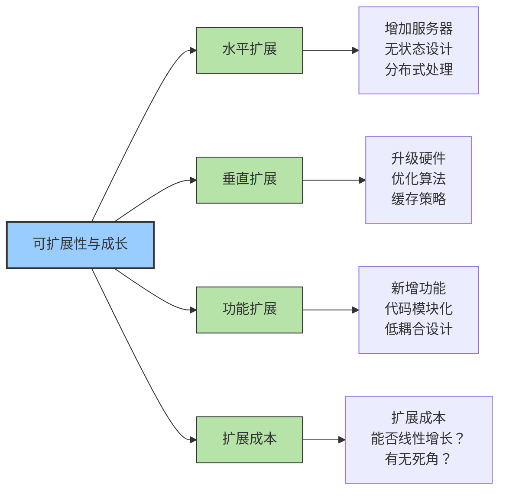

**关键问题**：
```
□ 数据量增长10倍时，系统是否仍然能够稳定运行？（容量规划）
□ 当需要增加服务器时，系统是否支持水平扩展？（无状态服务 / 横向扩展）
□ 系统是否存在单点瓶颈？（数据库、缓存、消息队列等）
□ 添加新功能时，是否需要修改核心代码？（模块解耦程度）
□ 系统扩展时，成本是否呈线性增长？（资源与架构扩展成本）
□ 技术栈的生命周期和生态是否稳定？（长期维护风险）
```

### 维度5：成本与权衡

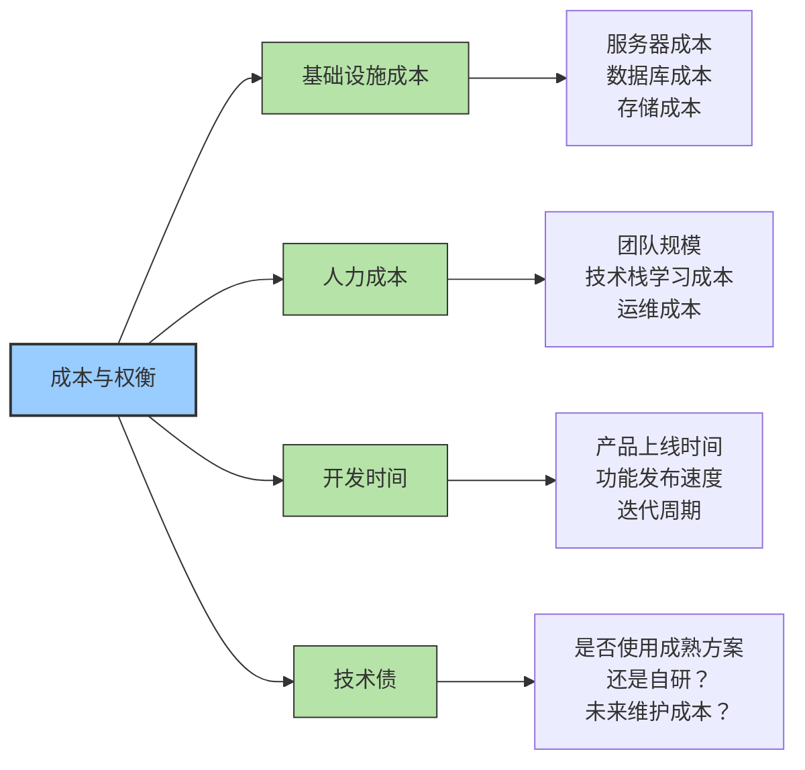

**关键权衡**：
```
性能 vs 成本：
✗ 过度设计：花2倍成本追求不到1倍的性能提升，实际业务负载并不需要
✓ 合理设计：稳定支撑当前业务，预留适度扩展，成本可控

快速 vs 可维护：
✗ 快速粗糙开发：一个月上线，忽略代码结构和架构设计，后期维护成本持续上升
✓ 平衡方案：先快速实现MVP版本验证需求，再通过持续重构和迭代提升系统质量

通用 vs 针对性：
✗ 通用系统：什么都能做，什么都不够好，功能复杂，性能和体验都不理想
✓ 针对性设计：专为业务场景优化，优先解决最重要的问题
```

---

## 四、系统设计工程师的核心职责

### 职责1：定义系统边界

```
清晰地回答：
✓ 系统包含哪些功能？哪些功能不属于本系统？
✓ 系统的输入是什么？输出是什么？
✓ 系统如何与外部系统交互？（API / MQ / 数据同步）
✓ 数据从哪里来？最终流向哪里？

示例：

推荐系统的边界：
✓ 包含：
  - 用户行为数据的收集
  - 推荐算法的计算
  - 推荐结果的展现
✗ 不包含：
  - 用户登录认证（由用户服务处理）
  - 商品详情展示（由商品服务处理）
  - 订单处理（由订单服务处理）
```

### 职责2：进行容量规划

```
估算系统需要的资源：
✓ 计算容量：需要多少台服务器？
✓ 存储容量：需要多少存储空间？
✓ 网络容量：需要多少带宽？
✓ 内存容量：需要多少缓存？

示例计算：

推荐系统容量规划：
流量估算：日活 1000 万用户 × 人均 30 次请求 = 3 亿请求/天
峰值 QPS：平均 3500 QPS。考虑早晚高峰（3-4倍系数），设计 QPS 应为 12,000 - 15,000
计算挑战：若所有请求实时计算（10ms/请求），则需 15,000 × 0.01s = 150 核CPU

优化方案（缓存 + 多级过滤）：

缓存策略：
热门商品/新用户兜底缓存（80% 命中率，响应 < 1ms）
个性化实时请求（20% 穿透，响应 100ms，需多核并行）

计算资源：
缓存层：15,000 × 80% × 1ms = 12 核
模型层：15,000 × 20% × 100ms = 300 核
实际需要：(312 核 × 2 倍冗余) ≈ 624 核（约 40-60 台 16 核服务器）

存储与内存估算：
用户实时特征 (Redis)：1000 万用户 × 10KB/人 (含画像、近期行为) = 100GB
向量检索索引 (Faiss/Milvus)：100 万商品 × 128 维向量 × 4 字节 × 索引膨胀系数 (3-4倍) ≈ 2GB
推荐结果缓存：1000 万用户 × 20 结果 × 100 字节 = 20GB
持久化存储：10 亿条行为日志 + 模型快照 ≈ 500GB - 1TB
总计内存需求：≈ 120GB - 150GB（建议配置 256GB 物理内存）
```

### 职责3：设计架构和技术栈

技术选型优先原则：成熟度 > 稳定性 > 团队经验 > 性能极限

```
选择合适的技术栈：
✓ 编程语言
  Python / Java / Go / Node.js
✓ 后端框架
  Django / Spring Boot / Gin / NestJS
✓ 前端框架
  React / Vue / Svelte / Angular / jQuery
✓ 数据库
  MySQL / PostgreSQL / MongoDB / Cassandra
✓ 缓存系统
  Redis / Memcached / Couchbase
✓ 消息队列
  RocketMQ / RabbitMQ / Kafka / Pulsar
✓ 搜索引擎
  Elasticsearch / Solr / OpenSearch
✓ 基础设施
  Docker / Kubernetes / 云服务

决策标准：
1. 业务适配性：技术是否适合当前业务场景？
2. 团队经验：团队是否具备相关技术经验？
3. 生态与社区：技术生态是否成熟？社区是否活跃？
4. 性能与扩展性：是否能够满足系统性能和扩展需求？
5. 成本控制：是否会带来过高的运维或资源成本？
6. 学习与维护成本：新成员是否容易上手？长期维护是否困难？
```

### 职责4：识别系统瓶颈和风险

```
在设计阶段识别风险：
✓ 是否存在单点故障？
✓ 系统能否应对峰值流量？
✓ 是否存在明显的性能瓶颈？
✓ 数据一致性如何保证？
✓ 是否有完整的灾难恢复计划？

风险识别示例：

推荐系统风险分析：
✗ 风险1：Redis宕机
   后果：无法获取缓存推荐，系统堵塞
   解决：Redis集群 + 主从切换

✗ 风险2：推荐算法计算太慢
   后果：响应时间超过200ms，用户体验下降  
   解决：时间有限（timeout）+ 快速降级策略：返回缓存结果或热门推荐

✗ 风险3：数据不一致
   后果：用户看到已购买或已下架的商品
   解决：异步更新 + 实时查询数据库双重验证
```

### 职责5：指导AI代码生成

```
用清晰的设计指导AI：

✗ 弱指导：
"AI，给我实现推荐系统"

✓ 强指导：
"AI，请基于以下架构实现推荐系统：
- 系统架构图：[粗排层] → [精排层] → [过滤层] → [结果]
- 粗排：使用Redis热度排序，支持1000qps
- 精排：使用向量相似度的贪心算法，支持100qps
- 过滤：排除已购商品、无货商品、用户黑名单
- 缓存：推荐结果缓存15分钟，TTL自动失效
- 容错：粗排失败返回热度排序；精排失败返回粗排结果
- 监控：记录算法耗时、命中率、多样性指标
- 技术栈：Python + Redis + Elasticsearch + Kafka"
```

---

## 五、系统设计框架和原则

### 系统设计框架：SCALE

> 这是为系统设计优化的结构化框架

#### **S - Scale（规模与容量）**

定义**系统要处理的数据规模和并发能力**

```
示例：
日活用户：1000万
峰值并发：10万用户同时在线
QPS：50000请求/秒
日均数据存储增量：10GB
年增长率：3倍
```

**需要明确的指标**：
```
□ DAU/MAU/总用户数
□ 峰值并发用户
□ QPS/TPS要求
□ 单个请求大小
□ 每日数据增长
□ 需要保存多久的数据
```

#### **C - Constraints（约束与限制）**

定义**系统的关键约束条件**

```
示例：
性能：
- 响应时间<200ms（P99）
- 系统可用性>99.9%

成本：
- 月成本<100万
- 可以用公共云

技术栈：
- 使用开源技术
- 团队熟悉Python和Java
```

**需要明确的约束**：
```
□ 响应时间要求
□ 可用性要求（SLA）
□ 成本预算
□ 开发时间
□ 团队技能
□ 外部系统限制
```

#### **A - Architecture（架构与设计）**

定义**系统的整体架构和关键组件**

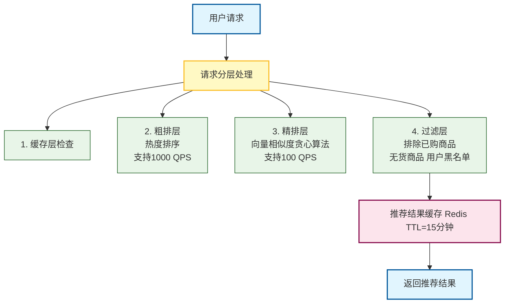

**需要明确的架构**：
```
□ 系统的主要组件有哪些？  
  （例如：API 网关、Web 服务、数据库、缓存、消息队列、搜索服务）
□ 组件之间如何交互？  
  （数据流向、同步/异步调用、接口协议）
□ 数据流向是怎样的？  
  （请求入口 → 处理层 → 存储/缓存 → 响应）
□ 是否有单点故障？  
  （数据库、缓存、服务、负载均衡是否有冗余）
□ 缓存和数据库如何分层？  
  （热数据使用缓存，冷数据写入数据库或持久存储）
□ 是否需要异步处理？  
  （高耗时任务、批处理或消息队列场景）
```

#### **L - Limitations（限制与降级）**

定义**系统的容错机制和降级策略**

```
示例：
正常流程：
请求 → 粗排 → 精排 → 过滤 → 返回

降级方案1（缓存失效）：
请求 → 缓存检查失败 → 热度排序 → 返回  
成本：快速（<50ms），质量：中等

降级方案2（粗排超时）：
请求 → 粗排超时 (timeout=100ms) → 使用缓存热度 → 返回  
成本：中等，质量：略低于正常流程

降级方案3（精排宕机）：
请求 → 粗排成功 → 精排宕机 → 返回粗排结果  
成本：快速，质量：基本满足需求
```

**需要明确的限制**：
```
□ 各个关键模块的超时时间
□ 某个模块故障时的降级方案
□ 是否有功能开关控制
□ 如何切换不同的算法版本
□ 故障时的最低服务保证
```

#### **E - Evaluation（评估与监控）**

定义**系统的关键指标和监控方案**

```
示例：

核心指标：
- 推荐准确率（用户点击率）
- 系统响应时间（ms）
- 推荐多样性（品类覆盖数）
- 用户转化率（购买/点击比例）

监控告警：
- 响应时间 > 500ms → 告警
- 推荐准确率 < 10% → 告警
- 系统可用性 < 99% → 告警
- 推荐多样性 < 3 个品类 → 告警

数据展示：
- 实时仪表板展示关键指标
- 每日报表对比历史数据
- 每周性能分析与趋势总结
```

**需要明确的评估**：
```
□ 系统的关键指标有哪些？
□ 如何衡量这些指标？
□ 监控告警的阈值是多少？
□ 如何进行A/B测试？
□ 如何对比不同方案？
□ 数据收集和分析的方式？
```

---

### 微服务系统设计原则：AKF分解法

####  AKF 分解法（三维立方体）

> 当系统需要微服务化时，可以参考 **AKF 分解法**（三维扩展立方体），用于指导服务拆分和系统扩展：

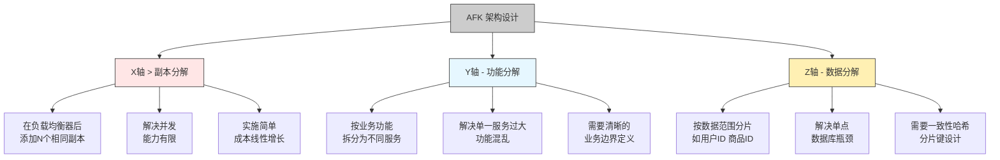
**SCALE框架与AKF的关系**：

- SCALE在A（架构）层面定义系统的组件划分
- AKF是具体的微服务分解方法，是SCALE架构设计的细化工具

###  微服务设计参考原则： SOLID 原则
> 在服务内部设计时，可以参考 SOLID 原则，保证服务可维护、可扩展：
```
S：每个服务只做一件事；  
O：新增功能时可扩展，不修改核心；  
L：子模块可替换父模块，保证兼容；  
I：接口专一，避免依赖无关功能；  
D：依赖抽象而非实现，方便升级替换。
```

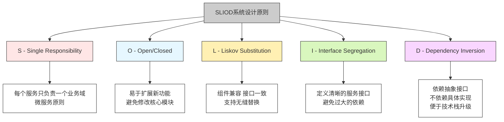

> 结合 AKF + SOLID 原则：
> AKF：指导微服务拆分、横向/纵向扩展
> SOLID：指导服务内部设计和接口规范
> 两者结合可构建可扩展、可维护的微服务架构

---

### 何时使用这些原则和框架

**SCALE框架** - 用于任何系统设计
- ✓ 新项目启动前的设计评审
- ✓ 大型系统的架构规划
- ✓ 性能问题的根因分析

**AKF分解法** - 用于微服务架构设计
- ✓ 系统需要水平扩展时
- ✓ 功能复杂需要拆分时
- ✓ 数据规模过大需要分片时

**SOLID原则** - 用于代码和模块设计

- ✓ 指导团队代码规范
- ✓ 代码审查的检查项
- ✓ 重构时的参考标准

**三层/分层架构** - 用于初期系统设计

- ✓ 传统业务系统
- ✓ 快速原型验证
- ✓ 中小型应用

---

## 六、常见的系统设计问题与解决方案

### 问题1：技术栈选择不当

**症状**：
```
常见技术选型问题：
- "我们用了一个很流行的框架，但后来发现它不适合实际的业务场景"
- "迁移成本太高，现在被技术选型困住了"
- "团队学习成本太高，导致开发效率一直上不去"
```

**问题所在**：
- 盲目跟风选技术
- 没有考虑团队经验
- 没有评估迁移成本

**解决方案 - 技术栈选择的决策框架**：
```
1. 适配性（权重40%）
   □ 是否适合这个业务场景？
   □ 性能指标能否满足需求？
   □ 可扩展性是否足够？

2. 团队因素（权重30%）
   □ 团队是否有经验？
   □ 学习成本有多高？
   □ 是否容易招人？

3. 生态成熟度（权重20%）
   □ 社区是否活跃？
   □ 文档和教程是否丰富？
   □ 解决方案是否成熟？

4. 成本因素（权重10%）
   □ 许可成本？
   □ 基础设施成本？
   □ 人力成本？

评分优先原则：成熟度 > 稳定性 > 团队经验 > 性能极限
```

### 问题2：忽视了关键的非功能需求

**症状**：
```
"我们只关注功能，没想到要考虑安全性"
"上线后才发现系统无法应对峰值流量"
"数据泄露了，才想起来要加密"
```

**问题所在**：
- 需求定义阶段就遗漏了
- 设计时没有全面考虑

**解决方案 - 非功能需求检查清单**：
```
性能与可靠性：
□ 响应时间要求是多少？
□ 系统可用性要求（99.9%?）
□ 是否需要灾难恢复计划？
□ 故障转移时间（RTO）？

安全性：
□ 需要加密吗？（传输层？存储层？）
□ 访问控制如何设计？
□ 有审计日志要求吗？
□ 需要防护DDoS吗？

可维护性：
□ 代码是否容易理解？
□ 日志和监控是否完善？
□ 是否有良好的文档？
□ 能否快速定位问题？

可扩展性：
□ 能否支持数据量翻10倍？
□ 能否轻松添加新功能？
□ 能否支持新的业务场景？

成本：
□ 基础设施成本是否可控？
□ 人力成本（包括运维）？
□ 技术债的隐性成本？
```

### 问题3：有单点故障

**症状**：
```
"整个系统就靠一台Redis，Redis挂了系统就死了"
"数据库是单点，万一故障就没办法"
"这个关键算法只有一个人会"
```

**问题所在**：
- 系统没有冗余设计
- 缺少高可用机制
- 知识集中

**解决方案**：

```
消除单点故障：

单点：单台MySQL
解决：主从复制 + 主备切换
        └─ 架构：Master-Slave + Sentinel

单点：单台Redis
解决：Redis Cluster + Sentinel + 持久化
        └─ 或者：用本地缓存 + 多级缓存

单点：单个数据中心
解决：跨地域部署 + 数据同步
        └─ 架构：主中心 + 从中心，异步同步

单点：人力
解决：知识文档化 + 代码审查 + 轮流值班
        └─ 确保至少2个人能处理关键模块
```

---

## 七、实战案例：完整的系统设计过程

### 案例：电商推荐系统的完整设计

#### 第1步：定义边界（SCALE框架）

**S - Scale（规模）**：
```
日活用户：1000万
峰值并发用户：100万
商品库：100万件
日推荐请求：3亿次（1000万用户 × 30次）
QPS：50000
月数据增长：10GB
```

**C - Constraints（约束）**：
```
性能：
- 推荐响应时间 < 200ms（P99）
- 系统可用性 > 99.9%
- 推荐准确率 > 80%

成本：
- 月基础设施成本 < 100万元
- 团队规模 < 15人

技术栈：
- 后端：Java/Python/Go均可
- 数据库：MySQL + Redis
- 搜索：Elasticsearch
- MQ：RocketMQ
- 容器化：Docker + K8S
```

**A - Architecture（架构）**：

推荐系统的处理流程：

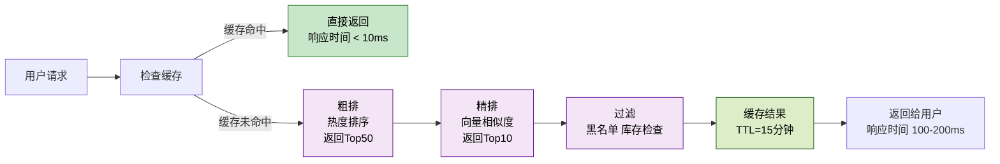

各层的具体职责：
- **缓存层**：存储热门推荐结果，命中率目标80%
- **粗排层**：快速筛选候选商品，支持1000+ QPS
- **精排层**：精细化排序和多样性优化，支持100 QPS
- **过滤层**：业务规则检查，排除无效商品
- **降级策略**：粗排超时→返回缓存；精排故障→返回粗排结果

**L - Limitations（容错）**：
```
级别1（缓存失效）：
- 清空Redis缓存
- 系统仍能继续处理（从粗排开始）
- 响应时间：100-200ms

级别2（粗排超时）：
- 粗排算法超过100ms未返回
- 降级到热度排序
- 响应时间：50ms

级别3（精排宕机）：
- 精排服务不可用
- 返回粗排结果
- 响应时间：100ms

级别4（推荐系统故障）：
- 整个推荐系统宕机
- 返回热销商品列表
- 响应时间：<10ms
```

**E - Evaluation（监控）**：
```
核心指标：
- 推荐准确率（点击率）
- 系统响应时间（P50/P99）
- 推荐多样性（品类数）
- 用户转化率

监控告警：
□ 响应时间 > 500ms → 告警
□ 准确率 < 10% → 告警
□ 多样性 < 3个品类 → 告警
□ 系统可用性 < 99% → 告警

监控仪表板：
- 实时QPS和延迟分布
- 各个层的错误率
- 缓存命中率
- 算法准确率趋势
```

#### 第2步：详细设计关键模块

**粗排层详设计**：
```
输入：用户ID、请求上下文
输出：Top 50商品ID列表

实现方案：
1. 获取用户兴趣标签（从用户画像缓存）
2. 基于标签从Elasticsearch快速检索Top 1000商品
   索引：商品ID + 品类 + 热度 + 标签
   查询时间：<50ms
3. 按热度排序，取Top 50
4. 检查库存（过滤库存<10件的）

预期性能：
- 处理时间：<80ms
- 支持QPS：1000（50核CPU）
```

**精排层详设计**：
```
输入：Top 50商品ID列表
输出：Top 10商品ID列表（考虑多样性）

实现方案：
1. 获取商品向量（从向量数据库缓存）
2. 计算用户-商品相似度
3. 使用MMR（最大边际相关性）算法平衡相关性和多样性
   - 贪心选择：相似度最高的商品
   - 多样性优化：逐个选择时，降低与已选商品的相似度

预期性能：
- 处理时间：<100ms
- 支持QPS：100（10核CPU）
```

**缓存策略**：
```
多级缓存设计：

L1 缓存（本地缓存，内存）：
- 存储：热门商品推荐（Top 100）
- TTL：5分钟
- 容量：1GB
- 命中率：30%

L2 缓存（Redis分布式缓存）：
- 存储：用户个性化推荐结果
- TTL：15分钟
- 容量：50GB（Redis集群）
- 命中率：50%

预热策略：
- 定时任务：每5分钟更新热门推荐
- 用户访问时：缓存用户个性化推荐

失效策略：
- 用户有新行为时：主动失效
- TTL过期时：自动失效
```

#### 第3步：技术栈和部署

**技术栈选择**：

```
应用层：
- 语言：Python（快速开发）+ Java（性能要求高的模块）
- 框架：FastAPI + Spring Boot

数据存储层：
- 关系数据库：MySQL（用户、商品元数据）
- 缓存：Redis（推荐缓存、用户特征）
- 搜索：Elasticsearch（粗排商品检索）
- 向量数据库：Milvus（商品向量存储和检索）
- 时序数据：InfluxDB（监控数据）

消息队列：
- Kafka（用户行为数据收集、推荐数据异步更新）

计算框架：
- Spark（离线推荐计算）
- Flink（实时推荐计算）

部署：
- 容器化：Docker
- 编排：Kubernetes
- CI/CD：GitLab CI + Jenkins
```

**部署架构**：

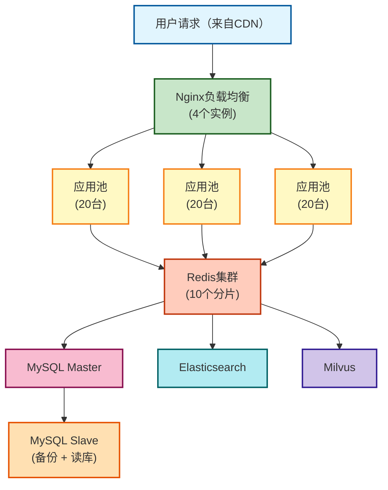

#### 第4步：风险和应对

**关键风险识别**：

```
风险1：推荐准确率下降
- 原因：算法模型过时、训练数据偏差
- 应对：
  □ 每周评估准确率，<10%时告警
  □ 准备降级方案（热度排序）
  □ A/B测试验证新模型

风险2：缓存雪崩
- 原因：Redis故障 + 高并发
- 应对：
  □ Redis集群 + 多个节点
  □ 本地缓存作为备选
  □ 降级方案确保服务可用

风险3：推荐延迟过高
- 原因：向量计算太慢、网络延迟
- 应对：
  □ 每10秒监控P99延迟
  □ 超过500ms自动降级
  □ 预计算热门商品

风险4：数据不一致
- 原因：推荐结果与实际库存不一致
- 应对：
  □ 过滤层实时查询库存
  □ 用户看到推荐后再查库存
  □ 异步补偿机制修复
```

---

## 八、系统设计工程师的成长路径

### 三层能力进阶模型

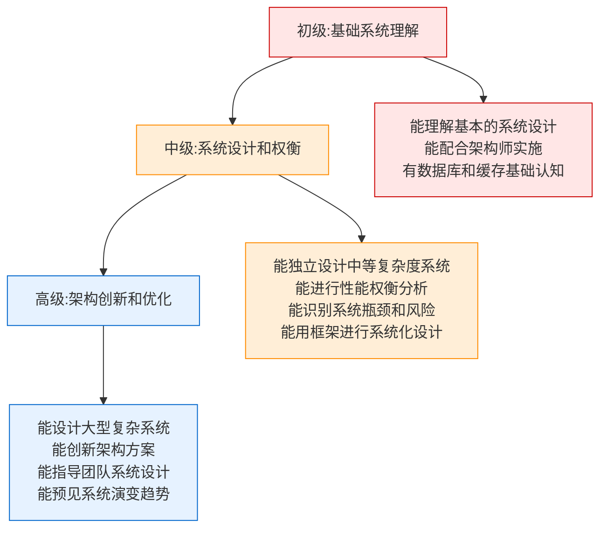

### 学习路径（初级 → 系统设计工程师）

#### **阶段1：理解基础（1-3个月）**

学习目标：掌握基本的系统设计思想和常见架构

```
□ 学习系统设计基础：可扩展性、可靠性、性能
□ 理解SCALE框架
□ 学习数据库设计和优化基础
□ 学习缓存原理和常见缓存模式
□ 理解消息队列的基本概念
□ 参与小型系统的设计评审
```

#### **阶段2：深化实践（3-6个月）**

学习目标：能独立进行中等复杂度的系统设计

```
□ 参与2-3个真实项目的系统设计全过程
□ 学会进行容量规划和性能估算
□ 学习架构权衡和决策方法
□ 学会识别系统瓶颈和单点故障
□ 了解不同技术栈的优缺点
□ 学习监控和告警的设计
□ 参与系统优化项目
```

#### **阶段3：能力升级（6-12个月）**

学习目标：成为团队的系统设计专家

```
□ 主导大型系统的架构设计
□ 建立团队的系统设计规范
□ 指导其他程序员进行系统设计
□ 学习分布式系统设计
□ 参与技术栈升级决策
□ 积累系统设计最佳实践库
```

### 系统设计工程师应该掌握的五项技能

#### 1. **规模估算能力**

```
能够快速估算系统需要的资源：

示例1：估算存储
100万用户，每用户100条行为记录
→ 1亿条记录，每条50字节
→ 总计5GB存储

示例2：估算QPS
1000万日活，人均10个请求
→ 10亿请求/天
→ 平均11500 QPS，峰值50000 QPS

示例3：估算服务器数
50000 QPS，单台服务器处理1000 QPS
→ 需要50台服务器

常用的估算公式：
- 日流量 = 日活用户 × 人均请求数
- QPS = 日流量 / (24×3600)
- 所需机器数 = 峰值QPS / 单机能力
- 存储大小 = 记录数 × 平均记录大小
```

#### 2. **架构权衡能力**

```
能够在多个方案中做出最优选择：

权衡1：性能 vs 成本
- 高性能方案：成本高，但用户体验好
- 经济方案：成本低，但可能需要优化

权衡2：复杂度 vs 功能
- 简单架构：易维护，但功能受限
- 复杂架构：功能完整，但难维护

权衡3：一致性 vs 可用性
- 强一致：数据准确但失败风险大
- 最终一致：可用性高但数据可能短期不一致

权衡4：通用 vs 特化
- 通用设计：适应多个场景，但都不最优
- 特化设计：针对特定场景优化，但扩展性差

做决策的方法：
1. 列出所有可选方案
2. 评估每个方案的优缺点
3. 根据优先级加权
4. 选择综合得分最高的
5. 记录决策的理由和假设
```

#### 3. **瓶颈识别能力**

```
能够快速识别系统的性能瓶颈：

常见的瓶颈：
- 数据库：慢查询、无索引
- 缓存：命中率低、热点数据
- 网络：带宽不足、延迟高
- 计算：算法复杂度高、CPU不足
- 存储：磁盘IO慢、空间不足

识别瓶颈的方法：
1. 搭建测试环境进行压力测试
2. 监控各个组件的指标
3. 使用分析工具（APM、火焰图）
4. 数学推导（Big O分析）

优化的优先级：
- 找到最大的瓶颈先优化
- 优化系统不是优化一个组件
- 优化的收益 vs 成本
```

#### 4. **技术选型能力**

```
能够根据需求选择合适的技术：

决策框架：
1. 业务需求匹配度（40%权重）
   - 是否支持所需的功能？
   - 性能能否满足？
   - 可扩展性？

2. 团队能力（30%权重）
   - 团队是否有经验？
   - 学习成本多高？
   - 是否容易招人？

3. 生态和支持（20%权重）
   - 社区是否活跃？
   - 文档是否完善？
   - 是否有成熟案例？

4. 成本因素（10%权重）
   - 许可成本？
   - 基础设施成本？
   - 学习和维护成本？

记录决策：
- 为什么选择这个技术？
- 其他可选方案是什么？
- 如果需要改进该怎么办？
- 后续的升级计划是什么？
```

#### 5. **系统性思维能力**

```
能够从全局视角理解系统：

系统性思维的表现：
□ 不只考虑单个模块，而是整体
□ 不只考虑功能，而是非功能需求
□ 不只考虑当前，而是未来增长
□ 不只考虑最优，而是成本与最优的平衡
□ 不只考虑设计，而是运维和监控

实践方法：
1. 画出系统的完整架构图
2. 标注各部分的关键指标
3. 分析各部分之间的依赖
4. 识别风险和瓶颈
5. 设计容错和监控方案
```

---

## 看完本文，您应该有所收获：

### 1. **认知转变**
- 从"会编码"升级为"能设计"
- 从"实现者"升级为"设计师"
- 系统设计是优秀程序员的必修课

### 2. **SCALE框架掌握**
```
S - Scale（规模与容量）→ 处理多少数据？
C - Constraints（约束）→ 有什么限制？
A - Architecture（架构）→ 怎么架构？
L - Limitations（容错）→ 故障怎么办？
E - Evaluation（评估）→ 如何监控？
```

### 3. **五大核心维度**
- **规模与容量**：日活、QPS、存储
- **性能与延迟**：响应时间、吞吐量、SLA
- **可靠性与容错**：高可用、容灾、数据一致性
- **可扩展性与成长**：水平扩展、功能扩展
- **成本与权衡**：基础设施、人力、技术债

### 4. **系统设计的三层能力**
```
初级：基础系统理解
  ↓
中级：系统设计和权衡
  ↓
高级：架构创新和指导
```

### 5. **完整的设计过程**
```
需求理解 → 边界定义(SCALE) → 架构设计 → 详细设计 → 风险评估 → 技术选型 → 监控方案
```

---

## AI时代程序员的三层能力

> AI时代，掌握这三层能力，你就能驾驭AI，让AI替你打工。

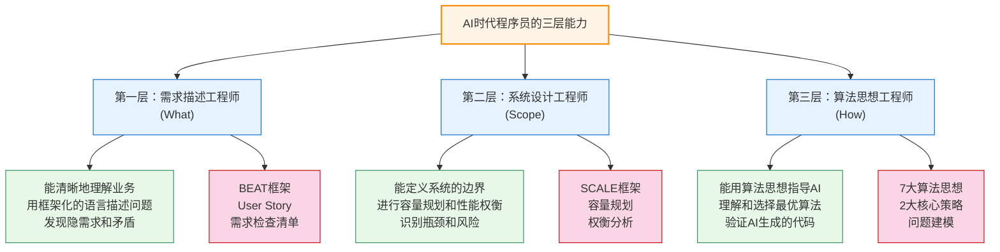

程序员的价值从"写代码"转向"指导AI写代码"。你需要：
> 1. **清晰地描述问题**（需求描述工程师）
> 2. **合理地设计系统**（系统设计工程师）
> 3. **用算法思想指导**（算法思想工程师）

### 相关链接
- [AI时代，人人都是AI Agent工程师](https://github.com/microwind/algorithms/blob/main/start-here/AI-Era-Programmers-as-Agent-Engineers.md)
- [AI时代，人人都是需求描述工程师](https://github.com/microwind/algorithms/blob/main/start-here/AI-Era-Programmers-as-Requirements-Engineers.md)
- [AI时代，人人都是系统设计工程师](https://github.com/microwind/algorithms/blob/main/start-here/AI-Era-Programmers-as-System-Design-Engineers.md)
- [AI时代，人人都是算法思想工程师](https://github.com/microwind/algorithms/blob/main/start-here/AI-Era-Programmers-as-Algorithmic-Thinkers.md)
- [算法与数据结构代码分析](https://github.com/microwind/algorithms)
- [设计模式与编程范式详解](https://github.com/microwind/design-patterns)
- [AI编程提示词模板库](https://github.com/microwind/ai-prompt)
- [AI编程Skill仓库](https://github.com/microwind/ai-skills)
