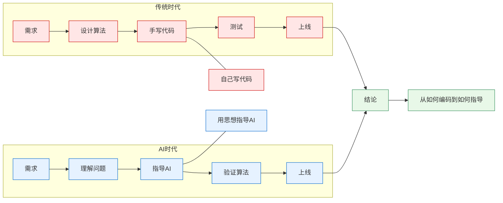
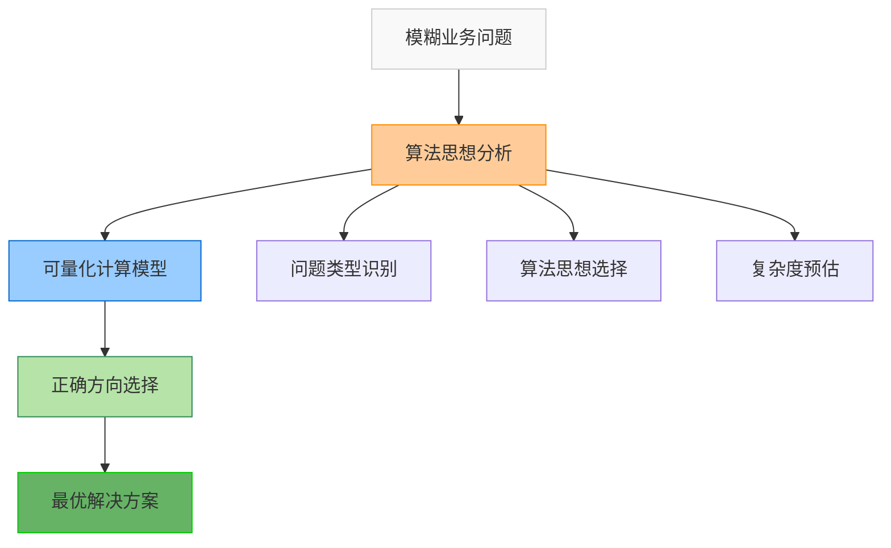
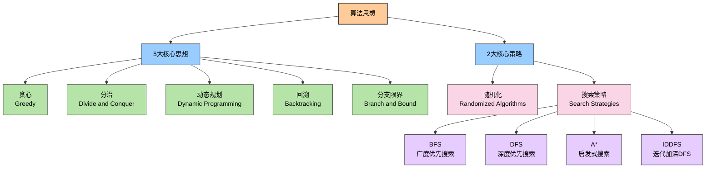
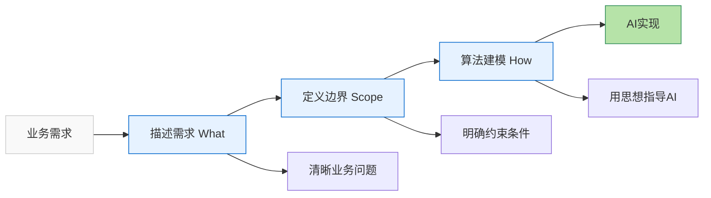

# AI Agent编程时代，程序员必须掌握算法思想

AI编程时代，AI写的代码又快又好。但面对具体业务场景，如果不能清晰地描述需求和定义边界，并从算法角度理解和建模问题，那么AI也无所适从。

因此，在AI时代，只有具备扎实的数据结构基础和算法思想能力，才能更有效地利用AI进行算法设计与问题求解，从而解决真实世界中的复杂问题。

> AI时代，程序员的价值不在于写代码，而在于用算法思想指导AI写出最优的代码。

**本文源码资料请见** [https://github.com/microwind/algorithms](https://github.com/microwind/algorithms)

## 目录

1. [算法与算法思想概述](#一算法与算法思想概述)
2. [算法要解决什么问题](#二算法要解决什么问题)
3. [算法思想有什么作用](#三算法思想有什么作用)
4. [算法思想大全](#四算法思想大全)
5. [算法思想指导AI编程示例](#五算法思想指导ai编程示例)
6. [普通人如何学习算法思想](#六普通人如何学习算法思想)
7. [核心算法思想应用场景总结](#七核心算法思想应用场景总结)
8. [总结：AI时代程序员的三层能力](#八总结ai时代程序员的三层能力)

---

## 一、算法与算法思想概述

### 什么是算法？

**算法**是计算机解决问题的一步步的方法和步骤。它是一个确定的、有限的、有效的计算过程，包括：

- **输入**：问题的数据
- **输出**：问题的解
- **清晰的指令**：一系列确定的步骤

**工程师视角**：计算机程序=算法+数据结构，算法是代码的灵魂。同样的功能，不同算法的性能差异可能是数个数量级。

### 什么是算法思想？

**算法思想**是指解决问题的通用的、系统的方法和理念。它是：

- 对多个具体算法的**抽象和总结**
- 一种**思考问题、分析问题、设计算法的思维方式**
- 不依赖于特定编程语言的**通用方法论**

**关键区别**：

- **算法思想**：抽象、通用、可复用 → **黑盒思维**
- **具体算法**：实现、特定、一次性 → **白盒实现**

### 为什么程序员必须学算法思想？

#### AI时代程序员的价值转变

| 维度         | 传统编程时代   | AI编程时代     |
| ------------ | -------------- | -------------- |
| **代码来源** | 手写           | AI生成         |
| **核心能力** | 编码能力       | 设计能力       |
| **关键价值** | 实现算法       | 指导AI设计     |
| **学习重点** | 掌握语法和算法 | 理解思想和原理 |

#### AI时代程序员的职责转变



#### AI时代学算法思想的核心理由

1. **指导AI生成正确算法** - AI需要清晰的设计指导
2. **验证AI生成代码** - 判断AI代码的正确性和最优性
3. **性能优化决策** - 在多个方案中选择最优方案
4. **解决创新问题** - 没有现成案例的新问题需要基础思想
5. **理解系统底层** - 数据库索引、缓存策略都基于基础思想
6. **面试和职业发展** - 算法思想是工程师能力的核心指标

---

## 二、算法要解决什么问题？

算法要解决的现实问题主要分为以下几类：

#### 1. **计算问题** - 求值问题
数学计算、统计计算、工程应用中的数值计算

#### 2. **搜索问题** - 查找问题
在数据集中找到符合条件的元素，如数据库查询、日志检索

#### 3. **排序问题** - 整序问题
将数据按特定顺序排列，如数据库索引、缓存淘汰

#### 4. **优化问题** - 最优化问题
在众多可能的解中找到最优解，如背包问题、资源分配

#### 5. **组合问题** - 枚举问题
生成或枚举所有可能的组合，如权限组合、测试用例生成

#### 6. **图论问题** - 关系问题
处理元素之间的关系和网络结构，如路由协议、推荐系统

---

## 三、算法思想有什么作用？

通过算法思想，可以将模糊的业务问题转化为可量化、可优化的计算模型，在设计阶段就做出正确的方向选择。



#### 1. **快速问题识别与方案选择**
- 识别问题类型（搜索/优化/排序）
- 快速关联对应思想（贪心/DP/分治）
- 预估解决方案的复杂度
- 选择最优设计方案

#### 2. **代码性能优化**
- 分析性能瓶颈，选择合适的算法
- 从O(n²)优化到O(n log n)等更优方案
- 在大规模数据处理中显著提升性能

#### 3. **系统架构理解**
- 数据库索引 ← 二分查找的应用
- 缓存淘汰 ← 贪心算法
- 分布式共识 ← 图论和贪心
- 操作系统调度 ← 动态规划

#### 4. **AI编程时代的核心竞争力**
- 用算法思想指导AI生成正确代码
- 验证AI代码的正确性和最优性
- 优化AI生成的方案

#### 5. **建立通用的解题框架**
- 面对新问题有章可循
- 知道什么时候用什么方法
- 能够组合多个思想解决复杂问题

---

## 四、算法思想大全

### 5大核心思想与2大策略


**5大核心算法思想** 是解决问题的**核心设计思路**，通过不同的分解和递推方式来处理复杂问题：

- **贪心**：每步选择局部最优，逐步逼近全局最优。
- **分治**：分解问题递归求解，化繁为简逐步解决。
- **动态规划**：状态转移避免重复，用记忆化消除冗余计算。
- **回溯**：系统尝试所有可能，遇到约束立即回退。
- **分支限界**：带剪枝的搜索优化，提前淘汰不可能的路径。

**随机化算法** 是一类**独特的优化技术**，通过引入随机性来简化算法或提高性能。

**搜索策略** 是**问题求解的遍历方法**，独立于上述核心思想，通常与其他思想结合使用：

- **BFS/DFS**：基础搜索遍历
- **A\***：启发式搜索加速
- **IDDFS**：内存和效率的平衡

---

### 如何选择算法思想？
| 问题          | 症状               | 推荐思想   | 参考章节 |
| ----------------- | ------------------ | ---------- | -------- |
| **需要高效处理**  | 时间紧张/资源有限  | 贪心算法   | 第1节    |
| **数据量很大**      | 100万+数据需要分治 | 分治算法   | 第2节    |
| **多阶段决策**    | 多个环节的优化组合 | 动态规划   | 第3节    |
| **枚举所有可能**  | 需要组合/排列      | 回溯算法   | 第4节    |
| **搜索空间巨大**  | 需要剪枝优化       | 分支限界   | 第5节    |
| **避免被识别**    | 需要随机模式       | 随机化策略 | 第6节    |
| **图形/路径问题** | 需要遍历网络       | 搜索策略   | 第7节    |

---

### 1 贪心算法 (Greedy)

#### 核心思想
每一步都选择当前状态下的最优选择，期望得到全局最优解。

#### 算法特征
- **贪心选择性**：全局最优解可以通过局部最优选择得到
- **最优子结构**：问题的最优解包含子问题的最优解
- **无后效性**：前面的选择不影响后面的决策

#### 适用场景
- 最优子结构明显的问题
- 无后效性的决策
- 实时性要求高的系统

#### 常见应用
活动选择、区间调度、霍夫曼编码、最小生成树、任务调度

---

### 2 分治算法 (Divide and Conquer)

#### 核心思想
分解问题 → 递归求解子问题 → 合并子问题的结果

#### 三个阶段
1. **Divide**：把问题分解成若干个规模较小的相同问题
2. **Conquer**：递归求解这些子问题
3. **Combine**：合并子问题的解成原问题的解

#### 适用场景
- 问题具有自相似性
- 子问题相互独立
- 需要处理大规模数据

#### 常见应用
排序（快速排序、归并排序）、二分查找、矩阵乘法、并行计算

---

### 3 动态规划 (Dynamic Programming)

#### 核心思想
以空间换时间，用记忆化消除重复计算

#### 必要条件
- **最优子结构**：大问题的最优解 = 子问题最优解的组合
- **重叠子问题**：不同的子问题有重复计算

#### 两种实现方式
1. **自顶向下**（记忆化递归）
2. **自底向上**（递推表格）

#### 适用场景
- 最优子结构+重叠子问题
- 多阶段决策问题
- 优化问题（求最大值、最小值、方案数）

#### 常见应用
背包问题、币种兑换、最长递增子序列、编辑距离、路径计数

---

### 4 回溯算法 (Backtracking)

#### 核心思想
尝试 → 探索 → 回退，系统地尝试所有可能性直到找到解

#### 本质
带约束的深度优先搜索（DFS）

#### 关键步骤
1. 做出选择
2. 在这个选择上进行递归
3. 撤销选择（回退）
4. 尝试其他选择

#### 适用场景
- 需要枚举所有可能解
- 组合生成、排列问题
- 约束满足问题

#### 常见应用
全排列、组合生成、N皇后问题、数独求解

### 5 分支限界算法 (Branch and Bound)

#### 核心思想
通过剪枝来减少搜索空间，在回溯的基础上加入界限函数

#### 算法特点
- **分支**：将问题分解为子问题
- **限界**：计算子问题的界限，剪枝不可能产生最优解的分支
- **剪枝**：提前终止不可能产生最优解的搜索路径

#### 适用场景
- 搜索空间巨大的优化问题
- 需要找到全局最优解
- 可以计算上下界的问题

#### 常见应用
旅行商问题、背包问题优化、任务调度、资源分配

### 6 随机化算法 (Randomized Algorithms)

#### 核心思想
利用随机性来简化算法设计、提高性能或解决确定性算法难以处理的问题

#### 算法类型
1. **拉斯维加斯算法**：总是给出正确答案，但运行时间随机
2. **蒙特卡洛算法**：运行时间确定，但可能给出错误答案

#### 适用场景
- 需要避免被识别的系统
- 性能要求高但可接受近似解
- 确定性算法过于复杂的问题

#### 常见应用
爬虫调度、A/B测试、缓存过期时间随机化

### 7 搜索策略 (Search Strategies)

#### 核心思想
系统性地在解空间中搜索目标，不同的策略适用于不同类型的问题

搜索策略是**问题求解的遍历方式**，通常**与核心思想结合使用**：
- BFS/DFS 常与**回溯、分支限界**结合
- A* 用于**路径规划**和**启发式优化**

#### 搜索策略分类
1. **BFS**：广度优先搜索，逐层扩展
2. **DFS**：深度优先搜索，一路到底
3. **A***：启发式搜索，有指导的搜索
4. **IDDFS**：迭代加深DFS，结合BFS和DFS优点

#### 常见应用
最短路径、社交网络推荐、导航系统、图遍历

---

## 五、算法思想指导AI编程示例

### 实战案例1：电商秒杀系统（贪心算法）

#### 业务需求
高并发商品抢购，确保公平性和系统稳定性

#### 算法建模
- **问题抽象**：资源分配 + 顺序决策
- **算法思想**：贪心算法（队列 + 贪心选择）
- **核心思路**：每个请求立即做最优分配

#### 指导AI编程
```
AI，请实现贪心算法的秒杀系统：
1. 用户请求进入队列
2. 按队列顺序处理（贪心选择）
3. 检查库存和用户限制
4. 立即分配或拒绝
```

---

### 实战案例2：视频内容分发（分治算法）

#### 业务需求
全球用户低延迟视频播放，优化传输成本

#### 算法建模
- **问题抽象**：大规模数据分发 + 地理位置优化
- **算法思想**：分治算法
- **核心思路**：Divide（地理分组）→ Conquer（并行分发）→ Combine（结果合并）

#### 指导AI编程
```
AI，请实现分治算法的视频分发：
1. Divide：按地理位置将用户分组
2. Conquer：并行处理各组的视频分发
3. Combine：合并分发状态和结果
4. 优化：选择最近的CDN节点
```

---

### 实战案例3：外卖路径优化（动态规划）

#### 业务需求
规划最优配送路线，提高配送效率和用户体验

#### 算法建模
- **问题抽象**：多阶段决策优化 + 资源约束
- **算法思想**：动态规划
- **核心思路**：当前最优 = 之前最优 + 当前决策

#### 指导AI编程
```
AI，请实现动态规划的配送优化：
1. 状态定义：(当前订单集合, 当前时间, 当前位置)
2. 状态转移：尝试每个订单作为下一个配送目标
3. 记忆化：缓存已计算的状态结果
4. 回溯：基于DP结果重构最优路径
```

## 六、普通人如何学习算法思想？

### 程序员的三层能力模型

#### **第一层：描述需求（What）**
**核心问题**：要解决什么业务问题？

**示例**：
- ✗ "写一个推荐系统"
- ✓ "给用户推荐他们可能感兴趣的商品"

#### **第二层：定义边界（Scope）**
**核心问题**：问题的规模和限制是什么？

**关键要素**：
- **数据规模**：用户数、商品数、请求数
- **时间限制**：响应时间要求、处理时间窗口
- **资源约束**：内存、CPU、网络带宽
- **质量要求**：准确率、成功率、容错性

#### **第三层：算法建模（How）**
**核心问题**：用什么算法模型解决？

**建模过程**：
1. **问题抽象**：将业务问题转化为算法问题
2. **模型选择**：基于约束选择合适的算法思想
3. **指导AI**：用算法思想指导AI生成代码

**示例**：
```
推荐问题 → 向量相似度搜索 → KNN/ANN算法 → AI实现
```

### AI编程指导原则

#### **Rule 1: 用思想而不是需求来指导AI**
```
✗ 弱：Prompt: "给我一个搜索函数"
✓ 强：Prompt: "用二分查找设计一个搜索函数，支持O(log n)查询，要求处理不存在的情况"
```

#### **Rule 2: 验证AI的结果**
**生成代码后的检查清单：**
- □ 时间复杂度是否符合预期？
- □ 空间复杂度是否可接受？
- □ 边界情况是否处理完整？
- □ 是否用了算法思想描述的方法？
- □ 是否有更优的方案？

#### **Rule 3: 理解权衡，而不是盲目求最优**
没有完美的算法，只有权衡：
- 时间 vs 空间
- 复杂度 vs 可维护性
- 最优 vs 足够好
- 通用 vs 特化

#### **Rule 4: 保持对AI代码的怀疑**
**AI可能出错的地方：**
- □ 复杂度分析错误
- □ 边界情况遗漏
- □ 逻辑漏洞（看不出来的bug）
- □ 性能瓶颈（代码正确但慢）
- □ 不符合业务逻辑

永远要自己验证关键代码

#### **Rule 5: 用小问题积累大智慧**
**学习循环：**
1. 用一个小问题测试某个算法思想
2. 让AI生成代码 + 解释
3. 自己分析验证
4. 迁移到大问题中
5. 重复

---

## 七、核心算法思想应用场景总结

| 思想/策略                   | 核心机制                       | 实际工程场景                                                                                        |
| --------------------------- | ------------------------------ | --------------------------------------------------------------------------------------------------- |
| 贪心                        | 每步局部最优，逐步逼近全局最优 | 1. 电商秒杀库存分配<br>2. 外卖/打车实时派单<br>3. 抖音/微博信息流广告竞价                           |
| 分治                        | 分解问题递归求解，化繁为简     | 1. CDN 视频内容分发（YouTube/B站）<br>2. Hadoop/Spark 大数据分布式处理<br>3. 搜索引擎倒排索引构建   |
| 动态规划                    | 记忆化消除重复计算             | 1. 滴滴/美团外卖路径规划<br>2. 拼多多/淘宝优惠券组合最优解<br>3. 微信输入法拼音联想词序列           |
| 回溯                        | 系统尝试 + 约束回退            | 1. 企业权限角色组合生成<br>2. 自动化测试用例全量覆盖<br>3. 游戏关卡地图自动生成                     |
| 分支限界                    | 估算上界，剪枝搜索最优         | 1. 顺丰/菜鸟物流线路最优规划<br>2. 企业级网络安全漏洞扫描<br>3. 云平台任务调度资源最优分配          |
| 随机化                      | 引入随机性简化问题或提升性能   | 1. 爬虫请求随机调度（反反爬）<br>2. A/B 测试流量随机分桶<br>3. Redis 缓存过期时间随机抖动（防雪崩） |
| 搜索策略<br>（BFS/DFS/A\*） | 系统遍历解空间，按策略选择路径 | 1. 微信社交关系六度推荐<br>2. 高德最优导航路径<br>3. 云音乐个性化推荐                               |

---

## 八、总结：AI时代程序员的三层能力

> AI时代，掌握这三层能力，你就能驾驭AI，让AI替你打工。

### 认知转变
- 从"如何编码"转变为"如何设计"
- 从"实现者"升级为"指导者"
- AI时代，程序员的价值在于**算法思想**而非编码能力

### 三层能力模型



**流程描述：**
```
描述需求（What）→ 定义边界（Scope）→ 算法建模（How）
   ↓                 ↓                  ↓
清晰业务问题    明确约束条件         用思想指导AI
```

程序员的价值从"写代码"转向"指导AI写代码"。你需要：
> 1. **清晰地描述问题**（需求描述工程师）
> 2. **合理地设计系统**（系统设计工程师）
> 3. **用算法思想指导**（算法思想工程师）

### 相关链接
- [AI时代，人人都是AI Agent工程师](https://github.com/microwind/algorithms/blob/main/start-here/AI-Era-Programmers-as-Agent-Engineers.md)
- [AI时代，人人都是需求描述工程师](https://github.com/microwind/algorithms/blob/main/start-here/AI-Era-Programmers-as-Requirements-Engineers.md)
- [AI时代，人人都是系统设计工程师](https://github.com/microwind/algorithms/blob/main/start-here/AI-Era-Programmers-as-System-Design-Engineers.md)
- [AI时代，人人都是算法思想工程师](https://github.com/microwind/algorithms/blob/main/start-here/AI-Era-Programmers-as-Algorithmic-Thinkers.md)
- [算法与数据结构代码分析](https://github.com/microwind/algorithms)
- [设计模式与编程范式详解](https://github.com/microwind/design-patterns)
- [AI编程提示词模板库](https://github.com/microwind/ai-prompt)
- [AI编程Skill仓库](https://github.com/microwind/ai-skills)

