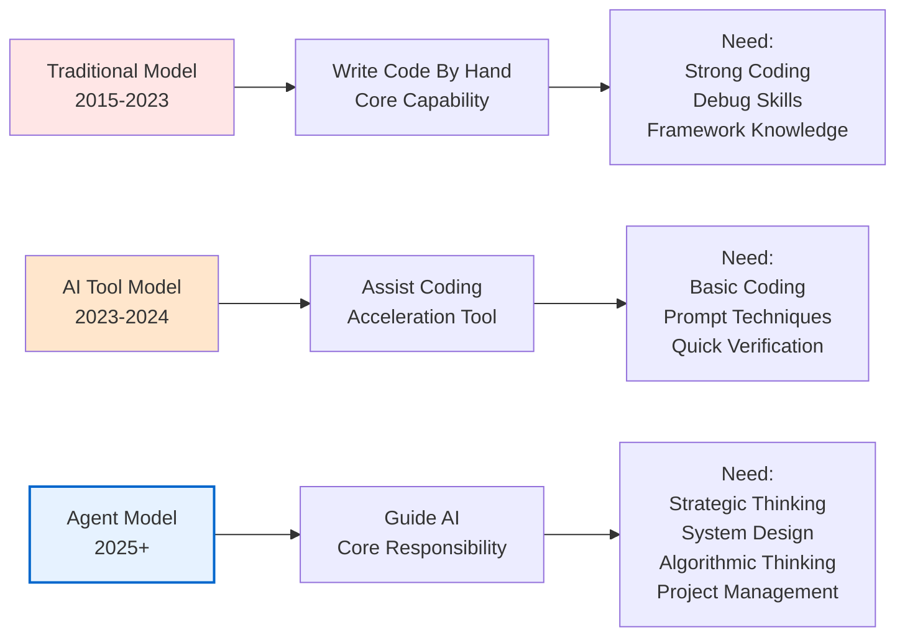
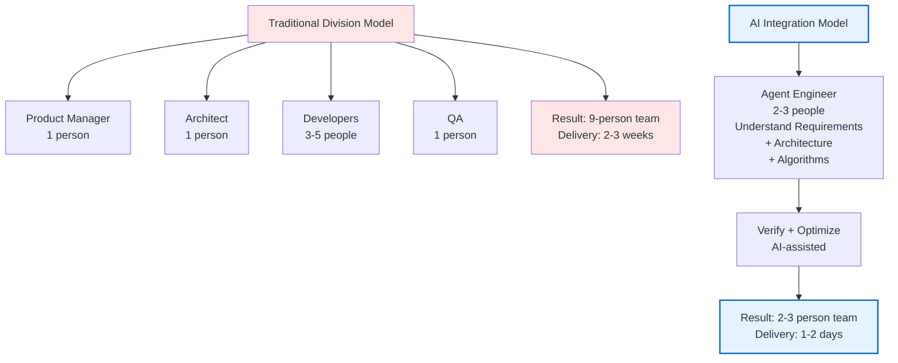
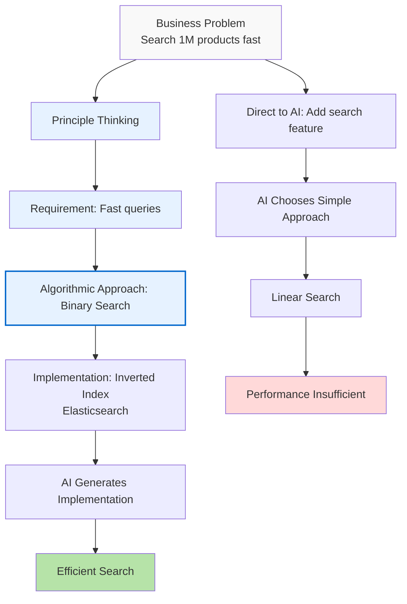
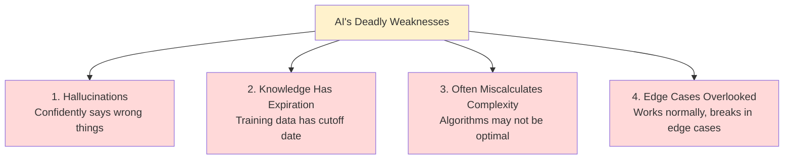
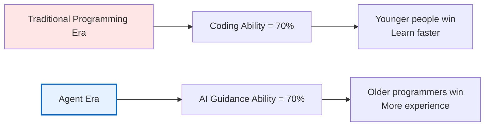
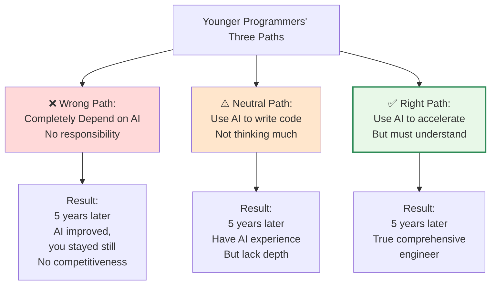
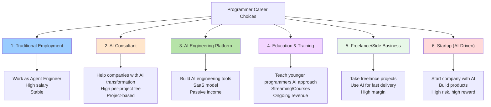
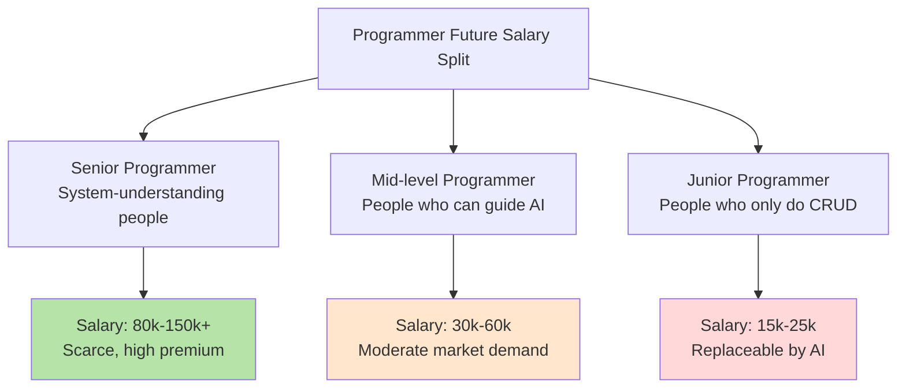
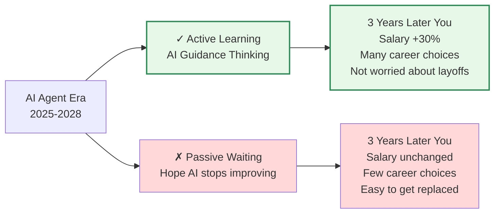

# Why Programmers 35+ Are Thriving in the AI Agent Era

> "I've written code for 15 years, AI arrived, and now I'm worthless." This is the question countless programmers over 35 have asked themselves late at night over the past six months. Anxiety, confusion, even despair.
>
> But I'm here to tell you: You've got it backwards.

---

## 1. The Shift in Programming Approaches in the AI Agent Era

Remember when ChatGPT went viral in 2023 and everyone was saying "programmers are doomed"?

It was genuinely scary back then. AI code is legitimately fast—writes both frontend and backend, fixes bugs quickly too. Plenty of 35-year-old programmers around me started panicking. They'd spent so many years mastering coding skills, only to have them obliterated by AI.

But now, at the end of 2025, the situation has completely reversed.

### From "Writing Code" to "Guiding AI"

The traditional development approach was straightforward:
```
Requirements → Understanding → Design → Write Code → Test → Deploy
```

Now it's:
```
Requirements → Understanding → Design → Guide AI → Verify → Deploy
```

Sounds like we just swapped "write code" for "guide AI," but here's the thing: **the entire center of gravity has shifted completely.**



I know a senior engineer in his 40s who recently introduced AI Agent workflows at his company. He said something brilliant:

> "My value used to be 'I can write efficient code in Java/Go.' Now it's 'I can get AI to write optimal code for me.' It's not that my abilities weakened—my abilities just upgraded to a different dimension."

The impact of this shift on programmers of different ages is completely different.

---

## 2. What the AI Agent Era Demands from Programmers

In the Agent era, what does an excellent programmer need?

Not a "Java expert" or "frontend master," but a **comprehensive engineer who understands requirements, architecture, and algorithms**.

Here's how I'd break it down:

| Dimension | Traditional Era | Agent Era | Trend |
|-----------|:---:|:---:|:---:|
| **Coding Ability** | ⭐⭐⭐⭐⭐ | ⭐⭐ | ↓ Decreasing |
| **Requirements Understanding** | ⭐⭐ | ⭐⭐⭐⭐⭐ | ↑ Increasing |
| **System Design Ability** | ⭐⭐⭐ | ⭐⭐⭐⭐⭐ | ↑ Surging |
| **Algorithmic Thinking** | ⭐⭐⭐ | ⭐⭐⭐⭐⭐ | ↑ Surging |
| **Guidance & Coordination** | ⭐ | ⭐⭐⭐⭐⭐ | ↑ Completely New |
| **Quality Verification** | ⭐⭐⭐ | ⭐⭐⭐⭐⭐ | ↑ Increasing |

The core change in two words: **Structure shifted.**

Before: "Clear division of labor"—product managers owned requirements, architects owned design, engineers owned implementation, testers owned verification. Everyone specialized, but coordination costs were high.

Now: "Integrated capabilities"—one person understands requirements, architecture, and algorithms, then guides AI to do the work.



I'm not making this up. Several major tech companies I know (e-commerce, short video, social) are making this shift. One recommendation system team had 9 people at the start of 2024; now (end of 2025) it's 3 people. Not layoffs—functional integration.

Those 3 people are each comprehensive—they understand product requirements, system architecture, and recommendation algorithms. They don't write code, but they guide AI to write code.

This is the fundamental change in requirements.

---

## 3. You Don't Need to Focus on Implementation Details, But You Must Understand the Principles

This deserves its own section because it's really important.

Many people misunderstand this. They think "the AI era means not learning technology anymore."

Completely wrong. **You don't need to focus on implementation details, but you must understand the underlying principles.**

Let's say you need to add a search feature to a recommendation system.

### The Bad Way:
```
Prompt: "Add a search feature to the recommendation system"

AI might give you:
// Simple linear search
for (auto& item : items) {
    if (item.name.find(query) != string::npos) {
        results.push_back(item);
    }
}
```

This code works. With 1 million products, search time is O(n), could take 1-2 seconds. Terrible user experience.

### The Right Way:
```
Prompt: "Need to search quickly through 1 million products (<100ms),
support multi-condition filtering.
Recommend using inverted index or Elasticsearch."

AI will give you:
// Use Elasticsearch for search
// Complexity: O(log n), response time <100ms
```

What's the difference? **Not implementation details, but algorithmic thinking.**

I don't need to tell AI how to use C++ STL or write Elasticsearch query DSL—that's implementation detail. AI excels at that.

But I need to tell AI: "This problem's core issue is needing O(log n) complexity. What's the algorithmic approach that achieves this?" That's the principle.



This is why, even though AI can write code, you still need to understand algorithms, system design, and complexity analysis.

**These are your core weapons for guiding AI.**

A 35-year-old veteran engineer might never use the latest framework or language. But if he understands:
- What greedy algorithms, divide-and-conquer, and dynamic programming are
- What O(n), O(n log n), O(n²) mean
- What distributed system consistency problems are
- What caching strategies, degradation approaches, and rate limiting are

Then when guiding AI, he can say things that make AI go "aha!" For example:

> "This inventory deduction problem is really about concurrency control. Row locking will have performance issues; optimistic locking requires considering retries. Also, failed payments need to roll back inventory deductions—that's atomicity guarantee."

A junior who's only been working 3 years? He's probably never even heard of these concepts. Even with Cursor, he can't guide AI. Because he doesn't know what he doesn't know.

That's the power of principles.

---

## 4. AI Isn't Always Reliable—You Need to Guide and Verify It

Time for a hard truth: **AI is smart, but not smart.**

That's not literary flourish—I mean AI excels in some areas but is more unreliable than you'd think in others.

### AI's Four Deadly Weaknesses



Real example:

I asked Claude to design a rate limiting algorithm. It gave me a "token bucket" implementation that looked perfect. Clear code, solid logic, I accepted it immediately.

But checking the complexity analysis, I found the problem—every request it had to iterate through the entire token list to find expired tokens. That's O(n)! A total bottleneck under high concurrency.

AI confidently gave me the wrong answer without considering performance. That's "confidently saying wrong things."

I had to tell it:
```
"Token expiration checking can't be O(n), change it to O(1).
Use timestamps and cleanup strategies to periodically clear."
```

Then it gave a genuinely good solution.

### Another Real Story

A friend used AI to write a recommendation algorithm. It used MMR (Maximal Marginal Relevance) to balance diversity and relevance—logic was perfect, code was correct.

But there was one detail he didn't think through: **What about new users?** No historical behavior data means the algorithm can't run at all.

AI never flagged this edge case. The code went live, and new users couldn't get recommendations for a week.

That's "edge cases overlooked."

### The Four-Point Verification Checklist for AI Code

Before deploying AI code, you must check:

```markdown
□ Complexity Check: Does time complexity meet performance requirements?
  - Is it really O(log n) or actually O(n²)?
  - Will it timeout with large data?

□ Edge Cases: Any special cases missed?
  - How about new users/new data?
  - What if data is empty, 1 item, or extreme size?
  - Degradation plans for network issues or service outages?

□ Business Logic: Does code truly understand the business?
  - Is inventory deduction atomic?
  - Is user idempotency considered?
  - Any migration plans for old data?

□ Performance Verification: Tested in actual environment?
  - How many QPS can a single machine handle?
  - How many servers needed?
  - Can cache hit rate reach the target?
```

**This verification process is the most critical part of guiding AI.**

Only experienced programmers can do this. Juniors can't because they don't know what to check.

---

## 5. Comparing Strengths and Weaknesses: New vs. Experienced Programmers

Now we can compare directly.

### Advantages of Programmers 35+

| Advantage | Why It Matters | Impact |
|-----------|---------|---------|
| **Rich System Design Experience** | Quickly identifies problem essence, avoids major pitfalls | ⭐⭐⭐⭐⭐ |
| **Understands Multiple Architecture Patterns** | Knows which approach to use for different problems | ⭐⭐⭐⭐⭐ |
| **Been Through Full Performance Optimization** | Knows when and how to optimize | ⭐⭐⭐⭐ |
| **Deep Business Understanding** | Can extract true requirements from surface needs | ⭐⭐⭐⭐⭐ |
| **Deep Technical Understanding** | Can verify if AI solutions are reliable | ⭐⭐⭐⭐⭐ |
| **Big Picture Thinking** | Sees the whole system, makes good tradeoffs | ⭐⭐⭐⭐ |

### Advantages of Programmers Under 35

| Advantage | Why It Matters | Impact |
|-----------|---------|---------|
| **Learn New Tech Fast** | Quickly masters AI tools | ⭐⭐⭐ |
| **No Historical Baggage** | Willing to try new AI workflows | ⭐⭐⭐ |
| **High Energy** | Strong overtime capacity, lots of study time | ⭐⭐ |
| **Lower Salary Costs** | Companies prefer hiring younger people | ⭐⭐ |

Honestly, this comparison isn't even close.

**In the Agent era, experience value has exploded.**



A 35-year-old veteran engineer has experienced:
- Complete lifecycle of small projects from zero to one
- Architecture design and evolution of medium projects
- Distributed system challenges of large projects
- Concrete details of performance optimization
- Real-world problems across multiple domains

This experience can't be learned in Cursor prompts no matter how hard you try.

---

## 6. Why Are Older Programmers More Valuable in the AI Era?

Let me spell it out: **Programmers 35+ actually have better prospects in the AI era.**

This isn't motivational fluff. I have data and logic.

### 1. The Four Core AI-Guidance Abilities All Favor Experienced Programmers

```
Requirements Understanding
├─ Requires: Understanding business essence, identifying hidden needs, eliminating ambiguity
├─ Who excels: Engineers with 5+ years
└─ Why: Seen enough business patterns

System Design
├─ Requires: Tradeoff consideration, single point identification, expansion planning
├─ Who excels: Engineers with 8+ years
└─ Why: Been through systems growing from small to large

Algorithmic Thinking
├─ Requires: Problem type identification, optimal approach selection, complexity verification
├─ Who excels: Engineers with 7+ years
└─ Why: Seen enough problems, tried enough approaches

Verification & Optimization
├─ Requires: AI error identification, improvement direction finding, iterative optimization
├─ Who excels: Engineers with 10+ years
└─ Why: Knows common pitfalls, seen enough failures
```

No junior, no matter how smart, can complete this path. They lack "seen enough."

### 2. Companies Pay Premium for Guides, Not Coders

Before:
```
1 Architect (20k) + 5 Programmers (8-12k) = 60-80k monthly cost
```

Now:
```
2 Agent Engineers (25-30k) + AI = 50-60k monthly cost
```

Where's the difference? **Agent Engineer premium.**

Because companies discovered: Finding a young "coding expert" is easy, but finding a true "guidance master" is hard.

The market has millions of the former, maybe thousands of the latter.

**Scarcity determines premium.**

The 35-year-old engineers I know are seeing salary increases. Not because they code better, but because they're now "scarce resources."

### 3. Experience is the Best Defense in the AI Era

Simple logic:
- **Junior with little experience depends on AI** → AI breaks, they're done
- **Senior with lots of experience guides AI** → AI breaks, they quickly identify and fix it

So:
```
Highest Risk → Under 35 with 0-3 years experience
             (Completely dependent on AI, clueless if problems occur)

Lower Risk → Over 35 with 10+ years experience
           (Understands AI weaknesses, knows how to respond)
```

AI isn't the end for programmers, it's a dividing line. Experienced people use AI to fly, inexperienced people get crashed by it.

### 4. Major Tech Companies Are Already Proving This

A major e-commerce company had a 120-person tech team in 2024. Now (end of 2025) it's 60 people, but business volume actually increased.

How?

The structure became:
- 10 engineers 35+ as "architects/design engineers" (guide AI)
- 20 engineers 25-35 as "full-stack engineers" (execute and verify)
- 30 AI/data engineers (run specific tasks)

All key positions (architecture, requirements, critical algorithms) are 35+.

A 35-year-old engineer's total compensation (salary + stock + benefits) is now 50%+ higher than when they were 25.

That's not a raise—that's a reassessment of role value.

---

## 7. How Experienced Programmers Can Seize This Opportunity

If you're 35+ and programming, now is the best time.

But opportunity won't knock on your door. You need to make it happen.

### Step 1: Recognize Your Existing Advantages (1 week)

```
What you have:
✓ System design experience
✓ Algorithmic problem sensitivity
✓ Business depth understanding
✓ Architecture tradeoff ability
✓ Problem debugging experience

These are your treasure. Recognize that.
```

### Step 2: Learn AI Guidance Frameworks (1-2 months)

Two core frameworks:

**BEAT Framework** (Understanding Requirements)
```
B - Background: What's the current state
E - Expectation: What's the desired outcome
A - Action: How to do it
T - Test: How to verify
```

**SCALE Framework** (System Design)
```
S - Scale: What's the magnitude
C - Constraints: What are the limitations
A - Architecture: What's the approach
L - Limitations: What's the fallback
E - Evaluation: What are the metrics
```

Learning these frameworks takes no extra brainpower—you already did this before, just never named it. Now name it and use it to guide AI.

My suggestion:
1. Spend two weeks understanding the frameworks
2. Spend a month practicing with two projects
3. Develop your own expression habits

### Step 3: Learn the Complete Algorithmic Thinking System (2-3 months)

This is the most important part.

Seven core algorithmic ideas:
```
Greedy Algorithm → Each step optimal
Divide & Conquer → Decompose recursively
Dynamic Programming → Memoize to avoid repeat
Backtracking → System enumeration
Branch & Bound → Prune optimization
Randomization → Introduce randomness
Search Strategies (BFS/DFS/A*) → Traverse solution space
```

You don't need to code implementations. You just need to:
- Understand each idea's core logic
- Know what problems need what ideas
- Guide AI using these ideas

For example:
```
You don't need to code red-black trees, but you need to know:
"This scenario needs fast range queries,
B-trees or skip lists work better than AVL trees."

This guides AI in the right direction.
```

### Step 4: Practice AI Code Verification Skills (Ongoing)

Most important, most overlooked.

Every time AI gives you code, ask yourself:
```
□ What's this solution's complexity?
□ Will it run in my data scale?
□ Any edge cases missed?
□ Any better algorithms available?
□ Can this architecture scale?
□ Any single points of failure?
```

Initially it takes time to review. But after a month or two, you'll develop intuition—glance at code and know if something's wrong.

### Step 5: Change Your Job Title Definition (Must Do)

Most critical step.

**Tell your company and team explicitly: My role transitions from "programmer" to "Agent engineer."**

Not hints, not hopes. Tell your boss and colleagues clearly:

```
I'm not focused on "how much code I write" anymore,
I'm focused on "what I can guide AI to implement."

My work output isn't lines of code,
it's system quality, design soundness, and decision accuracy.
```

This matters because:
1. Company needs to understand your role change
2. You need to shift from "coder" mindset
3. Team needs to reorganize

### A Real Transition Story

I know a 45-year-old engineer who in 2024 was still debating whether to move into management. He was anxious—"My coding's okay, but I can't answer latest framework questions in interviews."

Then he attended an AI workshop and systematically learned BEAT, SCALE, and algorithmic thinking.

Now he leads 3 junior engineers at his company, used AI to complete two major projects. His salary jumped 30%, job satisfaction is way higher.

He said:

> "I thought I was becoming obsolete. Now I found my 'old experience' is actually worth the most. Not because of AI, but because I finally found the right way to use it."

---

## 8. How Younger Programmers Can Seize This Opportunity

If you're under 35, your situation is completely different.

Frankly, your disadvantage is clear: **Lack of experience.**

But your advantage is also clear: **Time ahead, 30+ years of career left.**

Key is not walking down the wrong path.

### Your Current Most Common Mistakes



Most common mistake: Juniors use Cursor, AI writes it, they use it, never review, never think.

These people five years later will realize they hit a wall. They completely depend on AI; any problem from AI and they're lost.

These people get demolished by the ones who actually understand.

### Step 1: Master Programming Fundamentals (Year 1-2 Critical)

This step seniors don't need, but you must do.

**Don't rush to use AI. Learn to code by hand first.**

I know this sounds "traditional," but I'm serious.

Simple reason:
```
Reading AI code vs. writing code yourself
are completely different learning methods.

You need to go through:
1. Think → 2. Try → 3. Fail → 4. Debug → 5. Understand

This complete cycle is how you truly learn.
```

If your first project uses AI, you'll probably never understand why some edge case bugs happen.

So:
- First 3 months: Hand-write code only, no AI
- 3-6 months: AI as reference, but you understand its output
- 6+ months: AI as acceleration tool, but you verify it

### Step 2: Systematically Learn Data Structures and Algorithms (Year 2-3)

Non-negotiable.

Not saying grind 500 LeetCode problems (though not wrong). Rather you need to:
```
□ Understand each data structure's essence
  (Why is hash table O(1), binary tree O(log n))

□ Master core algorithmic ideas
  (Greedy, divide-and-conquer, DP, search)

□ Know what problems need what ideas
  (See search problem → think BFS/DFS)

□ Analyze complexity
  (Look at algorithm → state time/space complexity)
```

This learning isn't for interviews, it's to guide AI five years later.

If a 30-year-old doesn't understand algorithmic thinking, they can't guide AI. But if they do, they build truly good systems.

### Step 3: Participate in Many System Design Reviews (Year 3-5)

Most companies undervalue this, but it's critical for juniors.

You should:
- Attend architecture reviews, listen to how seniors analyze problems
- Join requirements reviews, see how product experts understand business
- Participate in tech selection, learn how to tradeoff between options

Not just sitting quietly, but genuinely questioning, discussing, thinking.

This experience, AI can't teach. **Only facing real complex systems can you learn.**

### Step 4: Actively Build Your Knowledge Base

Around year 3, start recording:
```
□ Problems encountered and their solutions
□ Different system design options compared
□ Algorithms used and their applications
□ Project failures and lessons learned
```

Five years later, this knowledge base becomes your biggest asset.

### Step 5: Don't Stay in One Place Too Long

Especially important for juniors.

First five years, change 2-3 companies or projects. This way you encounter different:
- Business scenarios (recommendations, ads, payments, transactions...)
- Tech stacks (different languages, different frameworks)
- Team styles (see how different engineers work)

This breadth accumulation becomes your competitive advantage by year five.

### Advice for Younger Programmers

```
Your biggest advantage isn't "learn new tech fast,"
it's "still have 30 years ahead."

Don't abandon deep learning just because AI exists.
Actually learn harder—your competitors are learning too.

Five years later with two people using AI:
- One understands everything, can guide AI on complex systems
- One only knows AI for CRUD, gets stuck on complex problems

First person: 50k+ monthly salary
Second person: 15k monthly salary

The difference isn't AI ability, it's your own depth.
```

---

## 9. Employment Is No Longer the Only Career Path

This topic is especially worth discussing in the AI era.

Before: Programmers had limited career paths.
```
Join company → Do development → Advance to architecture → Advance to management → Advance to director/VP
```

Basically one track. Either stay employed or startup.

Now it's different.

### New Career Models Are Forming



### Case 1: AI Consultant

A 40-year-old engineer spent 15 years at a major tech company. Now he quit and does AI transformation consulting with two friends.

Model is simple:
```
Assess company → Create transformation plan → Execute and verify → Continuous optimization

Per project:
- Small company: 200-300k RMB
- Mid company: 500k-1M RMB
- Large company: 2M+ RMB
```

He does 3-5 projects yearly, earns more than in big tech, and has more freedom.

Key point: His "ability" hasn't changed, just **the way he sells it.**

### Case 2: AI Engineering Tool

A 35-year-old engineer built an "AI-assisted system design tool."

Users are mid-size company tech leads who don't know how to use AI for system design. The tool helps them implement BEAT/SCALE frameworks and guide AI.

Now thousands of paying users, monthly revenue 200-300k RMB.

His work? Maintain the tool, update AI prompts, collect user feedback. 15 hours weekly.

This is **passive income model.**

### Case 3: Education

Someone started teaching younger programmers "how to think in the AI era."

Online course, 2000+ students, 100k+ monthly.

This "experience commercialization" existed before but wasn't this profitable. Now with AI demand surging, it's huge.

### Case 4: Freelance Project Delivery

A 33-year-old takes freelance projects.

Before: One project took 2 months. Now with AI acceleration, 1 month.

Result: **Same time, do more projects, double income.**

```
Before: 6 projects/year = 600k RMB annual
Now: 12 projects/year = 1.2M RMB annual
(Price unchanged, efficiency doubled)
```

### New Choice Framework

```
Which path do you want?

Stability + High income → Work as Agent Engineer at big company
                        (50k+ monthly, but must go to office)

Freedom + High income → Freelance or consulting
                      (Unstable income, but more freedom)

Passive income → Build SaaS or education
               (Need upfront investment, then steady revenue)

Startup dream → Start AI-driven company
              (High risk, huge reward if successful)
```

Key point: **You now have choices.**

Not the "employment or unemployment" binary anymore. Multiple paths are open.

---

## 10. Future Vision: AI Works, Humans Define Needs and Set Requirements

End of 2026, what do we see?

AI Agent frameworks (like OpenClaw) matured. You don't write prompts, don't guide step-by-step, AI can self-plan and execute tasks.

What does work look like then?

### First Transition: From "Guiding AI" to "Supervising AI"

```
Now (2025):
You → Guide AI to write code → Verify → Deploy

Future (2027-2028):
You → Describe needs → AI self-plans + executes → You supervise → Deploy
```

Difference: You don't guide step-by-step anymore. AI understands problems, makes plans, executes.

Your work shifts from "guide" to "supervise."

### Second Transition: Role Evolves from "Engineer" to "Requirement Officer"

Still need "people who write code" now. When AI truly matures, maybe not.

What's needed:
```
□ Person who understands business → "Requirement Officer"
□ Person who defines boundaries → "Constraint Officer"
□ Person who verifies plans → "Review Officer"
□ Person who specifies improvements → "Optimization Officer"
```

These four roles together form "define needs and supervise."

### Third Transition: From "Build Systems" to "Continuous Optimization"

```
Current workflow:
Requirements → Design → Development → Testing → Deploy (done)

Future workflow:
Requirements → Design → AI executes → Supervise & optimize (never done)
           ↑                           ↓
           ←←←← Continuous feedback and optimization ←←←←
```

Systems evolve forever. Your job is continuously saying "this needs improvement," then AI improves it.

### Fourth Transition: Hand-Coding Becomes Niche Skill

Now all programmers need coding. Future?

Maybe only 10%—those designing AI frameworks.

The other 90%? Their work is:
```
Understand requirements → Specify optimization direction → Verify results
```

Coding for them is an optional skill, not core capability.

### But There's Bad News

As AI gets stronger, programmer requirements actually increase.

Because:
```
Verifying AI is much harder than writing code.

Looking at AI-generated system, you can't tell
if there are problems at a glance.
You need to understand:
- Overall system design
- Reasoning for each decision
- Where potential flaws are
```

This needs higher experience and thinking ability.

So future isn't "programmers are obsolete" but "junior programmers are obsolete."

Senior programmers (those who truly understand systems, algorithms, business) get more valuable.

### How Will Salaries Evolve?



Bottom line is clear: **As long as you're valuable, you have income. Question is how valuable.**

### What This Means for Today's Programmers

Simple: **Start learning what you haven't learned yet.**

If you're now:
- **Junior** (can write code but don't understand systems)
  → Must systematically learn architecture, algorithms, business
  → Otherwise you'll be obsolete in 5 years

- **Mid-level** (can design systems but lack experience)
  → Quickly accumulate project experience now
  → Touch different business scenarios and tech stacks
  → Can become senior within 5 years

- **Senior** (experienced, system-understanding)
  → Now is the best time
  → Value surges, salary rises
  → Many career choices open

---

## Summary: Your Choices Now Determine Your Position in 3 Years

In the AI Agent era, there's no "neutral."

All programmers must make a choice:



Final words:

> **AI isn't the end for programmers—it's a dividing line. Prepared people upgrade, unprepared people get left behind.**

**Programmers 35+, your spring isn't coming—you're already in it. The question is: Do you see it?**

---

## Deep Reading

For deeper learning:

1. **Understanding Requirements**: "The Requirements Description Engineer of the AI Era"
2. **System Design**: "The System Design Engineer of the AI Era"
3. **Algorithmic Thinking**: "The Algorithmic Thinking Engineer of the AI Era"
4. **Complete Framework**: "Everyone Is an Agent Engineer in the AI Era"

These articles form a complete knowledge system.

Or read like this:
- Quick overview → Read this article
- Systematic learning → Read all four articles in series
- Deep mastery → Pick one area, deep read, then practice with projects

---

**The End.**

---

**About the Author**

刀法如飞 (Daofa Ruofei), 20+ years in internet software engineering. Experienced complete growth from 1 person to 1000-person teams. Witnessed every programming paradigm shift from assembly → C → Java → cloud-native.

Now I'm witnessing the next big shift: from "humans write code" to "humans guide AI to write code."

This isn't prediction—it's already happening.

Hope this article helps clarify your thinking.

Questions or want deeper discussion? Welcome to comment.
