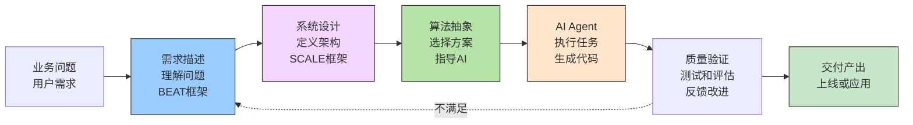
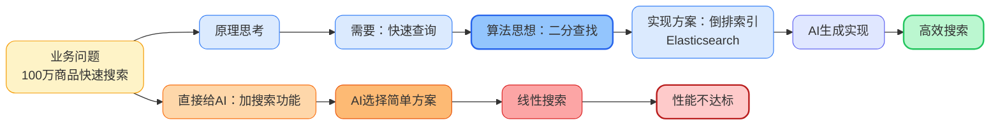
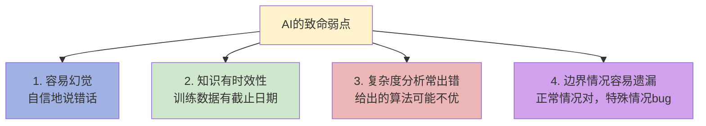

# AI编程时代，为什么35岁以上程序员会更吃香？

> 最近在聊到一个话题：AI取代人工编程已成必然趋势。那么，这对于35岁以上的程序员来说意味着什么——是会加速职业生涯死亡，还是开启了新的篇章？

都说互联网行业是“青春饭”，35岁以上的程序员容易被裁员。AI浪潮汹汹，大家因此充满焦虑、迷茫、甚至是恐惧。很多人开始担心，自己的职业生涯是否真的走到尽头，是不是到了40、50岁就必然会失业。

很多人认为程序员职业会消亡，但我觉得并非这样。我们先看看AI对编程改变了什么。

## 一、AI Agent时代编程方式的改变

2023年ChatGPT横空出世的时候，确实有点吓人。AI写代码是真的快，前后端都能写，算法也不在话下，bug也能修，测试用例随手就来，但那时候大家普遍把大模型当搜索用。随着Cursor、Windsurf以及Claude Code、Codex、OpenClaw相继问世，AI Agent彻底颠覆了传统编程模式。程序员开始慌了——花了这么多年学会的编程技能，都白费了吗？

现在，2026年了，Agentic AI时代，AI已经可以自主完成大部分编程工作了，可以不用人去写代码。这个冲击太大了。

我们来看下传统编程和AI时代编程的区别。

### 从"手写代码"到"驱动AI"的转变

传统开发方式：
```
需求 → 理解 → 设计文档 → 手写代码 → 测试 → 上线
```
AI时代方式：

```
需求 → 理解 → 设计Skill/提示词 → AI生成代码 → 验证 → 上线
```

看起来只是把"自己写代码"换成了"AI写代码"，但实际上整个工作的重心完全转移了。


最近公司也在推行Agentic工作流。负责同学说：

> "以前我还做架构设计，现在连设计都省了，直接提需求和要求，让AI去分析，出计划，自执行。"

目前，AI编程总体上仍处在 AI Agent 模式，依赖 Skills 和 Prompts 来给 AI 下指令，由 AI 执行任务。我们正迈向 Agentic AI 阶段——AI 将能够自主决策，并支持多任务并行。在这种模式下，你作为”老板”，只需给 AI 一个目标和概要需求，AI 就能自动细化任务、制定计划和策略。

那么问题来了：AI都这么强了，程序员真的可以被淘汰了吗？尤其是35+的程序员。

---

## 二、AI Agent时代，哪些能力AI目前还替代不了
> AI再强大，本质上仍是一个执行者，至少目前是这样。它擅长在已知边界内分析、优化、生成、推理，但有一些事情，它做不了，或者做不好。
>
> 如果说AI真的具有独立的自主意识了（自主决策执行计划任务并不是自主意识），那讨论的问题就不是程序员的职业发展了，而是人类何去何从。

软件开发中的哪些能力目前AI还替代不了，或者说不能完全替代，我觉得有以下这些。

| 能力项 | 分析 | 经验的优势 |
|--------|------|------|
| **1. 需求的定义** <br>你要解决的实际问题是什么？ | AI可以细化需求，但原始需求、业务目标、真正的痛点，来自人对真实世界的观察与判断 | 经验积累在于见过需求从模糊到清晰的完整过程，知道哪些是伪需求，哪些问题根本不需要技术解决 |
| **2. 目标的取舍** <br>什么是真正重要的？ | AI能给十个方案，但选哪个、为什么，背后是优先级、价值观和战略判断，这是认知问题不是技术问题 | 有经验的程序员知道什么是局部最优、什么是全局最优，"做什么"比"怎么做"更重要 |
| **3. 边界的划定** <br>该做哪些、不该做哪些？ | AI会尽职尽责地把事情做完，但哪些方案维护成本极高、哪些功能埋下隐患，需要人来叫停 | 边界感来自踩过坑。说"不"的能力比说"是"更难，AI不会主动拒绝，它会把错误的事做得很漂亮 |
| **4. 约束的管理**<br> 现实条件是什么？ | 时间、预算、团队能力、技术债、合规要求——AI并不了解你的真实处境 | 有经验的程序员擅长在约束下做出"够好"的决策，而不是追求脱离现实的最优解，这是工程智慧 |
| **5. 成本的评估**<br> 值不值得做？ | AI生成代码很快，但真实成本包括测试、维护、认知负担、学习曲线、未来扩展的代价 | 资深程序员看一眼方案能估算出三年后的技术债，这是积累出来的直觉，不是算法能给的 |
| **6. 策略的决策**<br> 怎么走这条路？ | AI能给路线图，但判断路线是否走得通，需要对人、对组织、对行业的深度理解 | 技术策略是在组织能力、市场时机、竞争态势之间找到一条现实可行的路，不只是技术最优解 |
| **7. 结果的评价**<br> 做得好不好？ | 代码能跑不代表做对了，测试通过不代表用户满意，功能上线不代表业务目标达成 | 评价标准需要人来制定和坚守。没有人的校准，AI只会在黑暗中自我打分 |

以上这些都是非编码能力，而是一种业务理解、抽象思考以及决策能力。这些能力目前AI还无法跟人比。

---

## 三、AI Agent时代对于程序员的要求

> 上一篇文章[《AI时代，人人都是Agent工程师》](https://github.com/microwind/algorithms/blob/main/start-here/AI-Era-Programmers-as-Agent-Engineers.md)里面专门介绍了Agent工程师的要求和发展之路。这里再简单描述下。

在AI Agent时代，一个优秀的程序员需要什么？

不是"后端专家"或"前端高手"，而是"懂需求、懂架构、懂算法"的综合型工程师，也就是Agent工程师。

传统开发和AI时代对于工程师能力的对比要求。

| 维度 | 传统时代要求 | AI时代要求 | 难度 |
|------|:---:|:---:|:---:|
| **代码编写能力** | 很高 | 一般 | ↓ 下降 |
| **需求理解能力** | 一般 | 很高 | ↑ 上升 |
| **系统设计能力** | 较高 | 很高 | ↑ 大幅上升 |
| **算法思想能力** | 较高 | 很高 | ↑ 大幅上升 |
| **指导监督能力** | 低 | 很高 | ↑ 完全新增 |
| **质量验证能力** | 较高 | 很高 | ↑ 上升 |

从上可以看出，时代变了，对人的要求大不相同。

之前是"分工明确"——产品经理负责需求、架构师负责设计、程序员负责实现、测试负责验收。每个人专业，但监督成本高。

现在是"能力融合"——一个人要懂需求、懂架构、懂算法，然后用这些知识驱动AI替你干活。

### AI Agent时代工程师工作场景



---

## 四、AI Agent时代无需关注实现细节，但你要懂得原理

这句话很重要，需要特别强调下。

很多人其实理解错了。他们以为"AI时代就是不用学技术了"，什么人都可以用AI生成代码。

现实恰恰相反。你不需要关注代码的实现细节，但你要懂得原理，尤其是算法、设计模式和系统架构等。

比如说，你要给推荐系统加一个搜索功能。

### 不好的方式：
```c
提示词："在推荐的基础上增加一个搜索功能"

AI可能给你：
// 简单的线性搜索或者给你一些选项让你来选择
for (auto& item : items) {
    if (item.name.find(query) != string::npos) {
        results.push_back(item);
    }
}
```

AI给的代码能用。但如果是100万商品，搜索时间是O(n)，可能要一两秒。用户体验很差。

### 好的方式：
```c
提示词："需要从100万商品中快速搜索（<100ms），支持多条件组合搜索。建议用倒排索引或Elasticsearch实现。"

AI会给你：
// 用Elasticsearch做搜索
// 复杂度：O(log n)，响应时间<100ms
```

提示词的差别在哪儿？不是要你去描述更多实现细节，而是基于系统设计与算法思想给出建议。

我并不需要告诉AI具体如何实现，怎么写Elasticsearch的query DSL，细节方面AI比我擅长。

我只需要告诉AI"这个问题的核心是需要O(log n)的复杂度，用什么思想能达到。我把约束条件和思考策略告诉AI。



这就是为什么，即便AI能写代码，你还是要懂算法、懂系统设计、懂复杂度分析。

因为这些是指导AI的核心武器。

一个35岁+的老程序员，可能不再用最新的框架、最新的语言以及最新的API。

但如果你有下面丰富的经验：

- **算法思想**：贪心、分治、动态规划、回溯

- **复杂度意识**：O(n)、O(n log n)、O(n²)，知道什么时候该优化

- **数据结构**：数组、链表、哈希表、堆、树，知道如何选型

- **系统设计**：高并发架构、服务拆分、接口设计、数据建模

- **分布式基础**：一致性（CAP / BASE）、事务、幂等性、消息可靠性

- **架构能力**：AKF扩展、微服务拆分、领域建模（DDD）

- **工程经验**：缓存策略、限流、降级、熔断、重试机制

- **设计原则**：SOLID、KISS、DRY等

- **系统思维**：SCALE框架、性能瓶颈分析、容量评估

那么在指导和驱动AI的时候，就能说出让AI理解的话。比如：

> “这个库存扣减问题，本质是**并发控制**。用行锁会有性能瓶颈，用乐观锁要设计好**重试机制**。
>  另外，支付失败必须回滚库存，这里要保证**原子性**。”

一个刚工作几年的新手，他可能听说过这些概念，也知道怎么用，但理解的并不深入，也没有碰到过真实的案例。他指导Claude Code，恐怕难有好的效果。因为他不知道自己不知道什么。当遇到调试疑难杂症的bug时，老程序员的优势就更明显了。

---

## 五、AI并不总是可靠，你需要指导和验证AI

AI很聪明，但有时候也犯傻。AI在某些方面远超人类，但在另一些方面很不靠谱。

### AI的四个致命弱点



举个案例：

前段时间我让Claude帮忙设计一个限流算法。它给了我一个"令牌桶"的实现，看起来很完美。代码清晰，逻辑清楚，我第一眼就接受了。

但我一看复杂度分析就发现问题了——它在每次请求时都要遍历整个令牌列表来找过期令牌。这是O(n)的操作！在高并发下完全是个瓶颈。

AI还自信地说没问题，但它并没有考虑性能。这就是AI"自信地说错话"。

我告诉它：
"令牌过期检查不能是O(n)，要改成O(1)。可以用时间戳标记，结合删除策略定期清理。"

然后它意识到了，再给出真正好的方案。

### AI验证的四个必查清单

作为指导者或者监督者，你上线AI的代码前，必须检查：

| 检查维度     | 核心问题                         | 关键检查点 |
|--------------|----------------------------------|------------|
| 复杂度检查   | 时间复杂度是否满足性能要求？     | 是否真的是 O(log n) 还是 O(n²)？<br>在大数据量下会不会 timeout？ |
| 边界情况     | 有没有遗漏特殊情况？             | 新用户/新数据怎么处理？<br>数据为空、为1、极端大时怎么样？<br>网络中断、服务宕机的降级方案？ |
| 业务逻辑     | 代码是否真的理解业务？           | 库存扣减的原子性保证了吗？<br>用户的幂等性考虑了吗？<br>旧数据的迁移方案有吗？ |
| 性能验证     | 是否在实际环境中测试过？         | 单机能支持多少 QPS？<br>需要多少服务器？<br>缓存命中率能达到预期吗？ |

这个验证过程，是指导AI时最关键的环节。而这个能力，只有经验丰富的程序员才有。年轻程序员可能做不了，因为他不知道什么该查。

---

## 六、新老程序员的优劣势对比

如果拼写代码，尤其是CRUD和UI交互类的逻辑开发，老程序员的确不如新手，不知道那么多技巧。新框架层出不穷，老人有点学不动了。

### 35岁以上老程序员的优势

| 优势 | 为什么重要 | 影响程度 |
|------|---------|---------|
| **系统设计经验丰富** | 能快速识别问题本质，避免大坑 | 很高 |
| **懂多种架构模式** | 面对问题知道该用什么思想 | 很高 |
| **经历过性能优化全过程** | 知道什么时候优化、如何优化 | 较高 |
| **理解业务的深度** | 能从需求挖掘真实需求 | 很高 |
| **对技术的深刻理解** | 能验证AI的方案是否可靠 | 很高 |
| **把握全局的能力** | 能看到系统全图，做出权衡 | 高 |

### 35岁以下新程序员的优势

| 优势 | 为什么重要 | 影响程度 |
|------|---------|---------|
| **学习新技术快** | 能快速上手AI工具和新框架 | 高 |
| **没有历史包袱** | 敢于尝试新的AI工作方式 | 高 |
| **精力充沛** | 学习投入多，迭代速度快 | 较高 |
| **适应性强** | 对新工具和新流程接受度高 | 高 |

在Agent时代，经验的价值凸显了。以前国外研究底层技术，会用老程序员，国内做应用开发，写CRUD，因此淘汰老程序员。现在AI时代下，老程序员的经验派上用场了。

简单说，传统编程时代代码编写能力占大头，年轻人学东西快有优势。Agent时代驱动AI的能力占大头，经验丰富的老程序员反而更有优势。

一个35岁的老工程师，经历过很多，知识面很广：
- 小项目从0到1的全过程
- 中等项目的架构设计和演进
- 大型项目的分布式系统挑战
- 性能优化的具体细节
- 多个业务领域的实际问题

这些经验，是你怎么在Claude Code里prompt都学不来的。

---

## 七、为什么有经验的程序员在AI时代更有优势？

### 1. 指导AI需要的核心能力，靠时间积累


| 阶段 | 能力需要 | 谁擅长 | 理由 |
|------|------|--------|--------|
| 需求理解 | 理解业务本质、识别隐需求、消除歧义 | 有5年+经验的工程师 | 见过足够多的业务模式 |
| 系统设计 | 权衡trade-off、识别单点、规划扩展 | 有10年+经验的工程师 | 经历过系统从小变大的全过程 |
| 算法思想 | 识别问题类型、选择最优思想、验证复杂度 | 有10年+经验的工程师 | 见过足够多的问题、尝试过足够多的方案 |
| 验证与优化 | 识别AI的错误、找到改进方向、迭代优化 | 有15年+经验的工程师 | 知道常见的坑、见过足够多的失败 |

这不是说年轻人不行，而是有些能力确实需要时间和项目经历去沉淀。

### 2. 经验决定了你是依赖AI还是驾驭AI

这个逻辑其实很直接：

- 经验少的人更依赖AI → AI出问题时容易束手无策
- 经验多的人在指导AI → AI出问题时能快速识别和修正

风险最大的是刚入行0-3年的新人——完全依赖AI，出了问题不知道为什么。风险较小的是10年+的老程序员——理解AI的弱点，知道怎么应对。

AI不是程序员的终点，更像是一个分水岭。有经验的人拿AI当杠杆，没经验的人容易被AI带偏。

---

## 八、老程序员如何抓住这个机会

如果你是35岁以上的程序员，现在确实是一个不错的窗口期。全力往Agent工程师方向转，打造全栈广博的知识面。

###  1、学习指导AI的方法

最核心的是三件事：
**1. 理解需求的方法**——搞清楚：现状是什么、目标是什么、要做什么、如何验证。（BEAT框架：Background / Expectation / Action / Test）[《AI时代人人都是需求描述工程师》](https://github.com/microwind/algorithms/blob/main/start-here/AI-Era-Programmers-as-Requirements-Engineers.md.md)

**2. 设计系统的方法**——明确：规模、约束、架构、边界、评估指标。（SCALE框架：Scale / Constraints / Architecture / Limitations / Evaluation）[《AI时代人人都是系统设计工程师》](https://github.com/microwind/algorithms/blob/main/start-here/AI-Era-Programmers-as-System-Design-Engineers.md)

**3. 解决问题的方法**——选择：把模糊业务变为可计算、可优化的问题模型，选用合适的求解策略。（算法思想：贪心 / 分治 / 动态规划 / 回溯）[《AI时代人人都是算法思想工程师》](https://github.com/microwind/algorithms/blob/main/start-here/AI-Era-Programmers-as-Algorithmic-Thinkers.md))

其实你之前做项目就是这么干的，只是没有刻意总结成方法论。

### 2、学习架构设计和算法思想的体系

完整地学习[系统设计](https://github.com/microwind/algorithms/blob/main/start-here/AI-Era-Programmers-as-System-Design-Engineers.md)与[算法思想](https://github.com/microwind/algorithms/blob/main/start-here/AI-Era-Programmers-Need-Algorithmic-Thinking.md)），掌握每种思想的意义和用途。

不一定需要你手写代码实现具体的设计模式与具体算法，但你一定理解：
- 理解每个设计与思想的核心思路
- 知道什么问题该用什么设计和思想
- 能用设计架构与算法思想来指导AI

### 3、持续练习验证AI代码的能力

这个最重要，也最容易被忽视，多用Claude Code和OpenClaw，用多了感觉自然就有了。

每次AI给你代码，你都要问自己：
- 这个方案的复杂度是多少？
- 在我的数据规模下能跑吗？
- 有没有边界情况没考虑？
- 有没有更优的算法可以用？
- 这个架构能扩展吗？
- 有没有单点故障？

刚开始可能要花时间审查。但一两个月后，你会形成直觉——看一眼代码就知道有没有问题。

---

## 九、未来：AI干活，人定方向

Agentic AI时代在加速到来。未来你都不再需要写提示词，不需要逐步指导，AI可以自主规划任务。你只需要告诉AI你要什么。

这时候的工作方式是什么样？

### 第一个转变：从"指导AI"到"监督AI"
```
现在（2025-2027）：
你 → 定义需求 → 指导AI写计划和方案 → AI生成代码 → 人工验证 → 人工上线

未来（2026-2030）：
你 → 描述需求 → AI自主规划+设计方案+执行 → 你监督 → AI验证 → AI上线

差别在于：你不需要逐步指导和多轮对话，AI能自己理解问题、拆解需求、制定计划、执行方案。
你的工作从"指导"变成"监督"。你就是老板，AI是全能型员工。

再往后，AI会怎么样就不好说了，或许真的可以替代人类给出从需求到解决的全流程了吧，那时候我们就可以在家躺着，让AI干活。：）
```

### 第二个转变：从"写代码"到"提需求+做监督"

现在还需要"写代码的人"。但等AI真正成熟，可能就不需要了。
需要的是：
- 理解业务、能提出好问题的人
- 能定义边界和约束的人
- 能设定目标和优先级的人
- 能验证方案质量的人

这些角色归结起来就是"提需求"和"做监督"。

### 第三个转变：AI变强的同时，对程序员的要求其实在提高。

因为：验证AI的难度，远高于编写代码。

一个AI生成的系统有没有问题，你一眼看不出来。你需要理解：
- 系统的全局设计
- 每个决策的理由
- 潜在的缺陷在哪儿

这需要更高的经验和思维能力。

所以，未来不是"程序员被淘汰"，而是"低级程序员被淘汰"。

Agent工程师（那些真正理解系统、理解算法、理解业务的人）会越来越吃香。

---

## 总结

AI Agent时代，没有"局外人"。AI替代人工编码已经确定无疑了，积极拥抱AI是唯一出路。

以前程序员是青春饭，虽然国外四五十岁的程序员很常见，但国内35岁以上基本就开始焦虑，50岁还全职写代码的几乎没有。

现在时代变了。AI把"写代码"这件事的门槛大幅降低了，反而让"理解问题、做出判断"这些需要时间积累的能力变得更值钱。对有经验的程序员来说，这或许是一个全新的契机。

---

## 相关链接

- [AI时代，人人都是AI Agent工程师](https://github.com/microwind/algorithms/blob/main/start-here/AI-Era-Programmers-as-Agent-Engineers.md)
- [AI时代，人人都是需求描述工程师](https://github.com/microwind/algorithms/blob/main/start-here/AI-Era-Programmers-as-Requirements-Engineers.md)
- [AI时代，人人都是系统设计工程师](https://github.com/microwind/algorithms/blob/main/start-here/AI-Era-Programmers-as-System-Design-Engineers.md)
- [AI时代，人人都是算法思想工程师](https://github.com/microwind/algorithms/blob/main/start-here/AI-Era-Programmers-as-Algorithmic-Thinkers.md)
- [算法与数据结构代码分析](https://github.com/microwind/algorithms)
- [设计模式与编程范式详解](https://github.com/microwind/design-patterns)
- [AI编程提示词模板库](https://github.com/microwind/ai-prompt)
- [AI编程Skill仓库](https://github.com/microwind/ai-skills)