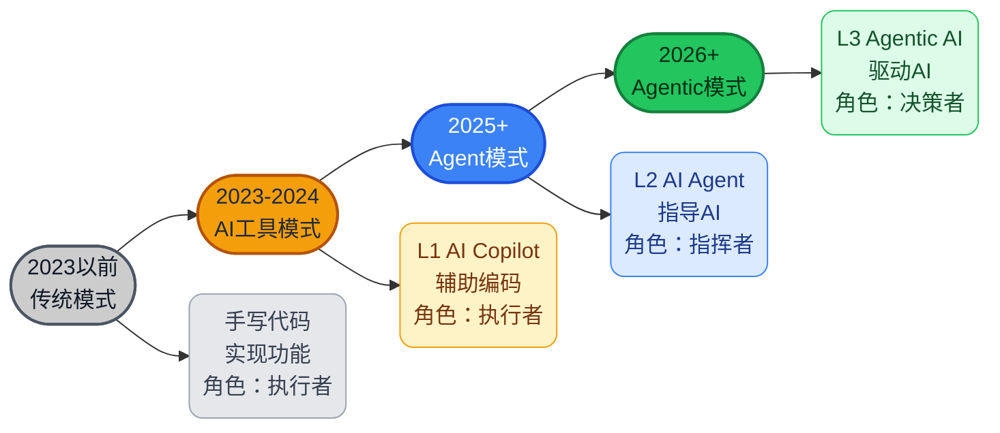
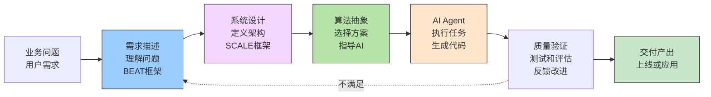
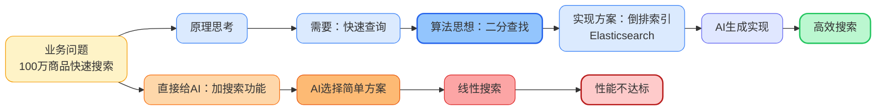
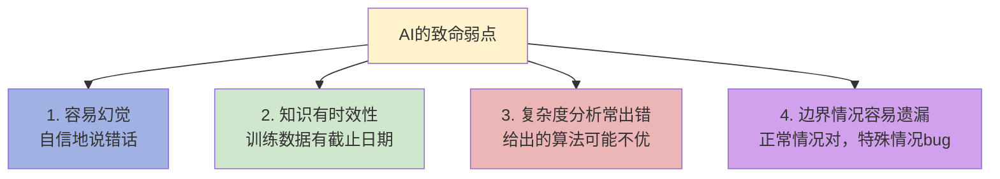
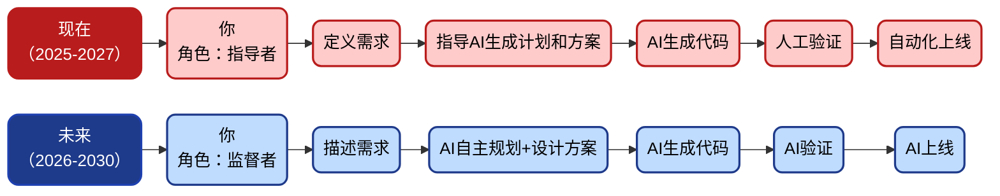

# AI编程时代，为什么35岁以上程序员会更吃香？

> AI取代人工编程已成必然趋势。那么，这对于35岁以上的程序员来说意味着什么——是会加速职业生涯死亡，还是开启了新的篇章？

AI浪潮袭来，大家充满焦虑与迷茫。一些人开始担心，自己的职业生涯是否走到了尽头，尤其是大龄程序员。

很多人认为程序员职业会消亡，但恰恰相反，我认为并非这样。我们先看看AI对编程改变了什么。

## 一、AI Agent时代编程方式的改变

2023年ChatGPT横空出世，确实有点吓人。AI写代码是真的快，前后端都能写，算法也不在话下，上线方案、测试用例随手就来。随着Cursor、Windsurf以及Claude Code、Codex与OpenClaw（龙虾）相继问世，AI Agent彻底颠覆了传统编程模式——AI能自主完成大部分编码工作，**人们不再需要手写代码了。**

这个冲击太大了，我们看下编程方式的发展变化。

### 从"手写代码"到"驱动AI"的转变

**传统开发方式：**

```
需求 → 理解 → 设计文档 → 手写代码 → 测试 → 上线
```

**AI时代方式：**

```
需求 → 理解 → 设计Skill/Prompt → AI生成代码 → 验证 → 上线
```

从“自己写”到“AI写”，工作重心完全转移了。



目前，AI编程总体处在Agent模式，依赖 Skills 和 Prompts 进行指令驱动。我们正在迈向 Agentic时代——AI自主决策，支持多任务并行。你只需给出目标和约束，**AI会自动拆解、规划和执行，完成全流程**。

负责推广AI编程的同学说：

> "以前我还做架构设计，现在连设计都省了，直接提需求和约束条件，让AI去分析、出计划、自执行。

那问题来了：AI这么强了，程序员还有价值吗？35岁以上的程序员何去何从？

---

## 二、AI Agent时代，哪些能力AI目前还替代不了
> AI再强大，本质上仍是一个执行者，是解决问题的智能体，至少目前是这样。
>
> 它擅长在已知边界内分析、优化、生成、推理，但有一些事情，它做不了，或者做不好。

软件开发中的有些能力目前AI还替代不了，或者说**不能完全替代**，比如下面这些。

| 能力项 | 分析 | 经验的优势 |
|--------|------|------|
| **1. 需求的定义** <br>你要解决的实际问题是什么？ | AI可以细化需求，但原始需求、业务目标、真正的痛点，来自人对真实世界的观察与判断 | 经验积累在于见过需求从模糊到清晰的完整过程，知道哪些是伪需求，哪些问题根本不需要技术解决 |
| **2. 目标的取舍** <br>什么是真正重要的？ | AI能给十个方案，但选哪个、为什么，背后是优先级、价值观和战略判断，这是认知问题不是技术问题 | 有经验的程序员知道什么是局部最优、什么是全局最优，"做什么"比"怎么做"更重要 |
| **3. 边界的划定** <br>该做哪些、不该做哪些？ | AI会尽职尽责地把事情做完，但哪些方案维护成本极高、哪些功能埋下隐患，需要人来叫停 | 边界感来自踩过坑。说"不"的能力比说"是"更难，AI不会主动拒绝，它会把错误的事做得很漂亮 |
| **4. 约束的管理**<br> 现实条件是什么？ | 时间、预算、团队能力、技术债、合规要求——AI并不了解你的真实处境 | 有经验的程序员擅长在约束下做出"够好"的决策，而不是追求脱离现实的最优解，这是工程智慧 |
| **5. 成本的评估**<br> 值不值得做？ | AI生成代码很快，但真实成本包括测试、维护、认知负担、学习曲线、未来扩展的代价 | 资深程序员看一眼方案能估算出三年后的技术债，这是积累出来的直觉，不是算法能给的 |
| **6. 策略的决策**<br> 怎么走这条路？ | AI能给路线图，但判断路线是否走得通，需要对人、对组织、对行业的深度理解 | 技术策略是在组织能力、市场时机、竞争态势之间找到一条现实可行的路，不只是技术最优解 |
| **7. 结果的评价**<br> 做得好不好？ | 代码能跑不代表做对了，测试通过不代表用户满意，功能上线不代表业务目标达成 | 评价标准需要人来制定和坚守。没有人的校准，AI就会在黑暗中自我打分 |

以上都不是编码能力，而是一种业务理解、抽象思考以及决策能力。这些能力目前AI还无法跟人比。

**AI可以替代解决问题的人，但还无法替代提出问题的人。**

> 如果AI真的具有独立的自主意识了（自主决策执行计划还不是自主意识），那讨论的就不是程序员的职业发展了，而是人类何去何从。

---

## 三、AI Agent时代对于程序员的要求

> 上一篇文章[《AI时代，人人都是Agent工程师》](https://github.com/microwind/algorithms/blob/main/start-here/AI-Era-Programmers-as-Agent-Engineers.md)里面专门介绍了Agent工程师的要求和发展之路。这里再简单描述下。

在AI Agent时代，一个优秀的程序员需要什么？

**不是"后端专家"或"前端高手"，而是"懂需求、懂架构、懂算法"的综合型工程师，也就是Agent工程师（或AI指导工程师）。**

传统开发和AI时代对于工程师能力的对比要求。

| 能力维度 | 传统时代要求 | AI时代要求 | 难度 |
|------|:---:|:---:|:---:|
| 1. **代码编写能力** | 很高 | 一般 | ↓ 下降 |
| 2. **需求理解能力** | 一般 | 很高 | ↑ 上升 |
| 3. **系统设计能力** | 较高 | 很高 | ↑ 大幅上升 |
| 4. **算法思想能力** | 较高 | 很高 | ↑ 大幅上升 |
| 5. **指导监督能力** | 低 | 很高 | ↑ 完全新增 |
| 6. **质量验证能力** | 较高 | 很高 | ↑ 上升 |

从以上可以看出，时代变了，要求大不相同。

之前是"分工明确"——产品经理负责需求，架构师负责设计，程序员负责实现，测试负责验收。

现在是"能力融合"——一个人要懂需求、懂架构、懂算法，然后驱动AI干活。

在 AI 时代，对程序员的要求广度大于深度：你不必掌握所有专业领域的细节技术，但需要理解该领域的核心原理，并能将其应用于实际问题。

### AI Agent时代工程师工作场景



**框架说明** 

- **BEAT**：Background（背景）、Expectation（期望）、Action（行动）、Test（验证）——用于需求澄清与拆解。

- **SCALE**：Scale（规模）、Constraints（约束）、Architecture（架构）、Limitations（容错）、Evaluation（评估）——用于系统设计时的维度参考。

> 这里的框架其实是一种提示词规范，是为了结构化表达，并非专有术语。你也可以按照任何你觉得合理的规范来。

---

## 四、不需要关注实现细节，但要懂原理

很多人其实理解错了。以为"AI时代不用学技术了"，什么人都可以用AI生成代码。

现实恰恰相反。**你的确无需关注代码的实现细节，但你要懂得技术原理**，尤其是算法思想、设计模式和系统架构等。

比如，你有个订单任务处理的功能。

### 你直接问AI：
```c
提示词："实现订单接口，处理并更新库存和日志"

AI可能给你一堆代码：
// 同步处理
processOrder(order);
updateInventory(order);
writeLog(order);
```

AI代码逻辑没问题，但在高并发场景下，每个请求都阻塞等待库存更新和日志写入，性能瓶颈明显，吞吐量低。

### 你指导性地问AI：
```c
提示词："高并发订单接口，需要异步处理库存和日志，核心逻辑200ms内响应"

AI会给你完整的版本：
// 核心逻辑先完成订单确认
// 异步更新库存和写日志（线程池/消息队列）
// 保证接口快速返回，性能稳定
```

提示词的差别在哪儿？不是要你去描述更多实现细节，而是基于系统设计与算法思想给出**约束和方向**。

我并不需要告诉AI具体如何实现，比如线程池怎么用或者日志写入的具体方式，**细节方面AI比我擅长**。

我只需要告诉AI：这个问题的核心是高并发场景下需要快速响应，并**说明约束条件和处理策略**。

再比如，在“搜索问题”中：

如果你只是说“实现一个商品搜索功能”，AI可能会给出一个简单的线性扫描方案，在数据量大时性能会很差。

但如果你告诉AI：“数据规模百万级，查询复杂度需要控制在 O(log n) 或更优，可使用索引或倒排结构”。

那么AI就更可能会给出更合理的实现方案。

**在这个过程中，我同样不需要告诉AI具体如何实现**，比如怎么写 Elasticsearch 的 query DSL，细节方面AI可以完成。

我只需要明确问题的核心约束，以及可行的算法思想方向，由AI来完成具体实现。

虽然现在通过一些开源 Skills 库，比如 **Superpowers**、**awesome-openclaw-skills**，以及基于**Claude / OpenAI / OpenClaw 的Agent Skills**实践，也可以做到问题澄清、任务拆解以及架构设计、策略推导等，但最终的取舍和决策，仍然需要人来完成。

如果你不懂技术原理，那么基于AI生成出来的程序质量可能不会很好。这就像你有了AI视频生成工具，也不一定能做好导演和剪辑——工具可以替你执行，但判断还得人来做。



这就是为什么，AI能写代码，你还是要懂业务需求、懂算法思想、懂系统设计。因为这些是指导AI的核心武器。

一个35岁+的老程序员，可能不再追逐最新的框架以及API。但如果你有这些经验：

- **算法思想**：贪心、分治、动态规划、回溯

- **复杂度意识**：O(n)、O(n log n)、O(n²)，知道什么时候该优化

- **数据结构**：数组、链表、哈希表、堆、树，知道如何选型

- **系统设计**：高并发架构、服务拆分、接口设计、数据建模

- **分布式基础**：一致性（CAP / BASE）、事务、幂等性、消息可靠性

- **架构能力**：AKF扩展、微服务拆分、领域建模（DDD）

- **工程经验**：缓存策略、限流、降级、熔断、重试机制

- **设计原则**：SOLID、KISS、DRY等

- **系统思维**：SCALE框架、性能瓶颈分析、容量评估

那么驱动AI时，就能准确描述问题。比如：

> “这个库存扣减问题，本质是**并发控制**。用行锁有性能瓶颈，用乐观锁要设计好**重试机制**。支付失败必须回滚库存，要保证**原子性**。”

一个刚工作几年的新手，可能听说过这些概念，但没碰过真实案例，理解并不深入。遇到疑难bug时，老程序员的优势更明显。

---

## 五、AI并不总是可靠，你需要验证

AI很聪明，但有时候也犯傻。AI在某些方面远超人类，但在另一些方面很不靠谱。

### AI的四个致命弱点



### 举几个例子

**案例1：限流算法性能问题**

让AI设计一个API限流器。它给出了一个令牌桶实现，代码清晰，逻辑也正确。但仔细分析会发现，它在每次请求时遍历整个令牌列表清理过期令牌——这是一个 O(n) 操作。QPS一高，这一步就会成为性能瓶颈。

更合理的做法是：避免每次请求进行全量遍历，例如使用时间戳计算或惰性更新，将单次请求复杂度降低到 O(1) 或接近 O(1)。本质问题不在令牌桶算法本身，而在具体实现方式不合理。优化后方案才具备可用性。

**案例2：分页查询问题**

让AI写一个商品列表分页接口。它给了标准的 `LIMIT offset, size` 写法。前几页没问题，但翻到第1000页（假设每页10条）时，`OFFSET 9990` 意味着数据库要扫描前9990条再丢弃，越往后越慢。

有经验的人一看就知道要用游标分页（keyset pagination），用 `WHERE id > last_id LIMIT size` 代替 OFFSET，使性能不随页码增长而下降。

**案例3：输入框防抖问题**

让AI实现一个Suggest搜索框，实时响应用户输入并展示搜索结果。它给了一个简单的防抖函数，在用户停止输入300ms后发送请求。看上去很合理。

但如果用户连续快速输入多个关键词，由于网络请求返回顺序不确定，可能出现后发出的请求先返回，导致最终显示的结果与最后一次输入不匹配。这种竞态问题光靠防抖解决不了。

有经验的前端会加入请求取消机制（如 AbortController），或通过请求标识进行结果校验，确保只有最后一次请求的结果被渲染，避免数据错乱。

### 验证AI代码四个必查项

上线AI的代码前，必须检查：

| 检查维度      | 核心问题                     | 关键检查点                                                   |
| ------------- | ---------------------------- | ------------------------------------------------------------ |
| 1. 复杂度检查 | 时间复杂度是否满足性能要求？ | 是否真的是 O(log n) 还是 O(n²)？<br>在大数据量下会不会 timeout？ |
| 2. 边界情况   | 有没有遗漏特殊情况？         | 新用户/新数据怎么处理？<br>数据为空、为1、极端大时怎么样？<br>网络中断、服务宕机的降级方案？ |
| 3. 业务逻辑   | 代码是否真的理解业务？       | 库存扣减的原子性保证了吗？<br>用户的幂等性考虑了吗？<br>旧数据的迁移方案有吗？ |
| 4. 性能验证   | 是否在实际环境中测试过？     | 单机能支持多少 QPS？<br>需要多少服务器？<br>缓存命中率能达到预期吗？ |

直接上线AI代码出问题的不少，有些问题更是运行一段时间后才会复现，那时候就晚了。因此，整体流程和关键细节必须人工再过一遍。

验证能力是驱动AI最关键的环节，经验丰富的程序员有优势。年轻程序员可能做不了，因为他不知道什么该查，或者无法判断问题所在。

---

## 六、新老程序员的优劣势对比

如果拼写代码，尤其是CRUD和UI交互类开发，老程序员可能不如新手。新框架、新概念层出不穷，老程序员学不动了。

### 35岁以上老程序员的优势

| 优势 | 为什么重要 | 影响程度 |
|------|---------|---------|
| **系统设计经验丰富** | 能快速识别问题本质，避免大坑 | 很高 |
| **懂多种架构模式** | 面对问题知道该用什么思想 | 很高 |
| **经历过性能优化全过程** | 知道什么时候优化、如何优化 | 较高 |
| **理解业务的深度** | 能从需求挖掘真实需求 | 很高 |
| **对技术的深刻理解** | 能验证AI的方案是否可靠 | 很高 |
| **把握全局的能力** | 能看到系统全图，做出权衡 | 高 |

### 35岁以下新程序员的优势

| 优势 | 为什么重要 | 影响程度 |
|------|---------|---------|
| **学习新技术快** | 能快速上手AI工具和新框架 | 高 |
| **没有历史包袱** | 敢于尝试新的AI工作方式 | 高 |
| **精力充沛** | 学习投入多，迭代速度快 | 较高 |
| **适应性强** | 对新工具和新流程接受度高 | 高 |

在Agent时代，经验的价值凸显了。以前写CRUD和UI交互，年轻人够用，老程序员性价比不高。现在驱动AI需要经验，老程序员反而更有优势。

简单说，传统时代代码能力占大头，年轻人学东西快有优势。Agent时代驱动AI的能力占大头，经验丰富的人反而更有优势。

35岁+老工程师，基本经历过：

- 小项目从0到1的全过程
- 中等项目的架构设计和演进
- 大型项目的分布式系统挑战
- 性能优化的具体细节
- 多个业务领域的实际问题

**这些都是经验，是靠项目实打实经年累月积攒下来的**。

### 为什么有经验的程序员更有优势？

### 1. 指导AI的能力，靠时间积累


| 阶段 | 能力需要 | 谁擅长 | 理由 |
|------|------|--------|--------|
| 需求理解 | 理解业务本质、识别隐需求、消除歧义 | 有5年+经验的工程师 | 见过足够多的业务模式 |
| 系统设计 | 权衡trade-off、识别单点、规划扩展 | 有10年+经验的工程师 | 经历过系统从小变大的全过程 |
| 算法思想 | 识别问题类型、选择最优思想、验证复杂度 | 有10年+经验的工程师 | 见过足够多的问题、尝试过足够多的方案 |
| 验证与优化 | 识别AI的错误、找到改进方向、迭代优化 | 有15年+经验的工程师 | 知道常见的坑、见过足够多的失败 |

不是说年轻人不行，而是有些能力确实需要时间沉淀。尤其是决策和判断力。

### 2. 经验决定你是依赖AI还是驾驭AI

- 经验少比较依赖AI，但AI出问题时束手无策
- 经验多则能指导AI，在AI出问题时能予以指正
- 有经验的人拿AI当工具，没经验的人容易被AI带偏

---

## 七、老程序员如何抓住这个机会

> 如果你是35岁以上的程序员，AI时代是很好的窗口期。
>
> 基于AI风口，可以成为Agent工程师，也可以成为决策者，还可以自己当老板。

###  1、学习指导AI的方法论

**1. 理解需求的方法**——搞清楚：现状是什么、目标是什么、要做什么、如何验证。[《AI时代，程序员如何成为需求描述工程师》](https://github.com/microwind/algorithms/blob/main/start-here/AI-Era-Programmers-as-Requirements-Engineers.md.md)

**2. 设计系统的方法**——明确：规模、约束、架构、边界、评估指标。[《AI时代，程序员如何成为系统设计工程师》](https://github.com/microwind/algorithms/blob/main/start-here/AI-Era-Programmers-as-System-Design-Engineers.md)

**3. 解决问题的方法**——选择：把模糊业务变为可计算、可优化的问题模型，选用合适的求解策略。[《AI时代，程序员如何成为算法思想工程师》](https://github.com/microwind/algorithms/blob/main/start-here/AI-Era-Programmers-as-Algorithmic-Thinkers.md)

其实你之前做项目也是这么干的，只是没刻意这么总结。

### 2、学习架构设计和算法思想的体系

完整学习[系统设计](https://github.com/microwind/algorithms/blob/main/start-here/AI-Era-Programmers-as-System-Design-Engineers.md)与[算法思想](https://github.com/microwind/algorithms/blob/main/start-here/AI-Era-Programmers-Need-Algorithmic-Thinking.md)），掌握每种思想的意义和用途。

不需要手写每个算法，但要理解：
- 理解每个设计与思想的核心思路
- 知道什么问题该用什么设计和思想
- 能用设计架构与算法思想来指导AI

### 3、持续练习验证AI代码的能力

这个最重要，没有什么比持续学习重要了。多用AI编程工具，用多了自然就有了感觉。

每次AI给你代码，你都要想想：
- 这个方案的复杂度是多少？
- 在我的数据规模下能跑吗？
- 有没有边界情况没考虑？
- 有没有更优的算法可以用？
- 这个架构能扩展吗？
- 有没有单点故障？

刚开始可能要花时间审查。但一两个月后，你会形成直觉——看一眼代码就知道有没有问题。

---

## 八、未来：AI干活，人定方向

随着AI的发展，未来你不再需要通过提示词逐步指导，AI可以自主规划任务，用OpenClaw的人可能正在这么做。你只需告诉AI你想要什么，其他交给AI来自主执行。但就跟自动驾驶一样，可能不需要司机了，但还是需要告诉目的地以及能随时改变路线的人。

### 第一个转变：从"指导AI"到"监督AI"


这两者差别在于：AI能自己理解问题、拆解需求、制定计划与执行方案，最后生成代码。你的工作从"指导"变成"监督"。

再往后AI会怎样不好说，或许真能自主完成从需求到解决的全流程吧，那时候人只要给AI提出想法就行，AI会替你思考与规划。

> 或许有一天，AI给自己提需求，AI相互之间提需求，AI会自主发现问题并解决问题，那时候人类再躺平不迟。：）

### 第二个转变：从"写代码"到"提需求+做监督"

随着AI日趋成熟，需要的是：
- 理解业务、能提出好问题的人
- 能定义边界和约束的人
- 能设定目标和优先级的人
- 能验证方案质量的人

这些归结起来就是"提需求"和"做监督"。

### 第三个转变：AI变强，对程序员的要求反而在提高

AI变强，对人的要求也在变强。因为验证AI的难度，远高于编写代码。

一个AI生成的系统有没有问题，你一眼看不出来。你需要理解系统的全局设计、每个决策的理由、潜在的缺陷在哪儿。这需要更高的经验和判断力。

所以未来不是"程序员被淘汰"，而是"只会搬砖的程序员被淘汰"。真正理解系统、算法和业务的人，会越来越吃香。

---

## 九、总结

AI替代人工编程已成定局，积极拥抱是唯一出路。以前程序员是“青春饭”，35岁以上就开始焦虑。现在时代变了——AI把"写代码"的门槛大幅降低，反而让"理解问题、做出判断"这些需要时间积累的能力变得更值钱。

**这对有经验的程序员来说，何尝不是一个难得的机会。你怎么看？欢迎聊聊你的看法。

---

## 相关链接

- [AI时代，人人都是AI Agent工程师](https://github.com/microwind/algorithms/blob/main/start-here/AI-Era-Programmers-as-Agent-Engineers.md)
- [AI时代，人人都是需求描述工程师](https://github.com/microwind/algorithms/blob/main/start-here/AI-Era-Programmers-as-Requirements-Engineers.md)
- [AI时代，人人都是系统设计工程师](https://github.com/microwind/algorithms/blob/main/start-here/AI-Era-Programmers-as-System-Design-Engineers.md)
- [AI时代，人人都是算法思想工程师](https://github.com/microwind/algorithms/blob/main/start-here/AI-Era-Programmers-as-Algorithmic-Thinkers.md)
- [算法与数据结构代码分析](https://github.com/microwind/algorithms)
- [设计模式与编程范式详解](https://github.com/microwind/design-patterns)
- [AI编程Prompts模板库](https://github.com/microwind/ai-prompt)
- [AI编程Skills仓库](https://github.com/microwind/ai-skills)