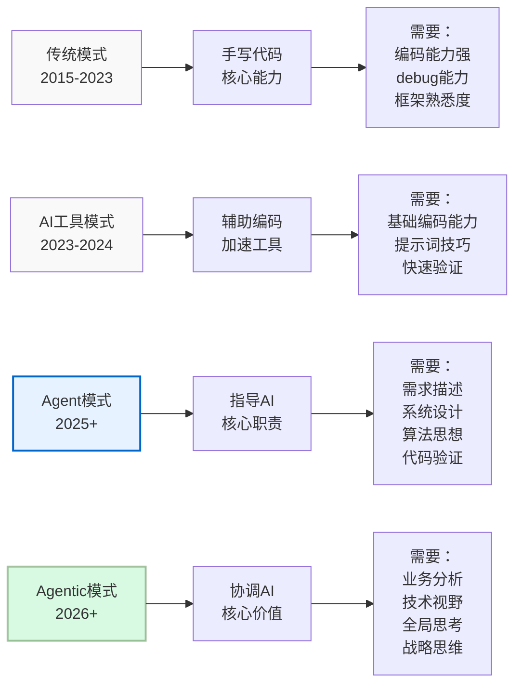
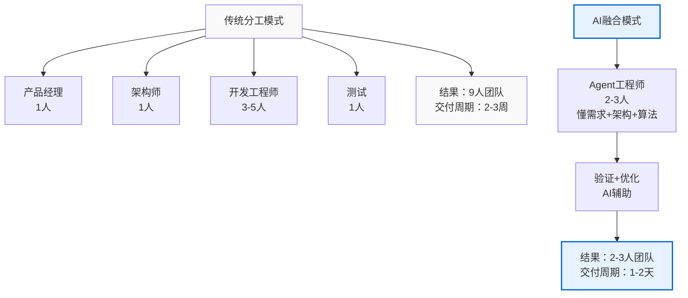
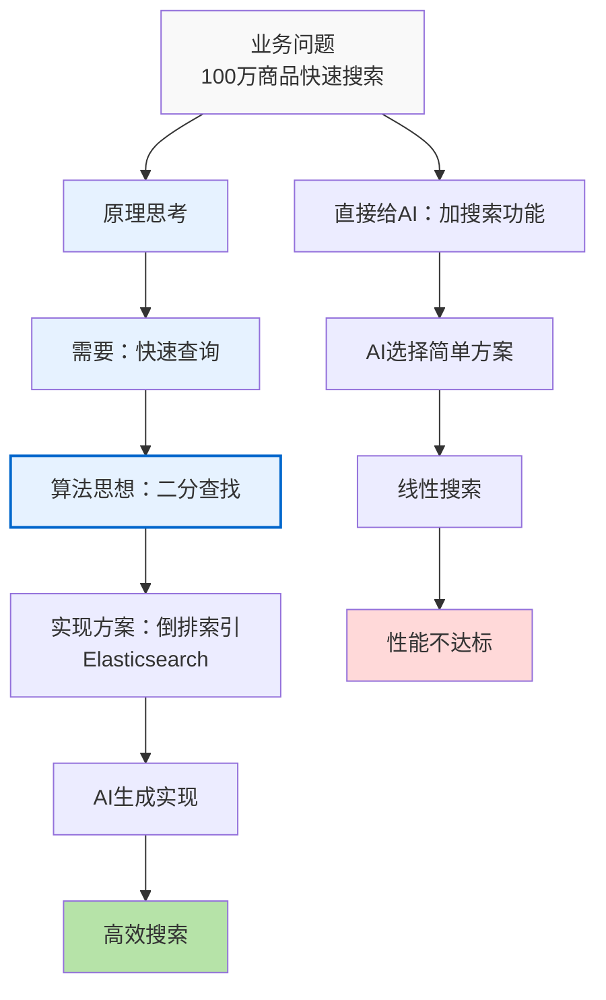
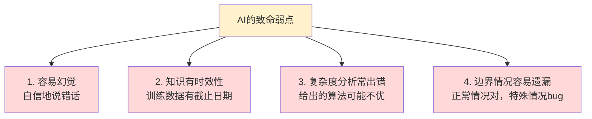
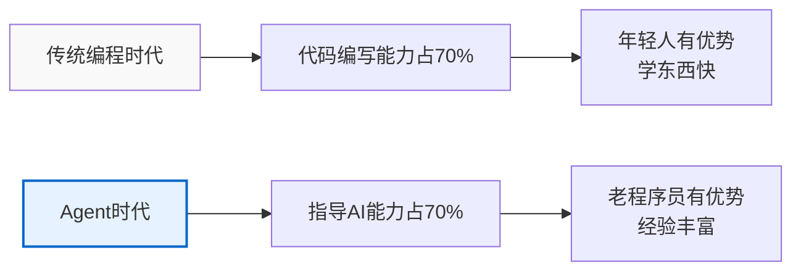
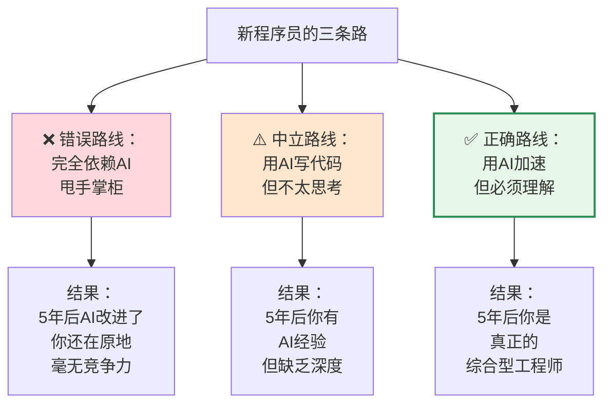
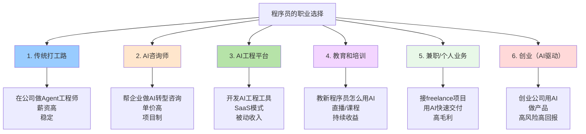
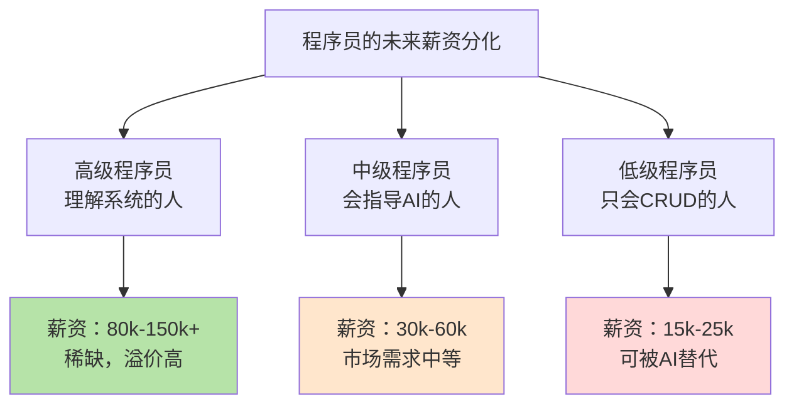
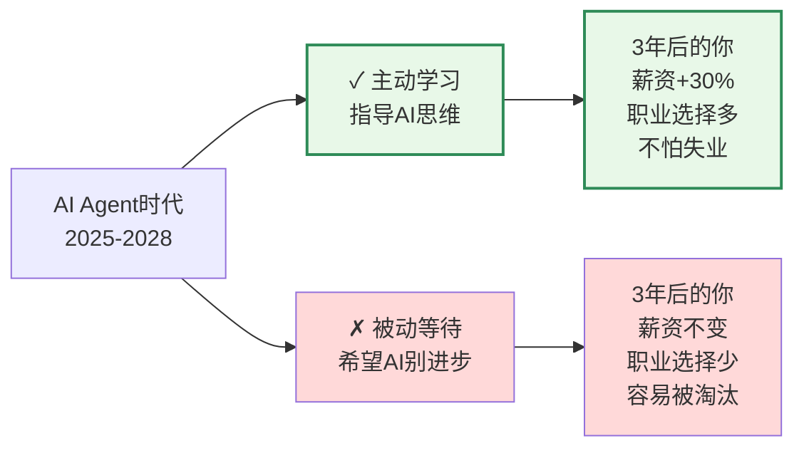

# AI编程时代，为何35岁以上程序员更吃香？

> 随着Claude Code和OpenClaw的流行，无数35岁以上的老程序员感叹："AI编程来了，我是否要下岗了？"不少人充满焦虑、迷茫、甚至绝望。
> 
> **但我想告诉你：你想反了。**
> 

---

## 文章要点速览

| 核心观点 | 关键数据 | 行动建议 |
|---------|---------|---------|
| **经验价值暴涨** | Agent工程师薪资溢价30%+ | 老程序员主动转型"指导者" |
| **能力要求重构** | 指导AI能力占70% | 学习BEAT/SCALE框架 |
| **验证能力关键** | AI错误率超预期 | 建立代码审查清单 |
| **职业选择多元化** | 6条新职业路径 | 根据个人情况选择 |

---

## 一、AI Agent时代编程方式的改变

还记得2023年ChatGPT爆火时，所有人都在说"程序员完蛋了"。

那时候确实有点吓人。AI写的代码是真的快，前端后端都能写，bug改得也不慢。我身边不少35岁左右的程序员开始慌了——花了这么多年学会的编码技能，被AI轻松秒杀。

但是现在，2026年了，情况已经完全反转了。

### 从"写代码"到"指导AI"的转变

传统开发方式很直接：
```
需求 → 理解 → 设计 → 写代码 → 测试 → 上线
```

现在的方式是：
```
需求 → 理解 → 设计 → 指导AI → 验证 → 上线
```

听起来好像只是把"写代码"换成了"指导AI"，但实际上？整个工作的重心完全转移了。



我身边一个40多岁的老工程师，最近在公司推行AI Agent工作流。他说得特别好：

> "以前我的价值在于'我能用Java/Go写出高效代码'。现在的价值在于'我能让AI替我写出最优的代码'。不是能力变弱了，而是能力的维度升级了。"

这个转变对不同年龄的程序员，冲击是完全不同的。

---

## 二、AI Agent时代对于程序员的要求

在Agent时代，一个优秀的程序员需要什么？

不是"Java专家"或"前端高手"，而是"懂需求、懂架构、懂算法"的综合型工程师。

我用一个表格来说明：

| 维度 | 传统时代要求 | Agent时代要求 | 难度 |
|------|:---:|:---:|:---:|
| **代码编写能力** | ⭐⭐⭐⭐⭐ | ⭐⭐ | ↓ 下降 |
| **需求理解能力** | ⭐⭐ | ⭐⭐⭐⭐⭐ | ↑ 上升 |
| **系统设计能力** | ⭐⭐⭐ | ⭐⭐⭐⭐⭐ | ↑ 大幅上升 |
| **算法思想能力** | ⭐⭐⭐ | ⭐⭐⭐⭐⭐ | ↑ 大幅上升 |
| **指导协调能力** | ⭐ | ⭐⭐⭐⭐⭐ | ↑ 完全新增 |
| **质量验证能力** | ⭐⭐⭐ | ⭐⭐⭐⭐⭐ | ↑ 上升 |

核心变化就两个字：结构变了。

之前是"分工明确"——产品经理负责需求、架构师负责设计、程序员负责实现、测试负责验收。每个人专业，但协调成本高。

现在是"能力融合"——一个人要懂需求、懂架构、懂算法，然后用这些知识指导AI替你干活。



这不是我胡说的。我身边的好几家大厂（电商、短视频、社交）都在做这个转变。某个推荐系统团队，2024年初是9个人，现在（2025年底）是3个人。不是裁员，是职能融合了。

那3个人每个都是综合型的——既懂产品需求，也懂系统架构，也懂推荐算法。他们不写代码，但他们指导AI写代码。

这就是核心需求的变化。

---

## 三、Agentic无需你再关注实现细节，但你要懂得原理

这句话特别重要，我要单独讲。

很多人理解错了。他们以为"AI时代就是不用学技术了"。

完全相反。你不需要关注实现细节，但你要懂得原理。

比如说，你要给推荐系统加一个搜索功能。

### 坏的方式：
```
提示词："给推荐系统加个搜索功能"

AI可能给你：
// 简单的线性搜索
for (auto& item : items) {
    if (item.name.find(query) != string::npos) {
        results.push_back(item);
    }
}
```

这个代码能用。100万商品，搜索时间是O(n)，可能要一两秒。用户体验很差。

### 好的方式：
```
提示词："需要从100万商品中快速搜索（<100ms），支持多条件组合搜索。
建议用倒排索引或Elasticsearch实现。"

AI会给你：
// 用Elasticsearch做搜索
// 复杂度：O(log n)，响应时间<100ms
```

差别在哪儿？不是实现细节，而是算法思想。

我不需要告诉AI怎么用C++ STL，怎么写Elasticsearch的query DSL，那是实现细节。AI很擅长。

但我需要告诉AI"这个问题的核心是需要O(log n)的复杂度，用什么思想能达到"。这是原理。



这就是为什么，即便AI能写代码，你还是要懂算法、懂系统设计、懂复杂度分析。

因为这些是指导AI的核心武器。

一个35岁的老工程师，可能从来没用过最新的框架，最新的语言。但如果他懂：
- 什么是贪心算法、分治、动态规划
- 什么是O(n)、O(n log n)、O(n²)
- 什么是分布式系统的一致性问题
- 什么是缓存策略、降级方案、限流

那他指导AI的时候，能说出让AI恍然大悟的话。比如：

> "这个库存扣减问题，核心是并发控制。用行锁会有性能问题，用乐观锁要考虑重试。还有，支付失败要能回滚库存，这是原子性保证。"

一个才工作3年的年轻人？他可能听都没听过这些。即便给他Cursor这样的AI工具，他也指导不了AI。因为他不知道自己不知道什么。

这就是原理的力量。

---

## 四、AI并不总是可靠，你需要指导和验证AI

现在必须说一个大实话：AI很聪明，但不聪明。

这句话不是文学修辞，我说的是：AI在某些方面超过人类，但在另一些方面比你想象得更不靠谱。

### AI的四个致命弱点



举个真实案例：

前段时间我让Claude帮忙设计一个限流算法。它给了我一个"令牌桶"的实现，看起来很完美。代码清晰，逻辑清楚，我第一眼就接受了。

但我一看复杂度分析就发现问题了——它在每次请求时都要遍历整个令牌列表来找过期令牌。这是O(n)的操作！在高并发下完全是个瓶颈。

AI自信地给了我，但没考虑性能。这就是"自信地说错话"。

我需要告诉它：
"令牌过期检查不能是O(n)，要改成O(1)。可以用时间戳标记，结合删除策略定期清理。"

这样它才能给出真正好的方案。

### 另一个真实的故事

我有个朋友，用AI写了个推荐算法。AI用了MMR（最大边际相关性）来平衡多样性和相关性，逻辑完全正确。代码也对。

但他没想到一个细节：新用户怎么办？没有历史行为数据，算法根本跑不了。

AI没有提醒这个边界情况。代码上线了一个星期，新用户都收不到推荐。

这就是"边界情况遗漏"。

### AI验证的四个必查清单

作为指导者，你上线AI的代码前，必须检查：

**复杂度检查：时间复杂度是否满足性能要求？**
  - 是否真的是O(log n)还是O(n²)？
  - 在大数据量下会不会timeout？

**边界情况：有没有遗漏特殊情况？**
  - 新用户/新数据怎么处理？
  - 数据为空、为1、极端大时怎么样？
  - 网络中断、服务宕机的降级方案？

**业务逻辑：代码是否真的理解业务？**
  - 库存扣减的原子性保证了吗？
  - 用户的幂等性考虑了吗？
  - 旧数据的迁移方案有吗？

**性能验证：是否在实际环境中测试过？**
  - 单机能支持多少QPS？
  - 需要多少服务器？
  - 缓存命中率能达到预期吗？

这个验证过程，是指导AI时最关键的环节。

而这个能力，只有经验丰富的程序员才有。年轻人做不了，因为他不知道什么该查。

---

## 五、新老程序员的优劣势对比

现在可以直接比了。

### 35岁以上老程序员的优势

| 优势 | 为什么重要 | 影响程度 |
|------|---------|---------|
| **系统设计经验丰富** | 能快速识别问题本质，避免大坑 | ⭐⭐⭐⭐⭐ |
| **懂多种架构模式** | 面对问题知道该用什么思想 | ⭐⭐⭐⭐⭐ |
| **经历过性能优化全过程** | 知道什么时候优化、如何优化 | ⭐⭐⭐⭐ |
| **理解业务的深度** | 能从需求挖掘真实需求 | ⭐⭐⭐⭐⭐ |
| **对技术的深刻理解** | 能验证AI的方案是否可靠 | ⭐⭐⭐⭐⭐ |
| **把握全局的能力** | 能看到系统全图，做出权衡 | ⭐⭐⭐⭐ |

### 35岁以下新程序员的优势

| 优势 | 为什么重要 | 影响程度 |
|------|---------|---------|
| **学习新技术快** | 能快速上手AI工具 | ⭐⭐⭐ |
| **没有历史包袱** | 敢于尝试新的AI工作方式 | ⭐⭐⭐ |
| **精力充沛** | 加班能力强、学习投入多 | ⭐⭐ |
| **薪资成本低** | 公司愿意多招年轻人 | ⭐⭐ |

老实说，这对比一点都不公平。

在Agent时代，经验的价值暴涨了。



一个35岁的老工程师，经历过：
- 小项目从0到1的全过程
- 中等项目的架构设计和演进
- 大型项目的分布式系统挑战
- 性能优化的具体细节
- 多个业务领域的实际问题

这些经验，是你怎么在Cursor里prompt都学不来的。

---

## 六、为什么老程序员在AI时代更吃香？

现在我直接说出来：AI时代，35岁以上的程序员反而前景更好。

这不是鸡汤。我用数据和逻辑说明。

### 1. 指导AI的四个核心能力，老程序员全占

```
需求理解
├─ 需要：理解业务本质、识别隐需求、消除歧义
├─ 谁擅长：有5年+经验的工程师
└─ 为什么：见过足够多的业务模式

系统设计
├─ 需要：权衡trade-off、识别单点、规划扩展
├─ 谁擅长：有8年+经验的工程师
└─ 为什么：经历过系统从小变大的全过程

算法思想
├─ 需要：识别问题类型、选择最优思想、验证复杂度
├─ 谁擅长：有7年+经验的工程师
└─ 为什么：见过足够多的问题、尝试过足够多的方案

验证与优化
├─ 需要：识别AI的错误、找到改进方向、迭代优化
├─ 谁擅长：有10年+经验的工程师
└─ 为什么：知道常见的坑、见过足够多的失败
```

一个年轻人，再聪明，也走不完这条路。因为他缺少"见过足够多"。

### 2. 公司对指导者的溢价远高于编码者

> **薪资对比数据**

原来：
```
1个架构师（20k） + 5个程序员（8-12k）= 月薪成本60-80k
```

现在：
```
2个Agent工程师（25-30k） + AI = 月薪成本50-60k
```

**关键变化：**
- 公司成本降低20-25%
- Agent工程师个人薪资上涨25-50%
- 团队效率提升3-5倍

差别在哪儿？**Agent工程师的溢价。**

因为公司发现，找一个年轻的"编码高手"容易，但找一个真正的"指导大师"难。

前者市场有几万人，后者市场可能只有几千人。

**稀缺性决定溢价。**

我身边35岁的老工程师，薪资正在上涨。不是因为他们编码能力强，而是因为他们现在成了"稀缺资源"。

### 3. 经验在AI时代是最强的防守

这个逻辑很简单：

- **经验少的人依赖AI** → AI出问题就完蛋
- **经验多的人指导AI** → AI出问题你能快速识别和修正

所以：
风险最大 → 35岁以下、经验0-3年的人
          （完全依赖AI，出问题不知道为什么）

风险较小 → 35岁以上、经验10年+的人
          （理解AI的弱点，知道怎么应对）

AI不是程序员的终点，而是一个分水岭。有经验的人用AI上天，没经验的人被AI坑死。

### 4. 大厂已经在用行动证明

某电商公司，2024年时有120人的技术团队。现在（2025年底）缩到60人，但业务量反而增加了。

他们怎么做到的？

结构变成了：
- 10个35岁以上的"架构/设计工程师"（指导AI）
- 20个25-35岁的"全栈工程师"（执行和验证）
- 30个AI工程/数据工程（跑具体任务）

关键职位（架构、需求理解、关键算法选择）全是35岁以上的。

一个35岁的工程师，现在的综合薪资+股票+福利，比他25岁时高50%以上。

这不是涨工资，这是职位价值重新评估。

---

## 七、老程序员如何赶上这个时代的机遇

如果你是35岁以上的程序员，现在是最好的时机。

但机遇不会自己找上门。你要主动出击。

### Step 1：理解你已经具备的优势（1周）

你有什么：
✓ 系统设计的经验
✓ 算法问题的敏感度
✓ 业务深度的理解
✓ 架构权衡的能力
✓ 调试问题的经验

这些就是你的财富。认清这一点很重要。

### Step 2：学习指导AI的框架（1-2个月）

最核心的两个框架：

**BEAT框架**（理解需求）
B - Background：现状是什么
E - Expectation：期望是什么
A - Action：怎么做
T - Test：怎么验证

**SCALE框架**（设计系统）
S - Scale：规模是多少
C - Constraints：约束条件
A - Architecture：架构思路
L - Limitations：降级方案
E - Evaluation：评估指标

学这两个框架，不需要额外的脑力，因为你之前就是这么做的，只是没有这个名字。现在给它命个名，就能用它来指导AI了。

我建议：
1. 花两周理解这两个框架
2. 花一个月用两个项目实践它
3. 形成自己的表达习惯

### Step 3：学习算法思想的完整体系（2-3个月）

这是最重要的环节。

7大核心算法思想：
贪心算法（Greedy）     → 每步最优
分治算法（Divide & Conquer） → 分解递归
动态规划（DP）         → 记忆化避免重复
回溯算法（Backtracking）    → 系统枚举
分支限界（Branch & Bound）  → 剪枝优化
随机化（Randomized）   → 引入随机性
搜索策略（BFS/DFS/A*） → 遍历解空间

不需要你写代码实现。你只需要：
- 理解每个思想的核心思路
- 知道什么问题该用什么思想
- 能用这个思想来指导AI

比如：
你不需要会手写红黑树，但你需要知道：
"这个场景需要快速的范围查询，用B树或跳表比AVL树更合适。"

这样AI就知道往哪个方向设计。

### Step 4：练习验证AI代码的能力（持续）

这个最重要，也最容易被忽视。

每次AI给你代码，你都要问自己：
- 这个方案的复杂度是多少？
- 在我的数据规模下能跑吗？
- 有没有边界情况没考虑？
- 有没有更优的算法可以用？
- 这个架构能扩展吗？
- 有没有单点故障？

刚开始可能要花时间审查。但一两个月后，你会形成直觉——看一眼代码就知道有没有问题。

### Step 5：转变职位定义（必须做的事）

这一步最关键。

**你要主动向公司和团队宣布：我的职位从"程序员"转变为"Agent工程师"。**

不是暗示，不是希望，而是明确地告诉老板和同事：

我不再关注"我能写多少代码"，
而关注"我能指导AI实现什么"。

我的工作成果不是代码行数，
而是系统的质量、设计的合理性、决策的准确性。

这很重要，因为：
1. 公司需要理解你角色的变化
2. 你自己也要从"编码者"的心态转变出来
3. 团队分工才能重新调整

### 真实的转变故事

我认识的一个45岁的工程师，2024年还在纠结自己是否要转管理。当时他很焦虑——"我编码能力还行，但面试确实答不上最新的框架题。"

后来他参加了一个AI工作坊，系统学了BEAT、SCALE和算法思想。

现在他在他的公司里，带了3个年轻工程师，用AI完成了两个大项目。他的薪资涨了30%，工作满足感比以前高得多。

他说：

> "原来我以为自己要过时了。现在我发现，我那些'老经验'反而成了最值钱的东西。不是因为AI，而是因为我终于找到了用对地方的方法。"

---

## 八、新程序员如何赶上这个时代的机遇

如果你是35岁以下的程序员，你面临的情况完全不同。

坦白说，你的劣势很明显：**经验不足。**

但你的优势也明显：**时间充足，还有30年职业生涯。**

关键是不要走错路。

### 你现在最容易犯的错误



最常见的错误：年轻人用Cursor写代码，AI写了就用，从不审查，从不思考。

这种人到第5年的时候，会发现自己卡住了。因为他们完全依赖AI，AI稍微出点问题就不知所措。

这样的人，会被真正懂的人吊打。

### Step 1：打牢编程基础（第1-2年很关键）

这一步老程序员不需要，但你必须做。

**不要急着用AI，先学会手写代码。**

我知道这听起来很"传统"，但我是认真的。

原因很简单：
看AI写代码和自己写代码，是完全不同的两种学习方式。

你需要经历：
1. 思考 → 2. 尝试 → 3. 失败 → 4. 调试 → 5. 理解

这个完整的过程，才能真正学会。

如果你的第一个项目就用AI写，你可能永远都不会知道为什么某个边界情况会出bug。

所以：
- 前3个月：坚持手写代码，不用AI
- 3-6个月：AI开始当参考，但你要理解它的输出
- 6个月+：AI当加速工具，但你能验证它

### Step 2：系统学习数据结构和算法（第2-3年）

这不是选项，是必修课。

不是说要你刷LeetCode 500题（虽然刷是没错）。而是要你：

**理解每种数据结构的本质**
  （为什么Hash表查询是O(1)，二叉树是O(log n)）

**掌握核心算法思想**
  （贪心、分治、DP、搜索）

**知道什么问题该用什么思想**
  （看到搜索问题会想到BFS/DFS）

**能分析复杂度**
  （看一个算法就能说出时空复杂度）

这个学习不是为了面试，而是为了5年后能指导AI。

一个30岁的程序员如果不懂算法思想，指导不了AI。但一个30岁的程序员如果懂，就能做出真正好的系统。

### Step 3：参与足够多的系统设计评审（第3-5年）

这个很多公司都不重视，但对年轻人特别重要。

你要：
- 参加架构评审，听老工程师怎么分析问题
- 参加需求评审，看资深产品怎么理解业务
- 参加技术选型，学习如何在方案间权衡

不是旁听，是要真的提问、讨论、思考。

这些经验，是AI教不了的。**只有在真实的复杂系统面前，你才能学到。**

### Step 4：主动建立自己的知识库

到了第3年左右，开始记录：

- 遇到过的问题和解决方案
- 不同的系统设计方案对比
- 用过的算法和它们的适用场景
- 项目中的失败案例和教训

这个知识库，5年后就成了你最大的财富。

### Step 5：不要在一个地方呆太久

这对年轻人特别重要。

前5年，最好换2-3个公司或者2-3个项目，这样能接触不同的：
- 业务场景（推荐、广告、支付、交易……）
- 技术栈（不同语言、不同框架）
- 团队风格（学会看不同的工程师怎么工作）

这种广度的积累，到第5年的时候，就成了你的竞争力。

### 给新程序员的忠告

你现在最大的优势不是"学新技术快"，而是"还有30年职业生涯"。

不要因为有AI就放弃深度学习。反而要更认真地学，因为你的竞争者也在学。

5年后，同样用AI的两个人：
- 一个人什么都懂，能指导AI做复杂系统
- 一个人只会用AI写CRUD，面对复杂问题卡壳

前者月薪50k+，后者月薪15k。

差别不在于AI能力，在于你本身的深度。


以前的情况：程序员的职业路线很单一。

进公司 → 做开发 → 升级做架构 → 升级做管理 → 升级做总监/VP

基本就这一条路。要么继续打工，要么创业。

现在不一样了。

### 新的职业模式正在形成



### 案例1：AI咨询师

某个40岁的工程师，在大厂呆了15年。现在他辞职了，和两个朋友做AI转型咨询。

模式很简单：
帮企业评估 → 做转型方案 → 执行和验证 → 持续优化

每个项目：
- 小企业：20-30万
- 中等企业：50-100万
- 大企业：200万+

他一年做3-5个项目，收入反而比在大厂高。而且更自由。

关键是：他的"能力"没变，只是**把能力换了个卖法**。

### 案例2：AI工程工具

某个35岁的工程师，开发了一个"AI辅助的系统设计工具"。

用户是中小企业的技术负责人。他们不懂怎么用AI做系统设计，这个工具帮他们实现BEAT/SCALE框架，然后指导AI。

现在这个工具有几千个付费用户，月收入20-30万。

他的工作？维护工具、更新AI提示词、收集用户反馈。一周工作15小时。

这就是**被动收入模式**。

### 案例3：教育

还有人开始教年轻程序员"怎么用AI时代的思维做开发"。

他开了个在线课程，目前有2000+学员，月收入10万+。

这种"经验商品化"的模式，以前存在，但没这么赚钱。现在因为AI的出现，需求暴增了。

### 案例4：Freelance项目交付

某个33岁的程序员，现在接freelance项目。

以前接一个项目需要2个月，现在用AI加速，1个月就能完成。

结果就是：**同样的时间，能做更多项目，收入翻倍。**

以前：一年接6个项目 = 年收60万
现在：一年接12个项目 = 年收120万
（单价不变，但效率翻倍）

### 新的选择框架

你要选择哪条路？取决于你想要什么：

稳定 + 高薪 → 在大厂做Agent工程师
              （薪资50k+，但要上班）

自由 + 高收入 → Freelance或咨询
              （收入不稳定，但更自由）

被动收入 → 做SaaS产品或教育
          （需要投入初期，然后持续收益）

创业梦想 → 用AI创业
         （高风险，但如果成功回报巨大）

关键是：**选择权回到了你手里。**

不再是"打工or失业"的二元选择，而是有多条路可以走。

---

## 十、未来畅想：AI打工，人们想需求和提要求

2026年底，我们看到了什么？

AI Agent框架（OpenClaw等）成熟了。你不需要自己写提示词，不需要自己指导，AI可以自主规划任务。

那时候的工作方式是什么样？

### 第一个转变：从"指导AI"到"监督AI"

现在（2025）：
你 → 指导AI写代码 → 验证 → 上线

未来（2027-2028）：
你 → 描述需求 → AI自主规划+执行 → 你监督 → 上线

差别在于：你不需要逐步指导，AI能自己理解问题、制定计划、执行方案。

你的工作从"指导"变成"监督"。

### 第二个转变：职位从"工程师"到"需求官"

现在还需要"写代码的人"。但等AI真正成熟，可能就不需要了。

需要的是：
理解业务的人        → "需求官"
定义边界的人        → "约束官"
验证方案的人        → "审核官"
指定优化方向的人    → "目标官"

这四个角色，合起来就是"需求和监督"。

### 第三个转变：从"建系统"到"持续优化"

现在的工作流程：
需求分析 → 系统设计 → 开发 → 测试 → 上线（做完了）

未来的工作流程：
需求分析 → 系统设计 → AI执行 → 监督优化（永不完成）
       ↑                      ↓
       ←←←← 持续反馈和优化 ←←←←

系统永远在演进，你的工作是持续地说"这个地方需要改"，然后AI去改。

### 第四个转变：个人编程成为小众技能

现在所有程序员都要会编程。未来？

可能只有10%的人需要真正会编程——那些设计AI框架的人。

其他90%的人？他们的工作是：
理解需求 → 指定优化方向 → 验证结果

编程对他们来说，是一个可选技能，不是核心能力。

### 但有个坏消息

AI变强的同时，对程序员的要求其实在提高。

因为：验证AI的难度，远高于编写代码。

一个AI生成的系统有没有问题，你一眼看不出来。你需要理解：
- 系统的全局设计
- 每个决策的理由
- 潜在的缺陷在哪儿

这需要更高的经验和思维能力。

所以，未来不是"程序员被淘汰"，而是"低级程序员被淘汰"。

高级程序员（那些真正理解系统、理解算法、理解业务的人）会越来越吃香。

### 薪资会怎样？



底线很清楚：**只要你还有价值，就有饭吃。问题是你有多大的价值。**

### 对现在的程序员意味着什么？

很简单：**开始学习你还没学的东西。**

如果你现在是：
- **初级程序员**（会写代码，但不理解系统）
  → 必须系统地学习架构、算法、业务
  → 否则5年内会被淘汰

- **中级程序员**（会设计系统，但经验不足）
  → 趁现在快速积累项目经验
  → 接触不同的业务场景和技术栈
  → 5年内能成为高级工程师

- **高级程序员**（经验丰富，理解系统）
  → 现在是最好的时机
  → 价值暴增，薪资上升
  → 职业选择变多

---

## 总结：你现在的选择，决定了3年后的位置

AI Agent时代，没有"局外人"。

> **思考题：** 你现在处于哪个阶段？
> 
> - 我还在手写代码，担心被AI替代
> - 我开始用AI，但不知道怎么指导
> - 我能指导AI，但缺乏系统性
> - 我已经是Agent工程师了
> 
> **欢迎在评论区分享你的选择！**

所有程序员都必须做一个选择：



最后一句话：

> **AI不是程序员的终点，而是一个分水岭。有准备的人升级了，没准备的人被淘汰了。**

**35岁以上的程序员，你的春天不是来了，你已经在春天里。问题是，你看到了吗？**

---

## 相关链接
- [AI时代，人人都是AI Agent工程师](https://github.com/microwind/algorithms/blob/main/start-here/AI-Era-Programmers-as-Agent-Engineers.md)
- [AI时代，人人都是需求描述工程师](https://github.com/microwind/algorithms/blob/main/start-here/AI-Era-Programmers-as-Requirements-Engineers.md)
- [AI时代，人人都是系统设计工程师](https://github.com/microwind/algorithms/blob/main/start-here/AI-Era-Programmers-as-System-Design-Engineers.md)
- [AI时代，人人都是算法思想工程师](https://github.com/microwind/algorithms/blob/main/start-here/AI-Era-Programmers-as-Algorithmic-Thinkers.md)
- [算法与数据结构代码分析](https://github.com/microwind/algorithms)
- [设计模式与编程范式详解](https://github.com/microwind/design-patterns)
- [AI编程提示词模板库](https://github.com/microwind/ai-prompt)
- [AI编程Skill仓库](https://github.com/microwind/ai-skills)