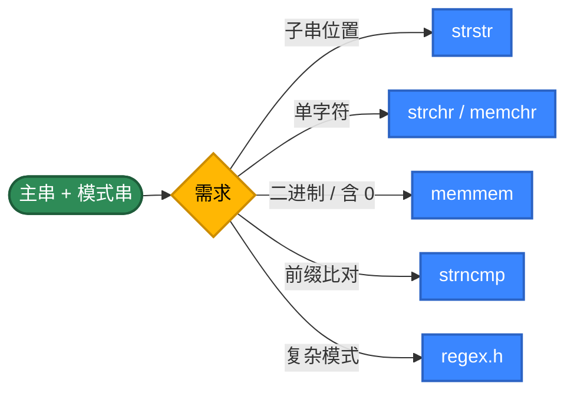
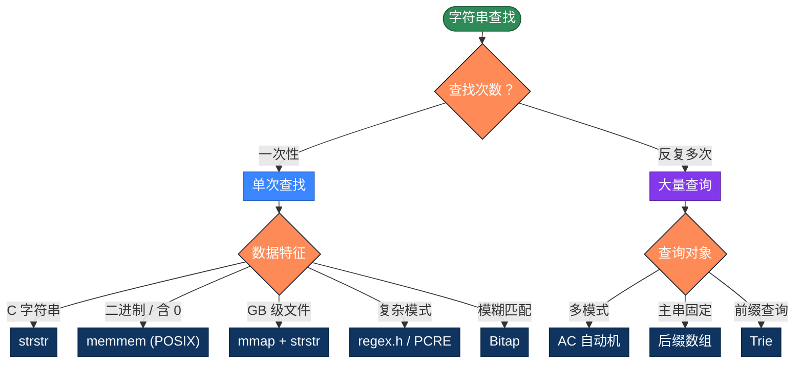

# C 字符串查找的 20 种实现方式，用不同思路解决问题

字符串查找是最常见的算法。C 语言里只有 `char*` 和 `\0` 结尾的约定，没有 String 类、没有自动内存管理——这反而让你看清字符串查找算法的"骨架"。本文整理 C 字符串查找的 20 种写法，按 5 个策略分类。

## 为什么有这么多算法？

最简单的写法，把模式串与主串的每个位置对齐，逐字符比较：

```c
int find(const char *text, const char *pattern) {
    int n = strlen(text), m = strlen(pattern);
    for (int i = 0; i <= n - m; i++) {
        int j = 0;
        while (j < m && text[i + j] == pattern[j]) j++;
        if (j == m) return i;
    }
    return -1;
}
```

问题在于"匹配失败时把所有已匹配的信息都丢了"——回到 i+1 重头比，复杂度退化成 O(m×n)。

**优化思路**：让"匹配失败"也带来信息

- **预处理模式串**：KMP 算 next 数组、BM 算坏字符表、Sunday 算下一字符位置
- **滑动得更远**：BM/Sunday 一次跳很多位
- **哈希指纹**：Rabin-Karp 用滚动哈希把"逐字符比较"压成 O(1)
- **位并行**：Bitap 用 uint64_t 表示"模式的所有前缀是否匹配"
- **多模式合并**：AC 自动机把 N 个模式串合成一个 Trie
- **数据结构**：Trie 用于前缀查询、后缀数组用于多次查询同一文本
- **SIMD**：现代 CPU 一条指令比较 16 个字节（SSE）或 32 个字节（AVX2）

**C 的特殊点**：
- `char*` 只是字节指针，遵循 `\0` 结尾约定
- 标准库只有 `strstr`/`strchr`/`strncmp`/`strpbrk` 几个查找函数
- POSIX 提供 `memmem`（在二进制数据中查子串）
- 没有内置正则——POSIX `<regex.h>` 或第三方 PCRE
- 内存管理需要手动 `malloc`/`free`，所有动态结构都要小心

## 推荐方案

| 需求 | 代码 | 性能 |
|------|------|------|
| 单次查找（C 字符串） | `strstr(text, pattern)` | glibc 用 Two-Way 算法 |
| 单次查找（二进制） | `memmem(text, n, pat, m)` | POSIX，无 \0 限制 |
| 单字符 | `strchr(text, c)` | SSE 优化 |
| 复杂模式 | POSIX `<regex.h>` 或 PCRE | 编译后 O(n) |
| 多模式同时查 | 自实现 AC 自动机 | O(n + 输出) |
| 模糊匹配 | Bitap | O(n × k) |

---

## 第1类：标准库 API（方法1-5）

策略原理：glibc 的 `strstr` 用 Two-Way 算法（一种高效的字符串匹配，结合了 KMP 和 BM 的思想）。`strchr`/`memchr` 在 x86-64 上是 SSE 实现，单字符扫描接近内存带宽。生产代码默认应该先用这些。



```c
#include <string.h>
#include <stdio.h>

/**
 * 方法1：strstr —— 标准库最常用
 * glibc 实现用 Two-Way 算法（O(n+m) 最坏复杂度）
 * 返回指向匹配位置的指针，未找到返回 NULL
 */
int find1(const char *text, const char *pattern) {
    const char *p = strstr(text, pattern);
    return p ? (int)(p - text) : -1;
}

/**
 * 方法2：strchr —— 单字符查找（特殊情况）
 * 在 x86-64 glibc 中是 SSE 实现，速度接近内存带宽
 */
int find2(const char *text, char c) {
    const char *p = strchr(text, c);
    return p ? (int)(p - text) : -1;
}

/**
 * 方法3：memmem —— POSIX 扩展，二进制数据中查子串
 * 不依赖 \0 结尾，适合处理网络包、二进制文件
 * Linux/macOS 都支持，Windows MSVC 没有（需自己实现）
 */
int find3(const char *text, size_t n,
          const char *pattern, size_t m) {
    const char *p = memmem(text, n, pattern, m);
    return p ? (int)(p - text) : -1;
}

/**
 * 方法4：strncmp 滑动窗口 —— 用 strncmp 做"前缀比对"
 * 比 strstr 更可控，可以加自定义条件
 */
int find4(const char *text, const char *pattern) {
    int n = strlen(text), m = strlen(pattern);
    if (m == 0) return 0;
    for (int i = 0; i <= n - m; i++) {
        if (strncmp(text + i, pattern, m) == 0) return i;
    }
    return -1;
}

/**
 * 方法5：POSIX <regex.h> 正则
 * 复杂模式（大小写不敏感、字符类等）的标准方案
 * Windows 没有，需要 PCRE 或 std::regex (C++)
 */
#include <regex.h>
int find5(const char *text, const char *pattern_regex) {
    regex_t re;
    regmatch_t match;
    if (regcomp(&re, pattern_regex, REG_EXTENDED) != 0) return -1;
    int pos = -1;
    if (regexec(&re, text, 1, &match, 0) == 0) {
        pos = (int)match.rm_so;
    }
    regfree(&re);
    return pos;
}
```

> **小心三个坑**：① C 字符串遇到 `\0` 就视为结束，二进制数据必须用 `memmem`；② `regcomp` 失败必须 `regfree` 防泄漏；③ `strstr` 在 musl/小型 libc 上可能是 O(n×m) 的朴素实现，性能不如 glibc。

---

## 第2类：朴素与暴力（方法6-9）

策略原理：不依赖任何预处理，纯靠下标扫描。最坏 O(m×n)。**理解朴素的浪费在哪，才能理解 KMP/BM 的优化**。

```c
/**
 * 方法6：双循环朴素 —— 最经典的 Brute Force
 * 已是 nativesearch/string_search.c 中的实现
 */
int find6(const char *text, const char *pattern) {
    int n = strlen(text), m = strlen(pattern);
    if (m == 0) return 0;
    for (int i = 0; i <= n - m; i++) {
        int j = 0;
        while (j < m && text[i + j] == pattern[j]) j++;
        if (j == m) return i;
    }
    return -1;
}

/**
 * 方法7：指针算术版 —— C 风格的"无下标"写法
 * 不少 C 老手喜欢这种风格，性能与方法6一致
 */
int find7(const char *text, const char *pattern) {
    if (*pattern == 0) return 0;
    for (const char *t = text; *t; t++) {
        const char *tt = t, *pp = pattern;
        while (*pp && *tt == *pp) { tt++; pp++; }
        if (*pp == 0) return (int)(t - text);
    }
    return -1;
}

/**
 * 方法8：标志位写法 —— 便于在循环里加额外逻辑
 */
int find8(const char *text, const char *pattern) {
    int n = strlen(text), m = strlen(pattern);
    if (m == 0) return 0;
    for (int i = 0; i <= n - m; i++) {
        int matched = 1;
        for (int j = 0; j < m; j++) {
            if (text[i + j] != pattern[j]) { matched = 0; break; }
        }
        if (matched) return i;
    }
    return -1;
}

/**
 * 方法9：反向朴素 —— 从右往左对齐
 * BM 算法的雏形：从模式串最右开始比，失败时直接跳到下一对齐位置
 */
int find9(const char *text, const char *pattern) {
    int n = strlen(text), m = strlen(pattern);
    if (m == 0) return 0;
    for (int i = n - m; i >= 0; i--) {
        int j = m - 1;
        while (j >= 0 && text[i + j] == pattern[j]) j--;
        if (j < 0) return i;
    }
    return -1;
}
```

> **朴素算法的最坏案例**：`text = "AAAAA...AAB"`、`pattern = "AAAB"`——前 m-1 字符总匹配，最后总失败。每对齐浪费 O(m)，总共 O(m×n)。

---

## 第3类：经典高效算法（方法10-14）

```c
/**
 * 方法10：KMP 算法 —— 利用已匹配信息避免回溯
 * 完整实现见 KMPsearch/kmp_search.c
 */
int find10(const char *text, const char *pattern) {
    int n = strlen(text), m = strlen(pattern);
    if (m == 0) return 0;

    /* 构建 next 数组 —— 注意需要 free */
    int *next = (int *)calloc(m, sizeof(int));
    if (!next) return -1;
    int k = 0;
    for (int i = 1; i < m; i++) {
        while (k > 0 && pattern[i] != pattern[k]) k = next[k - 1];
        if (pattern[i] == pattern[k]) k++;
        next[i] = k;
    }

    int j = 0, result = -1;
    for (int i = 0; i < n; i++) {
        while (j > 0 && text[i] != pattern[j]) j = next[j - 1];
        if (text[i] == pattern[j]) j++;
        if (j == m) { result = i - m + 1; break; }
    }
    free(next);
    return result;
}

/**
 * 方法11：Boyer-Moore（坏字符规则）
 * 完整实现见 pattern-matching/boyer_moore.c
 */
int find11(const char *text, const char *pattern) {
    int n = strlen(text), m = strlen(pattern);
    if (m == 0) return 0;

    /* 坏字符表：256 字节字符集，栈上分配避免 free */
    int bad[256];
    for (int i = 0; i < 256; i++) bad[i] = -1;
    for (int i = 0; i < m; i++) bad[(unsigned char)pattern[i]] = i;

    int shift = 0;
    while (shift <= n - m) {
        int j = m - 1;
        while (j >= 0 && pattern[j] == text[shift + j]) j--;
        if (j < 0) return shift;
        int delta = j - bad[(unsigned char)text[shift + j]];
        shift += delta < 1 ? 1 : delta;
    }
    return -1;
}

/**
 * 方法12：Sunday 算法 —— BM 的简化变种
 */
int find12(const char *text, const char *pattern) {
    int n = strlen(text), m = strlen(pattern);
    if (m == 0) return 0;

    int shift[256];
    for (int i = 0; i < 256; i++) shift[i] = m + 1;
    for (int i = 0; i < m; i++) shift[(unsigned char)pattern[i]] = m - i;

    int i = 0;
    while (i <= n - m) {
        int j = 0;
        while (j < m && text[i + j] == pattern[j]) j++;
        if (j == m) return i;
        if (i + m >= n) return -1;
        i += shift[(unsigned char)text[i + m]];
    }
    return -1;
}

/**
 * 方法13：Horspool 算法 —— BM 另一种简化
 */
int find13(const char *text, const char *pattern) {
    int n = strlen(text), m = strlen(pattern);
    if (m == 0) return 0;

    int shift[256];
    for (int i = 0; i < 256; i++) shift[i] = m;
    for (int i = 0; i < m - 1; i++) shift[(unsigned char)pattern[i]] = m - 1 - i;

    int i = 0;
    while (i <= n - m) {
        int j = m - 1;
        while (j >= 0 && pattern[j] == text[i + j]) j--;
        if (j < 0) return i;
        i += shift[(unsigned char)text[i + m - 1]];
    }
    return -1;
}

/**
 * 方法14：Rabin-Karp（滚动哈希）
 * 完整实现见 pattern-matching/rabin_karp.c
 */
int find14(const char *text, const char *pattern) {
    int n = strlen(text), m = strlen(pattern);
    if (m == 0) return 0;
    if (m > n) return -1;

    const long long D = 256;
    const long long Q = 1000000007LL;  /* 大素数防冲突 */
    long long h = 1;
    for (int i = 0; i < m - 1; i++) h = (h * D) % Q;

    long long p = 0, t = 0;
    for (int i = 0; i < m; i++) {
        p = (D * p + (unsigned char)pattern[i]) % Q;
        t = (D * t + (unsigned char)text[i]) % Q;
    }

    for (int i = 0; i <= n - m; i++) {
        if (p == t) {
            int j = 0;
            while (j < m && text[i + j] == pattern[j]) j++;
            if (j == m) return i;
        }
        if (i < n - m) {
            t = (D * (t - (unsigned char)text[i] * h) +
                 (unsigned char)text[i + m]) % Q;
            if (t < 0) t += Q;
        }
    }
    return -1;
}
```

---

## 第4类：数据结构辅助（方法15-17）

```c
/**
 * 方法15：Trie 前缀树 —— 多个模式串的前缀查询
 * C 没有动态对象，要自己用 struct + 指针数组
 */
typedef struct TrieNode {
    struct TrieNode *children[26]; /* 仅小写英文，工程用哈希表 */
    int is_end;
} TrieNode;

TrieNode *trie_new(void) {
    TrieNode *n = (TrieNode *)calloc(1, sizeof(TrieNode));
    return n;
}

void trie_insert(TrieNode *root, const char *word) {
    TrieNode *cur = root;
    for (const char *c = word; *c; c++) {
        int idx = *c - 'a';
        if (!cur->children[idx]) cur->children[idx] = trie_new();
        cur = cur->children[idx];
    }
    cur->is_end = 1;
}

int trie_contains(TrieNode *root, const char *word) {
    TrieNode *cur = root;
    for (const char *c = word; *c; c++) {
        int idx = *c - 'a';
        if (!cur->children[idx]) return 0;
        cur = cur->children[idx];
    }
    return cur->is_end;
}

/* 释放（递归后序） */
void trie_free(TrieNode *root) {
    if (!root) return;
    for (int i = 0; i < 26; i++) trie_free(root->children[i]);
    free(root);
}

/**
 * 方法16：AC 自动机 —— Trie + 失败指针
 * 一次扫描主串找出所有模式的所有出现
 * C 实现要小心内存管理：节点池 + 队列
 */
typedef struct ACNode {
    struct ACNode *children[26];
    struct ACNode *fail;
    int is_end;
    int pattern_id;  /* 命中的模式 ID（简化：每节点最多一个模式终止） */
} ACNode;

ACNode *ac_new(void) {
    return (ACNode *)calloc(1, sizeof(ACNode));
}

void ac_add(ACNode *root, const char *p, int id) {
    ACNode *cur = root;
    for (const char *c = p; *c; c++) {
        int idx = *c - 'a';
        if (!cur->children[idx]) cur->children[idx] = ac_new();
        cur = cur->children[idx];
    }
    cur->is_end = 1;
    cur->pattern_id = id;
}

/* 用一个简单的固定大小队列做 BFS */
#define AC_QUEUE_CAP 65536
void ac_build(ACNode *root) {
    ACNode *queue[AC_QUEUE_CAP];
    int head = 0, tail = 0;
    for (int i = 0; i < 26; i++) {
        if (root->children[i]) {
            root->children[i]->fail = root;
            queue[tail++] = root->children[i];
        }
    }
    while (head < tail) {
        ACNode *u = queue[head++];
        for (int i = 0; i < 26; i++) {
            ACNode *v = u->children[i];
            if (!v) continue;
            ACNode *f = u->fail;
            while (f && !f->children[i]) f = f->fail;
            v->fail = f ? f->children[i] : root;
            if (v->fail == v) v->fail = root;
            queue[tail++] = v;
        }
    }
}

/* 扫描主串：通过回调把所有命中报告出来 */
typedef void (*ac_hit_cb)(int pos, int pattern_id, void *ctx);

void ac_search(ACNode *root, const char *text, ac_hit_cb cb, void *ctx) {
    ACNode *cur = root;
    for (int i = 0; text[i]; i++) {
        int idx = text[i] - 'a';
        while (cur != root && !cur->children[idx]) cur = cur->fail;
        if (cur->children[idx]) cur = cur->children[idx];
        /* 沿失败链上溯，报告所有命中 */
        for (ACNode *p = cur; p != root; p = p->fail) {
            if (p->is_end) {
                /* 匹配长度需要单独存，这里简化省略 */
                cb(i, p->pattern_id, ctx);
            }
        }
    }
}

/**
 * 方法17：后缀数组 + 二分（朴素构建）
 * 朴素构建用 qsort + strcmp，O(n² log n)
 * 工程实际用 SA-IS 算法 O(n)，参考 sais 或 libdivsufsort
 */
typedef struct {
    const char *text;
    int *sa;
    int n;
} SuffixArray;

static const char *cmp_text;
static int cmp_suffix(const void *a, const void *b) {
    int ai = *(const int *)a;
    int bi = *(const int *)b;
    return strcmp(cmp_text + ai, cmp_text + bi);
}

SuffixArray *sa_build(const char *text) {
    int n = strlen(text);
    SuffixArray *sa = (SuffixArray *)malloc(sizeof(SuffixArray));
    sa->text = text;
    sa->n = n;
    sa->sa = (int *)malloc(n * sizeof(int));
    for (int i = 0; i < n; i++) sa->sa[i] = i;
    cmp_text = text;
    qsort(sa->sa, n, sizeof(int), cmp_suffix);
    return sa;
}

int sa_search(SuffixArray *sa, const char *pattern) {
    int m = strlen(pattern);
    int lo = 0, hi = sa->n - 1;
    while (lo <= hi) {
        int mid = (lo + hi) / 2;
        int cmp = strncmp(sa->text + sa->sa[mid], pattern, m);
        if (cmp == 0) return sa->sa[mid];
        if (cmp < 0) lo = mid + 1;
        else hi = mid - 1;
    }
    return -1;
}

void sa_free(SuffixArray *sa) {
    free(sa->sa);
    free(sa);
}
```

---

## 第5类：高级技巧（方法18-20）

```c
/**
 * 方法18：mmap 大文件查找
 * 不能一次性读进内存的大文件，用 mmap 把它当成一个大的 char 数组
 * 然后用 strstr/memmem 直接搜，OS 自动处理分页
 */
#include <sys/mman.h>
#include <sys/stat.h>
#include <fcntl.h>
#include <unistd.h>

int find18(const char *file_path, const char *pattern) {
    int fd = open(file_path, O_RDONLY);
    if (fd < 0) return -1;
    struct stat st;
    if (fstat(fd, &st) < 0) { close(fd); return -1; }
    char *data = (char *)mmap(NULL, st.st_size, PROT_READ, MAP_PRIVATE, fd, 0);
    close(fd);
    if (data == MAP_FAILED) return -1;
    /* 用 memmem 处理无 \0 数据 */
    void *p = memmem(data, st.st_size, pattern, strlen(pattern));
    int pos = p ? (int)((char *)p - data) : -1;
    munmap(data, st.st_size);
    return pos;
}

/**
 * 方法19：Z 算法 —— 线性时间扩展前缀
 * Z[i] = 以 i 开头的后缀与原串的最长公共前缀长度
 */
void compute_z(const char *s, int n, int *z) {
    z[0] = n;
    int l = 0, r = 0;
    for (int i = 1; i < n; i++) {
        z[i] = 0;
        if (i < r) z[i] = (r - i < z[i - l]) ? r - i : z[i - l];
        while (i + z[i] < n && s[z[i]] == s[i + z[i]]) z[i]++;
        if (i + z[i] > r) { l = i; r = i + z[i]; }
    }
}

int find19(const char *text, const char *pattern) {
    int m = strlen(pattern), n = strlen(text);
    if (m == 0) return 0;
    /* 拼接：pattern + 哨兵 + text */
    int total = m + 1 + n;
    char *buf = (char *)malloc(total + 1);
    memcpy(buf, pattern, m);
    buf[m] = 1; /* 用 \x01 作哨兵（避免与 \0 冲突，因为 strlen 会断在 \0） */
    memcpy(buf + m + 1, text, n);
    buf[total] = 0;
    int *z = (int *)calloc(total, sizeof(int));
    compute_z(buf, total, z);
    int result = -1;
    for (int i = m + 1; i < total; i++) {
        if (z[i] == m) { result = i - m - 1; break; }
    }
    free(z);
    free(buf);
    return result;
}

/**
 * 方法20：Bitap (Shift-And) ——位并行匹配
 * 用 uint64_t 的每一位表示"模式前缀 i 是否匹配到当前位置"
 * 限制：模式长度 ≤ 63
 * 真正威力：模糊匹配——k 个 uint64_t 数组同时跟踪 k 个错误内的所有匹配
 */
#include <stdint.h>

int find20(const char *text, const char *pattern) {
    int m = strlen(pattern);
    if (m == 0) return 0;
    if (m > 63) return -1; /* 单 uint64_t 限制 */

    /* mask[c] 的第 i 位为 1 表示 pattern[i] == c */
    uint64_t mask[256] = {0};
    for (int i = 0; i < m; i++) {
        mask[(unsigned char)pattern[i]] |= (uint64_t)1 << i;
    }

    uint64_t state = 0;
    uint64_t match_bit = (uint64_t)1 << (m - 1);
    for (int i = 0; text[i]; i++) {
        /* 关键一步：左移加 1 + 与 mask 相与 */
        state = ((state << 1) | 1) & mask[(unsigned char)text[i]];
        if (state & match_bit) return i - m + 1;
    }
    return -1;
}
```

---

## 选择指南



| 类别 | 时间复杂度 | 空间 | 主要场景 |
|------|----------|--------|---------|
| 标准库 API | glibc 是 O(n+m)，其他 libc 不一定 | O(1) | 日常 95% 场景 |
| 朴素与暴力 | O(m×n) | O(1) | 教学、嵌入式 |
| 经典算法 | O(m+n) ~ O(n/m) | O(m+σ) | 自实现高效查找 |
| 数据结构 | 预处理 O(n)，查询 O(m) | O(总规模) | 海量查询 |
| 高级技巧 | O(n) | O(m) ~ O(σ) | mmap 大文件 / 模糊 |

---

## C 内存管理的注意事项

C 实现字符串算法的最大难点是内存管理——下面是几条铁律：

```c
/* 1. 分配后必须 free，配对原则 */
int *next = (int *)calloc(m, sizeof(int));
if (!next) return -1;  /* OOM 检查不能省 */
/* ... 使用 ... */
free(next);

/* 2. free 后赋 NULL，避免悬挂指针 */
free(next);
next = NULL;

/* 3. 字符串拼接要算清楚长度 */
int total = m + 1 + n;
char *buf = (char *)malloc(total + 1);  /* +1 给 \0 */

/* 4. 用 unsigned char 索引数组，避免负数 */
int bad[256];
bad[(unsigned char)pattern[i]] = i;  /* 不加强转，char 可能是有符号的 */

/* 5. 大动态结构（Trie/AC）要写递归 free */
void trie_free(TrieNode *root) {
    if (!root) return;
    for (int i = 0; i < 26; i++) trie_free(root->children[i]);
    free(root);
}
```

---

## 实际项目里怎么选

绝大多数情况一行就够：

```c
/* 单次查找 */
char *p = strstr(text, pattern);
int pos = p ? (int)(p - text) : -1;

/* 二进制数据（带 \0） */
void *p = memmem(buf, buflen, pattern, plen);

/* 单字符（极快，SSE 优化） */
char *p = strchr(text, 'X');
```

模式很长且文本是自然文本：

```c
/* glibc 的 strstr 已经是 Two-Way 了，比自己写 BM 快 */
/* 在 musl/小型 libc 上才需要自实现 */
```

需要在同一文本上反复查多个模式：

```c
ACNode *root = ac_new();
for (int i = 0; i < n_patterns; i++) {
    ac_add(root, patterns[i], i);
}
ac_build(root);
ac_search(root, text, hit_callback, ctx);
/* 别忘了 ac_free */
```

GB 级大文件：

```c
/* mmap + memmem 是 C 的标准做法 */
char *data = mmap(NULL, file_size, PROT_READ, MAP_PRIVATE, fd, 0);
void *p = memmem(data, file_size, pattern, plen);
munmap(data, file_size);
```

---

## SIMD 加速：进一步压榨性能

x86-64 的 SSE/AVX2 让单指令比较多个字节成为可能。glibc 的 `strchr`、`memchr` 已经用了 SSE，但 `strstr` 在某些版本上还是纯 C。如果性能敏感：

```c
/* 用 SSE 加速 strchr 来快速跳过明显不匹配的位置 */
#include <emmintrin.h>

const char *find_first(const char *text, char c, size_t n) {
    /* SSE2: 16 字节同时比较 */
    __m128i target = _mm_set1_epi8(c);
    size_t i = 0;
    for (; i + 16 <= n; i += 16) {
        __m128i chunk = _mm_loadu_si128((__m128i *)(text + i));
        __m128i eq = _mm_cmpeq_epi8(chunk, target);
        int mask = _mm_movemask_epi8(eq);
        if (mask) return text + i + __builtin_ctz(mask);
    }
    /* 尾部按字节扫 */
    for (; i < n; i++) if (text[i] == c) return text + i;
    return NULL;
}

/* 实际工程：用 strchr 跳到模式串首字符，再 strncmp */
int find_simd(const char *text, const char *pattern) {
    int m = strlen(pattern);
    if (m == 0) return 0;
    const char *t = text;
    while ((t = strchr(t, pattern[0]))) {  /* glibc strchr 已经是 SSE */
        if (strncmp(t, pattern, m) == 0) return (int)(t - text);
        t++;
    }
    return -1;
}
```

> SIMD 是 C 相对其他语言的最大优势——能直接调到 CPU 指令。但要做好平台分支（x86-64/ARM NEON）和 fallback 路径。

---

## 多模式匹配的处理

不要循环调用 strstr：

```c
/* ❌ 反例：N 次扫描 */
for (int i = 0; i < n_patterns; i++) {
    if (strstr(text, patterns[i])) hit(i);
}
```

正确做法：

| 模式数 N | 推荐方案 |
|---|---|
| N ≤ 5，模式短 | 直接循环 strstr |
| N ≤ 100 | Rabin-Karp 多模式版（哈希集合） |
| N 上千 | AC 自动机 |
| 海量动态模式 | hyperscan（Intel 高性能匹配引擎） |

---

## C 的字符串与编码

C 的 `char` 是字节，没有"字符"概念。处理 UTF-8 时：

```c
/* ASCII：直接索引就是字符 */
const char *s = "hello";
strstr(s, "he");  /* 正常工作 */

/* UTF-8：strstr 仍能用，因为 UTF-8 是自同步编码 */
const char *s = "你好world";
strstr(s, "好");  /* 也能正常工作（多字节序列不会与单字节重叠） */

/* 但按字符遍历需要解码 */
size_t utf8_charlen(const char *s) {
    unsigned char c = (unsigned char)*s;
    if (c < 0x80) return 1;
    if ((c & 0xE0) == 0xC0) return 2;
    if ((c & 0xF0) == 0xE0) return 3;
    if ((c & 0xF8) == 0xF0) return 4;
    return 1;
}
```

**关键洞察**：UTF-8 的自同步性意味着 `strstr` 在 UTF-8 串上是正确的——不会出现跨字符的"伪匹配"。这是 UTF-8 设计的精妙之处，比 UTF-16 的代理对友好得多。

大小写不敏感：

```c
#include <ctype.h>
/* ASCII 范围内的简单实现 */
char *strcasestr(const char *haystack, const char *needle); /* GNU 扩展 */

/* 自己写 portable 版本 */
int find_ci(const char *text, const char *pattern) {
    int n = strlen(text), m = strlen(pattern);
    if (m == 0) return 0;
    for (int i = 0; i <= n - m; i++) {
        int j = 0;
        while (j < m && tolower((unsigned char)text[i+j]) == tolower((unsigned char)pattern[j])) j++;
        if (j == m) return i;
    }
    return -1;
}
```

> 严格的 Unicode 折叠（土耳其 i/I、德语 ß）需要 ICU 库（libicu），C 标准库无能为力。

---

## 通用泛化：在内存块中查找子序列

`strstr` 只查 char 子串。在任意元素数组中查子数组：

```c
/* 通用序列查找：在 haystack[n] 中查 needle[m]，elem_size 是元素大小 */
int memidx(const void *haystack, size_t n,
           const void *needle, size_t m,
           size_t elem_size) {
    if (m == 0) return 0;
    if (m > n) return -1;
    const char *h = (const char *)haystack;
    const char *p = (const char *)needle;
    for (size_t i = 0; i + m <= n; i++) {
        if (memcmp(h + i * elem_size, p, m * elem_size) == 0) {
            return (int)i;
        }
    }
    return -1;
}

/* 用法：在 int 数组中查子序列 */
int arr[] = {1, 2, 3, 4, 5};
int sub[] = {3, 4};
int pos = memidx(arr, 5, sub, 2, sizeof(int));  /* 返回 2 */
```

---

## 总结

工程上的快捷选择：

- 默认用 `strstr(text, pattern)`（glibc 是 Two-Way 算法）
- 二进制数据用 `memmem(buf, n, pat, m)`（POSIX 扩展）
- 单字符用 `strchr` / `memchr`（SIMD 优化最快）
- 大文件用 `mmap` + `memmem`，OS 处理分页
- 多个模式同时查，AC 自动机
- 同一主串反复查不同模式，后缀数组（推荐 libdivsufsort）
- 前缀查询、自动补全，Trie
- 模糊匹配，Bitap 或 levenshtein

核心思路：

1. 同一个问题可以从多个角度切入
2. 选对算法往往比写更聪明的代码更重要——AC 自动机一次扫描胜过 N 次 strstr
3. O(m×n) 与 O(m+n) 在数据变大时是几百倍的实际差距
4. 不要过度优化——能用 strstr 就别绕弯，glibc 已经很好
5. C 的最大优势是能直接控制内存布局和调用 SIMD 指令；最大代价是手动管理内存——所有 malloc 必须配对 free

**C 特有的几条铁律**：

- `unsigned char` 强转后再做下标索引，避免负数
- 任何 `malloc` 后立刻检查是否为 NULL
- 任何分配的资源（堆内存、文件、mmap、regex_t）必须 free/close/munmap/regfree
- UTF-8 是自同步编码，对 `strstr` 完全友好——不要无谓地切换到 wchar_t
- 不能依赖 `strstr` 是 O(n+m)（musl 上是 O(n×m)），需要保证最坏复杂度时自己实现 KMP

20 种实现的本质是**4 个升维**：
- 把"匹配失败"变成信息（朴素 → KMP）
- 把"逐字符比较"变成"批量跳跃"（KMP → BM/Sunday）
- 把"字符比较"变成"哈希/位运算"（BM → Rabin-Karp/Bitap）
- 把"一次查询"变成"多次查询"（→ Trie/AC/SuffixArray）

理解这 4 个升维方向，写出第 21、第 22 种都不在话下。

## 更多算法

- KMP 完整实现：[`KMPsearch/kmp_search.c`](./KMPsearch/kmp_search.c)
- Boyer-Moore：[`pattern-matching/boyer_moore.c`](./pattern-matching/boyer_moore.c)
- Rabin-Karp：[`pattern-matching/rabin_karp.c`](./pattern-matching/rabin_karp.c)
- 朴素查找：[`nativesearch/string_search.c`](./nativesearch/string_search.c)

不同语言算法实现：[https://github.com/microwind/algorithms](https://github.com/microwind/algorithms)

AI编程知识库：[https://microwind.github.io](https://microwind.github.io)
