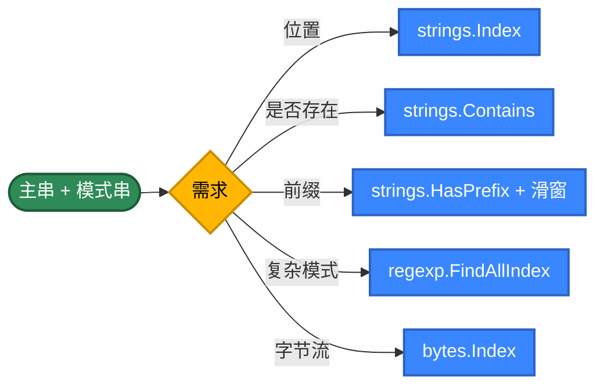
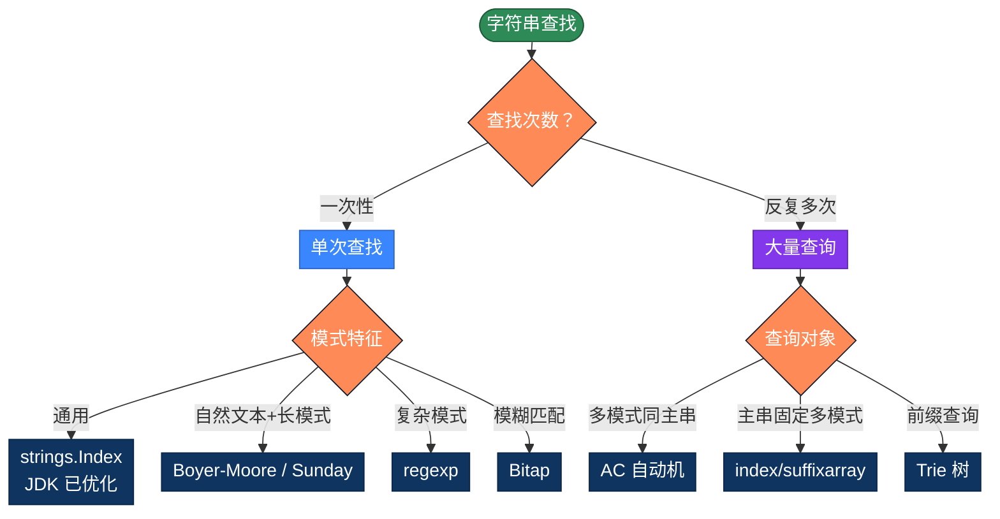

# Go 字符串查找的 20 种实现方式，用不同思路解决问题

字符串查找（在主串中找模式串第一次或全部出现的位置）是最常见的算法。看似只要一行 `strings.Index`，但背后有几十年的算法演进——同一个任务，朴素算法 O(m×n)，KMP 是 O(m+n)，Boyer-Moore 在自然文本上接近 O(n/m)，Bitap 把位并行做到极致。本文整理 Go 字符串查找的 20 种写法，按 5 个策略分类。

## 为什么有这么多算法？

最简单的写法，把模式串与主串的每个位置对齐，逐字节比较：

```go
func find(text, pattern string) int {
    n, m := len(text), len(pattern)
    for i := 0; i <= n-m; i++ {
        j := 0
        for j < m && text[i+j] == pattern[j] {
            j++
        }
        if j == m {
            return i
        }
    }
    return -1
}
```

问题在于"匹配失败时把所有已匹配的信息都丢了"——回到 i+1 重头比，复杂度退化成 O(m×n)。

**优化思路**：让"匹配失败"也带来信息

- **预处理模式串**：KMP 算 next 数组、BM 算坏字符表、Sunday 算下一字符位置
- **滑动得更远**：BM/Sunday 一次跳很多位，对长模式串极快
- **哈希指纹**：Rabin-Karp 用滚动哈希把"逐字符比较"压成 O(1)
- **位并行**：Bitap 用 uint64 表示"模式的所有前缀是否匹配"，一次 CPU 指令推进多位
- **多模式合并**：AC 自动机把 N 个模式串合成一个 Trie，扫一遍主串找出所有
- **数据结构**：Trie 用于前缀查询、后缀数组用于多次查询同一文本

**Go 的特殊点**：
- string 是只读的 `[]byte`，按字节 O(1) 索引；但 UTF-8 解码需要 `for ... range` 取 `rune`
- 标准库 `strings` 是工业级实现（含 Rabin-Karp 大模式优化）
- `bytes` 包对 `[]byte` 提供同样 API，处理二进制流不必经 string 转换

## 推荐方案

| 需求 | 代码 | 性能 |
|------|------|------|
| 单次查找 | `strings.Index(text, pat)` | 标准库实测最快 |
| 判断是否存在 | `strings.Contains(text, pat)` | 内部就是 Index ≥ 0 |
| 复杂模式 | `regexp.MustCompile(...).FindIndex` | 内部是 RE2，O(n) |
| 字节流 | `bytes.Index(buf, pat)` | 避免 string 拷贝 |
| 多模式同时查 | AC 自动机 | O(n + 输出) |
| 模糊匹配 | Bitap | O(n × k) |

---

## 第1类：标准库 API（方法1-5）

策略原理：Go 的 `strings` 包对短模式用朴素 + 字节扫描优化，长模式用 Rabin-Karp。`regexp` 用 RE2 引擎，保证线性时间，无 ReDoS 风险。生产代码默认应该先用这些。



```go
// 方法1：strings.Index —— 标准库最常用
// 短模式走朴素，长模式自动切到 Rabin-Karp（见 Go 源码 strings/search.go）
func find1(text, pattern string) int {
    return strings.Index(text, pattern)
}

// 方法2：strings.Contains —— 只关心"是否存在"
// 等价于 Index(...) >= 0，语义更明确
func find2(text, pattern string) bool {
    return strings.Contains(text, pattern)
}

// 方法3：HasPrefix 滑动窗口
// 不构造子串、零分配
func find3(text, pattern string) int {
    n, m := len(text), len(pattern)
    if m == 0 {
        return 0
    }
    for i := 0; i <= n-m; i++ {
        if strings.HasPrefix(text[i:], pattern) {
            return i
        }
    }
    return -1
}

// 方法4：regexp 正则——支持复杂模式、大小写不敏感
// regexp.QuoteMeta 把字符串里的元字符转义，防止把用户输入当正则解析
func find4(text, pattern string) []int {
    re := regexp.MustCompile(regexp.QuoteMeta(pattern))
    locs := re.FindAllStringIndex(text, -1)
    result := make([]int, 0, len(locs))
    for _, loc := range locs {
        result = append(result, loc[0])
    }
    return result
}

// 方法5：bytes.Index —— []byte 流上的查找
// 处理网络包、文件读取缓冲区时，比 string(buf) 转换零拷贝
func find5(buf, pattern []byte) int {
    return bytes.Index(buf, pattern)
}
```

> **小心两个坑**：① Go 的 `string` 索引是字节而非 rune，对中文/emoji 直接 `text[i]` 拿到的是 UTF-8 的某个字节，不是字符；② 不可信用户输入做正则前必须 `regexp.QuoteMeta` 转义，否则一个 `.*` 就会引发性能问题（虽然 RE2 没有 ReDoS，但仍可能慢）。

---

## 第2类：朴素与暴力（方法6-9）

策略原理：不依赖任何预处理，纯靠下标扫描。每个位置都重新比较 O(m) 次，最坏复杂度 O(m×n)。**这是所有高级算法的起点**——理解朴素算法的"浪费在哪里"，才能理解 KMP/BM 的优化点。

```go
// 方法6：双循环朴素——最经典的 Brute Force
// 已是 nativesearch/string_search.go 中的实现
func find6(text, pattern string) int {
    n, m := len(text), len(pattern)
    if m == 0 {
        return 0
    }
    for i := 0; i <= n-m; i++ {
        j := 0
        for j < m && text[i+j] == pattern[j] {
            j++
        }
        if j == m {
            return i
        }
    }
    return -1
}

// 方法7：[]byte 数组版——对 string 直接做字节索引就是这种效果
// Go 的 string 已经是只读 byte 数组，[]byte(text) 会触发拷贝
// 对 string 直接 text[i] 没有边界检查开销，与方法6性能一致
func find7(text, pattern string) int {
    n, m := len(text), len(pattern)
    if m == 0 {
        return 0
    }
    for i := 0; i <= n-m; i++ {
        match := true
        for j := 0; j < m; j++ {
            if text[i+j] != pattern[j] {
                match = false
                break
            }
        }
        if match {
            return i
        }
    }
    return -1
}

// 方法8：rune 版本——按 Unicode 字符比较
// 处理中文、emoji 时必须用 rune 而非 byte
// 注意：rune 切片会消耗 O(n) 额外空间
func find8(text, pattern string) int {
    tr, pr := []rune(text), []rune(pattern)
    n, m := len(tr), len(pr)
    if m == 0 {
        return 0
    }
    for i := 0; i <= n-m; i++ {
        j := 0
        for j < m && tr[i+j] == pr[j] {
            j++
        }
        if j == m {
            // 注意：返回的是 rune 下标，要算字节位置需要遍历前缀
            return i
        }
    }
    return -1
}

// 方法9：反向朴素——从右往左对齐
// BM 算法的雏形：从模式串最右开始比，失败时直接跳到下一对齐
func find9(text, pattern string) int {
    n, m := len(text), len(pattern)
    if m == 0 {
        return 0
    }
    for i := n - m; i >= 0; i-- {
        j := m - 1
        for j >= 0 && text[i+j] == pattern[j] {
            j--
        }
        if j < 0 {
            return i
        }
    }
    return -1
}
```

> **朴素算法的最坏案例**：`text = "AAAAA...AAB"`、`pattern = "AAAB"`——前 m-1 个字符总是匹配，最后一个总是失败。每对齐一次浪费 O(m)，总浪费 O(m×n)。

---

## 第3类：经典高效算法（方法10-14）

策略原理：通过对**模式串**的预处理，让"失败时"不再从头开始。代价是 O(m) 或 O(σ) 的预处理空间。这五种是字符串匹配的"教科书算法"。

```go
// 方法10：KMP 算法——利用已匹配信息避免回溯
// 完整实现见 KMPsearch/kmp_search.go
// 核心：next[i] = pattern[0..i] 的最长真前缀也是真后缀的长度
func find10(text, pattern string) int {
    n, m := len(text), len(pattern)
    if m == 0 {
        return 0
    }
    // 构建 next 数组
    next := make([]int, m)
    k := 0
    for i := 1; i < m; i++ {
        for k > 0 && pattern[i] != pattern[k] {
            k = next[k-1]
        }
        if pattern[i] == pattern[k] {
            k++
        }
        next[i] = k
    }
    // 主串扫描，j 永不回退
    j := 0
    for i := 0; i < n; i++ {
        for j > 0 && text[i] != pattern[j] {
            j = next[j-1]
        }
        if text[i] == pattern[j] {
            j++
        }
        if j == m {
            return i - m + 1
        }
    }
    return -1
}

// 方法11：Boyer-Moore（坏字符规则）
// 从模式串右端开始比，失配按"该字符在模式中最右出现位置"跳跃
// 在自然文本中常常能跳过 m 位（接近线性时间）
func find11(text, pattern string) int {
    n, m := len(text), len(pattern)
    if m == 0 {
        return 0
    }
    // 坏字符表：256 字节字符集
    var badChar [256]int
    for i := range badChar {
        badChar[i] = -1
    }
    for i := 0; i < m; i++ {
        badChar[pattern[i]] = i
    }
    shift := 0
    for shift <= n-m {
        j := m - 1
        for j >= 0 && pattern[j] == text[shift+j] {
            j--
        }
        if j < 0 {
            return shift
        }
        // max(1, ...) 防止跳到负数
        delta := j - badChar[text[shift+j]]
        if delta < 1 {
            delta = 1
        }
        shift += delta
    }
    return -1
}

// 方法12：Sunday 算法——BM 的简化变种
// 关键：失配时看"窗口右侧外那一格"，它将来必然要参与对齐
// 在英文文本上常常比 BM 还快
func find12(text, pattern string) int {
    n, m := len(text), len(pattern)
    if m == 0 {
        return 0
    }
    // shift[c] = 字符 c 在模式串中最右出现位置，让其与新窗口对齐
    var shift [256]int
    for i := range shift {
        shift[i] = m + 1
    }
    for i := 0; i < m; i++ {
        shift[pattern[i]] = m - i
    }
    i := 0
    for i <= n-m {
        j := 0
        for j < m && text[i+j] == pattern[j] {
            j++
        }
        if j == m {
            return i
        }
        if i+m >= n {
            return -1
        }
        i += shift[text[i+m]]
    }
    return -1
}

// 方法13：Horspool 算法——BM 的另一种简化
// 失配时只看"主串对齐到模式串末尾的字符"，不计算 j-badChar[c]
// 代码更短，性能在多数场景接近 BM
func find13(text, pattern string) int {
    n, m := len(text), len(pattern)
    if m == 0 {
        return 0
    }
    var shift [256]int
    for i := range shift {
        shift[i] = m
    }
    for i := 0; i < m-1; i++ {
        shift[pattern[i]] = m - 1 - i
    }
    i := 0
    for i <= n-m {
        j := m - 1
        for j >= 0 && pattern[j] == text[i+j] {
            j--
        }
        if j < 0 {
            return i
        }
        i += shift[text[i+m-1]]
    }
    return -1
}

// 方法14：Rabin-Karp（滚动哈希）
// 完整实现见 pattern-matching/ 中类比版本
// 核心：先比较窗口的哈希，相等再确认（解决冲突）
// 多模式同时查找时极其有用——所有模式串预算哈希存 map，扫一遍主串
func find14(text, pattern string) int {
    n, m := len(text), len(pattern)
    if m == 0 {
        return 0
    }
    if m > n {
        return -1
    }
    const (
        D = 256
        Q = 1000000007 // 大素数防冲突
    )
    h := uint64(1)
    for i := 0; i < m-1; i++ {
        h = (h * D) % Q
    }
    var p, t uint64
    for i := 0; i < m; i++ {
        p = (D*p + uint64(pattern[i])) % Q
        t = (D*t + uint64(text[i])) % Q
    }
    for i := 0; i <= n-m; i++ {
        if p == t {
            j := 0
            for j < m && text[i+j] == pattern[j] {
                j++
            }
            if j == m {
                return i
            }
        }
        if i < n-m {
            // Go 中 uint 减法是模运算，不会成负，但 (t - text[i]*h) 可能溢出
            // 用 +Q 保正再取模
            t = (D*((t+Q-uint64(text[i])*h%Q)%Q) + uint64(text[i+m])) % Q
        }
    }
    return -1
}
```

---

## 第4类：数据结构辅助（方法15-17）

策略原理：当"一次查找"变成"反复多次"时，把成本前置——预处理一次，之后查询接近 O(m) 或 O(log n)。

```go
// 方法15：Trie 前缀树——多个模式串的前缀查询
// 适合自动补全、敏感词字典查询等场景
type Trie struct {
    children [26]*Trie // 仅小写英文，工程里用 map[byte]*Trie
    isEnd    bool
}

func (t *Trie) Insert(word string) {
    cur := t
    for i := 0; i < len(word); i++ {
        idx := word[i] - 'a'
        if cur.children[idx] == nil {
            cur.children[idx] = &Trie{}
        }
        cur = cur.children[idx]
    }
    cur.isEnd = true
}

func (t *Trie) Contains(word string) bool {
    n := t.walk(word)
    return n != nil && n.isEnd
}

func (t *Trie) StartsWith(prefix string) bool {
    return t.walk(prefix) != nil
}

func (t *Trie) walk(s string) *Trie {
    cur := t
    for i := 0; i < len(s); i++ {
        cur = cur.children[s[i]-'a']
        if cur == nil {
            return nil
        }
    }
    return cur
}

// 方法16：AC 自动机——Trie + 失败指针
// 一次扫描主串，找出所有模式串的所有出现
// 是敏感词过滤、入侵检测的标准算法
type ACNode struct {
    children map[byte]*ACNode
    fail     *ACNode
    hits     []string // 该节点结尾的模式串
}

type AhoCorasick struct {
    root *ACNode
}

func NewAhoCorasick() *AhoCorasick {
    return &AhoCorasick{root: &ACNode{children: map[byte]*ACNode{}}}
}

func (ac *AhoCorasick) Add(p string) {
    cur := ac.root
    for i := 0; i < len(p); i++ {
        c := p[i]
        if cur.children[c] == nil {
            cur.children[c] = &ACNode{children: map[byte]*ACNode{}}
        }
        cur = cur.children[c]
    }
    cur.hits = append(cur.hits, p)
}

func (ac *AhoCorasick) Build() {
    queue := []*ACNode{}
    for _, child := range ac.root.children {
        child.fail = ac.root
        queue = append(queue, child)
    }
    for len(queue) > 0 {
        u := queue[0]
        queue = queue[1:]
        for c, v := range u.children {
            // v 的失败指针：从 u.fail 沿 c 走
            f := u.fail
            for f != nil && f.children[c] == nil {
                f = f.fail
            }
            if f == nil {
                v.fail = ac.root
            } else {
                v.fail = f.children[c]
            }
            // 累加失败链上的命中
            v.hits = append(v.hits, v.fail.hits...)
            queue = append(queue, v)
        }
    }
}

func (ac *AhoCorasick) Search(text string) [][2]int {
    var result [][2]int
    cur := ac.root
    for i := 0; i < len(text); i++ {
        c := text[i]
        for cur != ac.root && cur.children[c] == nil {
            cur = cur.fail
        }
        if next := cur.children[c]; next != nil {
            cur = next
        }
        for _, hit := range cur.hits {
            result = append(result, [2]int{i - len(hit) + 1, len(hit)})
        }
    }
    return result
}

// 方法17：后缀数组 + 二分查找
// 适合"主串固定、反复查不同模式"的场景
// 朴素构建 O(n² log n)，sort 接口带来便利
type SuffixArray struct {
    text string
    sa   []int
}

func NewSuffixArray(text string) *SuffixArray {
    n := len(text)
    sa := make([]int, n)
    for i := range sa {
        sa[i] = i
    }
    // 朴素 O(n² log n)；工程上用 SA-IS 实现 O(n)
    sort.Slice(sa, func(i, j int) bool {
        return text[sa[i]:] < text[sa[j]:]
    })
    return &SuffixArray{text: text, sa: sa}
}

func (s *SuffixArray) Search(pattern string) int {
    lo, hi := 0, len(s.sa)-1
    for lo <= hi {
        mid := (lo + hi) / 2
        suf := s.text[s.sa[mid]:]
        if strings.HasPrefix(suf, pattern) {
            return s.sa[mid]
        }
        if suf < pattern {
            lo = mid + 1
        } else {
            hi = mid - 1
        }
    }
    return -1
}
```

> Go 标准库 `index/suffixarray` 已提供 `SuffixArray`，O(n log n) 构建，`Lookup(pat, n)` 直接给出全部匹配位置。生产代码用它就够了。

---

## 第5类：高级技巧（方法18-20）

```go
// 方法18：strings.Reader + 流式查找
// 不能一次读进内存的大文件可以这么处理
func find18(reader *strings.Reader, pattern string) []int {
    // 简化：先全部读出来。真实场景用 bufio.Reader 分块 + 上下文保留
    data, _ := io.ReadAll(reader)
    var result []int
    text := string(data)
    for i := 0; ; {
        pos := strings.Index(text[i:], pattern)
        if pos < 0 {
            break
        }
        result = append(result, i+pos)
        i += pos + 1
    }
    return result
}

// 方法19：Z 算法——线性时间扩展前缀
// Z[i] = 以 i 开头的后缀与原串的最长公共前缀长度
// 拼接 "pattern + 分隔符 + text" 跑一遍 Z，所有 Z[i]==m 的位置就是匹配
func find19(text, pattern string) int {
    m := len(pattern)
    if m == 0 {
        return 0
    }
    s := pattern + "#" + text
    z := computeZ(s)
    for i := m + 1; i < len(s); i++ {
        if z[i] == m {
            return i - m - 1
        }
    }
    return -1
}

func computeZ(s string) []int {
    n := len(s)
    z := make([]int, n)
    l, r := 0, 0
    for i := 1; i < n; i++ {
        if i < r {
            if z[i-l] < r-i {
                z[i] = z[i-l]
            } else {
                z[i] = r - i
            }
        }
        for i+z[i] < n && s[z[i]] == s[i+z[i]] {
            z[i]++
        }
        if i+z[i] > r {
            l, r = i, i+z[i]
        }
    }
    return z
}

// 方法20：Bitap (Shift-And) ——位并行匹配
// 用 uint64 的每一位表示"模式串前缀 i 是否匹配到当前位置"
// 一次位运算推进所有前缀，CPU 上极快
// 限制：模式串长度 ≤ 64
// 真正威力：模糊匹配——k 个 uint64 数组同时跟踪 k 个错误内的所有匹配
func find20(text, pattern string) int {
    m := len(pattern)
    if m == 0 {
        return 0
    }
    if m > 63 {
        panic("Bitap 单 uint64 版只支持 m <= 63")
    }
    var mask [256]uint64
    for i := 0; i < m; i++ {
        mask[pattern[i]] |= 1 << i
    }
    var state uint64
    matchBit := uint64(1) << (m - 1)
    for i := 0; i < len(text); i++ {
        // 推进所有前缀进度，然后与当前字符的 mask 相与
        state = ((state << 1) | 1) & mask[text[i]]
        if state&matchBit != 0 {
            return i - m + 1
        }
    }
    return -1
}
```

---

## 选择指南



| 类别 | 时间复杂度 | 空间 | 主要场景 |
|------|----------|--------|---------|
| 标准库 API | O(m+n) 实测 | O(1) | 日常 95% 场景 |
| 朴素与暴力 | O(m×n) | O(1) | 教学、面试、极短模式 |
| 经典算法 | O(m+n) ~ O(n/m) | O(m+σ) | 单次查找的标准方案 |
| 数据结构 | 预处理 O(n)，查询 O(m) | O(总规模) | 海量查询 |
| 高级技巧 | O(n) | O(m) ~ O(σ) | 模糊匹配 / 流式 |

---

## 实际项目里怎么选

绝大多数情况一行就够：

```go
// 单次查找：标准库已经够好
pos := strings.Index(text, pattern)

// 找全部位置
re := regexp.MustCompile(regexp.QuoteMeta(pattern))
locs := re.FindAllStringIndex(text, -1) // [[start1,end1], [start2,end2], ...]
```

模式串很长（≥ 20）且文本是自然语言：

```go
// 标准库已经在长模式上自动切到 Rabin-Karp
// 一般不需要自己实现 BM/Sunday
pos := strings.Index(text, longPattern)
```

需要在同一文本上反复查多个模式：

```go
// AC 自动机
ac := NewAhoCorasick()
for _, p := range patterns {
    ac.Add(p)
}
ac.Build()
hits := ac.Search(text)
```

需要在同一文本上做大量不相关查询：

```go
// 标准库后缀数组
import "index/suffixarray"
sa := suffixarray.New([]byte(largeText))
positions := sa.Lookup([]byte(pattern), -1) // 返回全部出现位置
```

需要前缀查询、自动补全：

```go
trie := &Trie{}
for _, w := range dictionary {
    trie.Insert(w)
}
exists := trie.Contains("apple")
prefix := trie.StartsWith("app")
```

---

## 多模式匹配的处理

不要循环调用 strings.Index：

```go
// ❌ 反例：N 个模式 × M 次扫描 = O(N × M × n)
for _, p := range patterns {
    if strings.Contains(text, p) {
        hit(p)
    }
}
```

正确做法（按规模选择）：

| 模式数 N | 推荐方案 |
|---|---|
| N ≤ 5，模式短 | 直接循环 strings.Index |
| N ≤ 100 | 多模式 Rabin-Karp + map[uint64]string |
| N 上千 | AC 自动机 |
| 海量动态增删 | AC 自动机 + 失败链懒更新 |

正则的 alternation：

```go
// 把多个模式拼成一个 RE2 正则
// RE2 内部会编译为 NFA/DFA，效率取决于实现
parts := make([]string, len(patterns))
for i, p := range patterns {
    parts[i] = regexp.QuoteMeta(p)
}
re := regexp.MustCompile(strings.Join(parts, "|"))
locs := re.FindAllStringIndex(text, -1)
```

---

## 大文本与流式查找

文本不能一次性读进内存（GB 级日志、网络流）时：

```go
// 关键：跨缓冲区边界的匹配会被切断，需要保留 m-1 字符的"上下文"
func streamSearch(r io.Reader, pattern string) []int {
    m := len(pattern)
    buf := make([]byte, 0, 8192+m)
    chunk := make([]byte, 8192)
    var result []int
    var totalOffset int

    for {
        n, err := r.Read(chunk)
        if n > 0 {
            buf = append(buf, chunk[:n]...)
            // 在 buf 里找匹配
            offset := 0
            for {
                idx := bytes.Index(buf[offset:], []byte(pattern))
                if idx < 0 {
                    break
                }
                result = append(result, totalOffset+offset+idx)
                offset += idx + 1
            }
            // 保留末尾 m-1 字节，避免跨缓冲区漏匹配
            if len(buf) > m-1 {
                drop := len(buf) - (m - 1)
                totalOffset += drop
                buf = buf[drop:]
            }
        }
        if err != nil {
            break
        }
    }
    return result
}
```

工程里更常见的方式是用 `bufio.Scanner` 逐行扫，或者直接 mmap 大文件。

---

## 字节、rune 与 Unicode

Go 的 string 是只读 byte 序列，按字节索引：

```go
text := "你好world"
fmt.Println(len(text))   // 11（"你"、"好"各 3 字节，"world" 5 字节）
fmt.Println(text[0])     // 228（第一个字节，不是字符 '你'）
```

按字符（rune）处理：

```go
// 方式1：转 []rune
runes := []rune(text)
fmt.Println(len(runes))  // 7

// 方式2：for ... range
for i, r := range text {
    fmt.Printf("byte %d: %c\n", i, r)
}

// 方式3：utf8 包
import "unicode/utf8"
fmt.Println(utf8.RuneCountInString(text)) // 7
```

大小写不敏感查找：

```go
// 简单粗暴：全部转小写
strings.Contains(strings.ToLower(text), strings.ToLower(pattern))

// 严格 Unicode 折叠（处理土耳其 i/I、德语 ß 等）
strings.EqualFold(s1, s2) // 仅适用于"全等"判断

// 正则
re := regexp.MustCompile("(?i)" + regexp.QuoteMeta(pattern))
```

---

## 自定义对象：在切片中查找子序列

`strings.Index` 只查 string 子串。在 `[]T` 中查 `[]T` 模式，思路完全一样：

```go
// 在 []T 中查找 []T 模式（T 必须可比较）
func IndexSeq[T comparable](haystack, needle []T) int {
    n, m := len(haystack), len(needle)
    if m == 0 {
        return 0
    }
    for i := 0; i <= n-m; i++ {
        j := 0
        for j < m && haystack[i+j] == needle[j] {
            j++
        }
        if j == m {
            return i
        }
    }
    return -1
}
```

KMP/BM 等算法都可以泛化为 `[T comparable]`。如果元素是不可比较的（含 slice、map 字段的 struct），需要自己提取一个可比较"键"再查。

---

## 总结

工程上的快捷选择：

- 默认用 `strings.Index(text, pattern)`：标准库已经优化得很好
- 找全部位置用 `regexp.MustCompile(QuoteMeta(p)).FindAllStringIndex`
- 字节流上用 `bytes.Index`，零拷贝
- 多个模式同时查，AC 自动机
- 同一主串反复查不同模式，标准库 `index/suffixarray`
- 前缀查询、自动补全，Trie
- 模糊匹配，Bitap 或 levenshtein
- Unicode 处理用 `unicode/utf8` 包，不要直接对 string 做字节索引

核心思路：

1. 同一个问题可以从多个角度切入——朴素到 KMP 是"利用失败信息"，KMP 到 BM 是"换方向比较"，BM 到 Bitap 是"换数据表示"
2. 选对算法往往比写更聪明的代码更重要——AC 自动机一次扫描胜过 N 次 strings.Index
3. O(m×n) 与 O(m+n) 在数据变大时是几百倍的实际差距，但**常数也很重要**——KMP 不一定比 strings.Index 快
4. 不要过度优化——能用 strings.Index 就别绕弯
5. Go 的标准库已经覆盖了 80% 的场景，理解算法是为了选对工具，不是替代标准库

20 种实现的本质是 **4 个升维**：
- 把"匹配失败"变成信息（朴素 → KMP）
- 把"逐字符比较"变成"批量跳跃"（KMP → BM/Sunday）
- 把"字符比较"变成"哈希/位运算"（BM → Rabin-Karp/Bitap）
- 把"一次查询"变成"多次查询"（→ Trie/AC/SuffixArray）

理解这 4 个升维方向，写出第 21、第 22 种都不在话下。

## 更多算法

- KMP 完整实现：[`KMPsearch/kmp_search.go`](./KMPsearch/kmp_search.go)
- 朴素查找：[`nativesearch/string_search.go`](./nativesearch/string_search.go)
- 编辑距离：[`edit-distance/`](./edit-distance/)
- 最长公共子序列：[`LCS/`](./LCS/)

不同语言算法实现：[https://github.com/microwind/algorithms](https://github.com/microwind/algorithms)

AI编程知识库：[https://microwind.github.io](https://microwind.github.io)
