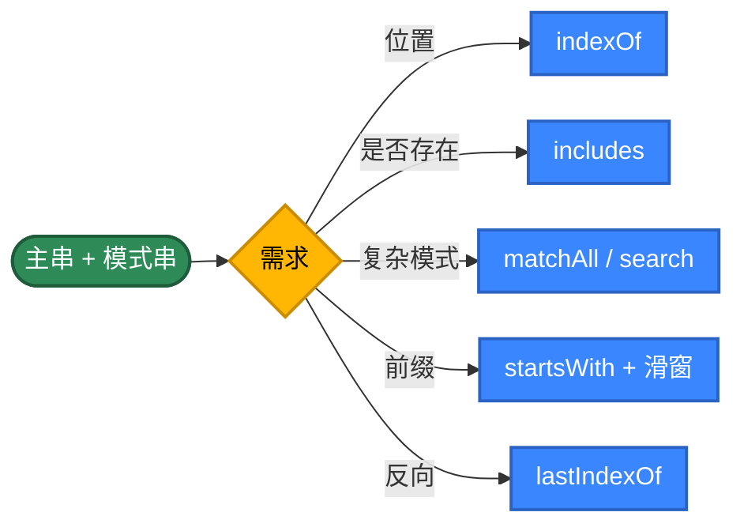
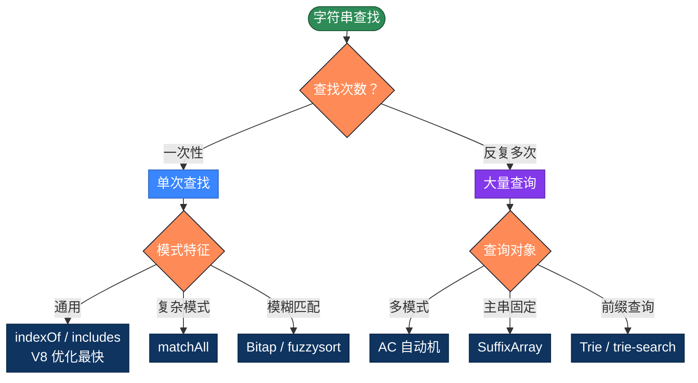

# JavaScript 字符串查找的 20 种实现方式，用不同思路解决问题

字符串查找是最常见的算法。看似只要一行 `text.indexOf(pattern)`，但背后有几十年的算法演进——同一个任务，朴素算法 O(m×n)，KMP 是 O(m+n)，Boyer-Moore 在自然文本上接近 O(n/m)，Bitap 把位并行做到极致。本文整理 JavaScript 字符串查找的 20 种写法，按 5 个策略分类。

## 为什么有这么多算法？

最简单的写法，把模式串与主串的每个位置对齐，逐字符比较：

```javascript
function find(text, pattern) {
  const n = text.length, m = pattern.length
  for (let i = 0; i <= n - m; i++) {
    let j = 0
    while (j < m && text[i + j] === pattern[j]) j++
    if (j === m) return i
  }
  return -1
}
```

问题在于"匹配失败时把所有已匹配的信息都丢了"——回到 i+1 重头比，复杂度退化成 O(m×n)。

**优化思路**：让"匹配失败"也带来信息

- **预处理模式串**：KMP 算 next 数组、BM 算坏字符表、Sunday 算下一字符位置
- **滑动得更远**：BM/Sunday 一次跳很多位
- **哈希指纹**：Rabin-Karp 用滚动哈希把"逐字符比较"压成 O(1)
- **位并行**：Bitap 用 BigInt/Number 表示"模式的所有前缀是否匹配"
- **多模式合并**：AC 自动机把 N 个模式串合成一个 Trie
- **数据结构**：Trie 用于前缀查询、后缀数组用于多次查询同一文本

**JavaScript 的特殊点**：
- V8 的 `String.prototype.indexOf` 是 C++ 实现，单次查询纯 JS 写不过它
- ES2020 引入 `String.prototype.matchAll`，返回正则迭代器
- string 是 UTF-16 编码，`text[i]` 取的是 16 位代码单元（emoji 占 2 个）
- 正则引擎是回溯式的（V8 的 Irregexp），有 ReDoS 风险

## 推荐方案

| 需求 | 代码 | 性能 |
|------|------|------|
| 单次查找 | `text.indexOf(pattern)` | V8 优化，最快 |
| 是否包含 | `text.includes(pattern)` | ES2015，等价于 indexOf ≥ 0 |
| 全部位置 | `[...text.matchAll(re)]` | ES2020，迭代器 |
| 多模式同时查 | AC 自动机 | O(n + 输出) |
| 模糊匹配 | Bitap / fast-fuzzy | O(n × k) |

---

## 第1类：标准库 API（方法1-5）

策略原理：V8 的 `indexOf` 用 Boyer-Moore-Horspool 变体（短模式直接朴素，长模式跳跃式）。`RegExp` 用 Irregexp 引擎。生产代码默认应该先用这些。



```javascript
// 方法1：String.prototype.indexOf —— 标准库最常用
// V8 内部用 BMH 变体；模式 ≤ 7 走朴素，更长走跳跃式
function find1(text, pattern) {
  return text.indexOf(pattern)
}

// 方法2：String.prototype.includes —— ES2015 引入
// 只关心"是否存在"时语义更清晰
function find2(text, pattern) {
  return text.includes(pattern)
}

// 方法3：String.prototype.startsWith 滑动窗口
// startsWith 接受第二个参数：起始下标（避免 substring 分配）
function find3(text, pattern) {
  const n = text.length, m = pattern.length
  if (m === 0) return 0
  for (let i = 0; i <= n - m; i++) {
    if (text.startsWith(pattern, i)) return i
  }
  return -1
}

// 方法4：String.prototype.matchAll —— ES2020 找全部位置
// 返回迭代器，可 spread 或 for...of
// 注意：必须传 g 标志的正则
function escapeRegExp(s) {
  return s.replace(/[.*+?^${}()|[\]\\]/g, '\\$&')
}

function find4(text, pattern) {
  const re = new RegExp(escapeRegExp(pattern), 'g')
  return [...text.matchAll(re)].map(m => m.index)
}

// 方法5：lastIndexOf —— 反向查找
// 返回最后一次出现位置；nativesearch 部分场景反向更快
function find5(text, pattern) {
  return text.lastIndexOf(pattern)
}
```

> **小心三个坑**：① `text[i]` 取的是 UTF-16 代码单元，emoji 等"代理对"占两位，要用 `text.codePointAt(i)` 才能拿到真正的 codepoint；② `String.prototype.match(regex)` 不带 g 时返回带捕获组的 `match[0]`，行为与带 g 时完全不同；③ V8 的正则有 ReDoS 风险，用户输入务必 `escapeRegExp`。

---

## 第2类：朴素与暴力（方法6-9）

策略原理：不依赖任何预处理，纯靠下标扫描。最坏 O(m×n)。**理解朴素的浪费在哪，才能理解 KMP/BM 的优化**。

```javascript
// 方法6：双循环朴素 —— 最经典的 Brute Force
function find6(text, pattern) {
  const n = text.length, m = pattern.length
  if (m === 0) return 0
  for (let i = 0; i <= n - m; i++) {
    let j = 0
    while (j < m && text[i + j] === pattern[j]) j++
    if (j === m) return i
  }
  return -1
}

// 方法7：charCodeAt 整数比较
// charCodeAt 比 [] 索引快 10~20%（避免每次返回新字符串）
function find7(text, pattern) {
  const n = text.length, m = pattern.length
  if (m === 0) return 0
  for (let i = 0; i <= n - m; i++) {
    let j = 0
    while (j < m && text.charCodeAt(i + j) === pattern.charCodeAt(j)) j++
    if (j === m) return i
  }
  return -1
}

// 方法8：标志位写法 —— 便于在循环里加额外逻辑
function find8(text, pattern) {
  const n = text.length, m = pattern.length
  if (m === 0) return 0
  for (let i = 0; i <= n - m; i++) {
    let matched = true
    for (let j = 0; j < m; j++) {
      if (text[i + j] !== pattern[j]) {
        matched = false
        break
      }
    }
    if (matched) return i
  }
  return -1
}

// 方法9：反向朴素 —— 从右往左对齐
// 文本末尾的模式查找时反向更高效
function find9(text, pattern) {
  const n = text.length, m = pattern.length
  if (m === 0) return 0
  for (let i = n - m; i >= 0; i--) {
    let j = m - 1
    while (j >= 0 && text[i + j] === pattern[j]) j--
    if (j < 0) return i
  }
  return -1
}
```

> **朴素算法的最坏案例**：`text = "AAAAA...AAB"`、`pattern = "AAAB"`——前 m-1 字符总匹配，最后总失败。每对齐浪费 O(m)，总共 O(m×n)。

---

## 第3类：经典高效算法（方法10-14）

```javascript
// 方法10：KMP 算法 —— 利用已匹配信息避免回溯
// 完整实现见 KMPsearch/kmp_search.js
function find10(text, pattern) {
  const n = text.length, m = pattern.length
  if (m === 0) return 0
  // 构建 next 数组
  const next = new Int32Array(m)
  let k = 0
  for (let i = 1; i < m; i++) {
    while (k > 0 && pattern[i] !== pattern[k]) k = next[k - 1]
    if (pattern[i] === pattern[k]) k++
    next[i] = k
  }
  let j = 0
  for (let i = 0; i < n; i++) {
    while (j > 0 && text[i] !== pattern[j]) j = next[j - 1]
    if (text[i] === pattern[j]) j++
    if (j === m) return i - m + 1
  }
  return -1
}

// 方法11：Boyer-Moore（坏字符规则）
// 完整实现见 pattern-matching/boyer_moore.js
function find11(text, pattern) {
  const n = text.length, m = pattern.length
  if (m === 0) return 0
  // 坏字符表：用 Map 支持 Unicode（256 数组只够 ASCII）
  const bad = new Map()
  for (let i = 0; i < m; i++) bad.set(pattern[i], i)
  let shift = 0
  while (shift <= n - m) {
    let j = m - 1
    while (j >= 0 && pattern[j] === text[shift + j]) j--
    if (j < 0) return shift
    shift += Math.max(1, j - (bad.get(text[shift + j]) ?? -1))
  }
  return -1
}

// 方法12：Sunday 算法 —— BM 的简化变种
// 失配时看"窗口右侧外那一格"
function find12(text, pattern) {
  const n = text.length, m = pattern.length
  if (m === 0) return 0
  const shift = new Map()
  for (let i = 0; i < m; i++) shift.set(pattern[i], m - i)
  let i = 0
  while (i <= n - m) {
    let j = 0
    while (j < m && text[i + j] === pattern[j]) j++
    if (j === m) return i
    if (i + m >= n) return -1
    i += shift.get(text[i + m]) ?? (m + 1)
  }
  return -1
}

// 方法13：Horspool 算法 —— BM 另一种简化
function find13(text, pattern) {
  const n = text.length, m = pattern.length
  if (m === 0) return 0
  const shift = new Map()
  for (let i = 0; i < m - 1; i++) shift.set(pattern[i], m - 1 - i)
  let i = 0
  while (i <= n - m) {
    let j = m - 1
    while (j >= 0 && pattern[j] === text[i + j]) j--
    if (j < 0) return i
    i += shift.get(text[i + m - 1]) ?? m
  }
  return -1
}

// 方法14：Rabin-Karp（滚动哈希）
// 完整实现见 pattern-matching/rabin_karp.js
function find14(text, pattern) {
  const n = text.length, m = pattern.length
  if (m === 0) return 0
  if (m > n) return -1
  const D = 256
  const Q = 1_000_000_007 // 大素数防冲突
  // h = D^(m-1) % Q（用 BigInt 避免溢出更稳，但慢）
  let h = 1
  for (let i = 0; i < m - 1; i++) h = (h * D) % Q
  let p = 0, t = 0
  for (let i = 0; i < m; i++) {
    p = (D * p + pattern.charCodeAt(i)) % Q
    t = (D * t + text.charCodeAt(i)) % Q
  }
  for (let i = 0; i <= n - m; i++) {
    if (p === t) {
      let j = 0
      while (j < m && text[i + j] === pattern[j]) j++
      if (j === m) return i
    }
    if (i < n - m) {
      t = (D * (t - text.charCodeAt(i) * h) + text.charCodeAt(i + m)) % Q
      if (t < 0) t += Q
    }
  }
  return -1
}
```

---

## 第4类：数据结构辅助（方法15-17）

```javascript
// 方法15：Trie 前缀树 —— 多个模式串的前缀查询
class Trie {
  constructor() {
    // 用 Map 而非 object，支持 Unicode + 避免原型链污染
    this.root = { children: new Map(), end: false }
  }

  insert(word) {
    let node = this.root
    for (const c of word) {
      if (!node.children.has(c)) {
        node.children.set(c, { children: new Map(), end: false })
      }
      node = node.children.get(c)
    }
    node.end = true
  }

  contains(word) {
    const node = this._walk(word)
    return node !== null && node.end
  }

  startsWith(prefix) {
    return this._walk(prefix) !== null
  }

  _walk(s) {
    let node = this.root
    for (const c of s) {
      if (!node.children.has(c)) return null
      node = node.children.get(c)
    }
    return node
  }
}

// 方法16：AC 自动机 —— Trie + 失败指针
// 一次扫描主串找出所有模式的所有出现
class AhoCorasick {
  constructor() {
    this.root = { children: new Map(), fail: null, hits: [] }
  }

  add(pattern) {
    let node = this.root
    for (const c of pattern) {
      if (!node.children.has(c)) {
        node.children.set(c, { children: new Map(), fail: null, hits: [] })
      }
      node = node.children.get(c)
    }
    node.hits.push(pattern)
  }

  build() {
    const queue = []
    for (const child of this.root.children.values()) {
      child.fail = this.root
      queue.push(child)
    }
    while (queue.length) {
      const u = queue.shift()
      for (const [c, v] of u.children) {
        // v 的失败指针：从 u.fail 沿 c 走
        let f = u.fail
        while (f && !f.children.has(c)) f = f.fail
        v.fail = f ? f.children.get(c) : this.root
        if (v.fail === v) v.fail = this.root
        // 累加失败链上的命中
        v.hits.push(...v.fail.hits)
        queue.push(v)
      }
    }
  }

  search(text) {
    const result = []
    let cur = this.root
    for (let i = 0; i < text.length; i++) {
      const c = text[i]
      while (cur !== this.root && !cur.children.has(c)) cur = cur.fail
      cur = cur.children.get(c) ?? this.root
      for (const hit of cur.hits) {
        result.push({ pos: i - hit.length + 1, pattern: hit })
      }
    }
    return result
  }
}

// 方法17：后缀数组 + 二分
class SuffixArray {
  constructor(text) {
    this.text = text
    const n = text.length
    // 朴素 O(n² log n)；工程用 SA-IS 实现 O(n)
    this.sa = Array.from({ length: n }, (_, i) => i)
      .sort((a, b) => text.slice(a) < text.slice(b) ? -1 : 1)
  }

  search(pattern) {
    let lo = 0, hi = this.sa.length - 1
    while (lo <= hi) {
      const mid = (lo + hi) >> 1
      const suf = this.text.slice(this.sa[mid])
      if (suf.startsWith(pattern)) return this.sa[mid]
      if (suf < pattern) lo = mid + 1
      else hi = mid - 1
    }
    return -1
  }
}
```

---

## 第5类：高级技巧（方法18-20）

```javascript
// 方法18：生成器版 —— 流式产出全部位置
// 适合超大文本：不一次性构造结果数组
function* find18(text, pattern) {
  if (!pattern) {
    yield 0
    return
  }
  let start = 0
  while (true) {
    const pos = text.indexOf(pattern, start)
    if (pos < 0) return
    yield pos
    start = pos + 1
  }
}
// 用法：for (const pos of find18(text, "abc")) ...
// 或：find18(text, pattern).next().value  // 找第一个

// 方法19：Z 算法 —— 线性时间扩展前缀
function find19(text, pattern) {
  const m = pattern.length
  if (m === 0) return 0
  const s = pattern + '\0' + text  // \0 作为哨兵
  const z = computeZ(s)
  for (let i = m + 1; i < s.length; i++) {
    if (z[i] === m) return i - m - 1
  }
  return -1
}

function computeZ(s) {
  const n = s.length
  const z = new Int32Array(n)
  let l = 0, r = 0
  for (let i = 1; i < n; i++) {
    if (i < r) z[i] = Math.min(r - i, z[i - l])
    while (i + z[i] < n && s[z[i]] === s[i + z[i]]) z[i]++
    if (i + z[i] > r) { l = i; r = i + z[i] }
  }
  return z
}

// 方法20：Bitap (Shift-And) ——位并行匹配
// 用 BigInt 表示位掩码，模式可任意长（但太长会慢）
// 真正威力：模糊匹配——k 个 BigInt 数组同时跟踪 k 个错误内的所有匹配
function find20(text, pattern) {
  const m = pattern.length
  if (m === 0) return 0
  // mask[c] 的第 i 位为 1 表示 pattern[i] === c
  const mask = new Map()
  for (let i = 0; i < m; i++) {
    const c = pattern[i]
    mask.set(c, (mask.get(c) ?? 0n) | (1n << BigInt(i)))
  }
  let state = 0n
  const matchBit = 1n << BigInt(m - 1)
  for (let i = 0; i < text.length; i++) {
    state = ((state << 1n) | 1n) & (mask.get(text[i]) ?? 0n)
    if ((state & matchBit) !== 0n) return i - m + 1
  }
  return -1
}
```

> **BigInt 性能提醒**：单字符 ≤ 31 时可以用普通 Number 代替 BigInt 提速 5~10 倍。生产用要根据 m 决定。

---

## 选择指南



| 类别 | 时间复杂度 | 空间 | 主要场景 |
|------|----------|--------|---------|
| 标准库 API | C++ 优化，接近 O(m+n) | O(1) | 日常 95% 场景 |
| 朴素与暴力 | O(m×n) | O(1) | 教学、面试 |
| 经典算法 | O(m+n) ~ O(n/m) | O(m+σ) | 算法练习 |
| 数据结构 | 预处理 O(n)，查询 O(m) | O(总规模) | 海量查询 |
| 高级技巧 | O(n) | O(m) ~ O(σ) | 模糊 / 流式 |

---

## 实际项目里怎么选

绝大多数情况一行就够：

```javascript
// 单次查找
const pos = text.indexOf(pattern)

// 是否存在
if (text.includes(pattern)) ...

// 找全部位置（ES2020+）
const positions = [...text.matchAll(new RegExp(escapeRegExp(pattern), 'g'))]
  .map(m => m.index)

// 计数（无原生 count，用正则）
const count = (text.match(new RegExp(escapeRegExp(pattern), 'g')) || []).length
```

需要在同一文本上反复查多个模式：

```javascript
// 推荐：自己实现 AC 或用 npm 库 ahocorasick
const AC = require('aho-corasick-node')
const ac = AC.builder()
patterns.forEach(p => ac.add(p))
const built = ac.build()
const hits = built.parseText(text)
```

模糊匹配：

```javascript
// fuzzysort（流行的轻量库）
const fuzzysort = require('fuzzysort')
fuzzysort.go('quick', candidates)
```

前缀查询、自动补全：

```javascript
// 自己实现 Trie 或用 npm 库
const Trie = require('trie-search')
const trie = new Trie()
dictionary.forEach(w => trie.add(w))
const matches = trie.search('pre')
```

---

## 多模式匹配的处理

不要循环调用 indexOf：

```javascript
// ❌ 反例：N 次扫描
patterns.forEach(p => {
  if (text.includes(p)) hit(p)
})
```

正确做法：

```javascript
// 模式数 ≤ 100：正则 alternation
const big = new RegExp(patterns.map(escapeRegExp).join('|'), 'g')
for (const m of text.matchAll(big)) {
  console.log(m.index, m[0])
}

// 模式数上千：AC 自动机
```

---

## 大文本与流式查找

文本不能一次性读进内存（GB 级日志、网络流）时：

```javascript
const fs = require('fs')
const readline = require('readline')

// 按行扫
async function lineSearch(filePath, pattern) {
  const stream = fs.createReadStream(filePath, { encoding: 'utf-8' })
  const rl = readline.createInterface({ input: stream, crlfDelay: Infinity })
  const result = []
  let lineNo = 0
  for await (const line of rl) {
    lineNo++
    let pos = line.indexOf(pattern)
    while (pos >= 0) {
      result.push({ line: lineNo, col: pos })
      pos = line.indexOf(pattern, pos + 1)
    }
  }
  return result
}
```

跨边界匹配的 Transform 流：

```javascript
const { Transform } = require('stream')

function patternStream(pattern) {
  let buffer = ''
  const m = pattern.length
  return new Transform({
    transform(chunk, encoding, cb) {
      buffer += chunk.toString()
      let pos = 0
      while ((pos = buffer.indexOf(pattern, pos)) >= 0) {
        this.push(`HIT@${pos}\n`)
        pos += 1
      }
      // 保留末尾 m-1 字符
      if (buffer.length > m - 1) buffer = buffer.slice(-(m - 1))
      cb()
    }
  })
}
```

---

## UTF-16 与 emoji

JS string 是 UTF-16 编码的代码单元序列。emoji 等"代理对"占两位：

```javascript
const s = '👋hi'
console.log(s.length)        // 4（👋 占 2 个代码单元）
console.log(s[0])            // '\uD83D'（高代理）
console.log(s.charCodeAt(0)) // 55357

// 正确做法
console.log([...s].length)   // 3（spread 按 codepoint 拆）
console.log(s.codePointAt(0)) // 128075
```

按 codepoint 查找：

```javascript
function findByCodepoint(text, pattern) {
  const t = [...text]   // 拆为 codepoint 数组
  const p = [...pattern]
  // 之后在 array 上做查找
  for (let i = 0; i <= t.length - p.length; i++) {
    if (p.every((c, j) => t[i + j] === c)) return i
  }
  return -1
}
```

大小写不敏感：

```javascript
text.toLowerCase().includes(pattern.toLowerCase())

// 严格 Unicode 折叠
text.toLocaleLowerCase('en').includes(pattern.toLocaleLowerCase('en'))

// 正则
new RegExp(escapeRegExp(pattern), 'iu').test(text)
// i = 大小写不敏感, u = Unicode 模式
```

---

## 自定义对象：在数组中查找子序列

`indexOf` 只查 string 子串。在数组中查子数组：

```javascript
function indexOfSeq(haystack, needle, eq = (a, b) => a === b) {
  const n = haystack.length, m = needle.length
  if (m === 0) return 0
  for (let i = 0; i <= n - m; i++) {
    let j = 0
    while (j < m && eq(haystack[i + j], needle[j])) j++
    if (j === m) return i
  }
  return -1
}

// 用法
indexOfSeq([1, 2, 3, 4], [2, 3])  // 1
indexOfSeq(users, [{id: 1}, {id: 2}], (a, b) => a.id === b.id)
```

---

## 总结

工程上的快捷选择：

- 默认用 `text.indexOf(pattern)` 或 `text.includes(pattern)`
- 找全部位置用 `[...text.matchAll(re)]`
- 多个模式同时查，AC 自动机或 alternation 正则
- 同一主串反复查不同模式，后缀数组
- 前缀查询、自动补全，Trie
- 模糊匹配，Bitap 或 fuzzysort
- emoji 处理用 spread `[...text]` 拆 codepoint，不要直接索引

核心思路：

1. 同一个问题可以从多个角度切入
2. 选对算法往往比写更聪明的代码更重要——AC 自动机一次扫描胜过 N 次 indexOf
3. O(m×n) 与 O(m+n) 在数据变大时是几百倍的实际差距，但**常数也很重要**
4. 不要过度优化——能用 indexOf 就别绕弯，V8 优化永远比纯 JS 快
5. JS 标准库已覆盖 80% 场景，理解算法是为了选对工具

20 种实现的本质是**4 个升维**：
- 把"匹配失败"变成信息（朴素 → KMP）
- 把"逐字符比较"变成"批量跳跃"（KMP → BM/Sunday）
- 把"字符比较"变成"哈希/位运算"（BM → Rabin-Karp/Bitap）
- 把"一次查询"变成"多次查询"（→ Trie/AC/SuffixArray）

理解这 4 个升维方向，写出第 21、第 22 种都不在话下。

## 更多算法

- KMP 完整实现：[`KMPsearch/kmp_search.js`](./KMPsearch/kmp_search.js)
- Boyer-Moore：[`pattern-matching/boyer_moore.js`](./pattern-matching/boyer_moore.js)
- Rabin-Karp：[`pattern-matching/rabin_karp.js`](./pattern-matching/rabin_karp.js)
- 朴素查找：[`nativesearch/string_search.js`](./nativesearch/string_search.js)
- 编辑距离：[`edit-distance/`](./edit-distance/)

不同语言算法实现：[https://github.com/microwind/algorithms](https://github.com/microwind/algorithms)

AI编程知识库：[https://microwind.github.io](https://microwind.github.io)
