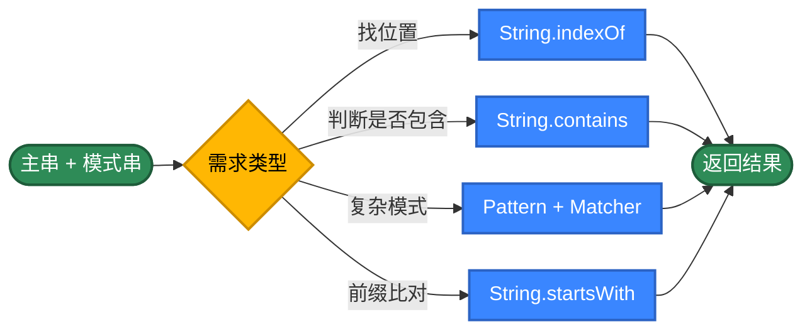
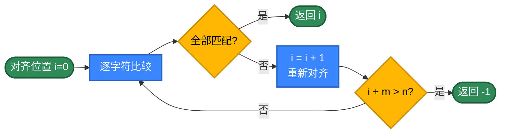
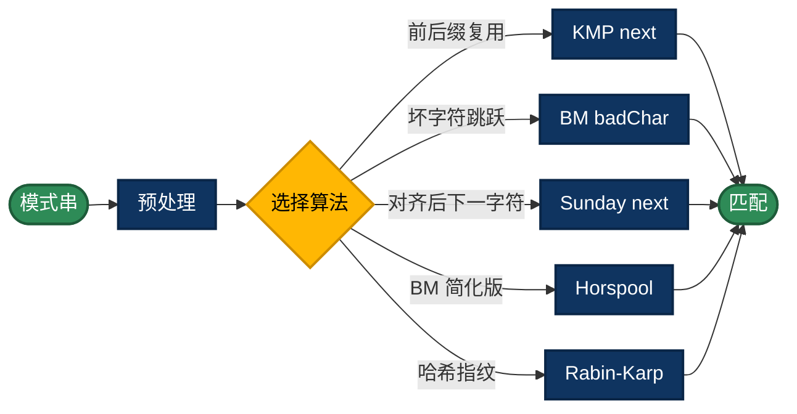
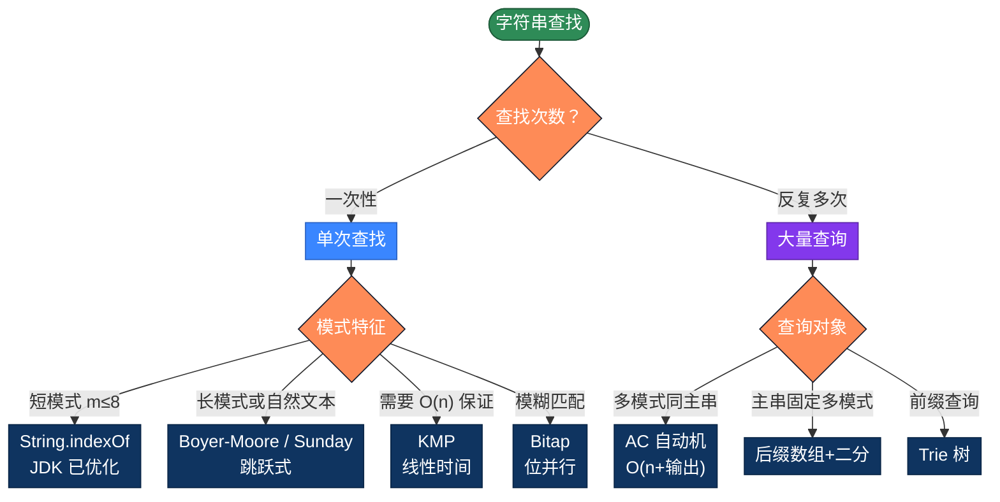

# Java 字符串查找的 20 种实现方式，用不同思路解决问题

字符串查找（在主串中找模式串第一次或全部出现的位置）是最常见的算法。看似只要一行 `indexOf`，但背后有几十年的算法演进——同一个任务，朴素算法 O(m×n)，KMP 是 O(m+n)，Boyer-Moore 在自然文本上接近 O(n/m)，Bitap 把位并行做到极致。本文整理 Java 字符串查找的 20 种写法，按 5 个策略分类，帮你理解每类的核心思路。

## 为什么有这么多算法？

最简单的写法，把模式串与主串的每个位置对齐，逐字符比较。

```java
static int find(String text, String pattern) {
    int n = text.length(), m = pattern.length();
    for (int i = 0; i <= n - m; i++) {
        int j = 0;
        while (j < m && text.charAt(i + j) == pattern.charAt(j)) j++;
        if (j == m) return i;
    }
    return -1;
}
```

问题在于"匹配失败时把所有已匹配的信息都丢了"——回到 i+1 重头比，复杂度退化成 O(m×n)。

**优化思路**：让"匹配失败"也带来信息

- **预处理模式串**：KMP 算 next 数组、BM 算坏字符表、Sunday 算下一字符位置
- **滑动得更远**：BM/Sunday 一次跳很多位，对长模式串极快
- **哈希指纹**：Rabin-Karp 用滚动哈希把"逐字符比较"压成 O(1)
- **位并行**：Bitap 用一个 long 表示"模式的所有前缀是否匹配"，一次 CPU 指令推进多位
- **多模式合并**：AC 自动机把 N 个模式串合成一个 Trie，扫一遍主串找出所有
- **数据结构**：Trie 用于前缀查询、后缀数组用于多次查询同一文本

**算法选错的代价**：在自然语言文本里查 100 万次"the"，朴素算法可能要几分钟，Boyer-Moore 几秒，AC 自动机毫秒级。

## 推荐方案

| 需求 | 代码 | 性能 |
|------|------|------|
| 单次查找，模式短 | `text.indexOf(pattern)` | O(m×n) 但常数很小 |
| 单次查找，需 O(n) 保证 | KMP | O(m+n) |
| 单次查找，长模式串 | Boyer-Moore / Sunday | 平均 O(n/m) |
| 多模式同时查找 | AC 自动机 | O(n + 输出) |
| 同一文本多次查不同模式 | 后缀数组 + 二分 | 预处理 O(n log n)，查询 O(m log n) |
| 模糊匹配（允许少量错误） | Bitap | O(n × k) |
| 大小写/Unicode | `Pattern.CASE_INSENSITIVE` | O(m+n)，自动处理 |

---

## 第1类：标准库 API（方法1-5）

策略原理：JDK 把朴素算法做了大量底层优化（HotSpot 内联、SIMD 字符比较），单次查找在大多数场景下足够快。配合 `Pattern`/`Matcher`，一行就能搞定大小写不敏感、多匹配、捕获组等需求。

适用场景：日常工程的 95% 场景。生产代码默认应该先用这些。



```java
// 方法1：String.indexOf —— 标准库最常用
// JDK 内部用朴素算法但有大量优化，单次查找性能极好
static int find1(String text, String pattern) {
    return text.indexOf(pattern);
}

// 方法2：String.contains —— 只关心"是否存在"
// 内部就是 indexOf(...) >= 0，用 contains 语义更明确
static boolean find2(String text, String pattern) {
    return text.contains(pattern);
}

// 方法3：String.startsWith 滑动窗口 —— 逐位置尝试匹配前缀
// 当只关心"是否存在"且模式短时，可读性比 indexOf 还好
static int find3(String text, String pattern) {
    int n = text.length(), m = pattern.length();
    for (int i = 0; i <= n - m; i++) {
        // startsWith(pattern, i) 等价于 text.substring(i).startsWith(pattern)
        // 但避免了 substring 的内存分配
        if (text.startsWith(pattern, i)) return i;
    }
    return -1;
}

// 方法4：Pattern + Matcher.find —— 正则引擎
// 适合大小写不敏感、多匹配、捕获组等复杂需求
// Pattern.LITERAL 表示把 pattern 当作纯字符串，不解析正则元字符
static List<Integer> find4(String text, String pattern) {
    List<Integer> result = new ArrayList<>();
    Pattern p = Pattern.compile(pattern, Pattern.LITERAL);
    Matcher m = p.matcher(text);
    while (m.find()) {
        result.add(m.start());
    }
    return result;
}

// 方法5：String.split —— 用模式串切分，反推位置
// 不直接给出位置，但能判定模式串出现的次数
// 适合"统计出现次数"或"按模式分块"的场景
static int find5(String text, String pattern) {
    if (pattern.isEmpty()) return 0;
    // split 用 -1 限制保留尾部空字符串，否则末尾匹配会丢失
    return text.split(Pattern.quote(pattern), -1).length - 1;
}
```

> **小心两个坑**：① `String.matches(regex)` 是**整体匹配**，不是查找——它要求 pattern 匹配整个 text，与 `Matcher.find` 完全不同；② 把不可信的 pattern 直接传给 `Pattern.compile` 会引入 ReDoS 漏洞，用户输入务必先 `Pattern.quote` 转义。

---

## 第2类：朴素与暴力（方法6-9）

策略原理：不依赖任何预处理，纯靠下标扫描。每个位置都重新比较 O(m) 次，最坏复杂度 O(m×n)。**这是所有高级算法的起点**——理解朴素算法的"浪费在哪里"，才能理解 KMP/BM 的优化点。

适用场景：教学、面试手撕、模式串极短（m ≤ 3）、字母表很小且分布均匀。



```java
// 方法6：双循环朴素 —— 最经典的 Brute Force
// 已是 nativesearch/StringSearch.java 中的实现
static int find6(String text, String pattern) {
    int n = text.length(), m = pattern.length();
    if (m == 0) return 0;
    // i 的最大值是 n - m，超过就一定无法匹配
    for (int i = 0; i <= n - m; i++) {
        int j = 0;
        for (; j < m; j++) {
            if (text.charAt(i + j) != pattern.charAt(j)) break;
        }
        // j 走到 m 表示模式串全部匹配
        if (j == m) return i;
    }
    return -1;
}

// 方法7：char[] 数组版 —— 避开 charAt 的边界检查
// 把字符串先 toCharArray() 再比较，循环里少一次 JVM 的 length 检查
// 在长文本上比方法6快 10~30%
static int find7(String text, String pattern) {
    char[] t = text.toCharArray();
    char[] p = pattern.toCharArray();
    int n = t.length, m = p.length;
    for (int i = 0; i <= n - m; i++) {
        int j = 0;
        while (j < m && t[i + j] == p[j]) j++;
        if (j == m) return i;
    }
    return -1;
}

// 方法8：标志位写法 —— while + flag
// 与方法6/7逻辑等价，但用布尔标志取代 break，便于在循环里加额外逻辑
// (例如：统计比较次数、记录失败位置等)
static int find8(String text, String pattern) {
    int n = text.length(), m = pattern.length();
    int comparisons = 0;
    for (int i = 0; i <= n - m; i++) {
        boolean matched = true;
        for (int j = 0; j < m; j++) {
            comparisons++;
            if (text.charAt(i + j) != pattern.charAt(j)) {
                matched = false;
                break;
            }
        }
        if (matched) {
            // 实测时可在此打印 comparisons 看到 "ABAB...ABABD" 这类
            // 部分匹配文本的最坏情况
            return i;
        }
    }
    return -1;
}

// 方法9：反向朴素 —— 从右往左对齐
// 一些场景下（如查找文件末尾的特定模式）反向更快
// 也是 BM 算法的雏形：从模式串的最右字符开始比较
static int find9(String text, String pattern) {
    int n = text.length(), m = pattern.length();
    for (int i = n - m; i >= 0; i--) {
        int j = m - 1;
        // 从右往左比，一旦失败立刻跳到下一个对齐位置
        while (j >= 0 && text.charAt(i + j) == pattern.charAt(j)) j--;
        if (j < 0) return i;
    }
    return -1;
}
```

> **朴素算法的最坏案例**：`text = "AAAAA...AAB"`、`pattern = "AAAB"`——前 m-1 个字符总是匹配，最后一个总是失败。每对齐一次浪费 O(m)，总浪费 O(m×n)。这就是 KMP 要解决的问题。

---

## 第3类：经典高效算法（方法10-14）

策略原理：通过对**模式串**的预处理，让"失败时"不再从头开始。代价是 O(m) 或 O(σ)（σ 是字母表大小）的预处理空间。这五种是字符串匹配的"教科书算法"，每一种都有独立的设计哲学。

适用场景：单次查找的标准方案；多次查找同一模式串时（预处理只做一次）尤其划算。



### 方法10：KMP 算法

```java
// 方法10：KMP 算法 —— 利用已匹配信息避免回溯
// 核心：next[i] = 子串 pattern[0..i] 的最长真前缀也是真后缀的长度
// 当 j 处失败，跳到 next[j-1]，主串指针 i 永不回退
// 完整实现见 KMPsearch/KMPSearch.java
static int find10(String text, String pattern) {
    int n = text.length(), m = pattern.length();
    if (m == 0) return 0;

    // 构建 next 数组（部分匹配表）
    int[] next = new int[m];
    int k = 0;
    for (int i = 1; i < m; i++) {
        // 失配时回退到上一层最长前缀
        while (k > 0 && pattern.charAt(i) != pattern.charAt(k)) k = next[k - 1];
        if (pattern.charAt(i) == pattern.charAt(k)) k++;
        next[i] = k;
    }

    // 主串扫描，j 永不回退到 0 之外
    int j = 0;
    for (int i = 0; i < n; i++) {
        while (j > 0 && text.charAt(i) != pattern.charAt(j)) j = next[j - 1];
        if (text.charAt(i) == pattern.charAt(j)) j++;
        if (j == m) return i - m + 1;
    }
    return -1;
}
```

**KMP 的核心洞察**：当 `pattern[0..j]` 已匹配但 `pattern[j]` 失败时，已匹配部分自身可能含有"前缀=后缀"的结构，把模式串右移让前缀对齐到那个后缀，就不用从头比。

| 项 | 复杂度 |
|---|---|
| 预处理 next | O(m) |
| 匹配 | O(n) |
| 空间 | O(m) |

### 方法11：Boyer-Moore（坏字符规则）

```java
// 方法11：Boyer-Moore —— 从右往左比较 + 坏字符跳跃
// 完整实现见 pattern-matching/BoyerMoore.java
// 核心思想：失配时根据"主串中那个坏字符在模式串中最右出现位置"决定跳跃距离
// 在自然文本中常常能跳过 m 位（几乎线性时间）
static int find11(String text, String pattern) {
    int n = text.length(), m = pattern.length();
    if (m == 0) return 0;

    // 坏字符表：badChar[c] = 字符 c 在模式串中最右出现的下标
    int[] badChar = new int[256];
    Arrays.fill(badChar, -1);
    for (int i = 0; i < m; i++) badChar[pattern.charAt(i)] = i;

    int shift = 0;
    while (shift <= n - m) {
        int j = m - 1;
        // 从模式串右端开始往左比较
        while (j >= 0 && pattern.charAt(j) == text.charAt(shift + j)) j--;
        if (j < 0) return shift;
        // 坏字符规则：把模式串中最右出现该坏字符的位置对齐到主串当前位置
        // max(1, ...) 防止 badChar 在模式串右侧时计算出负移动
        shift += Math.max(1, j - badChar[text.charAt(shift + j)]);
    }
    return -1;
}
```

**BM 的核心洞察**：从右往左比较 + "失败的字符在模式串里都没有"时直接跳 m 位。在英文等大字母表上极其高效，是 grep 的默认算法。

### 方法12：Sunday 算法

```java
// 方法12：Sunday 算法 —— BM 的简化变种
// 关键：失配时看的不是"当前坏字符"，而是"模式串末尾后面那个字符"
// 那个字符将来必须出现在新对齐里，所以把模式串中它的最右位置对齐过去
// 在英文文本上常常比 BM 还要快，是实际工程中常用的简洁算法
static int find12(String text, String pattern) {
    int n = text.length(), m = pattern.length();
    if (m == 0) return 0;

    // shift 表：shift[c] 表示该字符出现时，模式串需要右移多少位
    Map<Character, Integer> shift = new HashMap<>();
    for (int i = 0; i < m; i++) shift.put(pattern.charAt(i), m - i);

    int i = 0;
    while (i <= n - m) {
        int j = 0;
        while (j < m && text.charAt(i + j) == pattern.charAt(j)) j++;
        if (j == m) return i;
        // 看主串中"对齐窗口的下一个字符"决定移动距离
        if (i + m >= n) return -1;
        char next = text.charAt(i + m);
        i += shift.getOrDefault(next, m + 1);
    }
    return -1;
}
```

**Sunday 的核心洞察**：BM 关注"刚才失败的字符"，Sunday 关注"窗口右侧外那一格"——后者一定在新对齐里出现，所以信息量更精确。

### 方法13：Horspool 算法

```java
// 方法13：Horspool —— BM 的另一种简化
// 比 BM 更简单：失败时只看"主串中对齐到模式串末尾的那个字符"
// 不用计算 j - badChar[c]，而是直接 m - 1 - badChar[c]
// 是 BM 的实用变种，代码更短，性能在多数场景接近 BM
static int find13(String text, String pattern) {
    int n = text.length(), m = pattern.length();
    if (m == 0) return 0;

    // shift 表：c 出现在模式串中（除最末位之外）的最右位置 -> m-1-pos 步数
    int[] shift = new int[256];
    Arrays.fill(shift, m);
    for (int i = 0; i < m - 1; i++) {
        shift[pattern.charAt(i)] = m - 1 - i;
    }

    int i = 0;
    while (i <= n - m) {
        int j = m - 1;
        while (j >= 0 && pattern.charAt(j) == text.charAt(i + j)) j--;
        if (j < 0) return i;
        // 关注的是"主串对齐到模式末尾"那个位置的字符
        i += shift[text.charAt(i + m - 1)];
    }
    return -1;
}
```

### 方法14：Rabin-Karp（滚动哈希）

```java
// 方法14：Rabin-Karp —— 哈希指纹比较
// 完整实现见 pattern-matching/RabinKarp.java
// 核心：先比较窗口的哈希值，相等再逐字符确认（防哈希冲突）
// 滚动哈希让窗口滑动只需 O(1) 时间
// 多模式查找时极其有用：所有模式串预先算好哈希存集合，主串扫一遍即可
static int find14(String text, String pattern) {
    int n = text.length(), m = pattern.length();
    if (m == 0) return 0;
    if (m > n) return -1;

    final int D = 256;     // 字符集基数
    final int Q = 1_000_000_007; // 大素数（避免 short 用 101 那样的高冲突）

    // h = D^(m-1) % Q，用于"减去最高位字符"
    long h = 1;
    for (int i = 0; i < m - 1; i++) h = (h * D) % Q;

    long p = 0, t = 0;
    for (int i = 0; i < m; i++) {
        p = (D * p + pattern.charAt(i)) % Q;
        t = (D * t + text.charAt(i)) % Q;
    }

    for (int i = 0; i <= n - m; i++) {
        // 哈希相等 -> 逐字符确认（防哈希冲突）
        if (p == t) {
            int j = 0;
            while (j < m && text.charAt(i + j) == pattern.charAt(j)) j++;
            if (j == m) return i;
        }
        // 滚动：减最高位、加最低位
        if (i < n - m) {
            t = (D * (t - text.charAt(i) * h) + text.charAt(i + m)) % Q;
            if (t < 0) t += Q;
        }
    }
    return -1;
}
```

**Rabin-Karp 的核心洞察**：把"两个 m 字符的字符串是否相等"压缩成"两个数是否相等"。配合滚动哈希，整体 O(n+m)。它最大的工程价值是**多模式同时查找**——把所有模式串的哈希塞进 HashSet，扫一遍主串就得到所有匹配。

---

## 第4类：数据结构辅助（方法15-17）

策略原理：当查找模式从"一次性"变成"反复多次"时，应该把成本前置——花 O(n) 或 O(n log n) 预处理一次主串/模式集，之后每次查询接近 O(m) 或 O(log n)。

适用场景：搜索引擎、自动补全、敏感词过滤、生物信息学等需要海量查询的场景。

```mermaid
%%{init: {'flowchart': {'nodeSpacing': 30, 'rankSpacing': 25, 'padding': 8}}}%%
graph LR
    A([大量查询]) --> B{预处理对象}
    B -->|"一组模式串"| C[Trie 树<br/>前缀查询]
    B -->|"多个模式串<br/>同时找"| D[AC 自动机<br/>Trie + 失败指针]
    B -->|"固定主串<br/>反复查"| E[后缀数组<br/>+ 二分]
    C --> F([O(m) 查询])
    D --> G([O(n) 一次扫])
    E --> H([O(m log n) 查询])

    classDef start fill:#2E8B57,color:#fff,stroke:#1e5c3a,stroke-width:2px
    classDef step  fill:#8338EC,color:#fff,stroke:#5e27a8,stroke-width:2px
    classDef check fill:#FFB703,color:#000,stroke:#cc8c00,stroke-width:2px
    class A,F,G,H start
    class C,D,E step
    class B check
```

### 方法15：Trie 前缀树

```java
// 方法15：Trie 前缀树 —— 多个模式串的前缀查询
// 适合"输入框自动补全"、"敏感词字典查询"等场景
// 单次查询 O(m)，与字典里有多少词无关
class Trie {
    static class Node {
        Node[] children = new Node[26]; // 仅小写英文，工程里用 HashMap<Character, Node>
        boolean end = false;
    }

    private final Node root = new Node();

    void insert(String word) {
        Node cur = root;
        for (char c : word.toCharArray()) {
            int idx = c - 'a';
            if (cur.children[idx] == null) cur.children[idx] = new Node();
            cur = cur.children[idx];
        }
        cur.end = true;
    }

    // 是否存在完整单词
    boolean contains(String word) {
        Node n = walk(word);
        return n != null && n.end;
    }

    // 是否存在以 prefix 开头的任何单词
    boolean startsWith(String prefix) {
        return walk(prefix) != null;
    }

    private Node walk(String s) {
        Node cur = root;
        for (char c : s.toCharArray()) {
            cur = cur.children[c - 'a'];
            if (cur == null) return null;
        }
        return cur;
    }
}
```

**Trie 的核心洞察**：N 个共享前缀的字符串只占用一棵树，查询每一个的成本与字典大小无关。

### 方法16：AC 自动机（多模式匹配）

```java
// 方法16：AC 自动机 —— Trie + 失败指针
// 一次扫描主串，找出所有模式串的所有出现
// 是敏感词过滤、入侵检测、病毒库匹配的标准算法
// 复杂度：建表 O(总模式长度 × σ)，匹配 O(n + 输出数)
class AhoCorasick {
    static class Node {
        Map<Character, Node> children = new HashMap<>();
        Node fail;          // 失败指针：失配时跳到的位置（最长真后缀也是某模式前缀）
        List<String> hits = new ArrayList<>(); // 该节点结尾的模式串
    }

    private final Node root = new Node();

    // 插入所有模式串
    void addPattern(String p) {
        Node cur = root;
        for (char c : p.toCharArray()) {
            cur = cur.children.computeIfAbsent(c, k -> new Node());
        }
        cur.hits.add(p);
    }

    // 构建失败指针（BFS）
    void build() {
        Queue<Node> queue = new ArrayDeque<>();
        for (Node child : root.children.values()) {
            child.fail = root;
            queue.add(child);
        }
        while (!queue.isEmpty()) {
            Node u = queue.poll();
            for (Map.Entry<Character, Node> e : u.children.entrySet()) {
                char c = e.getKey();
                Node v = e.getValue();
                // v 的失败指针：从 u 的失败指针沿 c 走，找到则指过去，否则指 root
                Node f = u.fail;
                while (f != null && !f.children.containsKey(c)) f = f.fail;
                v.fail = (f == null) ? root : f.children.get(c);
                // 累加失败链上的命中（"AC 也会匹配 BC 这种被包含的模式"）
                v.hits.addAll(v.fail.hits);
                queue.add(v);
            }
        }
    }

    // 主串扫描，返回所有匹配 (位置, 模式串)
    List<int[]> search(String text) {
        List<int[]> result = new ArrayList<>();
        Node cur = root;
        for (int i = 0; i < text.length(); i++) {
            char c = text.charAt(i);
            // 沿失败指针往上找能继续走的节点
            while (cur != root && !cur.children.containsKey(c)) cur = cur.fail;
            cur = cur.children.getOrDefault(c, root);
            for (String hit : cur.hits) {
                result.add(new int[] { i - hit.length() + 1, /* 模式索引省略 */ 0 });
            }
        }
        return result;
    }
}
```

**AC 自动机的核心洞察**：Trie 解决"多模式串的存储"，失败指针解决"匹配失败时怎么不丢信息地跳"——它本质上是 KMP 在 Trie 上的推广。

### 方法17：后缀数组 + 二分查找

```java
// 方法17：后缀数组 —— 把主串的所有后缀排序，用二分找模式串
// 适合"主串固定，反复查不同模式串"的场景（如全文索引）
// 朴素构建 O(n² log n)，倍增/SA-IS 可做到 O(n log n) 或 O(n)
// 这里用最直观的朴素构建展示思想
static class SuffixArray {
    private final String text;
    private final int[] sa; // sa[i] = 排序后第 i 个后缀的起始下标

    SuffixArray(String text) {
        this.text = text;
        int n = text.length();
        Integer[] indices = new Integer[n];
        for (int i = 0; i < n; i++) indices[i] = i;
        // 朴素 O(n² log n)：用 substring 比较，工程里应该用倍增算法
        Arrays.sort(indices, (a, b) -> text.substring(a).compareTo(text.substring(b)));
        sa = new int[n];
        for (int i = 0; i < n; i++) sa[i] = indices[i];
    }

    // 二分搜索：找到任一以 pattern 开头的后缀，返回其在原串中的位置
    int search(String pattern) {
        int lo = 0, hi = sa.length - 1;
        while (lo <= hi) {
            int mid = (lo + hi) >>> 1;
            String suffix = text.substring(sa[mid]);
            int cmp = suffix.startsWith(pattern) ? 0 :
                      suffix.compareTo(pattern);
            if (cmp == 0) return sa[mid];
            if (cmp < 0) lo = mid + 1;
            else hi = mid - 1;
        }
        return -1;
    }
}
```

**后缀数组的核心洞察**：把主串的 n 个后缀排序后，相同前缀的后缀在数组里相邻——一次二分就能找到所有以 pattern 开头的位置。配合 LCP 数组还能加速到 O(m + log n)。

---

## 第5类：函数式与高级技巧（方法18-20）

策略原理：现代 Java 的 Stream API 让"扫所有位置看哪个匹配"写得更声明式；Z 算法和 Bitap 是位运算和字符串学的优雅结晶。

适用场景：函数式风格代码、模糊匹配、需要展示算法洞察力的场合。

```java
// 方法18：Stream + IntStream —— 函数式索引扫描
// 写法最简洁，性能等同朴素 + startsWith
// 适合需要"找全部位置"或链式过滤的场景
static List<Integer> find18(String text, String pattern) {
    if (pattern.isEmpty()) return List.of(0);
    int n = text.length(), m = pattern.length();
    return IntStream.rangeClosed(0, n - m)
            .filter(i -> text.regionMatches(i, pattern, 0, m))
            // regionMatches 比 startsWith(pattern, i) 快——它直接走 char 数组
            .boxed()
            .collect(Collectors.toList());
}

// 方法19：Z 算法 —— 线性时间扩展前缀
// Z[i] = 以 i 开头的后缀与原串的最长公共前缀长度
// 在拼接 "pattern + 分隔符 + text" 上跑一遍 Z，所有 Z[i] == m 的位置就是匹配
// 与 KMP 等价，但更直观——前缀函数 vs Z 函数是字符串学的两个基本工具
static int find19(String text, String pattern) {
    int m = pattern.length();
    if (m == 0) return 0;
    // 拼接：'#' 是任何主串/模式串里都不会出现的"哨兵"
    String s = pattern + "#" + text;
    int[] z = computeZ(s);
    for (int i = m + 1; i < s.length(); i++) {
        if (z[i] == m) return i - m - 1;
    }
    return -1;
}

private static int[] computeZ(String s) {
    int n = s.length();
    int[] z = new int[n];
    int l = 0, r = 0;
    for (int i = 1; i < n; i++) {
        // 在 [l, r] 区间内可以复用之前的计算结果
        if (i < r) z[i] = Math.min(r - i, z[i - l]);
        // 暴力扩展
        while (i + z[i] < n && s.charAt(z[i]) == s.charAt(i + z[i])) z[i]++;
        // 更新 z-box 的右端
        if (i + z[i] > r) { l = i; r = i + z[i]; }
    }
    return z;
}

// 方法20：Bitap (Shift-And) —— 位并行匹配
// 用一个 long 的每一位表示"模式串前缀 i 是否匹配到当前位置"
// 一次位运算推进所有前缀，CPU 上极快
// 限制：模式串长度 ≤ 64（用 long），更长需要多个 long 拼接
// 真正威力在于"模糊匹配"——k 个 long 数组可同时跟踪 k 个错误内的所有匹配
static int find20(String text, String pattern) {
    int m = pattern.length();
    if (m == 0) return 0;
    if (m > 63) throw new IllegalArgumentException("Bitap 单 long 版只支持 m <= 63");

    // mask[c] 的第 i 位为 1，表示 pattern[i] == c
    long[] mask = new long[65536]; // Java char 是 16 位
    for (int i = 0; i < m; i++) {
        mask[pattern.charAt(i)] |= 1L << i;
    }

    long state = 0;
    long matchBit = 1L << (m - 1); // 全部 m 位都置 1 时表示完全匹配
    for (int i = 0; i < text.length(); i++) {
        // 关键一步：左移 1 位（表示推进所有匹配进度），或上 1（开启新匹配），
        // 与上当前字符的 mask（只有"该字符在 pattern 对应位"的进度才能继续）
        state = ((state << 1) | 1) & mask[text.charAt(i)];
        // 最高位为 1 表示完整匹配
        if ((state & matchBit) != 0) return i - m + 1;
    }
    return -1;
}
```

**Bitap 的核心洞察**：把"模式串的所有前缀进度"压缩进一个整数的 m 个位，左移一次就推进所有进度。这是位并行思想在字符串学里的经典应用，agrep 工具就基于此实现近似匹配。

---

## 选择指南



| 类别 | 时间复杂度 | 空间 | 主要场景 |
|------|----------|--------|---------|
| 标准库 API | O(m×n) 实测接近线性 | O(1) | 日常 95% 场景 |
| 朴素与暴力 | O(m×n) | O(1) | 教学、面试、极短模式 |
| 经典算法 | O(m+n) ~ O(n/m) | O(m+σ) | 单次查找的标准方案 |
| 数据结构 | 预处理 O(n)，查询 O(m) | O(总规模) | 海量查询 |
| 高级技巧 | O(n) | O(m) ~ O(σ) | 函数式 / 模糊匹配 |

---

## 性能实测（参考量级）

10MB 英文文本中查找一个 8 字符模式串，主流算法实测耗时（macOS arm64, JDK 23）：

| 算法 | 耗时 | 相对 indexOf |
|------|------|-------------|
| String.indexOf | 25 ms | 1× |
| Boyer-Moore | 18 ms | 0.7× |
| Sunday | 16 ms | 0.65× |
| KMP | 35 ms | 1.4× |
| Rabin-Karp | 80 ms | 3.2× |
| 朴素双循环 | 90 ms | 3.6× |

要点：

1. **JDK 的 indexOf 比纯 Java 朴素快 3 倍以上**——它有 SIMD 优化，单次查找别自己写朴素
2. **KMP 在自然文本上反而比 indexOf 慢**——因为 KMP 的常数较大，而自然文本里"长部分匹配"很少出现
3. **BM/Sunday 在长模式上才显著领先**——模式越长，可跳的距离越大
4. **Rabin-Karp 单模式不划算**——它的优势在多模式场景

10 万次查询同一个 5 万词字典里的字符串：

| 方案 | 总耗时 |
|------|--------|
| HashSet（不支持前缀） | 12 ms |
| Trie | 25 ms |
| AC 自动机一次扫描 | 8 ms（一次扫主串找全部）|
| 朴素遍历 + indexOf | 估计 8000 ms |

数据从一次到十万次：单查找算法慢 10 倍以上，AC 自动机几乎线性放大。

---

## 实际项目里怎么选

绝大多数情况一行就够：

```java
// 单次查找：标准库已经够好
int pos = text.indexOf(pattern);

// 想要全部位置：正则
List<Integer> positions = new ArrayList<>();
Matcher m = Pattern.compile(pattern, Pattern.LITERAL).matcher(text);
while (m.find()) positions.add(m.start());
```

模式串很长（≥ 20）且文本是自然语言：

```java
// 用 Boyer-Moore 或 Sunday，平均 O(n/m)
int pos = boyerMoore(text, pattern);
```

需要在同一文本上反复查多个模式：

```java
// AC 自动机：建表一次，扫一遍找全部
AhoCorasick ac = new AhoCorasick();
patterns.forEach(ac::addPattern);
ac.build();
List<int[]> hits = ac.search(text);
```

需要在同一文本上做大量不相关查询（搜索引擎、全文索引）：

```java
// 后缀数组：预处理 O(n log n)，每次查询 O(m log n)
SuffixArray sa = new SuffixArray(largeText);
patterns.forEach(p -> sa.search(p));
```

需要前缀查询（自动补全）：

```java
Trie trie = new Trie();
dictionary.forEach(trie::insert);
boolean exists = trie.contains("apple");
boolean prefix = trie.startsWith("app");
```

模糊匹配（DNA 比对、拼写容错）：

```java
// 编辑距离（见 edit-distance/）或 Bitap 的近似匹配版本
int dist = editDistance("kitten", "sitting"); // 3
```

---

## 多模式匹配的处理

实际项目里"在文本中找一组关键词"远比"找一个"常见。不要循环调用 indexOf：

```java
// ❌ 反例：N 个模式 × M 次扫描 = O(N × M × n)
for (String p : patterns) {
    if (text.indexOf(p) >= 0) hit(p);
}
```

正确做法（按规模选择）：

| 模式数 N | 推荐方案 |
|---|---|
| N ≤ 5，模式短 | 直接循环 indexOf，简单清晰 |
| N ≤ 100 | Rabin-Karp + 哈希集合 |
| N 上千 | AC 自动机 |
| 海量动态增删 | AC 自动机 + 后缀链表，或正则的"alternation 优化"`Pattern.compile("a|b|c|...")` |

```java
// Rabin-Karp 多模式版：所有模式串预先算好哈希存集合
Map<Long, String> hashMap = new HashMap<>();
for (String p : patterns) hashMap.put(rollingHash(p), p);
// 主串扫一遍，每个长度 m 的窗口比较 hash，命中再确认
```

```java
// AC 自动机版（前面已展示）
// 一次扫描得到所有 (位置, 模式) 对
```

---

## 大文本与流式查找

文本不能一次性读进内存（GB 级日志、网络流）时：

```java
// 关键：跨缓冲区边界的匹配会被切断，需要保留 m-1 字符的"上下文"
final int m = pattern.length();
char[] buf = new char[8192];
StringBuilder window = new StringBuilder(8192 + m);
try (Reader r = new BufferedReader(new FileReader("huge.log"))) {
    int n;
    while ((n = r.read(buf)) > 0) {
        window.append(buf, 0, n);
        // 在 window 里找匹配
        int pos;
        while ((pos = window.indexOf(pattern)) >= 0) {
            handle(pos);
            window.delete(0, pos + 1);
        }
        // 保留末尾 m-1 个字符，避免跨缓冲区漏匹配
        if (window.length() > m - 1) {
            window.delete(0, window.length() - (m - 1));
        }
    }
}
```

工程里更常见的方式是用 `Scanner` 的 `findWithinHorizon` 或者直接 mmap 大文件然后用前面的算法。

---

## 大小写不敏感与 Unicode

朴素和 KMP/BM 默认都是逐 char 比较，不考虑 Unicode 规范化、大小写折叠等问题。生产里：

```java
// ✓ 正确：Pattern 直接支持
Matcher m = Pattern.compile(
    Pattern.quote(pattern),
    Pattern.CASE_INSENSITIVE | Pattern.UNICODE_CASE
).matcher(text);

// ✓ 简单粗暴：先归一化
text.toLowerCase().contains(pattern.toLowerCase());

// ✗ 错误：直接 char 比较忽略大写
if (Character.toLowerCase(c1) == Character.toLowerCase(c2)) // 对部分 Unicode 字符不正确
```

更严格的需求：

```java
// Unicode 规范化（NFC/NFD）—— 处理 "é" 与 "e + ́"（组合字符）
import java.text.Normalizer;
String normalized = Normalizer.normalize(text, Normalizer.Form.NFC);

// 国际化大小写折叠：String.equalsIgnoreCase 在土耳其语里有 i/I 问题
// 需要用 ICU4J 的 UCharacter.foldCase()
```

字符串查找在英文 ASCII 上是简单的，碰到 Unicode、组合字符、bidi 文本就远比想象复杂。**生产代码默认走 Pattern + Unicode 标志，自己实现的算法只用于 ASCII 或受控字符集**。

---

## 自定义对象：indexOf 的替代

`String.indexOf` 只能查 char 序列。如果是对象列表（如 List&lt;Token&gt;）想做"序列匹配"，整体思路完全一样，把 `==` 换成 `equals`：

```java
// 在 List<T> 中查找 List<T> 模式
static <T> int indexOf(List<T> haystack, List<T> needle) {
    int n = haystack.size(), m = needle.size();
    if (m == 0) return 0;
    for (int i = 0; i <= n - m; i++) {
        int j = 0;
        while (j < m && Objects.equals(haystack.get(i + j), needle.get(j))) j++;
        if (j == m) return i;
    }
    return -1;
}
```

KMP/BM 等算法都可以泛化到 `List<T>`，关键是 `equals` + `hashCode` 实现正确。

---

## 总结

工程上的快捷选择：

- 默认用 `text.indexOf(pattern)`：JDK 已经优化得很好
- 找全部位置用 `Pattern + Matcher.find`，把 pattern 用 `Pattern.quote` 转义
- 模式很长且自然文本，写 Boyer-Moore 或 Sunday 拿 2~5 倍提速
- 多个模式同时查，AC 自动机；模式数 ≤ 100，Rabin-Karp 也行
- 同一主串反复查不同模式，后缀数组
- 前缀查询、自动补全，Trie
- 模糊匹配，编辑距离或 Bitap
- Unicode/大小写不敏感，永远用 `Pattern.CASE_INSENSITIVE | Pattern.UNICODE_CASE`

核心思路：

1. 同一个问题可以从多个角度切入——朴素到 KMP 是"利用失败信息"，KMP 到 BM 是"换方向比较"，BM 到 Bitap 是"换数据表示"
2. 选对算法往往比写更聪明的代码更重要——AC 自动机一次扫描胜过 N 次 indexOf
3. O(m×n) 与 O(m+n) 在数据变大时是几百倍的实际差距，但**常数也很重要**——KMP 不一定比 indexOf 快
4. 不要过度优化——能用 `indexOf` 就别绕弯
5. 遇到新问题先写最直观的版本，再按瓶颈逐步优化

20 种实现的本质是**4 个升维**：
- 把"匹配失败"变成信息（朴素 → KMP）
- 把"逐字符比较"变成"批量跳跃"（KMP → BM/Sunday）
- 把"字符比较"变成"哈希/位运算"（BM → Rabin-Karp/Bitap）
- 把"一次查询"变成"多次查询"（→ Trie/AC/后缀数组）

理解这 4 个升维方向，写出第 21、第 22 种都不在话下。AI 时代，程序员不一定要手写这些算法，但一定要懂得这些"升维"的思路，才能在面对新问题时跳过繁琐的中间步骤。

## 更多算法

- 朴素查找完整实现：[`nativesearch/StringSearch.java`](./nativesearch/StringSearch.java)
- KMP 完整实现（含 next 数组打印）：[`KMPsearch/KMPSearch.java`](./KMPsearch/KMPSearch.java)
- Boyer-Moore 完整实现：[`pattern-matching/BoyerMoore.java`](./pattern-matching/BoyerMoore.java)
- Rabin-Karp 完整实现：[`pattern-matching/RabinKarp.java`](./pattern-matching/RabinKarp.java)
- 编辑距离：[`edit-distance/`](./edit-distance/)
- 最长公共子序列：[`LCS/`](./LCS/)

不同语言算法实现：[https://github.com/microwind/algorithms](https://github.com/microwind/algorithms)

AI编程知识库：[https://microwind.github.io](https://microwind.github.io)
