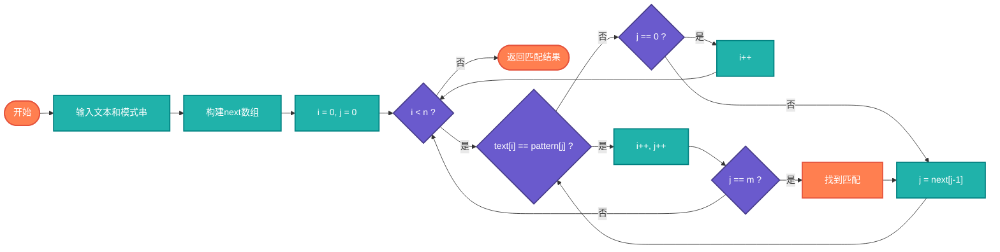

# KMP字符串匹配（KMP Search）

> 高效的字符串匹配算法，时间复杂度O(n+m)，避免了朴素算法的回溯。

## 算法原理

### 核心思想

利用已匹配的信息避免重复比较：
```
1. 预处理模式串，构建部分匹配表（next数组）
2. 失配时，根据next数组跳过已匹配部分
3. 主串指针不回溯，只移动模式串
```

### 部分匹配表（next数组）

记录模式串每个位置的最长相等前后缀长度：
```
模式串: a b a b a c
next:   0 0 1 2 3 0

含义: 在位置i失配时，模式串可以向右移动i - next[i]位
```

---

## 复杂度分析

| 指标 | 复杂度 | 说明 |
|------|--------|------|
| **预处理** | O(m) | m为模式串长度 |
| **匹配** | O(n) | n为主串长度 |
| **总复杂度** | O(n+m) | 线性时间 |
| **空间复杂度** | O(m) | next数组 |

## 算法流程



---

## 适用场景

- **文本编辑器**：查找替换
- **搜索引擎**：关键词匹配
- **DNA序列分析**：基因片段查找
- **入侵检测**：模式匹配
- **数据过滤**：内容审查

---

## 实现列表

| 语言 | 文件名 | 说明 |
|------|--------|------|
| C | [kmp.c](./kmp.c) | 标准实现 |
| Java | [KMP.java](./KMP.java) | 类封装 |
| Go | [kmp.go](./kmp.go) | 简洁实现 |
| Python | [kmp.py](./kmp.py) | 清晰实现 |
| JavaScript | [kmp.js](./kmp.js) | 迭代实现 |
| TypeScript | [KMP.ts](./KMP.ts) | 类型安全 |
| Rust | [kmp.rs](./kmp.rs) | 高效实现 |

---

## 使用示例

### Python 版本
```python
text = "ABABDABACDABABCABAB"
pattern = "ABABCABAB"

# 查找所有匹配位置
positions = kmp_search(text, pattern)  # [10]

# 只找第一个
index = kmp_find(text, pattern)  # 10
```

---

## 扩展阅读

- BM算法（Boyer-Moore）
- Sunday算法
- 多模式匹配（AC自动机）
