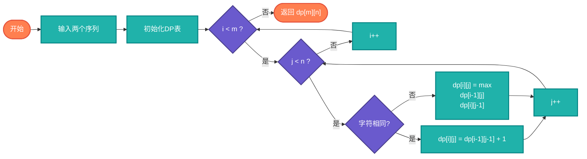

# 最长公共子序列（LCS - Longest Common Subsequence）

> 两个序列的最长公共子序列，经典的动态规划问题。

## 算法原理

### 动态规划定义

设dp[i][j]为X[0..i-1]和Y[0..j-1]的LCS长度：

```
if X[i-1] == Y[j-1]:
    dp[i][j] = dp[i-1][j-1] + 1
else:
    dp[i][j] = max(dp[i-1][j], dp[i][j-1])
```

### 示例

```
X: A B C B D A B
Y: B D C A B A

LCS: B C B A 或 B D A B
长度: 4
```

---

## 复杂度分析

| 指标 | 复杂度 | 说明 |
|------|--------|------|
| **时间复杂度** | O(m×n) | m,n为序列长度 |
| **空间复杂度** | O(m×n)或O(min(m,n)) | DP表或滚动数组 |

## 算法流程



---

## 适用场景

- **版本控制**：Git diff算法
- **DNA比对**：生物信息学
- **拼写纠错**：相似度计算
- ** plagiarism检测**：文本相似度
- **数据同步**：文件差异比较

---

## 实现列表

| 语言 | 文件名 | 说明 |
|------|--------|------|
| C | [lcs.c](./lcs.c) | DP实现 |
| Java | [LCS.java](./LCS.java) | 类封装 |
| Go | [lcs.go](./lcs.go) | 简洁实现 |
| Python | [lcs.py](./lcs.py) | DP实现 |
| JavaScript | [lcs.js](./lcs.js) | 迭代实现 |
| TypeScript | [LCS.ts](./LCS.ts) | 类型安全 |
| Rust | [lcs.rs](./lcs.rs) | 高效实现 |

---

## 使用示例

### Python 版本
```python
# 计算LCS长度
length = lcs_length("ABCBDAB", "BDCABA")  # 4

# 获取LCS序列
sequence = lcs_sequence("ABCBDAB", "BDCABA")  # "BCBA"或"BDAB"
```

---

## 扩展阅读

- 最长公共子串（连续）
- 编辑距离（Levenshtein）
- 最长递增子序列（LIS）
