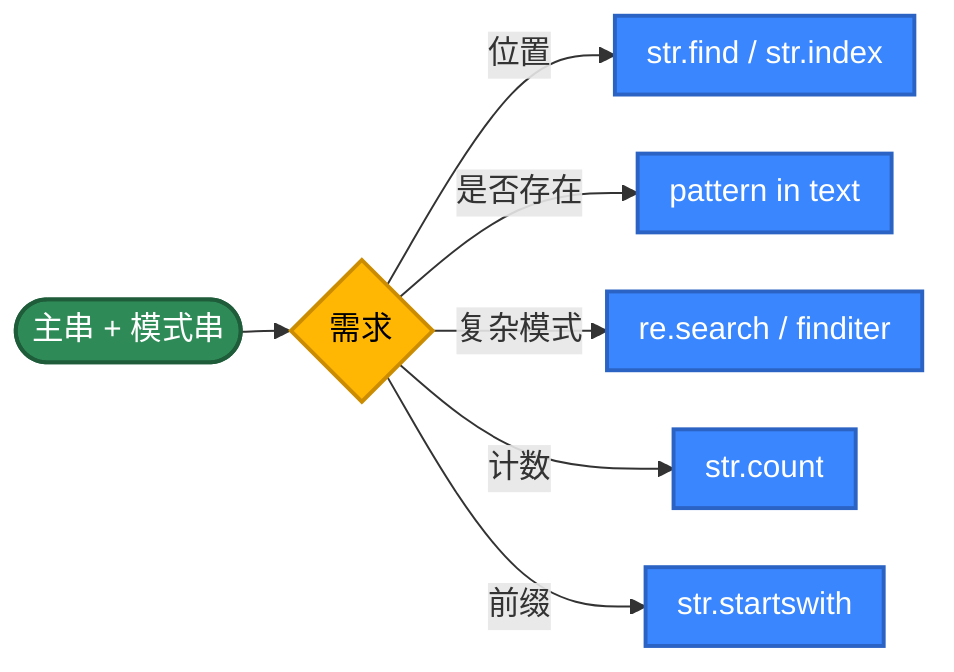
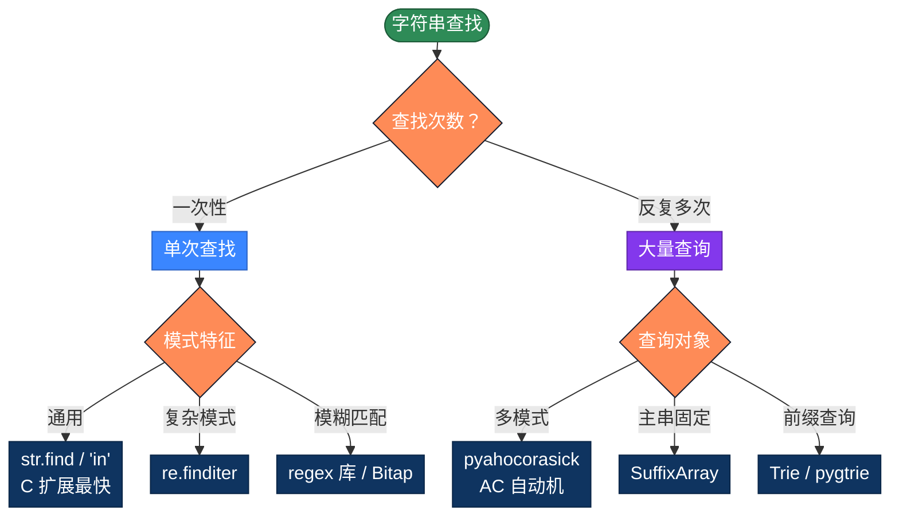

# Python 字符串查找的 20 种实现方式，用不同思路解决问题

字符串查找是最常见的算法。看似只要一行 `text.find(pattern)`，但背后有几十年的算法演进——同一个任务，朴素算法 O(m×n)，KMP 是 O(m+n)，Boyer-Moore 在自然文本上接近 O(n/m)，Bitap 把位并行做到极致。本文整理 Python 字符串查找的 20 种写法，按 5 个策略分类。

## 为什么有这么多算法？

最简单的写法，把模式串与主串的每个位置对齐，逐字符比较：

```python
def find(text, pattern):
    n, m = len(text), len(pattern)
    for i in range(n - m + 1):
        j = 0
        while j < m and text[i + j] == pattern[j]:
            j += 1
        if j == m:
            return i
    return -1
```

问题在于"匹配失败时把所有已匹配的信息都丢了"——回到 i+1 重头比，复杂度退化成 O(m×n)。

**优化思路**：让"匹配失败"也带来信息

- **预处理模式串**：KMP 算 next 数组、BM 算坏字符表、Sunday 算下一字符位置
- **滑动得更远**：BM/Sunday 一次跳很多位
- **哈希指纹**：Rabin-Karp 用滚动哈希把"逐字符比较"压成 O(1)
- **位并行**：Bitap 用 int 表示"模式的所有前缀是否匹配"
- **多模式合并**：AC 自动机把 N 个模式串合成一个 Trie
- **数据结构**：Trie 用于前缀查询、后缀数组用于多次查询同一文本

**Python 的特殊点**：
- `str.find` / `'in'` 是 C 扩展实现（CPython 用 Two-Way 算法的变体），单次查询纯 Python 写不过它
- 切片 `text[i:i+m] == pattern` 看似 O(m) 但很短代码，可读性极好
- 没有 char 类型——每个字符是 1-len 字符串，`text[i]` 返回单字符字符串
- `re` 模块用 SRE 引擎，回溯导致 ReDoS 风险

## 推荐方案

| 需求 | 代码 | 性能 |
|------|------|------|
| 单次查找 | `text.find(pattern)` | C 扩展，最快 |
| 是否包含 | `pattern in text` | 等价于 find ≥ 0 |
| 全部位置 | `re.finditer(re.escape(p), text)` | C 扩展正则 |
| 计数 | `text.count(pattern)` | C 扩展 |
| 多模式同时查 | AC 自动机（pyahocorasick） | O(n + 输出) |
| 模糊匹配 | `regex` 库的 fuzzy 或 Bitap | O(n × k) |

---

## 第1类：标准库 API（方法1-5）

策略原理：CPython 的 `str.find` 用 C 写的 Two-Way 算法变体，对短模式有大量底层优化。`re` 用 SRE 引擎。生产代码默认应该先用这些。



```python
# 方法1：str.find —— 标准库最常用
# CPython 的 Objects/stringlib/find.h 使用 Two-Way 算法变体，纯 C 实现
def find1(text, pattern):
    return text.find(pattern)
# 找不到返回 -1。str.index() 行为一致但找不到抛 ValueError

# 方法2：'in' 运算符 —— 只关心"是否存在"
def find2(text, pattern):
    return pattern in text
# 内部就是 find ≥ 0，但写法更 Pythonic

# 方法3：str.startswith 滑动窗口
# Python 3 的 startswith 接受第三个参数：起始下标
def find3(text, pattern):
    n, m = len(text), len(pattern)
    if m == 0:
        return 0
    for i in range(n - m + 1):
        if text.startswith(pattern, i):
            return i
    return -1

# 方法4：re.finditer —— 找全部位置
# re.escape 把元字符转义，防止 user input 被解析为正则
import re
def find4(text, pattern):
    return [m.start() for m in re.finditer(re.escape(pattern), text)]

# 方法5：str.count —— 统计出现次数
# 内部一次扫描，比 len(re.findall(...)) 快
def find5(text, pattern):
    return text.count(pattern)
```

> **小心三个坑**：① `str.find` 找不到返回 -1 而 `str.index` 抛异常；② `re` 的 SRE 引擎有回溯，恶意 pattern 可导致 ReDoS（参考 `re2` 库）；③ 任何用户输入要做正则前必须 `re.escape()`。

---

## 第2类：朴素与暴力（方法6-9）

策略原理：不依赖任何预处理，纯靠下标扫描。最坏复杂度 O(m×n)。**理解朴素的浪费在哪，才能理解 KMP/BM 的优化点**。

```python
# 方法6：双循环朴素 —— 最经典的 Brute Force
def find6(text, pattern):
    n, m = len(text), len(pattern)
    if m == 0:
        return 0
    for i in range(n - m + 1):
        j = 0
        while j < m and text[i + j] == pattern[j]:
            j += 1
        if j == m:
            return i
    return -1

# 方法7：切片相等比较 —— Pythonic 写法
# text[i:i+m] == pattern 在 CPython 中走 unicode_compare，比 char-by-char 略快
# 但每次切片会创建新对象，有一定开销
def find7(text, pattern):
    n, m = len(text), len(pattern)
    if m == 0:
        return 0
    for i in range(n - m + 1):
        if text[i:i+m] == pattern:
            return i
    return -1

# 方法8：标志位写法 —— 便于在循环里加额外逻辑
def find8(text, pattern):
    n, m = len(text), len(pattern)
    comparisons = 0  # 演示：可统计比较次数
    for i in range(n - m + 1):
        matched = True
        for j in range(m):
            comparisons += 1
            if text[i + j] != pattern[j]:
                matched = False
                break
        if matched:
            return i
    return -1

# 方法9：反向朴素 —— 从右往左对齐
# 适合查找文本末尾的模式
def find9(text, pattern):
    n, m = len(text), len(pattern)
    if m == 0:
        return 0
    for i in range(n - m, -1, -1):
        j = m - 1
        while j >= 0 and text[i + j] == pattern[j]:
            j -= 1
        if j < 0:
            return i
    return -1
```

> **朴素算法的最坏案例**：`text = "AAAAA...AAB"`、`pattern = "AAAB"`——前 m-1 字符总匹配，最后总失败。每对齐浪费 O(m)，总共 O(m×n)。

---

## 第3类：经典高效算法（方法10-14）

策略原理：通过对**模式串**预处理，让"失败时"不再从头开始。

```python
# 方法10：KMP 算法 —— 利用已匹配信息避免回溯
# 完整实现见 KMPsearch/kmp_search.py
# 核心：next[i] = pattern[:i+1] 的最长真前缀也是真后缀的长度
def find10(text, pattern):
    n, m = len(text), len(pattern)
    if m == 0:
        return 0
    # 构建 next 数组
    next_arr = [0] * m
    k = 0
    for i in range(1, m):
        while k > 0 and pattern[i] != pattern[k]:
            k = next_arr[k - 1]
        if pattern[i] == pattern[k]:
            k += 1
        next_arr[i] = k
    # 主串扫描，j 永不回退
    j = 0
    for i in range(n):
        while j > 0 and text[i] != pattern[j]:
            j = next_arr[j - 1]
        if text[i] == pattern[j]:
            j += 1
        if j == m:
            return i - m + 1
    return -1

# 方法11：Boyer-Moore（坏字符规则）
# 完整实现见 pattern-matching/boyer_moore.py
# 从模式串右端开始比，失配按"该字符在模式中最右出现位置"跳跃
def find11(text, pattern):
    n, m = len(text), len(pattern)
    if m == 0:
        return 0
    # 坏字符表：用 dict 支持 Unicode（256 数组只够 ASCII）
    bad = {}
    for i, c in enumerate(pattern):
        bad[c] = i
    shift = 0
    while shift <= n - m:
        j = m - 1
        while j >= 0 and pattern[j] == text[shift + j]:
            j -= 1
        if j < 0:
            return shift
        # max(1, ...) 防止跳到负数
        shift += max(1, j - bad.get(text[shift + j], -1))
    return -1

# 方法12：Sunday 算法 —— BM 的简化变种
# 失配时看"窗口右侧外那一格"，把模式串中它的最右位置对齐过去
def find12(text, pattern):
    n, m = len(text), len(pattern)
    if m == 0:
        return 0
    # shift[c] = 该字符出现时模式串需要右移多少位
    shift = {c: m - i for i, c in enumerate(pattern)}
    i = 0
    while i <= n - m:
        if text[i:i+m] == pattern:
            return i
        if i + m >= n:
            return -1
        i += shift.get(text[i + m], m + 1)
    return -1

# 方法13：Horspool 算法 —— BM 另一种简化
# 失配时只看"主串对齐到模式串末尾的字符"
def find13(text, pattern):
    n, m = len(text), len(pattern)
    if m == 0:
        return 0
    shift = {c: m - 1 - i for i, c in enumerate(pattern[:-1])}
    i = 0
    while i <= n - m:
        j = m - 1
        while j >= 0 and pattern[j] == text[i + j]:
            j -= 1
        if j < 0:
            return i
        i += shift.get(text[i + m - 1], m)
    return -1

# 方法14：Rabin-Karp（滚动哈希）
# 完整实现见 pattern-matching/rabin_karp.py
# 哈希指纹比较，多模式查找的基础
def find14(text, pattern):
    n, m = len(text), len(pattern)
    if m == 0:
        return 0
    if m > n:
        return -1
    D, Q = 256, 10**9 + 7  # 大素数防冲突
    # h = D^(m-1) % Q
    h = pow(D, m - 1, Q)
    p = t = 0
    for i in range(m):
        p = (D * p + ord(pattern[i])) % Q
        t = (D * t + ord(text[i])) % Q
    for i in range(n - m + 1):
        if p == t and text[i:i+m] == pattern:
            return i
        if i < n - m:
            t = (D * (t - ord(text[i]) * h) + ord(text[i + m])) % Q
    return -1
```

---

## 第4类：数据结构辅助（方法15-17）

```python
# 方法15：Trie 前缀树 —— 多个模式串的前缀查询
class Trie:
    def __init__(self):
        # 用 dict 而非数组，自动支持 Unicode
        self.root = {}

    def insert(self, word):
        node = self.root
        for c in word:
            node = node.setdefault(c, {})
        node['#'] = True  # 单词结束标记

    def contains(self, word):
        node = self._walk(word)
        return node is not None and '#' in node

    def starts_with(self, prefix):
        return self._walk(prefix) is not None

    def _walk(self, s):
        node = self.root
        for c in s:
            if c not in node:
                return None
            node = node[c]
        return node

# 方法16：AC 自动机 —— Trie + 失败指针
# 一次扫描主串找出所有模式的所有出现
# 工程上推荐 pyahocorasick 库，性能比纯 Python 快 100 倍
from collections import deque

class AhoCorasick:
    def __init__(self):
        self.nodes = [{'children': {}, 'fail': 0, 'hits': []}]

    def add(self, pattern):
        cur = 0
        for c in pattern:
            if c not in self.nodes[cur]['children']:
                self.nodes.append({'children': {}, 'fail': 0, 'hits': []})
                self.nodes[cur]['children'][c] = len(self.nodes) - 1
            cur = self.nodes[cur]['children'][c]
        self.nodes[cur]['hits'].append(pattern)

    def build(self):
        queue = deque()
        for c, child in self.nodes[0]['children'].items():
            self.nodes[child]['fail'] = 0
            queue.append(child)
        while queue:
            u = queue.popleft()
            for c, v in self.nodes[u]['children'].items():
                # v 的失败指针：从 u.fail 沿 c 走
                f = self.nodes[u]['fail']
                while f != 0 and c not in self.nodes[f]['children']:
                    f = self.nodes[f]['fail']
                self.nodes[v]['fail'] = self.nodes[f]['children'].get(c, 0)
                if self.nodes[v]['fail'] == v:
                    self.nodes[v]['fail'] = 0
                # 累加失败链上的命中
                self.nodes[v]['hits'].extend(self.nodes[self.nodes[v]['fail']]['hits'])
                queue.append(v)

    def search(self, text):
        result = []
        cur = 0
        for i, c in enumerate(text):
            while cur != 0 and c not in self.nodes[cur]['children']:
                cur = self.nodes[cur]['fail']
            cur = self.nodes[cur]['children'].get(c, 0)
            for hit in self.nodes[cur]['hits']:
                result.append((i - len(hit) + 1, hit))
        return result

# 方法17：后缀数组 + 二分
# 适合"主串固定、反复查不同模式"
# 朴素 O(n² log n)；工程推荐 pysuffix 或 SA-IS
class SuffixArray:
    def __init__(self, text):
        self.text = text
        n = len(text)
        # 朴素构建：用切片排序，O(n² log n)
        self.sa = sorted(range(n), key=lambda i: text[i:])

    def search(self, pattern):
        from bisect import bisect_left
        # 二分找第一个 >= pattern 的后缀
        lo, hi = 0, len(self.sa)
        while lo < hi:
            mid = (lo + hi) // 2
            if self.text[self.sa[mid]:self.sa[mid] + len(pattern)] < pattern:
                lo = mid + 1
            else:
                hi = mid
        if lo < len(self.sa) and self.text[self.sa[lo]:].startswith(pattern):
            return self.sa[lo]
        return -1
```

---

## 第5类：高级技巧（方法18-20）

```python
# 方法18：生成器版 —— 流式产出全部位置
# 适合超大文本：不一次性构造结果列表，用 yield 按需产出
def find18(text, pattern):
    if not pattern:
        yield 0
        return
    start = 0
    while True:
        pos = text.find(pattern, start)
        if pos < 0:
            return
        yield pos
        start = pos + 1

# 用法：for pos in find18(text, "abc"): ...
# 或：next(find18(text, pattern), -1)  # 找第一个

# 方法19：Z 算法 —— 线性时间扩展前缀
# Z[i] = 以 i 开头的后缀与原串的最长公共前缀长度
# 拼接 "pattern + 分隔符 + text" 跑一遍，所有 Z[i]==m 的位置就是匹配
def find19(text, pattern):
    m = len(pattern)
    if m == 0:
        return 0
    s = pattern + '\x00' + text  # \x00 作为哨兵
    z = compute_z(s)
    for i in range(m + 1, len(s)):
        if z[i] == m:
            return i - m - 1
    return -1

def compute_z(s):
    n = len(s)
    z = [0] * n
    l = r = 0
    for i in range(1, n):
        if i < r:
            z[i] = min(r - i, z[i - l])
        while i + z[i] < n and s[z[i]] == s[i + z[i]]:
            z[i] += 1
        if i + z[i] > r:
            l, r = i, i + z[i]
    return z

# 方法20：Bitap (Shift-And) ——位并行匹配
# 用 int 的每一位表示"模式前缀 i 是否匹配到当前位置"
# Python 整数无大小限制，模式可任意长（但太长会慢）
# 真正威力：模糊匹配——k 个 int 数组同时跟踪 k 个错误内的所有匹配
def find20(text, pattern):
    m = len(pattern)
    if m == 0:
        return 0
    # mask[c] 的第 i 位为 1 表示 pattern[i] == c
    mask = {}
    for i, c in enumerate(pattern):
        mask[c] = mask.get(c, 0) | (1 << i)
    state = 0
    match_bit = 1 << (m - 1)
    for i, c in enumerate(text):
        # 关键一步：左移 1 位 + 开启新匹配，再与当前字符 mask 相与
        state = ((state << 1) | 1) & mask.get(c, 0)
        if state & match_bit:
            return i - m + 1
    return -1
```

---

## 选择指南



| 类别 | 时间复杂度 | 空间 | 主要场景 |
|------|----------|--------|---------|
| 标准库 API | C 扩展，接近 O(m+n) | O(1) | 日常 95% 场景 |
| 朴素与暴力 | O(m×n) | O(1) | 教学、面试 |
| 经典算法 | O(m+n) ~ O(n/m) | O(m+σ) | 算法练习 |
| 数据结构 | 预处理 O(n)，查询 O(m) | O(总规模) | 海量查询 |
| 高级技巧 | O(n) | O(m) ~ O(σ) | 模糊 / 流式 |

---

## 实际项目里怎么选

绝大多数情况一行就够：

```python
# 单次查找
pos = text.find(pattern)

# 是否存在
if pattern in text: ...

# 找全部位置
import re
positions = [m.start() for m in re.finditer(re.escape(pattern), text)]

# 计数
count = text.count(pattern)
```

需要在同一文本上反复查多个模式：

```python
# 推荐：第三方库 pyahocorasick（C 扩展，比纯 Python 快 100 倍）
import ahocorasick
A = ahocorasick.Automaton()
for idx, p in enumerate(patterns):
    A.add_word(p, (idx, p))
A.make_automaton()
for end_pos, (idx, p) in A.iter(text):
    print(f"{p} at {end_pos - len(p) + 1}")
```

需要在大文本上做大量查询：

```python
# 后缀数组：标准库无，第三方有 pysuffix / suffix-arrays
# 也可以用 ahocorasick 把所有查询模式一次扫
```

模糊匹配（拼写容错、DNA 比对）：

```python
# regex 库支持 fuzzy matching
import regex
regex.findall(r"(?:pattern){e<=2}", text)  # 允许至多 2 个编辑距离

# 或 levenshtein 库
from rapidfuzz import fuzz, process
process.extractOne(query, candidates)
```

前缀查询、自动补全：

```python
# 用 dict 实现 Trie 即可，或第三方 pygtrie
from pygtrie import StringTrie
trie = StringTrie()
for w in dictionary:
    trie[w] = True
matches = list(trie.keys('pre'))  # 所有以 'pre' 开头的词
```

---

## 多模式匹配的处理

不要循环调用 find：

```python
# ❌ 反例：N 次扫描
for p in patterns:
    if p in text:
        hit(p)
```

正确做法：

```python
# 模式数 ≤ 5：直接循环
# 模式数 ≤ 100：正则 alternation
import re
big_re = '|'.join(re.escape(p) for p in patterns)
for m in re.finditer(big_re, text):
    print(m.start(), m.group())

# 模式数上千：AC 自动机（pyahocorasick）
```

---

## 大文本与流式查找

文本不能一次性读进内存时（GB 级日志、网络流）：

```python
# 关键：跨缓冲区边界的匹配会被切断，保留 m-1 字符上下文
def stream_find(file_path, pattern, chunk_size=8192):
    m = len(pattern)
    if m == 0:
        return
    buffer = ''
    offset = 0
    with open(file_path, 'r', encoding='utf-8') as f:
        while True:
            chunk = f.read(chunk_size)
            if not chunk:
                break
            buffer += chunk
            # 在 buffer 里找匹配
            start = 0
            while True:
                pos = buffer.find(pattern, start)
                if pos < 0:
                    break
                yield offset + pos
                start = pos + 1
            # 保留末尾 m-1 字符
            if len(buffer) > m - 1:
                drop = len(buffer) - (m - 1)
                offset += drop
                buffer = buffer[drop:]

# 用法：for pos in stream_find('huge.log', 'ERROR'): ...
```

mmap 是更高效的选择：

```python
import mmap
with open('huge.log', 'rb') as f:
    with mmap.mmap(f.fileno(), 0, access=mmap.ACCESS_READ) as mm:
        # mm 看起来像 bytes，可直接 find
        pos = mm.find(b'ERROR')
```

---

## Unicode 与大小写

Python 3 的 str 是 Unicode 字符序列，索引按字符（codepoint）：

```python
text = "你好world"
print(len(text))     # 7（每个汉字算 1）
print(text[0])       # '你'
print(text.find('好'))  # 1
```

但要注意"组合字符"——`é` 可以是单个 codepoint 也可以是 `e + ́`：

```python
import unicodedata
s1 = "café"  # NFC：é 是单个 codepoint
s2 = "cafe\u0301"  # NFD：e + 组合重音符
print(s1 == s2)  # False！
print(unicodedata.normalize('NFC', s1) == unicodedata.normalize('NFC', s2))  # True
```

大小写不敏感：

```python
# 简单：归一化为小写
text.lower().find(pattern.lower())

# 严格 Unicode 折叠
text.casefold().find(pattern.casefold())
# casefold 比 lower 更严格，处理德语 ß → ss、土耳其 i 等

# 正则
re.search(pattern, text, re.IGNORECASE)
```

---

## 自定义对象：在序列中查找子序列

`str.find` 只查 str 子串。在 list 中查子 list：

```python
def index_seq(haystack, needle):
    """在 haystack 中查找 needle 子序列首次出现位置"""
    n, m = len(haystack), len(needle)
    if m == 0:
        return 0
    for i in range(n - m + 1):
        if haystack[i:i+m] == needle:
            return i
    return -1

# 用法
index_seq([1, 2, 3, 4, 5], [3, 4])  # 2
index_seq(['a', 'b', 'c'], ['b', 'c'])  # 1
```

KMP/BM 等都可泛化到 list/tuple，关键是元素支持 `==` 比较。

---

## 总结

工程上的快捷选择：

- 默认用 `text.find(pattern)`：CPython 已经用 C 实现得很好
- 用 `pattern in text` 表达"是否存在"
- 找全部位置用 `re.finditer(re.escape(p), text)`
- 多个模式同时查，第三方 `pyahocorasick`
- 同一主串反复查不同模式，后缀数组或一次性 AC 扫
- 前缀查询、自动补全，dict 实现 Trie 或 `pygtrie`
- 模糊匹配，`regex` 库的 fuzzy 或 `rapidfuzz`
- Unicode 处理用 `str.casefold()` + `unicodedata.normalize()`

核心思路：

1. 同一个问题可以从多个角度切入
2. 选对算法往往比写更聪明的代码更重要——AC 自动机一次扫描胜过 N 次 find
3. O(m×n) 与 O(m+n) 在数据变大时是几百倍的实际差距
4. 不要过度优化——能用 `str.find` 就别绕弯，C 扩展永远比纯 Python 快
5. Python 标准库已覆盖 80% 场景，理解算法是为了选对工具

20 种实现的本质是**4 个升维**：
- 把"匹配失败"变成信息（朴素 → KMP）
- 把"逐字符比较"变成"批量跳跃"（KMP → BM/Sunday）
- 把"字符比较"变成"哈希/位运算"（BM → Rabin-Karp/Bitap）
- 把"一次查询"变成"多次查询"（→ Trie/AC/SuffixArray）

理解这 4 个升维方向，写出第 21、第 22 种都不在话下。AI 时代，程序员不一定要手写这些算法，但一定要懂得这些"升维"思路。

## 更多算法

- KMP 完整实现：[`KMPsearch/kmp_search.py`](./KMPsearch/kmp_search.py)
- Boyer-Moore：[`pattern-matching/boyer_moore.py`](./pattern-matching/boyer_moore.py)
- Rabin-Karp：[`pattern-matching/rabin_karp.py`](./pattern-matching/rabin_karp.py)
- 朴素查找：[`nativesearch/string_search.py`](./nativesearch/string_search.py)
- 编辑距离：[`edit-distance/`](./edit-distance/)

不同语言算法实现：[https://github.com/microwind/algorithms](https://github.com/microwind/algorithms)

AI编程知识库：[https://microwind.github.io](https://microwind.github.io)
