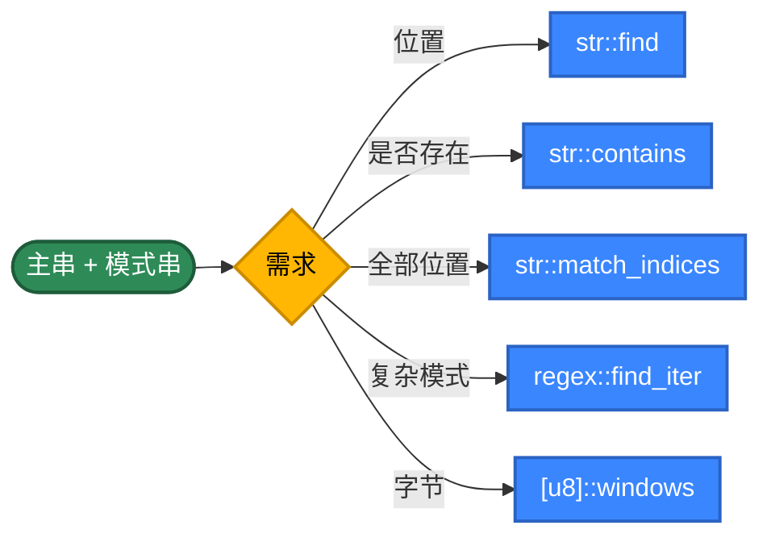
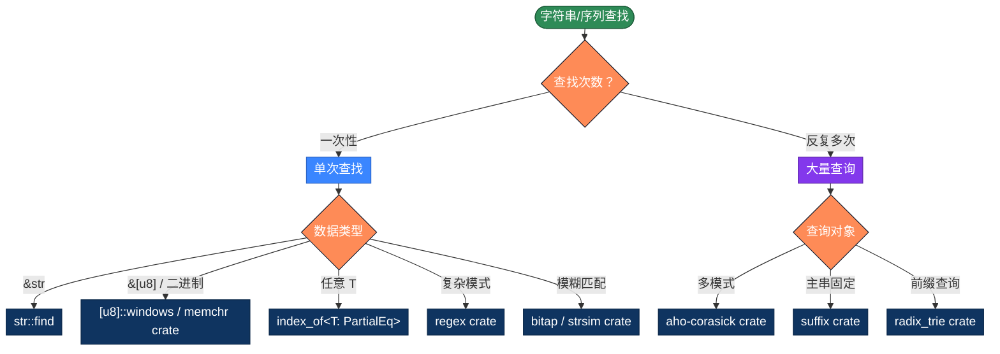

# Rust 字符串查找的 20 种实现方式，用不同思路解决问题

字符串查找是最常见的算法。Rust 同时提供了 `&str`（保证 UTF-8 的字符串切片）和 `&[u8]`（裸字节切片）两种视角，让你能在"安全的字符层面"和"高效的字节层面"自由切换。本文整理 Rust 字符串查找的 20 种写法，按 5 个策略分类。

## 为什么有这么多算法？

最简单的写法，把模式串与主串的每个位置对齐，逐字节比较：

```rust
fn find(text: &[u8], pattern: &[u8]) -> Option<usize> {
    let (n, m) = (text.len(), pattern.len());
    for i in 0..=n.saturating_sub(m) {
        if &text[i..i + m] == pattern {
            return Some(i);
        }
    }
    None
}
```

问题在于"匹配失败时把所有已匹配的信息都丢了"——回到 i+1 重头比，复杂度退化成 O(m×n)。

**优化思路**：让"匹配失败"也带来信息

- **预处理模式串**：KMP 算 next 数组、BM 算坏字符表、Sunday 算下一字符位置
- **滑动得更远**：BM/Sunday 一次跳很多位
- **哈希指纹**：Rabin-Karp 用滚动哈希把"逐字符比较"压成 O(1)
- **位并行**：Bitap 用 u64 表示"模式的所有前缀是否匹配"
- **多模式合并**：AC 自动机把 N 个模式串合成一个 Trie
- **数据结构**：Trie 用于前缀查询、后缀数组用于多次查询同一文本

**Rust 的特殊点**：
- `&str` 是 **保证 UTF-8 的字节切片**——索引必须落在 codepoint 边界，否则 panic
- `&[u8]` 是裸字节，可以任意索引，适合实现高性能算法
- 标准库 `str::find` 内部用 Two-Way 算法（`core::str::pattern`）
- 所有权系统让"借用 vs 拥有"必须显式——`String` vs `&str`
- trait `Pattern` 让 `find(&self, pat: P)` 同时接受 `char` / `&str` / `Fn(char)->bool`
- `regex` crate 是事实标准，编译期生成 NFA/DFA，无 ReDoS

## 推荐方案

| 需求 | 代码 | 性能 |
|------|------|------|
| 单次查找 | `text.find(pattern)` | 标准库 Two-Way |
| 是否包含 | `text.contains(pattern)` | 等价于 `find().is_some()` |
| 全部位置 | `text.match_indices(pattern)` | 迭代器，零拷贝 |
| 复杂模式 | `regex::Regex::find_iter` | 编译期 NFA/DFA |
| 字节流 | `<[u8]>::windows(m).position()` | 标准库迭代器 |
| 多模式 | `aho-corasick` crate | O(n + 输出) |
| 模糊匹配 | `bitap` / `levenshtein` | O(n × k) |

---

## 第1类：标准库 API（方法1-5）

策略原理：Rust 标准库 `str::find` 实现的是 Two-Way 算法（一种结合 KMP 和 BM 思想的高效算法）。`Pattern` trait 让 API 同时接受字符、字符串和闭包。`regex` crate 用 RE2 风格的引擎，保证线性时间。



```rust
// 方法1：str::find —— 标准库最常用
// 内部用 Two-Way 算法，最坏 O(n+m)
// Pattern trait 让它同时接受 char / &str / Fn(char) -> bool
fn find1(text: &str, pattern: &str) -> Option<usize> {
    text.find(pattern)
}

// 方法2：str::contains —— 只关心"是否存在"
fn find2(text: &str, pattern: &str) -> bool {
    text.contains(pattern)
}

// 方法3：str::match_indices —— 找全部位置
// 返回零拷贝迭代器，按需消费
fn find3(text: &str, pattern: &str) -> Vec<usize> {
    text.match_indices(pattern).map(|(i, _)| i).collect()
}

// 方法4：regex 正则—— Cargo.toml 加 regex = "1"
// regex::escape 把元字符转义，防止用户输入被解析
use regex::Regex;
fn find4(text: &str, pattern: &str) -> Vec<usize> {
    let re = Regex::new(&regex::escape(pattern)).unwrap();
    re.find_iter(text).map(|m| m.start()).collect()
}

// 方法5：[u8]::windows —— 字节切片上的滑动窗口
// 适合处理二进制数据或避免 UTF-8 边界检查的开销
fn find5(text: &[u8], pattern: &[u8]) -> Option<usize> {
    if pattern.is_empty() {
        return Some(0);
    }
    text.windows(pattern.len()).position(|w| w == pattern)
}
```

> **小心三个坑**：① `&str` 索引 `text[i]` 会 panic（必须用 `text[i..j]` 切片，且边界要在 codepoint）；② `regex::Regex::new` 在每次调用都重新编译，热路径里要 `lazy_static!` 或 `OnceLock` 缓存；③ `str::find` 找空字符串 `""` 返回 `Some(0)`，与多数语言一致。

---

## 第2类：朴素与暴力（方法6-9）

策略原理：不依赖任何预处理，纯靠下标扫描。最坏 O(m×n)。Rust 这里关键是**选择 `&str` 还是 `&[u8]`**——前者保证 UTF-8 但有边界检查，后者随便索引但要自己保证字符边界。

```rust
// 方法6：双循环朴素 —— 在 &[u8] 上做，最快
fn find6(text: &[u8], pattern: &[u8]) -> Option<usize> {
    let (n, m) = (text.len(), pattern.len());
    if m == 0 {
        return Some(0);
    }
    for i in 0..=n.saturating_sub(m) {
        let mut j = 0;
        while j < m && text[i + j] == pattern[j] {
            j += 1;
        }
        if j == m {
            return Some(i);
        }
    }
    None
}

// 方法7：char 迭代器版 —— 处理 Unicode
// 把 &str 拆成 Vec<char>，按 codepoint 比较
// 注意：返回的是 char 下标，要算字节位置需要遍历前缀
fn find7(text: &str, pattern: &str) -> Option<usize> {
    let t: Vec<char> = text.chars().collect();
    let p: Vec<char> = pattern.chars().collect();
    let (n, m) = (t.len(), p.len());
    if m == 0 {
        return Some(0);
    }
    for i in 0..=n.saturating_sub(m) {
        if t[i..i + m] == p[..] {
            return Some(i);
        }
    }
    None
}

// 方法8：泛型版 —— 用 PartialEq 约束接受任意可比较类型
// 这是 Rust 比 C/Java 更优雅的地方：一次写好，对所有类型可用
fn find8<T: PartialEq>(haystack: &[T], needle: &[T]) -> Option<usize> {
    let (n, m) = (haystack.len(), needle.len());
    if m == 0 {
        return Some(0);
    }
    for i in 0..=n.saturating_sub(m) {
        if haystack[i..i + m] == needle[..] {
            return Some(i);
        }
    }
    None
}
// 用法：find8(b"hello world", b"world")  // Some(6)
// 用法：find8(&[1, 2, 3, 4], &[2, 3])    // Some(1)

// 方法9：反向朴素 —— rfind 风格
fn find9(text: &[u8], pattern: &[u8]) -> Option<usize> {
    let (n, m) = (text.len(), pattern.len());
    if m == 0 {
        return Some(0);
    }
    for i in (0..=n.saturating_sub(m)).rev() {
        if &text[i..i + m] == pattern {
            return Some(i);
        }
    }
    None
}
```

> **`saturating_sub` 的妙用**：`n - m` 当 `m > n` 时会下溢 panic（Rust 的整数溢出在 debug 是 panic，release 是 wrap）。`n.saturating_sub(m)` 在下溢时返回 0，配合 `0..=0` 正好不进入循环。

---

## 第3类：经典高效算法（方法10-14）

```rust
// 方法10：KMP 算法 —— 利用已匹配信息避免回溯
// 完整实现见 KMPsearch/kmp_search.rs
fn find10(text: &[u8], pattern: &[u8]) -> Option<usize> {
    let (n, m) = (text.len(), pattern.len());
    if m == 0 {
        return Some(0);
    }

    // 构建 next 数组（最长真前缀=真后缀长度）
    let mut next = vec![0usize; m];
    let mut k = 0;
    for i in 1..m {
        while k > 0 && pattern[i] != pattern[k] {
            k = next[k - 1];
        }
        if pattern[i] == pattern[k] {
            k += 1;
        }
        next[i] = k;
    }

    // 主串扫描，j 永不回退
    let mut j = 0;
    for i in 0..n {
        while j > 0 && text[i] != pattern[j] {
            j = next[j - 1];
        }
        if text[i] == pattern[j] {
            j += 1;
        }
        if j == m {
            return Some(i - m + 1);
        }
    }
    None
}

// 方法11：Boyer-Moore（坏字符规则）
fn find11(text: &[u8], pattern: &[u8]) -> Option<usize> {
    let (n, m) = (text.len(), pattern.len());
    if m == 0 {
        return Some(0);
    }
    // 坏字符表：256 字节字符集，栈上分配
    let mut bad = [-1i32; 256];
    for i in 0..m {
        bad[pattern[i] as usize] = i as i32;
    }
    let mut shift = 0usize;
    while shift + m <= n {
        let mut j = m - 1;
        while pattern[j] == text[shift + j] {
            if j == 0 {
                return Some(shift);
            }
            j -= 1;
        }
        // max(1, j - badChar) 防负移
        let bc = bad[text[shift + j] as usize];
        let delta = (j as i32) - bc;
        shift += if delta < 1 { 1 } else { delta as usize };
    }
    None
}

// 方法12：Sunday 算法 —— BM 的简化变种
// 失配时看"窗口右侧外那一格"
fn find12(text: &[u8], pattern: &[u8]) -> Option<usize> {
    let (n, m) = (text.len(), pattern.len());
    if m == 0 {
        return Some(0);
    }
    let mut shift = [m + 1usize; 256];
    for i in 0..m {
        shift[pattern[i] as usize] = m - i;
    }
    let mut i = 0;
    while i + m <= n {
        if &text[i..i + m] == pattern {
            return Some(i);
        }
        if i + m >= n {
            return None;
        }
        i += shift[text[i + m] as usize];
    }
    None
}

// 方法13：Horspool 算法
fn find13(text: &[u8], pattern: &[u8]) -> Option<usize> {
    let (n, m) = (text.len(), pattern.len());
    if m == 0 {
        return Some(0);
    }
    let mut shift = [m; 256];
    for i in 0..m - 1 {
        shift[pattern[i] as usize] = m - 1 - i;
    }
    let mut i = 0;
    while i + m <= n {
        let mut j = m - 1;
        while pattern[j] == text[i + j] {
            if j == 0 {
                return Some(i);
            }
            j -= 1;
        }
        i += shift[text[i + m - 1] as usize];
    }
    None
}

// 方法14：Rabin-Karp（滚动哈希）
fn find14(text: &[u8], pattern: &[u8]) -> Option<usize> {
    let (n, m) = (text.len(), pattern.len());
    if m == 0 {
        return Some(0);
    }
    if m > n {
        return None;
    }
    const D: u64 = 256;
    const Q: u64 = 1_000_000_007; // 大素数防冲突
    let mut h: u64 = 1;
    for _ in 0..m - 1 {
        h = (h * D) % Q;
    }
    let (mut p, mut t) = (0u64, 0u64);
    for i in 0..m {
        p = (D * p + pattern[i] as u64) % Q;
        t = (D * t + text[i] as u64) % Q;
    }
    for i in 0..=n - m {
        if p == t && &text[i..i + m] == pattern {
            return Some(i);
        }
        if i < n - m {
            // (Q - text[i] * h % Q) 避免 u64 减法下溢
            t = (D * ((t + Q - text[i] as u64 * h % Q) % Q) + text[i + m] as u64) % Q;
        }
    }
    None
}
```

> **u64 下溢的处理**：Rust 的 `u64` 减法在 debug 下 panic、release 下 wrap。Rabin-Karp 的滚动哈希计算中 `t - text[i] * h` 可能为负，必须用 `(t + Q - text[i] * h % Q) % Q` 这种正向表达。

---

## 第4类：数据结构辅助（方法15-17）

```rust
// 方法15：Trie 前缀树
// 用 HashMap 而非数组，支持 Unicode 字符
use std::collections::HashMap;

#[derive(Default)]
pub struct Trie {
    children: HashMap<char, Trie>,
    is_end: bool,
}

impl Trie {
    pub fn new() -> Self {
        Self::default()
    }

    pub fn insert(&mut self, word: &str) {
        let mut node = self;
        for c in word.chars() {
            node = node.children.entry(c).or_default();
        }
        node.is_end = true;
    }

    pub fn contains(&self, word: &str) -> bool {
        match self.walk(word) {
            Some(n) => n.is_end,
            None => false,
        }
    }

    pub fn starts_with(&self, prefix: &str) -> bool {
        self.walk(prefix).is_some()
    }

    fn walk(&self, s: &str) -> Option<&Trie> {
        let mut node = self;
        for c in s.chars() {
            node = node.children.get(&c)?;
        }
        Some(node)
    }
}

// 方法16：AC 自动机 —— Trie + 失败指针
// Rust 实现的难点：失败指针需要"指向另一个节点"
// 直接用 &Self 引用会被借用检查器拦下
// 经典做法：用 index 而非引用，把所有节点存在 Vec 里
pub struct AhoCorasick {
    nodes: Vec<ACNode>,
}

struct ACNode {
    children: HashMap<u8, usize>, // 字符 -> 节点索引
    fail: usize,
    hits: Vec<usize>, // 该节点匹配的模式 ID
}

impl AhoCorasick {
    pub fn new() -> Self {
        Self {
            nodes: vec![ACNode {
                children: HashMap::new(),
                fail: 0,
                hits: vec![],
            }],
        }
    }

    pub fn add(&mut self, pattern: &[u8], id: usize) {
        let mut cur = 0;
        for &c in pattern {
            if !self.nodes[cur].children.contains_key(&c) {
                self.nodes.push(ACNode {
                    children: HashMap::new(),
                    fail: 0,
                    hits: vec![],
                });
                let new_idx = self.nodes.len() - 1;
                self.nodes[cur].children.insert(c, new_idx);
            }
            cur = self.nodes[cur].children[&c];
        }
        self.nodes[cur].hits.push(id);
    }

    pub fn build(&mut self) {
        use std::collections::VecDeque;
        let mut queue = VecDeque::new();
        // 收集 root 的子节点字符（避免在循环中借用 self.nodes[0]）
        let root_children: Vec<(u8, usize)> = self.nodes[0]
            .children.iter().map(|(&c, &i)| (c, i)).collect();
        for (_, child) in &root_children {
            self.nodes[*child].fail = 0;
            queue.push_back(*child);
        }
        while let Some(u) = queue.pop_front() {
            // 同样需要先收集再修改
            let kids: Vec<(u8, usize)> = self.nodes[u]
                .children.iter().map(|(&c, &i)| (c, i)).collect();
            for (c, v) in kids {
                let mut f = self.nodes[u].fail;
                while f != 0 && !self.nodes[f].children.contains_key(&c) {
                    f = self.nodes[f].fail;
                }
                let new_fail = self.nodes[f].children.get(&c).copied().unwrap_or(0);
                self.nodes[v].fail = if new_fail == v { 0 } else { new_fail };
                // 累加失败链上的命中
                let inherited: Vec<usize> = self.nodes[self.nodes[v].fail].hits.clone();
                self.nodes[v].hits.extend(inherited);
                queue.push_back(v);
            }
        }
    }

    pub fn search(&self, text: &[u8]) -> Vec<(usize, usize)> {
        let mut result = Vec::new();
        let mut cur = 0;
        for (i, &c) in text.iter().enumerate() {
            while cur != 0 && !self.nodes[cur].children.contains_key(&c) {
                cur = self.nodes[cur].fail;
            }
            cur = self.nodes[cur].children.get(&c).copied().unwrap_or(0);
            for &hit_id in &self.nodes[cur].hits {
                result.push((i, hit_id));
            }
        }
        result
    }
}

// 方法17：后缀数组 + 二分
pub struct SuffixArray<'a> {
    text: &'a [u8],
    sa: Vec<usize>,
}

impl<'a> SuffixArray<'a> {
    pub fn new(text: &'a [u8]) -> Self {
        let n = text.len();
        let mut sa: Vec<usize> = (0..n).collect();
        // 朴素 O(n² log n)；工程上推荐 suffix crate（O(n) SA-IS）
        sa.sort_by(|&a, &b| text[a..].cmp(&text[b..]));
        Self { text, sa }
    }

    pub fn search(&self, pattern: &[u8]) -> Option<usize> {
        let result = self.sa.binary_search_by(|&i| {
            let suffix = &self.text[i..];
            if suffix.starts_with(pattern) {
                std::cmp::Ordering::Equal
            } else {
                suffix.cmp(pattern)
            }
        });
        result.ok().map(|idx| self.sa[idx])
    }
}
```

> **AC 自动机的"index 而非引用"**：Rust 的借用检查器禁止"在持有节点引用时修改其他节点"。把所有节点存在 `Vec<ACNode>`、用 `usize` 索引代替指针——这是 Rust 实现"图状结构"的标准模式，工程里大量使用（参见 petgraph 库）。

---

## 第5类：高级技巧（方法18-20）

```rust
// 方法18：迭代器版 —— 流式产出全部位置
// 利用 Iterator trait，零拷贝
pub struct FindIter<'a> {
    text: &'a [u8],
    pattern: &'a [u8],
    pos: usize,
}

impl<'a> Iterator for FindIter<'a> {
    type Item = usize;
    fn next(&mut self) -> Option<usize> {
        let remaining = self.text.get(self.pos..)?;
        let m = self.pattern.len();
        if m == 0 {
            // 空模式串特殊处理
            if self.pos == 0 {
                self.pos = 1;
                return Some(0);
            }
            return None;
        }
        let found = remaining.windows(m).position(|w| w == self.pattern)?;
        let abs = self.pos + found;
        self.pos = abs + 1;
        Some(abs)
    }
}

fn find18<'a>(text: &'a [u8], pattern: &'a [u8]) -> FindIter<'a> {
    FindIter { text, pattern, pos: 0 }
}

// 用法：let positions: Vec<usize> = find18(text, pattern).collect();
//       for pos in find18(text, pattern) { ... }

// 方法19：Z 算法 —— 线性时间扩展前缀
fn find19(text: &[u8], pattern: &[u8]) -> Option<usize> {
    let m = pattern.len();
    if m == 0 {
        return Some(0);
    }
    // 拼接：pattern + 哨兵 + text
    let mut s = Vec::with_capacity(m + 1 + text.len());
    s.extend_from_slice(pattern);
    s.push(0); // \0 作哨兵
    s.extend_from_slice(text);
    let z = compute_z(&s);
    for i in m + 1..s.len() {
        if z[i] == m {
            return Some(i - m - 1);
        }
    }
    None
}

fn compute_z(s: &[u8]) -> Vec<usize> {
    let n = s.len();
    let mut z = vec![0usize; n];
    let (mut l, mut r) = (0usize, 0usize);
    for i in 1..n {
        if i < r {
            z[i] = std::cmp::min(r - i, z[i - l]);
        }
        while i + z[i] < n && s[z[i]] == s[i + z[i]] {
            z[i] += 1;
        }
        if i + z[i] > r {
            l = i;
            r = i + z[i];
        }
    }
    z
}

// 方法20：Bitap (Shift-And) ——位并行匹配
// 用 u64 的每一位表示"模式前缀 i 是否匹配到当前位置"
// 限制：模式长度 ≤ 63（用 u64）
// 真正威力：模糊匹配——k 个 u64 数组同时跟踪 k 个错误内的所有匹配
fn find20(text: &[u8], pattern: &[u8]) -> Option<usize> {
    let m = pattern.len();
    if m == 0 {
        return Some(0);
    }
    if m > 63 {
        panic!("Bitap 单 u64 版只支持 m <= 63");
    }
    // mask[c] 的第 i 位为 1 表示 pattern[i] == c
    let mut mask = [0u64; 256];
    for i in 0..m {
        mask[pattern[i] as usize] |= 1u64 << i;
    }
    let mut state = 0u64;
    let match_bit = 1u64 << (m - 1);
    for (i, &c) in text.iter().enumerate() {
        // 关键一步：左移加 1 + 与 mask 相与
        state = ((state << 1) | 1) & mask[c as usize];
        if state & match_bit != 0 {
            return Some(i + 1 - m);
        }
    }
    None
}
```

---

## Rust 特有的优势：trait 泛化

Rust 比 C/JS/Python 在算法层面的最大优势是 **trait 泛化** + **零成本抽象**。下面是一个泛型查找模板：

```rust
/// 通用序列查找：在 haystack 中查找 needle
/// 用 PartialEq 约束接受任意可比较类型
pub fn index_of<T: PartialEq>(haystack: &[T], needle: &[T]) -> Option<usize> {
    let (n, m) = (haystack.len(), needle.len());
    if m == 0 {
        return Some(0);
    }
    for i in 0..=n.saturating_sub(m) {
        if haystack[i..i + m] == needle[..] {
            return Some(i);
        }
    }
    None
}

// KMP 也可以泛化（T 必须 Eq）
pub fn kmp_find<T: Eq>(haystack: &[T], needle: &[T]) -> Option<usize> {
    let (n, m) = (haystack.len(), needle.len());
    if m == 0 {
        return Some(0);
    }
    let mut next = vec![0usize; m];
    let mut k = 0;
    for i in 1..m {
        while k > 0 && needle[i] != needle[k] {
            k = next[k - 1];
        }
        if needle[i] == needle[k] {
            k += 1;
        }
        next[i] = k;
    }
    let mut j = 0;
    for i in 0..n {
        while j > 0 && haystack[i] != needle[j] {
            j = next[j - 1];
        }
        if haystack[i] == needle[j] {
            j += 1;
        }
        if j == m {
            return Some(i - m + 1);
        }
    }
    None
}

// 用法：
// index_of(b"hello world", b"world")            // Some(6)
// index_of(&[1, 2, 3, 4, 5], &[3, 4])           // Some(2)
// kmp_find(&['a', 'b', 'c'], &['b', 'c'])       // Some(1)
//
// 自定义 struct（实现 PartialEq）也能用：
// #[derive(PartialEq)]
// struct Token { kind: TokenKind, ... }
// kmp_find(&tokens, &pattern_tokens)
```

**零成本抽象**：泛型在编译期单态化（monomorphization），等价于手写每种类型的版本——运行时性能完全等同 C 的非泛型实现。

---

## Rust 标准库的 Pattern trait

Rust 的 `str::find` 实际签名是：

```rust
pub fn find<'a, P: Pattern<'a>>(&'a self, pat: P) -> Option<usize>
```

`Pattern` trait 让一个 API 同时接受：

```rust
text.find('a')                  // char
text.find("hello")              // &str
text.find(&['a', 'b', 'c'][..]) // 字符切片
text.find(|c: char| c.is_uppercase())  // 闭包
```

实际项目里这是 Rust 字符串 API 最 Pythonic 的部分——一个函数应对所有形态的"模式"。

---

## 选择指南



| 类别 | 时间复杂度 | 空间 | 主要场景 |
|------|----------|--------|---------|
| 标准库 API | Two-Way O(n+m) | O(1) | 日常 95% 场景 |
| 朴素与暴力 | O(m×n) | O(1) | 教学、自定义类型 |
| 经典算法 | O(m+n) ~ O(n/m) | O(m+σ) | 算法练习 |
| 数据结构 | 预处理 O(n)，查询 O(m) | O(总规模) | 海量查询 |
| 高级技巧 | O(n) | O(m) ~ O(σ) | 模糊 / 流式 |

---

## 实际项目里怎么选

绝大多数情况一行就够：

```rust
// 单次查找
let pos = text.find(pattern);

// 是否存在
if text.contains(pattern) { ... }

// 找全部位置
let positions: Vec<usize> = text.match_indices(pattern).map(|(i, _)| i).collect();

// 字节流
let pos = text_bytes.windows(pattern.len()).position(|w| w == pattern);

// 任意 T 切片
let pos = index_of(&items, &sub);
```

需要在同一文本上反复查多个模式：

```rust
// aho-corasick crate（性能极佳，比纯 Rust 实现快 10 倍以上）
// Cargo.toml: aho-corasick = "1"
use aho_corasick::AhoCorasick;
let ac = AhoCorasick::new(&patterns).unwrap();
for mat in ac.find_iter(text) {
    println!("pattern {} at {}", mat.pattern(), mat.start());
}
```

需要在大文本上做大量不相关查询：

```rust
// suffix crate（O(n) SA-IS 算法）
use suffix::SuffixTable;
let st = SuffixTable::new(text);
let positions: &[u32] = st.positions(pattern); // 全部出现位置
```

模糊匹配：

```rust
// strsim crate
use strsim::levenshtein;
let dist = levenshtein("kitten", "sitting"); // 3

// 或者用 fuzzy-matcher
use fuzzy_matcher::skim::SkimMatcherV2;
use fuzzy_matcher::FuzzyMatcher;
let matcher = SkimMatcherV2::default();
let score = matcher.fuzzy_match(text, pattern);
```

前缀查询、自动补全：

```rust
// radix_trie crate（更紧凑的 Trie 变种）
use radix_trie::Trie;
let mut trie: Trie<&str, ()> = Trie::new();
for w in dictionary { trie.insert(w, ()); }
let matches: Vec<_> = trie.iter().filter(|(k, _)| k.starts_with("pre")).collect();
```

字节级单字符快速扫描：

```rust
// memchr crate（SIMD 优化，速度接近内存带宽）
use memchr::{memchr, memmem};
let pos = memchr(b'X', text);          // 单字符
let pos = memmem::find(text, pattern); // 多字符（标准库 find 内部就是这个）
```

---

## 多模式匹配的处理

不要循环调用 find：

```rust
// ❌ 反例：N 次扫描
for p in patterns {
    if text.contains(p) {
        hit(p);
    }
}
```

正确做法：

| 模式数 N | 推荐方案 |
|---|---|
| N ≤ 5 | 直接循环 `text.find(p)` |
| N ≤ 100 | regex alternation `Regex::new(&patterns.join("\|"))` |
| N 上千 | `aho-corasick` crate |
| 海量动态 | `aho-corasick` 的 streaming 模式 |

```rust
// regex alternation：把多个模式拼成一个正则
let re = Regex::new(
    &patterns.iter().map(|p| regex::escape(p)).collect::<Vec<_>>().join("|")
).unwrap();
for m in re.find_iter(text) {
    println!("{} at {}", m.as_str(), m.start());
}
```

---

## 大文本与流式查找

文本不能一次性读进内存（GB 级日志、网络流）时：

```rust
// 关键：跨缓冲区边界的匹配会被切断，保留 m-1 字节上下文
use std::io::{BufRead, BufReader, Read};
use std::fs::File;

fn stream_search<R: Read>(reader: R, pattern: &[u8]) -> Vec<usize> {
    let mut buf = Vec::with_capacity(8192 + pattern.len());
    let mut chunk = [0u8; 8192];
    let mut total_offset = 0usize;
    let mut result = Vec::new();
    let m = pattern.len();
    let mut reader = reader;
    loop {
        let n = match reader.read(&mut chunk) {
            Ok(0) => break,
            Ok(n) => n,
            Err(_) => break,
        };
        buf.extend_from_slice(&chunk[..n]);
        // 在 buf 里找全部
        let mut offset = 0;
        while let Some(pos) = buf[offset..].windows(m).position(|w| w == pattern) {
            result.push(total_offset + offset + pos);
            offset += pos + 1;
        }
        // 保留末尾 m-1 字节
        if buf.len() > m - 1 {
            let drop = buf.len() - (m - 1);
            total_offset += drop;
            buf.drain(..drop);
        }
    }
    result
}
```

mmap 是更高效的选择：

```rust
// memmap2 crate
use memmap2::Mmap;
use std::fs::File;
let file = File::open("huge.log").unwrap();
let mmap = unsafe { Mmap::map(&file).unwrap() };
let pos = memmem::find(&mmap[..], b"ERROR");
```

---

## UTF-8 与字符边界

Rust 的 `&str` 是 **保证有效 UTF-8 的字节切片**——这意味着按字节索引必须落在 codepoint 边界，否则 panic：

```rust
let s = "你好world";
println!("{}", s.len());      // 11（"你"、"好"各 3 字节）
println!("{}", &s[0..3]);     // "你"（OK，3 字节是边界）
// println!("{}", &s[0..1]);   // panic！1 不在 codepoint 边界
println!("{}", s.chars().count()); // 7

// 安全的字符级处理
for (byte_pos, c) in s.char_indices() {
    println!("byte {}: {}", byte_pos, c);
}
```

`str::find` 返回的是字节下标：

```rust
let s = "你好world";
let pos = s.find("world").unwrap();  // 6（不是 2！）
println!("{}", &s[pos..]);            // "world"
```

按字符（而非字节）的查找需要先转 `Vec<char>`：

```rust
fn find_char_index(text: &str, pattern: &str) -> Option<usize> {
    let t: Vec<char> = text.chars().collect();
    let p: Vec<char> = pattern.chars().collect();
    t.windows(p.len()).position(|w| w == p.as_slice())
}
```

大小写不敏感：

```rust
// 简单：归一化为小写
text.to_lowercase().contains(&pattern.to_lowercase())

// 严格 Unicode 折叠（处理土耳其 i/I）
// caseless crate
use caseless::default_caseless_match_str;
default_caseless_match_str(text, pattern)

// 正则
let re = Regex::new(&format!("(?i){}", regex::escape(pattern))).unwrap();
re.is_match(text)
```

---

## Rust 错误处理与生命周期

Rust 字符串查找的"地道"风格：

```rust
// ✓ 用 Option<usize> 表示"找到/没找到"
fn find(text: &str, pat: &str) -> Option<usize> { ... }

// ✗ 不要返回 -1（这是 C/Java 的习惯）
fn find_bad(text: &str, pat: &str) -> i64 { ... }  // 强烈不推荐

// ✓ 链式处理
text.find(pat)
    .map(|pos| &text[pos..pos + pat.len()])
    .unwrap_or("not found")

// ✓ ? 操作符传播
fn extract<'a>(text: &'a str, marker: &str) -> Option<&'a str> {
    let start = text.find(marker)?;
    let after = &text[start + marker.len()..];
    let end = after.find('\n')?;
    Some(&after[..end])
}
```

生命周期：函数返回切片时要标注生命周期与输入的关系：

```rust
// 'a 表明返回的切片借用自 text
fn extract_after<'a>(text: &'a str, marker: &str) -> Option<&'a str> {
    text.find(marker).map(|pos| &text[pos + marker.len()..])
}
```

---

## 总结

工程上的快捷选择：

- 默认用 `text.find(pattern)`：标准库已经是 Two-Way 算法
- 找全部位置用 `text.match_indices(pattern)`，零拷贝迭代器
- 字节级查找用 `[u8]::windows` 或 `memchr` crate（SIMD 优化）
- 多个模式同时查，`aho-corasick` crate
- 同一主串反复查不同模式，`suffix` crate
- 前缀查询、自动补全，`radix_trie` crate
- 模糊匹配，`strsim` 或 `fuzzy-matcher` crate
- 复杂模式用 `regex` crate，无 ReDoS 风险
- 任意 T 切片用泛型 `index_of<T: PartialEq>`

核心思路：

1. 同一个问题可以从多个角度切入
2. 选对算法往往比写更聪明的代码更重要——`aho-corasick` 一次扫描胜过 N 次 find
3. O(m×n) 与 O(m+n) 在数据变大时是几百倍的实际差距
4. 不要过度优化——能用 `str::find` 就别绕弯
5. **Rust 的 crate 生态是真正的优势**：`memchr`、`aho-corasick`、`regex`、`suffix` 都是世界顶级实现，直接用比自己写性能更好

**Rust 特有的几条铁律**：

- `&str` 永远是有效 UTF-8，索引必须在字符边界
- `&[u8]` 上做算法最快（避免 UTF-8 检查），但要自己保证字符语义
- 用 `Option<usize>` 表示"找到/没找到"，不要返 -1
- 整数减法防下溢用 `saturating_sub` / `checked_sub`
- 图状结构（AC 自动机、Trie）用 `Vec<Node> + usize` 索引代替指针引用
- 泛型 + trait bound 让算法对所有可比较类型可用，零运行时开销
- 任何动态结构都要考虑生命周期——返回引用必须保证主串还活着

20 种实现的本质是**4 个升维**：
- 把"匹配失败"变成信息（朴素 → KMP）
- 把"逐字符比较"变成"批量跳跃"（KMP → BM/Sunday）
- 把"字符比较"变成"哈希/位运算"（BM → Rabin-Karp/Bitap）
- 把"一次查询"变成"多次查询"（→ Trie/AC/SuffixArray）

理解这 4 个升维方向，写出第 21、第 22 种都不在话下。

## 更多算法

- KMP 完整实现：[`KMPsearch/kmp_search.rs`](./KMPsearch/kmp_search.rs)
- 朴素查找：[`nativesearch/StringSearch.rs`](./nativesearch/StringSearch.rs)
- 编辑距离：[`edit-distance/`](./edit-distance/)

不同语言算法实现：[https://github.com/microwind/algorithms](https://github.com/microwind/algorithms)

AI编程知识库：[https://microwind.github.io](https://microwind.github.io)
