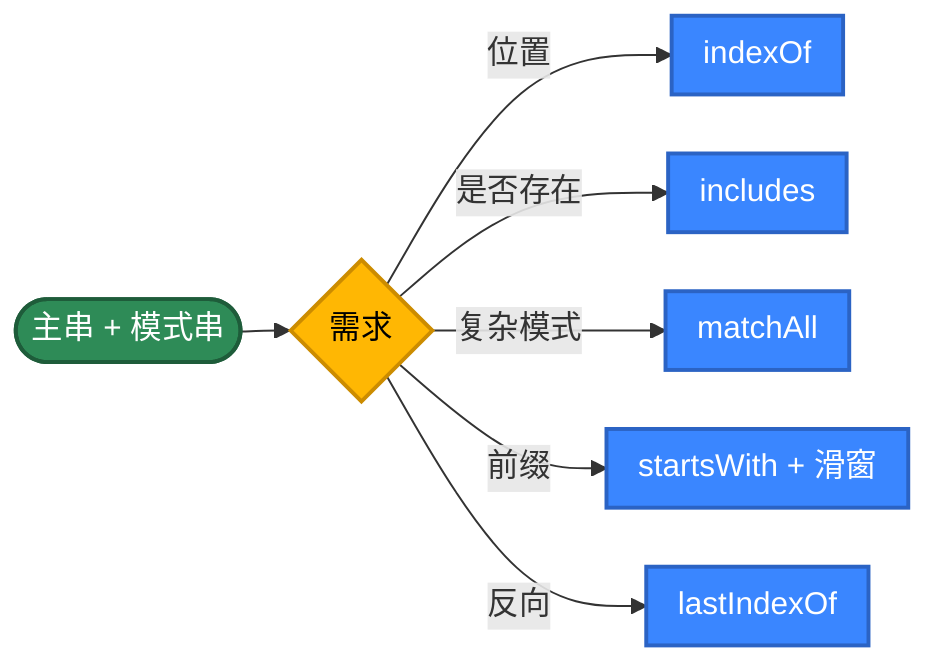
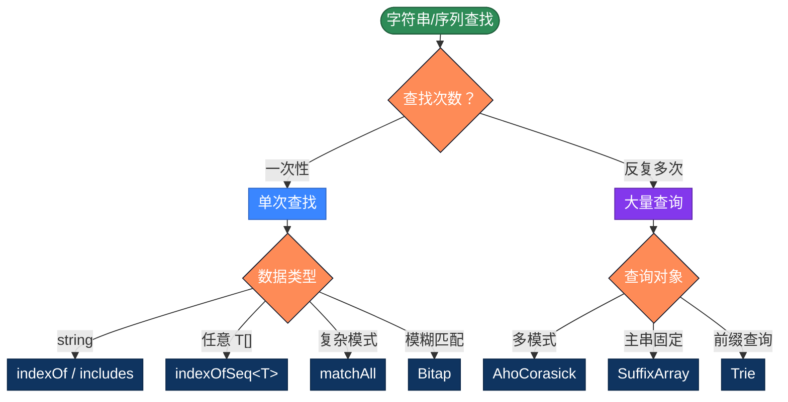

# TypeScript 字符串查找的 20 种实现方式，用不同思路解决问题

字符串查找是最常见的算法。TypeScript 在 JavaScript 的基础上加了静态类型，让通用查找工具能用泛型写一次、对所有可比较类型类型安全。本文整理 TS 字符串查找的 20 种写法，按 5 个策略分类。

## 为什么有这么多算法？

最简单的写法，把模式串与主串的每个位置对齐，逐字符比较：

```typescript
function find(text: string, pattern: string): number {
  const n = text.length, m = pattern.length
  for (let i = 0; i <= n - m; i++) {
    let j = 0
    while (j < m && text[i + j] === pattern[j]) j++
    if (j === m) return i
  }
  return -1
}
```

问题在于"匹配失败时把所有已匹配的信息都丢了"——回到 i+1 重头比，复杂度退化成 O(m×n)。

**优化思路**：让"匹配失败"也带来信息

- **预处理模式串**：KMP 算 next 数组、BM 算坏字符表、Sunday 算下一字符位置
- **滑动得更远**：BM/Sunday 一次跳很多位
- **哈希指纹**：Rabin-Karp 用滚动哈希把"逐字符比较"压成 O(1)
- **位并行**：Bitap 用 BigInt 表示"模式的所有前缀是否匹配"
- **多模式合并**：AC 自动机把 N 个模式串合成一个 Trie
- **数据结构**：Trie 用于前缀查询、后缀数组用于多次查询同一文本

**TypeScript 的特殊点**：
- 泛型 `<T>` 让 KMP/BM 等算法可以泛化到任意 `T[]` 而非只是 string
- `string` 类型实际是 UTF-16 codeunits（与 JS 一致）
- 类型约束 `T extends string | number` 可以限定使用范围
- 编译期校验避免运行时类型错误

## 推荐方案

| 需求 | 代码 | 性能 |
|------|------|------|
| 单次查找 | `text.indexOf(pattern)` | V8 优化，最快 |
| 是否包含 | `text.includes(pattern)` | ES2015 |
| 全部位置 | `[...text.matchAll(re)].map(m => m.index!)` | ES2020 |
| 通用查找 | `findSeq<T>(arr, sub)` 泛型 | 任意类型 |
| 多模式同时查 | `class AhoCorasick` | O(n + 输出) |

---

## 第1类：标准库 API（方法1-5）



```typescript
// 方法1：String.prototype.indexOf
function find1(text: string, pattern: string): number {
  return text.indexOf(pattern)
}

// 方法2：String.prototype.includes
function find2(text: string, pattern: string): boolean {
  return text.includes(pattern)
}

// 方法3：String.prototype.startsWith 滑动窗口
function find3(text: string, pattern: string): number {
  const n = text.length, m = pattern.length
  if (m === 0) return 0
  for (let i = 0; i <= n - m; i++) {
    if (text.startsWith(pattern, i)) return i
  }
  return -1
}

// 方法4：matchAll —— ES2020
// 返回类型 IterableIterator<RegExpMatchArray>
function escapeRegExp(s: string): string {
  return s.replace(/[.*+?^${}()|[\]\\]/g, '\\$&')
}

function find4(text: string, pattern: string): number[] {
  const re = new RegExp(escapeRegExp(pattern), 'g')
  return [...text.matchAll(re)].map(m => m.index!)
}

// 方法5：lastIndexOf —— 反向查找
function find5(text: string, pattern: string): number {
  return text.lastIndexOf(pattern)
}
```

> **TS 类型小贴士**：`matchAll` 返回的 `RegExpMatchArray` 中 `index` 是 `number | undefined`，要么用 `!` 断言，要么 `?? -1` 兜底。

---

## 第2类：朴素与暴力（方法6-9）

```typescript
// 方法6：双循环朴素 —— 用泛型支持任意 T[]
// 加上类型参数，KMP/BM 等都可以同样泛化
function find6<T>(haystack: ArrayLike<T>, needle: ArrayLike<T>): number {
  const n = haystack.length, m = needle.length
  if (m === 0) return 0
  for (let i = 0; i <= n - m; i++) {
    let j = 0
    while (j < m && haystack[i + j] === needle[j]) j++
    if (j === m) return i
  }
  return -1
}

// 方法7：charCodeAt 整数比较 —— 对 string 优化
// 比 [] 索引快 10~20%
function find7(text: string, pattern: string): number {
  const n = text.length, m = pattern.length
  if (m === 0) return 0
  for (let i = 0; i <= n - m; i++) {
    let j = 0
    while (j < m && text.charCodeAt(i + j) === pattern.charCodeAt(j)) j++
    if (j === m) return i
  }
  return -1
}

// 方法8：标志位写法 —— 便于扩展
function find8(text: string, pattern: string): number {
  const n = text.length, m = pattern.length
  if (m === 0) return 0
  for (let i = 0; i <= n - m; i++) {
    let matched = true
    for (let j = 0; j < m; j++) {
      if (text[i + j] !== pattern[j]) {
        matched = false
        break
      }
    }
    if (matched) return i
  }
  return -1
}

// 方法9：反向朴素 —— 从右往左对齐
function find9<T>(haystack: ArrayLike<T>, needle: ArrayLike<T>): number {
  const n = haystack.length, m = needle.length
  if (m === 0) return 0
  for (let i = n - m; i >= 0; i--) {
    let j = m - 1
    while (j >= 0 && haystack[i + j] === needle[j]) j--
    if (j < 0) return i
  }
  return -1
}
```

> **泛型设计的取舍**：用 `ArrayLike<T>` 作参数类型是兼容 string 和 array 的最佳选择——string 也实现了 `ArrayLike<string>` 接口（`length` 和数字索引）。

---

## 第3类：经典高效算法（方法10-14）

```typescript
// 方法10：KMP —— 用泛型支持任意可比较类型
// 完整实现见 KMPsearch/KMPSearch.ts
function find10<T>(haystack: ArrayLike<T>, needle: ArrayLike<T>): number {
  const n = haystack.length, m = needle.length
  if (m === 0) return 0

  // 构建 next 数组
  const next = new Int32Array(m)
  let k = 0
  for (let i = 1; i < m; i++) {
    while (k > 0 && needle[i] !== needle[k]) k = next[k - 1]
    if (needle[i] === needle[k]) k++
    next[i] = k
  }

  let j = 0
  for (let i = 0; i < n; i++) {
    while (j > 0 && haystack[i] !== needle[j]) j = next[j - 1]
    if (haystack[i] === needle[j]) j++
    if (j === m) return i - m + 1
  }
  return -1
}

// 方法11：Boyer-Moore（坏字符规则）
class BoyerMoore {
  private bad: Map<string, number>
  private m: number

  constructor(private pattern: string) {
    this.m = pattern.length
    this.bad = new Map()
    for (let i = 0; i < this.m; i++) {
      this.bad.set(pattern[i], i)
    }
  }

  search(text: string): number {
    const n = text.length, m = this.m
    if (m === 0) return 0
    let shift = 0
    while (shift <= n - m) {
      let j = m - 1
      while (j >= 0 && this.pattern[j] === text[shift + j]) j--
      if (j < 0) return shift
      shift += Math.max(1, j - (this.bad.get(text[shift + j]) ?? -1))
    }
    return -1
  }
}

// 方法12：Sunday 算法
function find12(text: string, pattern: string): number {
  const n = text.length, m = pattern.length
  if (m === 0) return 0
  const shift = new Map<string, number>()
  for (let i = 0; i < m; i++) shift.set(pattern[i], m - i)
  let i = 0
  while (i <= n - m) {
    let j = 0
    while (j < m && text[i + j] === pattern[j]) j++
    if (j === m) return i
    if (i + m >= n) return -1
    i += shift.get(text[i + m]) ?? (m + 1)
  }
  return -1
}

// 方法13：Horspool 算法
function find13(text: string, pattern: string): number {
  const n = text.length, m = pattern.length
  if (m === 0) return 0
  const shift = new Map<string, number>()
  for (let i = 0; i < m - 1; i++) shift.set(pattern[i], m - 1 - i)
  let i = 0
  while (i <= n - m) {
    let j = m - 1
    while (j >= 0 && pattern[j] === text[i + j]) j--
    if (j < 0) return i
    i += shift.get(text[i + m - 1]) ?? m
  }
  return -1
}

// 方法14：Rabin-Karp（滚动哈希）
function find14(text: string, pattern: string): number {
  const n = text.length, m = pattern.length
  if (m === 0) return 0
  if (m > n) return -1
  const D = 256
  const Q = 1_000_000_007
  let h = 1
  for (let i = 0; i < m - 1; i++) h = (h * D) % Q
  let p = 0, t = 0
  for (let i = 0; i < m; i++) {
    p = (D * p + pattern.charCodeAt(i)) % Q
    t = (D * t + text.charCodeAt(i)) % Q
  }
  for (let i = 0; i <= n - m; i++) {
    if (p === t) {
      let j = 0
      while (j < m && text[i + j] === pattern[j]) j++
      if (j === m) return i
    }
    if (i < n - m) {
      t = (D * (t - text.charCodeAt(i) * h) + text.charCodeAt(i + m)) % Q
      if (t < 0) t += Q
    }
  }
  return -1
}
```

---

## 第4类：数据结构辅助（方法15-17）

```typescript
// 方法15：Trie 前缀树
interface TrieNode {
  children: Map<string, TrieNode>
  end: boolean
}

class Trie {
  private root: TrieNode = { children: new Map(), end: false }

  insert(word: string): void {
    let node = this.root
    for (const c of word) {
      let child = node.children.get(c)
      if (!child) {
        child = { children: new Map(), end: false }
        node.children.set(c, child)
      }
      node = child
    }
    node.end = true
  }

  contains(word: string): boolean {
    const node = this.walk(word)
    return node !== null && node.end
  }

  startsWith(prefix: string): boolean {
    return this.walk(prefix) !== null
  }

  private walk(s: string): TrieNode | null {
    let node = this.root
    for (const c of s) {
      const next = node.children.get(c)
      if (!next) return null
      node = next
    }
    return node
  }
}

// 方法16：AC 自动机 —— Trie + 失败指针
interface ACNode {
  children: Map<string, ACNode>
  fail: ACNode | null
  hits: string[]
}

class AhoCorasick {
  private root: ACNode = { children: new Map(), fail: null, hits: [] }

  add(pattern: string): void {
    let node = this.root
    for (const c of pattern) {
      let child = node.children.get(c)
      if (!child) {
        child = { children: new Map(), fail: null, hits: [] }
        node.children.set(c, child)
      }
      node = child
    }
    node.hits.push(pattern)
  }

  build(): void {
    const queue: ACNode[] = []
    for (const child of this.root.children.values()) {
      child.fail = this.root
      queue.push(child)
    }
    while (queue.length) {
      const u = queue.shift()!
      for (const [c, v] of u.children) {
        let f: ACNode | null = u.fail
        while (f && !f.children.has(c)) f = f.fail
        v.fail = f ? (f.children.get(c) ?? this.root) : this.root
        if (v.fail === v) v.fail = this.root
        v.hits.push(...v.fail.hits)
        queue.push(v)
      }
    }
  }

  search(text: string): Array<{ pos: number; pattern: string }> {
    const result: Array<{ pos: number; pattern: string }> = []
    let cur = this.root
    for (let i = 0; i < text.length; i++) {
      const c = text[i]
      while (cur !== this.root && !cur.children.has(c)) {
        cur = cur.fail!
      }
      cur = cur.children.get(c) ?? this.root
      for (const hit of cur.hits) {
        result.push({ pos: i - hit.length + 1, pattern: hit })
      }
    }
    return result
  }
}

// 方法17：后缀数组 + 二分
class SuffixArray {
  private sa: number[]

  constructor(private text: string) {
    const n = text.length
    this.sa = Array.from({ length: n }, (_, i) => i)
      .sort((a, b) => text.slice(a) < text.slice(b) ? -1 : 1)
  }

  search(pattern: string): number {
    let lo = 0, hi = this.sa.length - 1
    while (lo <= hi) {
      const mid = (lo + hi) >> 1
      const suf = this.text.slice(this.sa[mid])
      if (suf.startsWith(pattern)) return this.sa[mid]
      if (suf < pattern) lo = mid + 1
      else hi = mid - 1
    }
    return -1
  }
}
```

---

## 第5类：高级技巧（方法18-20）

```typescript
// 方法18：生成器版 —— 流式产出全部位置
function* find18(text: string, pattern: string): Generator<number> {
  if (!pattern) {
    yield 0
    return
  }
  let start = 0
  while (true) {
    const pos = text.indexOf(pattern, start)
    if (pos < 0) return
    yield pos
    start = pos + 1
  }
}

// 用法 const positions: number[] = [...find18(text, "abc")]

// 方法19：Z 算法 —— 线性时间扩展前缀
function find19(text: string, pattern: string): number {
  const m = pattern.length
  if (m === 0) return 0
  const s = pattern + '\0' + text
  const z = computeZ(s)
  for (let i = m + 1; i < s.length; i++) {
    if (z[i] === m) return i - m - 1
  }
  return -1
}

function computeZ(s: string): Int32Array {
  const n = s.length
  const z = new Int32Array(n)
  let l = 0, r = 0
  for (let i = 1; i < n; i++) {
    if (i < r) z[i] = Math.min(r - i, z[i - l])
    while (i + z[i] < n && s[z[i]] === s[i + z[i]]) z[i]++
    if (i + z[i] > r) { l = i; r = i + z[i] }
  }
  return z
}

// 方法20：Bitap (Shift-And) ——位并行匹配
// 用 bigint 表示位掩码
function find20(text: string, pattern: string): number {
  const m = pattern.length
  if (m === 0) return 0
  const mask = new Map<string, bigint>()
  for (let i = 0; i < m; i++) {
    const c = pattern[i]
    mask.set(c, (mask.get(c) ?? 0n) | (1n << BigInt(i)))
  }
  let state = 0n
  const matchBit = 1n << BigInt(m - 1)
  for (let i = 0; i < text.length; i++) {
    state = ((state << 1n) | 1n) & (mask.get(text[i]) ?? 0n)
    if ((state & matchBit) !== 0n) return i - m + 1
  }
  return -1
}
```

---

## TS 特有的优势：通用查找工具

TS 比 JS 的关键优势是——可以写一份"通用查找"代码，支持任意元素类型：

```typescript
/**
 * 通用序列查找：在 haystack 中查找 needle 子序列首次出现的位置
 * @param haystack 主序列（数组、字符串、TypedArray 等）
 * @param needle 模式序列
 * @param eq 自定义相等比较函数（默认 ===）
 */
function indexOfSeq<T>(
  haystack: ArrayLike<T>,
  needle: ArrayLike<T>,
  eq: (a: T, b: T) => boolean = (a, b) => a === b
): number {
  const n = haystack.length, m = needle.length
  if (m === 0) return 0
  for (let i = 0; i <= n - m; i++) {
    let j = 0
    while (j < m && eq(haystack[i + j], needle[j])) j++
    if (j === m) return i
  }
  return -1
}

// 用法 1：string —— ArrayLike<string> 兼容
indexOfSeq("hello world", "world")    // 6

// 用法 2：number[]
indexOfSeq([1, 2, 3, 4, 5], [3, 4])   // 2

// 用法 3：对象数组 + 自定义 eq
interface User { id: number; name: string }
const users: User[] = [
  { id: 1, name: 'A' }, { id: 2, name: 'B' }, { id: 3, name: 'C' }
]
indexOfSeq(users, [{ id: 2, name: 'B' }, { id: 3, name: 'C' }],
           (a, b) => a.id === b.id)   // 1

// 用法 4：TypedArray —— Uint8Array 也是 ArrayLike<number>
const buf = new Uint8Array([0x4D, 0x5A, 0x90, 0x00])
indexOfSeq(buf, new Uint8Array([0x4D, 0x5A]))  // 0
```

这种泛型设计在 JS 里需要靠"约定俗成"，在 TS 里有编译期保证。

---

## 选择指南



| 类别 | 时间复杂度 | 空间 | 主要场景 |
|------|----------|--------|---------|
| 标准库 API | C++ 优化 | O(1) | 95% string 场景 |
| 朴素与暴力（泛型） | O(m×n) | O(1) | 教学、任意 T[] |
| 经典算法 | O(m+n) ~ O(n/m) | O(m+σ) | 单次查找的标准方案 |
| 数据结构 | 预处理 O(n)，查询 O(m) | O(总规模) | 海量查询 |
| 高级技巧 | O(n) | O(m) ~ O(σ) | 模糊 / 流式 |

---

## TS 类型小贴士

**Map vs Record 的选择**：

```typescript
// ✓ Map：支持任意键类型，性能稳定，没有原型链污染
const shift = new Map<string, number>()

// ✗ Record：键被强制转 string，"length"/"toString" 等会冲突
const shift: Record<string, number> = {}
```

**Int32Array 优化数值数组**：

```typescript
// ✓ 性能更好，固定长度
const next = new Int32Array(m)

// ✗ Array 是动态的，元素装箱
const next: number[] = new Array(m).fill(0)
```

**严格模式下的 nullable 处理**：

```typescript
// strict mode: bad.get(c) 返回 number | undefined
const idx = bad.get(c)
if (idx !== undefined) { ... }

// 或使用 ??（空值合并）
shift += Math.max(1, j - (bad.get(c) ?? -1))
```

---

## 实际项目里怎么选

绝大多数情况一行就够：

```typescript
// 单次查找
const pos = text.indexOf(pattern)

// 找全部位置
const positions: number[] = [...text.matchAll(new RegExp(escapeRegExp(pattern), 'g'))]
  .map(m => m.index!)

// 任意 T[] 查找
const pos = indexOfSeq(arr, sub)
```

需要在同一文本上反复查多个模式：

```typescript
const ac = new AhoCorasick()
patterns.forEach(p => ac.add(p))
ac.build()
const hits = ac.search(text)
```

模糊匹配：

```typescript
import Fuzzysort from 'fuzzysort'
const result = Fuzzysort.go('quick', candidates)
```

前缀查询：

```typescript
const trie = new Trie()
dictionary.forEach(w => trie.insert(w))
const exists = trie.contains('apple')
```

---

## 总结

工程上的快捷选择：

- string 默认用 `text.indexOf(pattern)`
- 任意 T[] 用泛型 `indexOfSeq<T>`
- 找全部位置用 `[...text.matchAll(re)].map(m => m.index!)`
- 多个模式同时查，AC 自动机
- 同一主串反复查不同模式，后缀数组
- 前缀查询、自动补全，Trie
- 模糊匹配，Bitap 或 fuzzysort
- 集合容器永远用 `Map<K, V>` 而非 `Record`，避免 `__proto__` 等键冲突

TS 相比 JS 的核心优势：

1. **泛型让算法可以写一次、所有类型可用**——KMP/BM 等都能优雅泛化
2. **类型约束防误用**——`T extends string | number` 限定基本类型
3. **编译期校验**——`Map<K, V>` 的键值类型不匹配立即报错
4. **可读性提升**——接口描述节点结构（`TrieNode`、`ACNode`）比 plain object 清晰

20 种实现的本质是**4 个升维**：
- 把"匹配失败"变成信息（朴素 → KMP）
- 把"逐字符比较"变成"批量跳跃"（KMP → BM/Sunday）
- 把"字符比较"变成"哈希/位运算"（BM → Rabin-Karp/Bitap）
- 把"一次查询"变成"多次查询"（→ Trie/AC/SuffixArray）

理解这 4 个升维方向，写出第 21、第 22 种都不在话下。

## 更多算法

- KMP 完整实现：[`KMPsearch/KMPSearch.ts`](./KMPsearch/KMPSearch.ts)
- 朴素查找：[`nativesearch/StringSearch.ts`](./nativesearch/StringSearch.ts)
- 编辑距离：[`edit-distance/`](./edit-distance/)

不同语言算法实现：[https://github.com/microwind/algorithms](https://github.com/microwind/algorithms)

AI编程知识库：[https://microwind.github.io](https://microwind.github.io)
