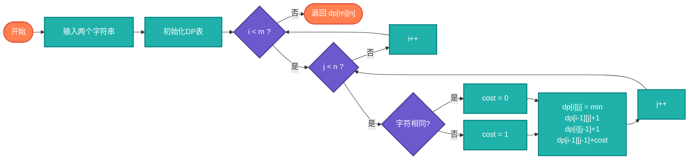

# 编辑距离（Edit Distance）

> 两个字符串之间的最小编辑操作次数，也称Levenshtein距离。

## 算法原理

### 动态规划定义

设dp[i][j]为word1[0..i-1]转换到word2[0..j-1]的最小编辑次数：

```
dp[i][j] = min(
    dp[i-1][j] + 1,      # 删除
    dp[i][j-1] + 1,      # 插入
    dp[i-1][j-1] + cost  # 替换(0或1)
)
```

### 示例

```
kitten → sitting
kitten → sitten (替换k→s)
sitten → sittin (替换e→i)
sittin → sitting (插入g)

编辑距离: 3
```

---

## 复杂度分析

| 指标 | 复杂度 | 说明 |
|------|--------|------|
| **时间复杂度** | O(m×n) | m,n为字符串长度 |
| **空间复杂度** | O(m×n)或O(min(m,n)) | DP表或滚动数组 |

## 算法流程



---

## 适用场景

- **拼写纠错**：找出最相近的正确单词
- **DNA比对**：计算序列差异
- **语音识别**：音素序列比对
- **抄袭检测**：文本相似度
- **机器翻译**：评估翻译质量

---

## 实现列表

| 语言 | 文件名 | 说明 |
|------|--------|------|
| C | [edit_distance.c](./edit_distance.c) | DP实现 |
| Java | [EditDistance.java](./EditDistance.java) | 类封装 |
| Go | [edit_distance.go](./edit_distance.go) | 简洁实现 |
| Python | [edit_distance.py](./edit_distance.py) | DP实现 |
| JavaScript | [edit_distance.js](./edit_distance.js) | 迭代实现 |
| TypeScript | [EditDistance.ts](./EditDistance.ts) | 类型安全 |
| Rust | [edit_distance.rs](./edit_distance.rs) | 高效实现 |

---

## 使用示例

### Python 版本
```python
# 计算编辑距离
distance = edit_distance("kitten", "sitting")  # 3

# 获取编辑操作序列
operations = edit_operations("kitten", "sitting")
# ["replace k→s", "replace e→i", "insert g"]
```

---

## 扩展阅读

- 汉明距离（仅替换）
- Damerau-Levenshtein距离（含交换）
- Jaro-Winkler相似度
