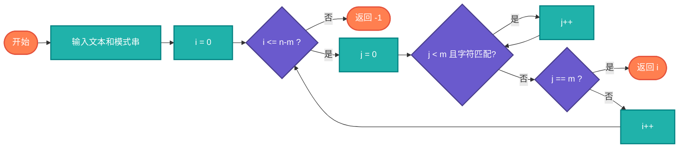

# 朴素字符串匹配（Native Search）

> 最直观的字符串匹配算法，逐个位置比较。

## 算法原理

### 核心思想

从每个位置开始，逐个字符比较：
```
for i from 0 to n-m:
    j = 0
    while j < m and text[i+j] == pattern[j]:
        j++
    if j == m:
        return i  # 找到匹配
return -1  # 未找到
```

---

## 复杂度分析

| 指标 | 复杂度 | 说明 |
|------|--------|------|
| **最坏时间** | O(n×m) | 每次都比较m个字符 |
| **平均时间** | O(n) | 随机数据时 |
| **空间复杂度** | O(1) | 原地比较 |

## 算法流程



---

## 适用场景

- **教学演示**：理解匹配基本概念
- **简单场景**：模式串很短
- **内置函数**：高级语言的indexOf通常优化版
- **测试基准**：与其他算法对比

---

## 实现列表

| 语言 | 文件名 | 说明 |
|------|--------|------|
| C | [native_search.c](./native_search.c) | 基础实现 |
| Java | [NativeSearch.java](./NativeSearch.java) | 类封装 |
| Go | [native_search.go](./native_search.go) | 简洁实现 |
| Python | [native_search.py](./native_search.py) | 简单实现 |
| JavaScript | [native_search.js](./native_search.js) | 循环实现 |
| TypeScript | [NativeSearch.ts](./NativeSearch.ts) | 类型安全 |
| Rust | [native_search.rs](./native_search.rs) | 迭代实现 |

---

## 使用示例

### Python 版本
```python
text = "hello world"
pattern = "world"

index = native_search(text, pattern)  # 6
```

---

## 扩展阅读

- 朴素算法的优化变体
- KMP、BM等高效算法
