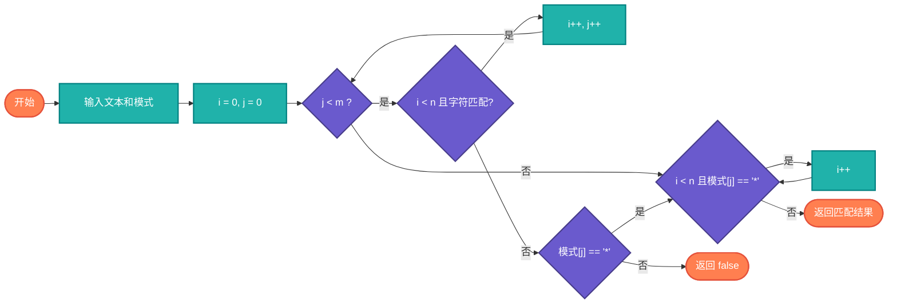

# 模式匹配（Pattern Matching）

> 支持通配符和正则表达式的模式匹配算法。

## 算法原理

### 通配符匹配

| 通配符 | 含义 | 示例 |
|--------|------|------|
| `?` | 匹配任意单个字符 | "a?c"匹配"abc","acc" |
| `*` | 匹配任意字符序列（包括空） | "a*c"匹配"ac","abc","abbc" |

### 正则表达式基础

| 元字符 | 含义 | 示例 |
|--------|------|------|
| `.` | 任意字符 | "a.c"匹配"abc","acc" |
| `*` | 前一个字符0次或多次 | "ab*c"匹配"ac","abc","abbc" |
| `+` | 前一个字符1次或多次 | "ab+c"匹配"abc","abbc" |
| `^` | 行首 | "^abc"匹配以abc开头 |
| `$` | 行尾 | "abc$"匹配以abc结尾 |

---

## 复杂度分析

| 匹配类型 | 时间复杂度 | 空间复杂度 |
|----------|-----------|-----------|
| 朴素通配符 | O(n×m) | O(1) |
| DP通配符 | O(n×m) | O(n×m) |
| 正则引擎 | 视实现而定 | 视实现而定 |

## 算法流程（通配符匹配）



---

## 适用场景

- **文件搜索**：通配符查找文件
- **输入验证**：正则校验
- **日志分析**：模式提取
- **数据清洗**：替换删除
- **编译器**：词法分析

---

## 实现列表

| 语言 | 文件名 | 说明 |
|------|--------|------|
| C | [pattern_matching.c](./pattern_matching.c) | 通配符实现 |
| Java | [PatternMatching.java](./PatternMatching.java) | 正则支持 |
| Go | [pattern_matching.go](./pattern_matching.go) | regexp包 |
| Python | [pattern_matching.py](./pattern_matching.py) | re模块 |
| JavaScript | [pattern_matching.js](./pattern_matching.js) | RegExp |
| TypeScript | [PatternMatching.ts](./PatternMatching.ts) | 类型安全 |
| Rust | [pattern_matching.rs](./pattern_matching.rs) | regex crate |

---

## 使用示例

### Python 版本
```python
# 通配符匹配
is_match("aa", "a*")     # True
is_match("cb", "?a")     # False
is_match("adceb", "*a*b")  # True

# 正则匹配
import re
pattern = r"\d{3}-\d{4}"
re.match(pattern, "123-4567")  # 匹配
```

---

## 扩展阅读

- 正则表达式引擎实现
- NFA/DFA转换
- 回溯vs非回溯正则
