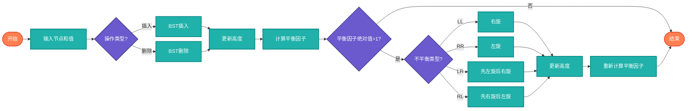

# AVL树（Adelson-Velsky and Landis Tree）

> 自平衡二叉搜索树，任何节点的左右子树高度差不超过1。

## 算法原理

### 平衡因子

```
平衡因子 = 左子树高度 - 右子树高度
取值: -1, 0, 1 (平衡)
      <-1 或 >1 (不平衡，需要旋转)
```

### 旋转操作

| 情况 | 旋转 |
|------|------|
| LL（左左） | 右旋 |
| RR（右右） | 左旋 |
| LR（左右） | 先左旋后右旋 |
| RL（右左） | 先右旋后左旋 |

### 旋转示意图

```
左旋（RR情况）:
    x              y
   / \            / \
  T1  y    →     x  T3
     / \        / \
    T2 T3      T1 T2
```

---

## 复杂度分析

| 操作 | 时间复杂度 | 说明 |
|------|-----------|------|
| 查找 | O(log n) | 平衡保证 |
| 插入 | O(log n) | 查找+旋转 |
| 删除 | O(log n) | 查找+旋转 |
| 旋转 | O(1) | 局部调整 |

## 算法流程



---

## 适用场景

- **频繁查找**：保证O(log n)性能
- **动态数据**：频繁插入删除
- **数据库索引**：需要稳定性能
- **内存管理**：分配器实现

---

## 实现列表

| 语言 | 文件名 | 说明 |
|------|--------|------|
| C | [avl_tree.c](./avl_tree.c) | 指针实现 |
| Java | [AVLTree.java](./AVLTree.java) | 类封装 |
| Go | [avl_tree.go](./avl_tree.go) | 结构体实现 |
| Python | [avl_tree.py](./avl_tree.py) | 类实现 |
| JavaScript | [avl_tree.js](./avl_tree.js) | 对象实现 |
| TypeScript | [AVLTree.ts](./AVLTree.ts) | 类型安全 |
| Rust | [avl_tree.rs](./avl_tree.rs) | 内存安全 |

---

## 使用示例

### Python 版本
```python
avl = AVLTree()
for i in range(10):
    avl.insert(i)

# 树自动平衡，高度为O(log n)
height = avl.get_height()  # 4
```

---

## 扩展阅读

- 红黑树（另一种平衡树）
- Treap（树+堆）
- Splay树（自调整）
