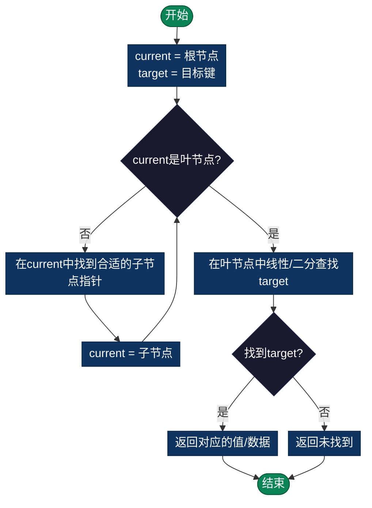

# B+树 (B+ Tree)

> 自平衡的多路搜索树，数据库和文件系统中索引结构的基础，特别适合磁盘存储和范围查询。


## 概述

B+树是一种自平衡的多路搜索树，是B树的变种。它是数据库和文件系统中索引结构的基础，特别适合磁盘存储和范围查询。

## B+树的特点

### 1. 核心特性
```
B+树结构特点:

内部节点（非叶节点）:
• 只存储键值，用于导航
• 不存储实际数据
• 作为索引使用

叶节点:
• 存储所有键值和数据
• 键值有序排列
• 通过指针形成有序链表

        [10 | 20 | 30]           ← 内部节点（索引）
       /     |     \
      ↓      ↓      ↓
[1,2,5,7,10] → [12,15,18,20] → [22,25,30,35]  ← 叶节点链表
     ↑                             ↑
   数据                          数据
```

### 2. B+树 vs B树
```
对比:
┌─────────────────┬───────────────┬───────────────┐
│     特性        │     B树        │     B+树       │
├─────────────────┼───────────────┼───────────────┤
│ 数据存储位置     │ 所有节点        │ 仅叶节点        │
│ 叶节点链表       │ 无             │ 有             │
│ 范围查询效率     │ 需要中序遍历    │ 直接链表遍历     │
│ 空间利用率       │ 较低           │ 较高           │
│ 查找稳定性       │ 可能提前终止    │ 稳定到叶节点     │
└─────────────────┴───────────────┴───────────────┘
```

## B+树的操作

### 1. 查找操作
```
查找过程:
1. 从根节点开始
2. 在内部节点中比较键值，找到合适的子节点
3. 递归向下直到叶节点
4. 在叶节点中线性查找或使用二分查找

示例: 查找键值15

        [10 | 20 | 30]
       /     |     \
      ↓      ↓      ↓
查找15: 15 > 10 且 15 < 20，进入中间分支

        [12 | 15 | 18]
       /     |     \
在叶节点[12,15,18,20]中找到15
```

### 2. 插入操作
```
插入步骤:
1. 找到应该插入的叶节点
2. 如果叶节点未满，直接插入
3. 如果叶节点已满，分裂叶节点
   - 创建新叶节点
   - 将后半部分键值移到新节点
   - 更新链表指针
   - 将中间键提升到父节点
4. 如果父节点也满，递归向上分裂

插入25到满节点:

原节点: [20, 22, 24, 26, 28]  (已满，ORDER=3)

分裂后:
        父节点插入24
       /        \
[20, 22]  →  [24, 26, 28, 25]
                ↑
            插入25后排序
            [24, 25, 26, 28]
```

### 3. 删除操作
```
删除策略:
• 如果删除后节点键数 ≥ 最小值(ORDER-1)，直接删除
• 如果删除后节点键数 < 最小值，考虑:
  - 从兄弟节点借键
  - 与兄弟节点合并
  - 必要时调整父节点
```

### 4. 范围查询
```
范围查询优势:

查询 [15, 30]:

        [10 | 20 | 30]
       /     |     \
      ↓      ↓      ↓
找到起始叶节点 → 沿着链表遍历
[1,2,5,7,10] → [12,15,18,20] → [22,25,30,35]
                    ↑ -------------- ↑
                    收集15到30的所有键值

时间复杂度: O(log n + k)
- O(log n): 找到起始叶节点
- O(k): 遍历k个结果
```

### 流程图



## 复杂度分析

| 操作 | 时间复杂度 | 空间复杂度 | 说明 |
|------|-----------|-----------|------|
| 查找 | O(log n) | O(1) | 树的高度 |
| 插入 | O(log n) | O(1) | 可能需要分裂 |
| 删除 | O(log n) | O(1) | 可能需要合并 |
| 范围查询 | O(log n + k) | O(1) | k是结果数量 |
| 顺序遍历 | O(n) | O(1) | 利用叶节点链表 |

- **总空间复杂度**: O(n)
- **填充因子**: 通常保持在50%以上（除根节点外）

## 应用场景

### 1. 数据库索引
```
MySQL InnoDB:
• 使用B+树作为默认索引结构
• 叶节点存储实际数据行
• 支持高效的范围查询和排序

查询示例:
SELECT * FROM users WHERE age BETWEEN 20 AND 30;
• 快速定位到age=20的叶节点
• 沿着链表遍历到age=30
• 无需回溯到根节点
```

### 2. 文件系统
```
文件系统索引:
• 文件块索引
• 目录结构索引
• 支持快速文件查找
```

### 3. 其他应用
- **内存数据库**: 需要有序数据访问
- **日志系统**: 按时间范围查询
- **地理信息系统**: 空间索引

## 实现列表

| 语言 | 文件名 | 说明 |
|------|--------|------|
| C | [bplus_tree.c](./bplus_tree.c) | 高效内存管理 |
| Java | [BPlusTree.java](./BPlusTree.java) | 面向对象设计 |
| Go | [bplus_tree.go](./bplus_tree.go) | 并发安全 |
| Python | [bplus_tree.py](./bplus_tree.py) | 简洁易读 |
| JavaScript | [bplus_tree.js](./bplus_tree.js) | ES6语法 |
| TypeScript | [BPlusTree.ts](./BPlusTree.ts) | 类型安全 |
| Rust | [bplus_tree.rs](./bplus_tree.rs) | 内存安全 |

### 使用示例（Python）

> 详细API文档请参考各源码文件的注释说明

```python
from bplus_tree import BPlusTree

# 创建B+树（阶数为3）
bpt = BPlusTree(order=3)

# 插入数据
values = [10, 20, 5, 6, 12, 30, 7, 17]
for val in values:
    bpt.insert(val)

# 搜索
print(bpt.search(15))   # False
print(bpt.search(12))  # True

# 范围查询 O(log n + k)
result = bpt.range_query(10, 20)  # [10, 12, 17, 20]

# 遍历所有键（利用叶节点链表）
all_keys = bpt.traverse()  # [5, 6, 7, 10, 12, 17, 20, 30]
```

**运行示例：**
```bash
cd b+tree
python3 bplus_tree.py
```

## 学习建议

### 1. 学习路径
1. **理解B树基础**: 先掌握B树的概念
2. **对比学习**: 对比B树和B+树的差异
3. **动手实现**: 从简化的ORDER=3开始
4. **可视化**: 画图跟踪插入和分裂过程
5. **性能测试**: 对比不同结构的查询效率

### 2. 调试技巧
- 使用小阶数(ORDER=3)便于调试
- 打印树结构验证正确性
- 测试边界情况（空树、满节点等）

### 3. 优化方向
- **并发控制**: 锁机制和MVCC
- **磁盘优化**: 节点大小匹配磁盘页
- **压缩**: 键值前缀压缩
- **缓存**: 热数据内存缓存

## 参考资源
- 《数据库系统概念》第11章
- 《算法导论》B树章节
- MySQL官方文档: InnoDB索引结构

## 复杂度总结

```
B+树核心优势:
┌──────────────────────────────────────────────────┐
│ 磁盘友好                                          │
│ • 节点大小匹配磁盘页(4KB)，减少I/O次数               │
│ • 顺序访问减少磁盘寻道时间                          │
├──────────────────────────────────────────────────┤
│ 查询稳定                                          │
│ • 所有查询都访问叶节点，时间复杂度稳定 O(log n)        │
│ • 无最坏情况的性能退化                              │
├──────────────────────────────────────────────────┤
│ 范围查询高效                                       │
│ • 叶节点链表支持 O(k) 范围查询（k为结果数）            │
│ • 无需回溯或重复遍历树结构                           │
│ • 天然支持排序输出                                  │
└──────────────────────────────────────────────────┘
```