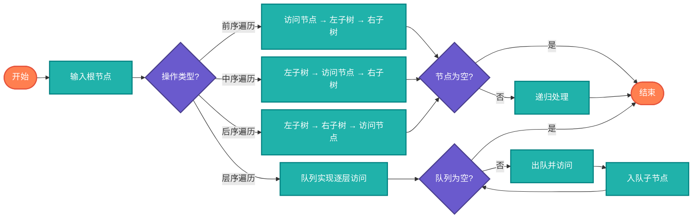

# 二叉树（Binary Tree）

> 每个节点最多有两个子节点的树结构，是树结构的基础。

## 算法原理

### 基本结构

```
     1       <- 根节点
    / \
   2   3     <- 子节点
  / \
 4   5       <- 叶子节点
```

### 遍历方式

| 遍历 | 顺序 | 代码 |
|------|------|------|
| 前序 | 根-左-右 | `visit(root); preorder(left); preorder(right)` |
| 中序 | 左-根-右 | `inorder(left); visit(root); inorder(right)` |
| 后序 | 左-右-根 | `postorder(left); postorder(right); visit(root)` |
| 层序 | 按层 | 队列实现 |

### 重要性质

| 性质 | 完全二叉树 | 满二叉树 |
|------|-----------|----------|
| 节点数n | 2^h-1到2^h-1之间 | 2^h-1 |
| 高度h | ⌊log₂n⌋ | log₂(n+1) |
| 叶子节点 | 不固定 | (n+1)/2 |

---

## 复杂度分析

| 操作 | 时间复杂度 | 空间复杂度 |
|------|-----------|-----------|
| 遍历 | O(n) | O(h)递归栈 |
| 查找 | O(n) | O(h) |
| 插入 | O(1)~O(n) | O(1)~O(h) |

## 算法流程



---

## 适用场景

- **表达式树**：算术表达式解析
- **文件系统**：目录结构
- **游戏树**：Minimax算法
- **霍夫曼编码**：压缩算法
- **堆结构**：优先队列

---

## 实现列表

| 语言 | 文件名 | 说明 |
|------|--------|------|
| C | [binary_tree.c](./binary_tree.c) | 结构体实现 |
| Java | [BinaryTree.java](./BinaryTree.java) | 类封装 |
| Go | [binary_tree.go](./binary_tree.go) | 结构体实现 |
| Python | [binary_tree.py](./binary_tree.py) | 类实现 |
| JavaScript | [binary_tree.js](./binary_tree.js) | 对象实现 |
| TypeScript | [BinaryTree.ts](./BinaryTree.ts) | 类型安全 |
| Rust | [binary_tree.rs](./binary_tree.rs) | 内存安全 |

---

## 使用示例

### Python 版本
```python
# 创建树
root = TreeNode(1)
root.left = TreeNode(2)
root.right = TreeNode(3)

# 遍历
preorder = preorder_traversal(root)  # [1, 2, 3]
inorder = inorder_traversal(root)    # [2, 1, 3]
```

---

## 扩展阅读

- 线索二叉树
- Morris遍历（O(1)空间）
- 序列化与反序列化
