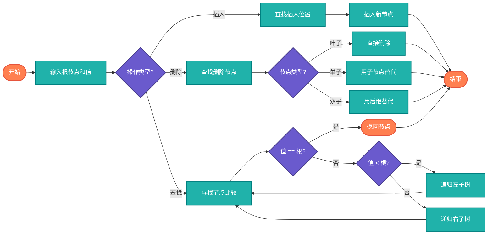

# 二叉搜索树（BST - Binary Search Tree）

> 有序二叉树，左子树所有节点小于根，右子树所有节点大于根。

## 算法原理

### 性质

- 左子树所有节点值 < 根节点值
- 右子树所有节点值 > 根节点值
- 左右子树也是BST
- 中序遍历得到有序序列

### 操作

| 操作 | 步骤 |
|------|------|
| 查找 | 与根比较，小则左，大则右 |
| 插入 | 按查找路径找到空位插入 |
| 删除 | 叶子直接删；单子树用子节点替代；双子树用后继替代 |

---

## 复杂度分析

| 情况 | 查找 | 插入 | 删除 |
|------|------|------|------|
| 平均 | O(log n) | O(log n) | O(log n) |
| 最坏 | O(n) | O(n) | O(n) |

最坏情况发生在树退化为链表时。

## 算法流程



---

## 适用场景

- **动态排序**：需要频繁插入删除的有序数据
- **查找表**：键值对存储
- **范围查询**：查找区间内的值
- **优先队列**：结合堆使用

---

## 实现列表

| 语言 | 文件名 | 说明 |
|------|--------|------|
| C | [bst.c](./bst.c) | 指针实现 |
| Java | [BST.java](./BST.java) | 类封装 |
| Go | [bst.go](./bst.go) | 结构体实现 |
| Python | [bst.py](./bst.py) | 类实现 |
| JavaScript | [bst.js](./bst.js) | 对象实现 |
| TypeScript | [BST.ts](./BST.ts) | 类型安全 |
| Rust | [bst.rs](./bst.rs) | 内存安全 |

---

## 使用示例

### Python 版本
```python
bst = BST()
bst.insert(5)
bst.insert(3)
bst.insert(7)

# 查找
found = bst.search(3)  # True

# 删除
bst.delete(3)
```

---

## 扩展阅读

- AVL树（自平衡）
- 红黑树
- B树/B+树
