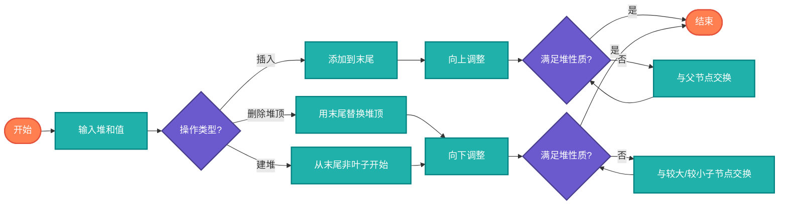

# 堆（Heap）

> 完全二叉树，父节点值大于（大顶堆）或小于（小顶堆）子节点。

## 算法原理

### 堆性质

| 类型 | 性质 |
|------|------|
| 大顶堆 | parent ≥ children |
| 小顶堆 | parent ≤ children |

### 核心操作

| 操作 | 步骤 |
|------|------|
| 插入 | 添加到末尾，向上调整（sift up） |
| 删除堆顶 | 用末尾元素替换堆顶，向下调整（sift down） |
| 建堆 | 从最后一个非叶子节点开始向下调整 |

### 数组表示

```
父节点i的左子节点: 2*i + 1
父节点i的右子节点: 2*i + 2
子节点i的父节点: (i-1) // 2
```

---

## 复杂度分析

| 操作 | 时间复杂度 | 说明 |
|------|-----------|------|
| 插入 | O(log n) | 向上调整高度 |
| 删除堆顶 | O(log n) | 向下调整高度 |
| 获取堆顶 | O(1) | 直接访问 |
| 建堆 | O(n) | 线性建堆 |

## 算法流程



---

## 适用场景

- **优先队列**：堆顶为最高优先级
- **Top K问题**：维护K个最大/最小值
- **堆排序**：原地排序算法
- **图算法**：Dijkstra、Prim
- **任务调度**：优先级调度

---

## 实现列表

| 语言 | 文件名 | 说明 |
|------|--------|------|
| C | [heap.c](./heap.c) | 数组实现 |
| Java | [Heap.java](./Heap.java) | PriorityQueue |
| Go | [heap.go](./heap.go) | container/heap |
| Python | [heap.py](./heap.py) | heapq模块 |
| JavaScript | [heap.js](./heap.js) | 数组实现 |
| TypeScript | [Heap.ts](./Heap.ts) | 类型安全 |
| Rust | [heap.rs](./heap.rs) | BinaryHeap |

---

## 使用示例

### Python 版本
```python
import heapq

# 小顶堆
heap = []
heapq.heappush(heap, 3)
heapq.heappush(heap, 1)
heapq.heappush(heap, 4)

smallest = heapq.heappop(heap)  # 1

# Top 3
nums = [3, 1, 4, 1, 5, 9, 2, 6]
top3 = heapq.nlargest(3, nums)  # [9, 6, 5]
```

---

## 扩展阅读

- 二项堆
- 斐波那契堆
- 配对堆
