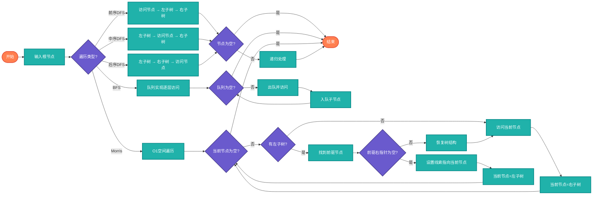

# 树遍历（Tree Traversal）

> 树结构的遍历算法，包括递归和迭代实现，以及Morris遍历。

## 算法原理

### 深度优先遍历（DFS）

| 遍历 | 顺序 | 应用 |
|------|------|------|
| 前序 | 根-左-右 | 复制树、前缀表达式 |
| 中序 | 左-根-右 | BST排序输出 |
| 后序 | 左-右-根 | 删除树、后缀表达式 |

### 广度优先遍历（BFS）

按层遍历，使用队列实现。

### Morris遍历

O(1)空间的遍历算法，利用空闲指针：
```
1. 当前节点cur
2. 如果cur无左子树，访问cur，cur=右子树
3. 如果有左子树，找到中序前驱
   - 如果前驱右指针为空，指向cur（线索），cur=左子树
   - 如果不为空，访问cur，恢复树结构，cur=右子树
```

---

## 复杂度分析

| 遍历 | 时间复杂度 | 空间复杂度 |
|------|-----------|-----------|
| 递归DFS | O(n) | O(h)栈 |
| 迭代DFS | O(n) | O(h)栈 |
| BFS | O(n) | O(w) w为最大宽度 |
| Morris | O(n) | O(1) |

## 算法流程



---

## 适用场景

- **树复制**：前序遍历
- **表达式求值**：后序遍历
- **BST排序**：中序遍历
- **层次处理**：BFS
- **内存受限**：Morris遍历

---

## 实现列表

| 语言 | 文件名 | 说明 |
|------|--------|------|
| C | [tree_traversal.c](./tree_traversal.c) | 多种遍历 |
| Java | [TreeTraversal.java](./TreeTraversal.java) | 类封装 |
| Go | [tree_traversal.go](./tree_traversal.go) | 迭代实现 |
| Python | [tree_traversal.py](./tree_traversal.py) | 简洁实现 |
| JavaScript | [tree_traversal.js](./tree_traversal.js) | 递归迭代 |
| TypeScript | [TreeTraversal.ts](./TreeTraversal.ts) | 类型安全 |
| Rust | [tree_traversal.rs](./tree_traversal.rs) | Morris实现 |

---

## 使用示例

### Python 版本
```python
# 递归遍历
preorder = preorder_recursive(root)
inorder = inorder_recursive(root)
postorder = postorder_recursive(root)

# 迭代遍历
preorder = preorder_iterative(root)
inorder = inorder_iterative(root)

# Morris中序
inorder = morris_traversal(root)  # O(1)空间
```

---

## 扩展阅读

- N叉树遍历
- 锯齿形遍历
- 垂直遍历
