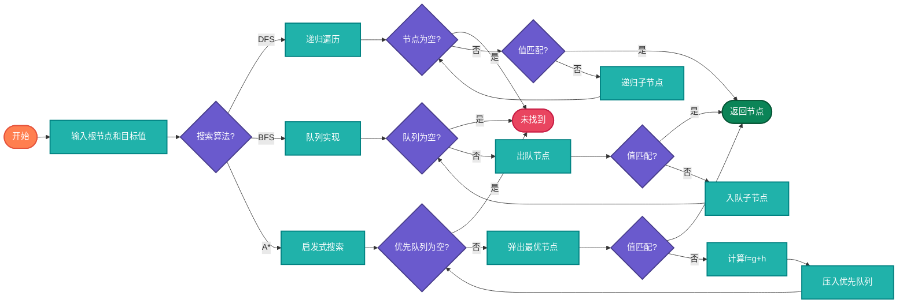

# 树搜索算法（Tree Search）

> 在树结构中搜索特定节点或路径的算法，包括DFS、BFS、启发式搜索等。

## 算法原理

### 深度优先搜索（DFS）

递归遍历树，先深入再回溯：
```
- 前序DFS：根-左-右
- 中序DFS（BST）：左-根-右（有序输出）
- 后序DFS：左-右-根
```

### 广度优先搜索（BFS）

按层遍历，使用队列：
```
第1层：根节点
第2层：根的子节点
第3层：孙节点
...
```

### 最短路径搜索

- **无权树**：BFS即可得到最短路径
- **带权树**：Dijkstra算法变种

### 启发式搜索（A*）

在树形状态空间中使用启发函数指导搜索：
```
f(n) = g(n) + h(n)
g(n): 从起点到n的实际代价
h(n): 从n到目标的估计代价（启发函数）
```

---

## 复杂度分析

| 算法 | 时间复杂度 | 空间复杂度 |
|------|-----------|-----------|
| DFS | O(n) | O(h) h为树高 |
| BFS | O(n) | O(w) w为最大宽度 |
| A* | O(b^d) | O(b^d) d为深度，b为分支因子 |

## 算法流程



---

## 适用场景

- **DOM查询**：网页元素查找
- **文件搜索**：目录树遍历
- **游戏AI**：Minimax、Alpha-Beta剪枝
- **路径规划**：迷宫求解
- **决策树**：机器学习决策

---

## 实现列表

| 语言 | 文件名 | 说明 |
|------|--------|------|
| C | [tree_search.c](./tree_search.c) | DFS/BFS实现 |
| Java | [TreeSearch.java](./TreeSearch.java) | BFS/DFS类 |
| Go | [tree_search.go](./tree_search.go) | 简洁实现 |
| Python | [tree_search.py](./tree_search.py) | 多种搜索 |
| JavaScript | [tree_search.js](./tree_search.js) | DOM搜索 |
| TypeScript | [TreeSearch.ts](./TreeSearch.ts) | 类型安全 |
| Rust | [tree_search.rs](./tree_search.rs) | 高效实现 |

---

## 使用示例

### Python 版本
```python
# 查找值为target的节点
node = dfs_search(root, target)
node = bfs_search(root, target)

# 查找路径
path = find_path(root, target)  # 根到目标的路径

# 最短路径（无权树）
path = shortest_path(root, target)  # BFS
```

---

## 扩展阅读

- Minimax算法（博弈树）
- Alpha-Beta剪枝
- MCTS（蒙特卡洛树搜索）
